<div align="center">

# Projeto Thoth — Mão Robótica HACKberry

**Controle da mão protética HACKberry por painel web + espelhamento da mão por visão computacional**

Universidade Federal do Rio Grande do Sul (UFRGS) · Enfitec Jr. (Engenharia Física) · CTA — Centro de Tecnologia Acadêmica (IF-UFRGS)

</div>

> A mão robótica obedece a comandos por um painel no navegador (gestos, ângulo de cada dedo, parada de emergência) **e imita a sua própria mão** capturada pela webcam, via visão computacional (MediaPipe). Este documento explica **tudo**: o hardware, como fizemos funcionar, como os códigos funcionam, a teoria da visão computacional e como **usar e replicar em casa**.

---

## Sumário

- [Sobre o Projeto](#sobre-o-projeto)
- [Hardware](#hardware)
- [Eletrônica e Alimentação](#eletrônica-e-alimentação)
- [Firmware (Arduino)](#firmware-arduino)
- [Software (Python / Web)](#software-python-web)
- [Visão Computacional (teoria e aplicação)](#visão-computacional-teoria-e-aplicação)
- [Como Usar](#como-usar)
- [Como Replicar em Casa](#como-replicar-em-casa)
- [A Jornada, Solução de Problemas e Referência](#a-jornada-solução-de-problemas-e-referência)

---

## Sobre o Projeto

> **Braço Robótico controlado por EEG, EMG e Sistema de IA**
> Universidade Federal do Rio Grande do Sul (UFRGS) · Enfitec Jr. (Empresa Júnior de Engenharia Física) · CTA — Centro de Tecnologia Acadêmica (IF-UFRGS)

Este é um projeto acadêmico e de pesquisa cujo objetivo de longo prazo é desenvolver uma **prótese assistiva nacional**, de baixo custo, **impressa em 3D**, controlada por sinais biológicos (**EEG/EMG**) e por uma camada de **Inteligência Artificial agêntica**. A presente entrega documentada é um **módulo concreto e funcional** dessa visão maior: o **controle da mão protética HACKberry por um painel web**, com **comandos diretos** de gestos/ângulos e **espelhamento em tempo real da mão do usuário por visão computacional**.

- **Idealização:** Marco Aurelio Andrade — [LinkedIn](https://www.linkedin.com/in/-marcoandrade)
- **Parceria institucional:** [Enfitec Jr.](https://enfitecjunior.com/) — Empresa Júnior de Engenharia Física da UFRGS
- **Apoio acadêmico e técnico:** Prof. **Mauricio Tosin** — apoio acadêmico/técnico e cessão de **equipamentos de EMG do IF-UFRGS** · [Currículo Lattes](http://lattes.cnpq.br/8031556056127117)
- **Vínculo:** CTA — Centro de Tecnologia Acadêmica (Instituto de Física, UFRGS)

---

### 📄 Resumo (PT-BR)

Este módulo controla a mão protética open-source **HACKberry** (impressa em 3D, da exiii Inc. / Mission ARM Japan) a partir de um computador. A mão possui **três servomotores** (polegar, indicador e o grupo "três dedos" = médio + anelar + mínimo) acionados por um **Arduino Nano** sobre protoboard. Um firmware serial customizado expõe um protocolo ASCII que recebe **gestos nomeados** (abrir, punho, apontar, pinça, apertar) e **ângulos absolutos** por dedo, com travas de segurança (limites de ângulo, movimento suave, *watchdog* de *heartbeat* que abre a mão se a comunicação cair). Por cima, um **servidor FastAPI** serve um **painel web** (dashboard) que mostra o vídeo da câmera, o estado da mão e permite comandá-la por botões e *sliders*. O recurso de **espelhamento** usa **visão computacional (MediaPipe HandLandmarker)** para detectar a mão do usuário na webcam, estimar a flexão de cada dedo e replicar o movimento nos servos em tempo real.

### 📄 Abstract (EN)

This module controls the open-source **HACKberry** 3D-printed prosthetic hand (by exiii Inc. / Mission ARM Japan) from a computer. The hand has **three servomotors** (thumb, index, and the "three fingers" group = middle + ring + little) driven by an **Arduino Nano** on a breadboard. A custom serial firmware exposes an ASCII protocol accepting **named gestures** (open, fist, point, pinch, shake) and **per-finger absolute angles**, with safety guards (angle clamping, slew-rate smoothing, and a heartbeat watchdog that opens the hand if the link drops). On top of it, a **FastAPI server** delivers a **web dashboard** showing the camera feed and hand state, allowing control via buttons and sliders. A **mirroring** feature uses **computer vision (MediaPipe HandLandmarker)** to detect the user's hand on the webcam, estimate each finger's flexion, and replicate the motion on the servos in real time. **EEG/EMG control and the agentic-AI/voice layer are part of the broader roadmap, not this delivery.**

---

### 🎯 Escopo desta entrega vs. visão maior

| Aspecto | **Esta entrega (módulo funcional)** | **Roadmap (visão maior)** |
| --- | --- | --- |
| Atuador | Mão HACKberry (3 servos de dedos) ✅ | Braço + mão completa |
| Controle | Painel web (gestos + ângulos) ✅ | — |
| Sensoriamento | Visão computacional (espelhamento) ✅ | **EEG / EMG** (biossinais) |
| Inteligência | Comando direto / espelhamento ✅ | **IA agêntica + voz** |
| Fabricação | Impressão 3D ✅ | Eletrônica biomédica nacional |

> **Importante:** o "braço 3DOF" descrito em materiais antigos é, na verdade, a **mão HACKberry** (não um braço posicionador). O pulso é ajustado **manualmente**; os três servos atuam apenas os **dedos**.

---

### O que este sistema faz

- **Painel web (dashboard)** de página única, tema escuro, que centraliza todo o controle e a telemetria da mão.
- **Comandos de gesto** com um clique: **Abrir**, **Punho**, **Apontar**, **Pinça** e **Apertar a mão**.
- **Controle por dedo** via três *sliders* (polegar, indicador, três dedos) que enviam ângulos absolutos.
- **Espelhamento em tempo real**: a webcam captura a mão do usuário, a visão computacional estima a flexão de cada grupo de dedos e a mão protética **copia o movimento** (toggle "Espelhar minha mão").
- **Vídeo ao vivo anotado** com o esqueleto da mão (21 *landmarks*) por *stream* MJPEG no navegador.
- **Telemetria em tempo real** por WebSocket (~3 Hz): modo (HOST/SAFE), ângulos atuais e **flexões em %**.
- **Parada de emergência (E-STOP)**: botão que abre a mão imediatamente em estado seguro.
- **Segurança em camadas**: limites de ângulo por servo (15–165°), movimento suave (*slew-rate*), e *watchdog* de *heartbeat* — se o computador parar de enviar sinal por ~1 s, a mão **abre sozinha** (fail-safe).

### Como funciona (visão geral do fluxo)

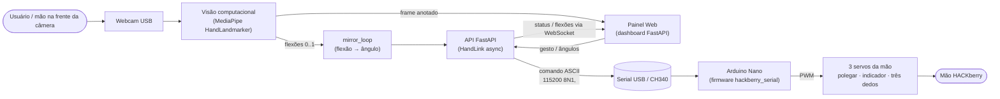

O caminho de controle é sempre o mesmo: tanto os **comandos do painel** quanto o **espelhamento por visão** convergem para o cliente serial assíncrono (`HandLink`), que conversa com o **firmware do Arduino** por um protocolo ASCII; o firmware aplica as travas de segurança e aciona os **servos da mão**.

---

### Materiais e evidências

Os materiais de referência e as evidências do projeto estão na pasta [`documentos/`](../../documentos/):

| Arquivo | Descrição |
| --- | --- |
| [`documentos/manual_original.pdf`](../../documentos/manual_original.pdf) | Manual original da mão HACKberry (referência de montagem e funcionamento). |
| [`documentos/Manual_traduzido_PT-BR.pdf`](../../documentos/Manual_traduzido_PT-BR.pdf) | Tradução do manual para Português do Brasil. |
| [`documentos/equipe.jpeg`](../../documentos/equipe.jpeg) | Foto da equipe do projeto. |
| [`documentos/video.mp4`](../../documentos/video.mp4) | Vídeo demonstrativo do sistema em funcionamento. |

**Equipe:**


---

## Hardware

Esta seção descreve, de ponta a ponta, o hardware que compõe este módulo do projeto: a **mão protética HACKberry**, o **controlador (Arduino Nano clone CH340 numa protoboard)**, o **mapeamento de pinos** dos servomotores e, por fim, **o que adaptamos** em relação ao projeto HACKberry original. O objetivo é que você consiga **entender** cada peça e **replicar** a montagem.

> Importante: o que neste projeto chamamos informalmente de "braço 3DOF" **não é um braço posicionador** (não move o ombro/cotovelo/punho no espaço). É uma **mão** com 3 graus de liberdade nos **dedos**. Essa descoberta — feita lendo o manual do hardware — definiu o que é viável fazer: **gestos de mão e espelhamento de dedos**, e não pose de braço.

---

### A mão HACKberry

A **HACKberry** é uma **prótese de mão open-source**, idealizada e publicada pela **exiii Inc.** e mantida pela comunidade **Mission ARM Japan**. Ela foi pensada para ser **impressa em 3D** (PLA/nylon) e montada com peças de baixo custo, justamente para baratear o acesso a próteses. No nosso projeto, a mão foi **impressa em 3D** e montada manualmente.

A mão tem **três servomotores**, cada um responsável por um grupo de dedos:

| Grupo de dedos | Servo | Movimento | Observação |
| --- | --- | --- | --- |
| **Polegar** | servo **pequeno** | abdução / rotação do polegar | curso menor, passo de slew-rate mais suave no firmware |
| **Indicador** | servo **GRANDE** | flexão (fecha/abre o indicador) | é o servo de maior torque, pois o indicador faz a maior parte da pinça |
| **"Três dedos"** (médio + anelar + mínimo) | servo **pequeno** | flexão dos três juntos | os três dedos são acoplados mecanicamente e movem em conjunto |

Pontos importantes da mecânica:

- **O punho é ajustável MANUALMENTE — não tem motor.** Você posiciona o pulso com a mão e ele fica na posição; o software **não** controla a orientação do punho.
- **Os dedos têm mola de retorno** (mola de torção). Isso significa que, se o servo **soltar** o PWM (detach), a mola tende a **devolver o dedo** para a posição de repouso sozinha. Esse detalhe foi determinante em várias decisões de firmware (ver mais adiante).

#### Dimensões e peso (aproximados)

| Característica | Valor aproximado |
| --- | --- |
| Dimensões (C × L × A) | ~225 × 150 × 60 mm |
| Peso | ~450–500 g |
| Material | impressão 3D (PLA/nylon) |

#### Licença do hardware

O hardware HACKberry é distribuído sob **Creative Commons CC BY-NC-SA 4.0** — ou seja, **uso não-comercial**, com atribuição e compartilhamento sob a mesma licença. O **firmware (sketch)** original da HACKberry é **GPLv3**, e por isso o firmware deste projeto, que deriva dele, também é **GPLv3** (ver seção de licenças do README). Os modelos 3D e a documentação de montagem estão disponíveis publicamente no repositório `mission-arm/HACKberry` no GitHub.

---

### O controlador: Arduino Nano (clone CH340) na protoboard

O controle dos servos é feito por um **Arduino Nano** — um **clone**, cujo chip USB-serial é o **CH340** (e não o FTDI/ATmega16U2 dos Nano "originais"). Esse detalhe parece cosmético, mas tem consequência prática direta na **gravação do firmware** (o clone usa o **bootloader antigo** — detalhado na seção de Firmware).

Decisão de montagem importante:

> Usamos o Arduino Nano em uma **protoboard**, e **NÃO a placa integrada HACKberry Mk2**. Toda a fiação dos servos e a distribuição de energia foram feitas na protoboard com jumpers. Isso nos deu liberdade para testar a pinagem, isolar problemas de energia e iterar rápido — ao custo de termos que descobrir o mapeamento de pinos por conta própria (ver abaixo).

A conexão entre o PC e o Nano é feita por **cabo mini-USB de dados** (atenção: muitos cabos mini-USB são só de carga; é preciso um cabo com vias de dados). O Nano permanece **alimentado pela USB**; os **servos NÃO**.

#### ⚡ Alimentação — a regra mais crítica da montagem

Os três servos juntos puxam **muita corrente** (principalmente o servo grande do indicador, e ainda mais quando precisam **segurar** posição contra a mola de retorno). Tentar alimentá-los pelo **5V do Arduino/USB** faz o servo **tremer, não segurar** e pode até **derrubar/reiniciar a placa**.

Por isso, a regra de ouro:

- Use uma **fonte externa de 5–6V** dedicada aos servos (bateria 5V, 4 pilhas AA = 6V, BEC 5V, power bank 5V, ou módulo step-down/buck). Recomendado **≥ 2 A**.
- O **+5V externo vai SÓ nos fios de alimentação dos servos** — **nunca** no pino `5V` do Nano.
- **GND COMUM (regra crítica):** o **negativo da fonte**, o **GND do Nano** e os **fios pretos/marrons dos servos** devem estar **todos no mesmo ponto**. Sem esse terra comum, o sinal PWM não tem referência e a mão treme/não responde direito.
- O **Nano continua alimentado pela USB**.

Código de cores dos fios dos servos (padrão deste hardware):

| Cor do fio | Função |
| --- | --- |
| **Vermelho** | V+ (5–6V da fonte externa) |
| **Preto / marrom** | GND (terra comum) |
| **Branco / laranja** | Sinal (PWM, vai ao pino digital do Nano) |

Diagrama de ligação (energia e sinal):

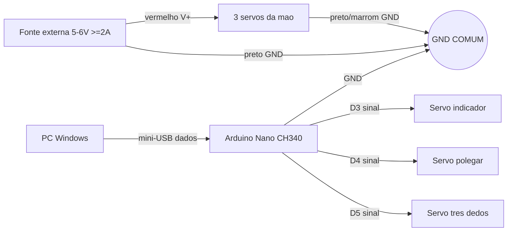

> Como confirmamos que o problema do "treme/não para" era **energia e não software**: lemos a porta serial e vimos que a placa **NÃO estava reiniciando** (o banner `R` de boot não reaparecia). Logo, não era reset por firmware — era **falta de corrente**. A solução foi a fonte externa + GND comum.

---

### Mapeamento de pinos dos servos

Os sinais (fios branco/laranja) dos três servos são ligados a **pinos digitais** do Nano. O mapeamento que usamos é:

| Grupo de dedos | Pino digital | Constante no firmware |
| --- | --- | --- |
| **Indicador** | **D3** | `PIN_INDEX = 3` |
| **Polegar** | **D4** | `PIN_THUMB = 4` |
| **"Três dedos"** (médio+anelar+mínimo) | **D5** | `PIN_OTHER = 5` |

Esse mapeamento está fixado no firmware em `firmware/hackberry_serial/hackberry_serial.ino`:

```cpp
// Pinos dos 3 servos de dedos (PROTOBOARD)
const uint8_t PIN_THUMB = 4;   // polegar
const uint8_t PIN_INDEX = 3;   // indicador
const uint8_t PIN_OTHER = 5;   // medio+anelar+minimo (dedosAux)
```

#### Por que o mapeamento foi descoberto EMPIRICAMENTE

Como montamos o Nano numa **protoboard** (e não na placa Mk2 com silkscreen documentado), **não tínhamos garantia** de qual pino ia para qual dedo. De fato, no começo **só dois servos se mexiam**: a pinagem assumida pelo firmware não batia com a fiação real.

Para resolver, escrevemos um sketch de diagnóstico, `firmware/servo_scan/servo_scan.ino`, que **testa um pino por vez**: ele varre uma faixa de pinos digitais (D2 a D12), anuncia pela serial qual pino está testando e faz o servo daquele pino fazer uma varredura suave (~35° → 115° → 35°). Você **observa a mão** e anota **qual dedo se move** em cada pino:

```cpp
// servo_scan.ino — varre cada pino e move o servo para você ver qual dedo mexe
const uint8_t PINS[] = {2, 3, 4, 5, 6, 7, 8, 9, 10, 11, 12};
...
void sweep(uint8_t pin) {
  s.attach(pin);
  for (int a = 35; a <= 115; a += 5) { s.write(a); delay(25); }
  for (int a = 115; a >= 35; a -= 5) { s.write(a); delay(25); }
  s.write(35);
  s.detach();   // libera o pino antes do proximo
}
```

Abrindo o monitor serial e observando a mão:

```bash
arduino-cli monitor -p COM16 -c baudrate=115200
```

Foi assim que **descobrimos empiricamente** que **indicador = D3, polegar = D4, três dedos = D5** — e então fixamos esses valores no firmware definitivo.

---

### O que adaptamos em relação ao HACKberry original

O HACKberry "de fábrica" foi projetado para funcionar de forma **autônoma**: o firmware nativo lê sensores (EMG/botões) **na própria prótese** e decide os movimentos localmente, sem depender de um computador. Para o nosso objetivo — controlar a mão por um **painel web**, com **comandos diretos** e **espelhamento da mão do usuário por visão computacional** — esse modelo autônomo não servia. Precisávamos que **um host (PC) ditasse os movimentos em tempo real**.

As principais adaptações:

| Aspecto | HACKberry original | Neste projeto (Thoth) |
| --- | --- | --- |
| **Quem decide o movimento** | a própria prótese (firmware autônomo) | o **host (PC)** envia comandos; o MCU executa |
| **Firmware** | sketch nativo autônomo | firmware **serial custom** (`hackberry_serial.ino`) com protocolo ASCII |
| **Controlador / placa** | placa integrada HACKberry Mk2 | **Arduino Nano clone CH340 na protoboard** |
| **Entrada de controle** | sensores locais (EMG etc.) | **painel web** (gestos + sliders) e **visão computacional** (espelhamento dos dedos) |
| **Pinagem dos servos** | conforme o silk da Mk2 | **descoberta empiricamente** (indicador D3, polegar D4, três dedos D5) |
| **Alimentação dos servos** | conforme projeto Mk2 | **fonte externa 5–6V + GND comum** (Nano segue na USB) |

Em resumo, trocamos o **controle autônomo embarcado** por um **firmware host-controlled**: a inteligência (gestos, espelhamento, segurança de alto nível) fica no PC, e o Arduino Nano vira um **executor confiável** que recebe comandos por serial, aplica limites de segurança e abre a mão automaticamente se o host parar de responder (fail-safe por heartbeat — detalhado na seção de Firmware).

---

## Eletrônica e Alimentação

Esta seção descreve, do começo ao fim, **como ligar a parte elétrica** da mão HACKberry na protoboard para que o firmware do Projeto Thoth (UFRGS / Enfitec Jr. / CTA-IF) consiga controlar os três servomotores de forma estável. O objetivo é que você consiga **replicar a montagem** seguindo o passo a passo, os diagramas e a tabela "cabo → onde liga".

> **Importante:** a mão HACKberry não é um braço posicionador — é uma **mão** com **3 servomotores de dedos**. Não há motor de pulso (o pulso é ajustado manualmente). Toda a eletrônica abaixo se resume a alimentar e comandar esses três servos.

### Visão geral dos componentes elétricos

| Componente | Papel na montagem |
|---|---|
| **Arduino Nano (clone CH340)** | Cérebro. Roda o firmware, gera os 3 sinais PWM (D3/D4/D5) e fala serial com o PC pelo cabo **mini-USB**. |
| **Servo do indicador** (servo **grande**, flexão) | Sinal em **D3**. |
| **Servo do polegar** (servo **pequeno**, abdução/rotação) | Sinal em **D4**. |
| **Servo dos "três dedos"** = médio + anelar + mínimo (servo **pequeno**, flexão) | Sinal em **D5**. |
| **Fonte externa 5–6 V (≥ 2 A)** | Alimenta **somente os servos**. Ex.: 4 pilhas AA (~6 V), BEC 5 V, power bank 5 V ou módulo step-down/buck. |
| **Protoboard + jumpers** | Onde tudo se encontra: trilhos de **+V** e **GND** para distribuir energia e o **GND comum**. |
| **Cabo mini-USB de DADOS** | Liga o Nano ao PC (energia do Nano + comunicação serial). |

### As três regras críticas (leia antes de ligar qualquer fio)

1. **NÃO alimente os servos pelo 5V do Arduino / pelo USB.** Os três servos juntos puxam corrente demais; no 5V do USB o servo **treme, não segura a posição** e pode até **derrubar/reiniciar a placa**.
2. **GND COMUM é obrigatório.** O **negativo (−) da fonte externa**, o **GND do Nano** e os **fios pretos/marrons dos três servos** precisam estar **todos no mesmo ponto** (mesma trilha de GND da protoboard). Sem isso, o sinal PWM não tem referência e os servos enlouquecem.
3. **O +5 V externo vai SÓ nos servos — NUNCA no pino 5V do Nano.** Ligar a fonte externa no pino `5V` do Nano pode danificá-lo (conflito com o regulador interno e com o USB). O Nano continua sendo alimentado **apenas pelo USB**.

> Resumindo o fluxo de energia: **USB → alimenta o Nano** (lógica + serial). **Fonte externa → alimenta só os servos** (potência). Os dois mundos se encontram **apenas no GND comum**.

### Por que fonte externa e por que GND comum (a teoria por trás das regras)

- **Corrente dos 3 servos:** um servo sob carga (movendo o dedo contra a mola e/ou segurando um objeto) pode puxar centenas de mA cada; em **pico de partida** os três somados ultrapassam facilmente o que o regulador do Nano e a porta USB conseguem entregar. O resultado é queda de tensão → o servo perde força, **treme** e a placa pode **resetar**. A fonte externa de **≥ 2 A** dá folga para os picos.
- **Mola de retorno dos dedos:** os dedos da HACKberry têm **mola de torção** que tende a abrir o dedo. O servo precisa de torque (logo, corrente) para **segurar a posição contra a mola**. Por isso o firmware mantém `DETACH_WHEN_IDLE=false` (não solta o PWM em repouso) — e por isso o servo precisa de uma fonte que aguente o *holding current* sem afundar a tensão.
- **GND comum:** o sinal PWM (em D3/D4/D5) é uma tensão **medida em relação ao GND**. Se o servo está num GND e o Nano em outro, o servo não tem a mesma referência do sinal → leitura errática, jitter, movimento aleatório. Unindo os GNDs, o "zero" é o mesmo para todos.

> **Diagnóstico real do projeto:** o sintoma "não para de mexer / treme" no USB foi confirmado como **falta de corrente** (não bug de software) — lendo a serial vimos que a placa **não reiniciava**. A correção foi exatamente **fonte externa 5 V + GND comum**.

### Cores dos servos (padrão dos 3 servos da HACKberry)

| Cor do fio | Função | Onde liga |
|---|---|---|
| **Vermelho** | **V+** (alimentação 5–6 V) | Trilha **+V da fonte externa** (positivo) — **nunca** no 5V do Nano |
| **Preto** (ou **marrom**) | **GND** | Trilha de **GND comum** (junto do − da fonte e do GND do Nano) |
| **Branco** (ou **laranja**) | **Sinal** (PWM) | Pino digital do Nano: **D3 / D4 / D5** conforme o servo |

### Tabela "cabo → onde liga" por servo

| Servo (dedo) | Fio **vermelho** (V+) | Fio **preto/marrom** (GND) | Fio **branco/laranja** (sinal) |
|---|---|---|---|
| **Indicador** (servo grande) | +V da fonte | GND comum | **D3** |
| **Polegar** (servo pequeno) | +V da fonte | GND comum | **D4** |
| **Três dedos** (médio+anelar+mínimo) | +V da fonte | GND comum | **D5** |
| **Arduino Nano** | — (alimentado via USB) | **GND** do Nano → GND comum | — |
| **Fonte externa** | **+** → trilha +V (só servos) | **−** → GND comum | — |

> O mapeamento de pinos foi **descoberto empiricamente** com o sketch `firmware/servo_scan/servo_scan.ino` (varre os pinos D2..D12 e mostra qual dedo se move) e está fixado no firmware `firmware/hackberry_serial/hackberry_serial.ino`:
> ```cpp
> const uint8_t PIN_THUMB = 4;   // polegar  -> D4
> const uint8_t PIN_INDEX = 3;   // indicador -> D3
> const uint8_t PIN_OTHER = 5;   // tres dedos -> D5
> ```

### Diagrama ASCII da ligação na protoboard

```text
                          PC (Windows)
                              │
                              │  cabo mini-USB (DADOS + energia do Nano)
                              ▼
                      ┌───────────────┐
                      │  ARDUINO NANO │
                      │   (CH340)     │
                      │               │
                      │  D3 ──────────┼──────────► sinal INDICADOR (branco/laranja)
                      │  D4 ──────────┼──────────► sinal POLEGAR   (branco/laranja)
                      │  D5 ──────────┼──────────► sinal TRÊS DEDOS(branco/laranja)
                      │               │
                      │  GND ─────────┼────┐
                      │  5V  ── (NÃO USAR p/ servos!)
                      └───────────────┘    │
                                           │
   FONTE EXTERNA 5–6 V (≥ 2 A)             │
   (4x AA / BEC / power bank / buck)       │
        │   │                              │
       (+) (−)                             │
        │   └──────────────┬───────────────┘
        │                  │   ◄── GND COMUM (mesma trilha):
        │                  │        − da fonte + GND do Nano + pretos dos servos
        ▼                  ▼
   ┌─── TRILHA +V ───┐  ┌─── TRILHA GND ───┐   (trilhos da protoboard)
   │  ●    ●    ●    │  │  ●    ●    ●     │
   │ vrm  vrm  vrm   │  │ pto  pto  pto    │
   │  │    │    │    │  │  │    │    │     │
   │INDIC POLEG TRES │  │INDIC POLEG TRES  │
   └─────────────────┘  └──────────────────┘
     (vermelho dos        (preto/marrom dos
      3 servos)            3 servos)
```

**Leitura do diagrama:**
- Os **3 fios brancos/laranja** (sinal) vão direto para **D3, D4, D5** do Nano.
- Os **3 fios vermelhos** (V+) vão para a **trilha +V**, alimentada **só pela fonte externa**.
- Os **3 fios pretos** + o **− da fonte** + o **GND do Nano** se juntam na **trilha de GND comum**.
- O Nano segue ligado ao **PC pelo USB**; o pino **5V do Nano fica livre** (não alimenta servo).

### Diagrama Mermaid (mesmo circuito, em blocos)

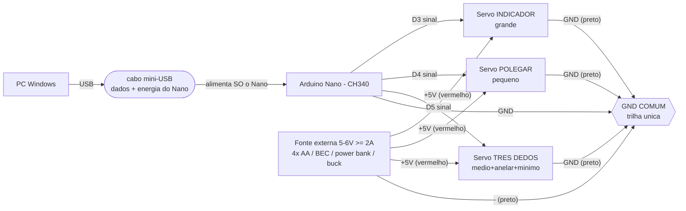

### Passo a passo da montagem na protoboard

1. **Defina os dois trilhos.** Escolha uma trilha lateral da protoboard para **+V** (positivo da fonte) e outra para **GND comum**. Não conecte nada da fonte ao Nano ainda.
2. **GND comum primeiro.** Ligue o **−** da fonte e um **GND** do Nano na **mesma trilha de GND**. Em seguida ligue os **3 fios pretos/marrons** dos servos nessa trilha. (Fazer o GND antes evita ligar um servo "flutuante".)
3. **Sinais.** Ligue cada fio **branco/laranja** ao pino correto: indicador → **D3**, polegar → **D4**, três dedos → **D5**.
4. **+V dos servos.** Só agora ligue os **3 fios vermelhos** à trilha **+V**. Confira **uma última vez** que o **+V não toca o pino 5V do Nano**.
5. **Energize.** Conecte o Nano ao PC pelo **USB** e ligue a **fonte externa**. Ao energizar, o firmware envia o banner `R` pela serial e leva os servos para a **posição segura = mão aberta**.

### Cuidados e boas práticas

- **Fonte de ≥ 2 A:** subdimensionar a fonte reproduz exatamente o sintoma de "tremedeira" do USB. Prefira margem de corrente (3 servos com pico simultâneo). Tensão entre **5 V e 6 V**; acima disso pode estressar servos pequenos.
- **Servo do polegar:** é um servo **pequeno** e pode **contrair sozinho** em situações de borda (foi necessário calibrar limiar/faixa do polegar na visão para ele não fechar ao ligar a câmera). Eletricamente, garanta que ele esteja na **mesma fonte e mesmo GND** dos demais — não tente alimentá-lo separado.
- **GND solto = jitter:** se, mesmo com fonte externa, o servo voltar a **oscilar/tremer**, suspeite de **GND comum mal conectado** (jumper frouxo na protoboard) ou **fonte fraca** — não é software. O firmware comenta isso explicitamente.
- **Polaridade:** confira **vermelho = +V** e **preto/marrom = GND** antes de energizar. Inverter pode danificar o servo.
- **Cabo USB de DADOS:** alguns cabos mini-USB são "só carga". Use um cabo de **dados**, senão a porta serial COM nem aparece.
- **Não passe o +5V externo pelos trilhos de energia do Nano** — mantenha potência (servos) e lógica (Nano/USB) separadas, unidas só pelo **GND comum**.
- **Sentido e curso** (open/fist invertidos, curso curto) **não são problemas elétricos** — são resolvidos no firmware (flags `REV_*` e limites `15..165`). Se a fiação de energia/GND estiver correta e o dedo "anda ao contrário", o ajuste é em software, não na protoboard.

---

## Firmware (Arduino)

O firmware roda em um **Arduino Nano** (clone com chip USB-serial **CH340**, montado numa protoboard) e transforma a mão HACKberry — que de fábrica é autônoma — em um **atuador controlado pelo host**. Toda a inteligência (visão, painel web, gestos) fica no PC; o firmware é a camada de baixo nível que recebe comandos por serial, move os 3 servos de dedos de forma suave e segura, e garante o **fail-safe** quando perde contato com o host.

O sketch fica em [`firmware/hackberry_serial/hackberry_serial.ino`](../../firmware/hackberry_serial/hackberry_serial.ino) e usa apenas a biblioteca padrão `Servo.h` (mais `avr/wdt.h`, usado só para *desligar* o watchdog de hardware — ver mais abaixo).

> **Lembrete sobre o hardware:** a HACKberry **não é um braço posicionador**, é uma **mão**. São 3 servos de dedos — polegar, indicador (servo grande) e o grupo "três dedos" (médio+anelar+mínimo, que se movem juntos). O pulso é ajustado **manualmente**, sem motor. Antes de ligar, releia a seção de hardware: os servos exigem **fonte externa de 5–6 V** e **GND comum** com o Nano.

---

### Visão geral do laço de controle

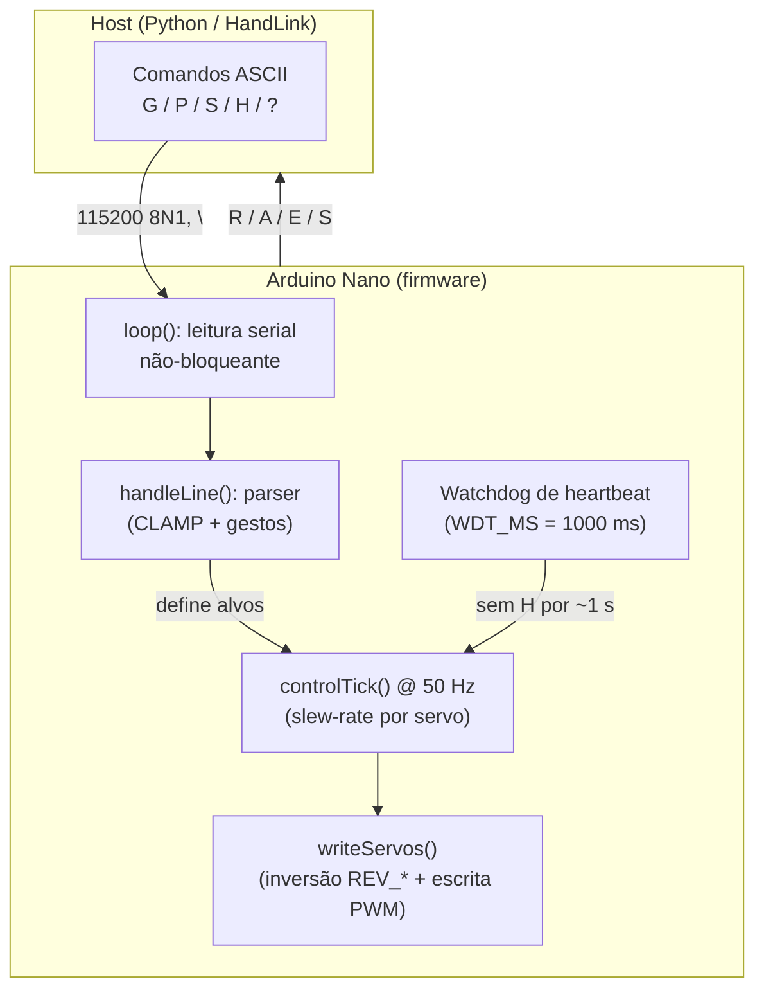

O `loop()` faz três coisas a cada volta, sem nunca bloquear:
1. **Lê a serial** caractere a caractere, montando uma linha terminada em `\n` (ou `\r`).
2. **Verifica o watchdog de heartbeat** — se o host parou de enviar `H`, abre a mão (fail-safe).
3. **Roda o tick de controle a 50 Hz** (a cada 20 ms), aproximando suavemente os ângulos atuais dos alvos.

---

### Protocolo serial completo

- **Camada física:** ASCII, **115200 8N1**, terminador de linha `\n` (o firmware também aceita `\r`).
- **Regra de fluxo:** o host envia uma linha; o MCU responde com um **ACK** (`A:…`) ou um **erro** (`E:…`). O cliente Python (`HandLink`) mantém **1 comando em voo por vez**, aguardando o ACK antes de enviar o próximo.

#### Host → MCU (comandos)

| Comando | Sintaxe | Significado | Exemplo | Resposta esperada |
|---|---|---|---|---|
| **G** | `G:<polegar>,<indicador>,<três_dedos>` | Define ângulos **absolutos** em graus (lógicos). Aplica **CLAMP** por servo (15..165). | `G:120,30,30` | `A:G` (ou `E:1:range` se algum valor veio fora do intervalo — mesmo assim o CLAMP é aplicado) |
| **P** | `P:<NOME>` | Executa um **gesto nomeado**: `OPEN`, `FIST`, `POINT`, `PINCH`, `SHAKE`. | `P:FIST` | `A:P:FIST` (ou `E:4:cmd` se o gesto for desconhecido) |
| **S** | `S` | **STOP seguro**: abre a mão (libera objeto) e entra em modo `SAFE`. | `S` | `A:S` |
| **H** | `H` | **Heartbeat**: alimenta o watchdog. O host envia periodicamente (~0,3 s). | `H` | `A:H` |
| **?** | `?` | **Query** de status atual. | `?` | `S:<th>,<idx>,<ot>,<modo>` |

> **Convenção de ângulo lógico:** `0` (ou o `MIN`) = dedo **aberto/estendido**; o valor máximo = dedo **flexionado/fechado**. A inversão física de cada servo é resolvida internamente pelas flags `REV_*` (ver adiante), então o host raciocina sempre na escala lógica.

**Como os gestos nomeados se traduzem em ângulos** (sempre dentro do CLAMP):

| Gesto | Polegar | Indicador | Três dedos | Efeito |
|---|---|---|---|---|
| `OPEN` | `MIN` | `MIN` | `MIN` | Mão totalmente aberta |
| `FIST` | `MAX` | `MAX` | `MAX` | Punho fechado |
| `POINT` | `MAX` | `MIN` | `MAX` | Indicador estendido, resto fechado |
| `PINCH` | `MAX` | meio do curso | `MIN` | Pinça (polegar + indicador) |
| `SHAKE` | ~70% do curso | ~70% | ~70% | Fecho suave para "apertar a mão" |

#### MCU → Host (respostas)

| Resposta | Sintaxe | Significado | Exemplo |
|---|---|---|---|
| **R** | `R` | **Banner de boot/ready**: o firmware iniciou e está pronto. O `HandLink` espera por ele antes de comandar. | `R` |
| **A** | `A:<eco>` | **ACK** de comando aceito (eco do comando). | `A:H` · `A:G` · `A:P:FIST` · `A:S` |
| **E** | `E:<cod>:<msg>` | **Erro**. Códigos: `1=range`, `2=parse`, `3=wdt`, `4=cmd`. | `E:1:range` · `E:2:parse` · `E:3:wdt` · `E:4:cmd` |
| **S** | `S:<th>,<idx>,<ot>,<modo>` | **Status**: ângulos atuais (lógicos, já suavizados) + modo. Modo é `HOST` (operando) ou `SAFE` (após STOP/watchdog). | `S:15,15,15,SAFE` |

**Tabela de códigos de erro:**

| Código | Nome | Quando ocorre |
|---|---|---|
| `1` | `range` | Algum ângulo do `G:` veio fora de 15..165 (o CLAMP é aplicado mesmo assim). |
| `2` | `parse` | Linha malformada: falta o `:`, `sscanf` não leu 3 inteiros, ou estouro do buffer de linha. |
| `3` | `wdt` | Watchdog de heartbeat disparou (host sumiu) → mão abriu em fail-safe. |
| `4` | `cmd` | Comando ou gesto desconhecido. |

**Exemplo de sessão serial** (host à esquerda, MCU à direita):

```text
                 <- R                 # boot pronto
H                -> A:H               # heartbeat
P:FIST           -> A:P:FIST          # fecha o punho (com slew-rate)
?                -> S:165,165,165,HOST
G:120,30,30      -> A:G               # ângulos absolutos
G:999,0,0        -> E:1:range         # fora do range; CLAMP -> 165,15,...
S                -> A:S               # stop seguro: abre a mão
?                -> S:15,15,15,SAFE
(host para de mandar H por >1 s)
                 <- E:3:wdt           # watchdog -> abriu sozinha
```

---

### Bloco de constantes (pinos, limites, passos, watchdog)

Estes são os parâmetros calibráveis no topo do sketch. **Não invente outros valores**: estes refletem a montagem real do projeto.

```cpp
// ---------- Pinos dos 3 servos de dedos (protoboard) ----------
//   indicador -> D3 ; polegar -> D4 ; três dedos -> D5
const uint8_t PIN_THUMB = 4;   // polegar
const uint8_t PIN_INDEX = 3;   // indicador
const uint8_t PIN_OTHER = 5;   // médio+anelar+mínimo

// ---------- Inversão de sentido por servo ----------
// Este modelo gira ao contrário: ângulo menor = fechado.
const bool REV_THUMB = true;
const bool REV_INDEX = true;
const bool REV_OTHER = true;

// ---------- Limites de ângulo por servo (LÓGICO: MIN=aberto, MAX=fechado) ----------
const int THUMB_MIN = 15,  THUMB_MAX = 165;
const int INDEX_MIN = 15,  INDEX_MAX = 165;
const int OTHER_MIN = 15,  OTHER_MAX = 165;

// ---------- Parâmetros de controle ----------
const uint8_t  STEP_BIG   = 10;    // graus/ciclo p/ indicador e três dedos
const uint8_t  STEP_THUMB = 7;     // graus/ciclo p/ polegar
const uint16_t TICK_MS    = 20;    // período do loop de controle (50 Hz)
const uint16_t WDT_MS     = 1000;  // sem heartbeat por este tempo -> fail-safe = abrir
const uint16_t IDLE_MS    = 800;   // só usado se DETACH_WHEN_IDLE = true
const bool DETACH_WHEN_IDLE = false; // detach desligado (servo SEGURA a posição)
```

> **Diagnóstico de pinos:** o mapeamento `indicador=D3 / polegar=D4 / três dedos=D5` foi **descoberto empiricamente**, porque a fiação da protoboard não batia com o palpite inicial. Para descobrir os seus pinos, use o sketch [`firmware/servo_scan/servo_scan.ino`](../../firmware/servo_scan/servo_scan.ino): ele varre os pinos digitais `2..12` um de cada vez, faz cada servo oscilar `~35°→115°→35°` e anuncia na serial qual pino está sendo testado. Você observa **qual dedo se move** em cada anúncio e anota o mapeamento real. Monitor: `arduino-cli monitor -p COM16 -c baudrate=115200`.

---

### Recursos do firmware (explicados)

#### 1. CLAMP por servo (limites 15..165)
Todo ângulo passa por `constrain(a, MIN, MAX)` específico do servo (`clampThumb`, `clampIndex`, `clampOther`). Isso impede que o software peça um ângulo que force a estrutura mecânica além do curso seguro. Se um comando `G:` chega com algum valor fora do intervalo, o firmware **ainda aplica o CLAMP** (move até o limite) mas responde `E:1:range` para o host saber que houve recorte. Esses mesmos limites são espelhados no Python (`src/thoth/safety/limits.py`), garantindo uma **fonte única de verdade** dos dois lados.

#### 2. Slew-rate (movimento suave a 50 Hz)
O firmware **nunca salta** direto para o ângulo alvo. A cada 20 ms (`TICK_MS`, ou seja, **50 Hz**), `controlTick()` aproxima o ângulo atual do alvo em passos limitados: `STEP_BIG = 10°` para indicador e três dedos, `STEP_THUMB = 7°` para o polegar. O resultado é um movimento contínuo e firme, sem trancos que poderiam derrubar a placa por pico de corrente. A escrita real no servo (`writeServos()`) acontece dentro desse tick.

#### 3. Inversão de sentido por servo (`REV_*`)
Na montagem real, os três servos **giram ao contrário** do esperado (com `OPEN` a mão fechava e vice-versa). Em vez de remontar o hardware, o firmware converte o **ângulo lógico** em **ângulo físico** com `outAngle(logical, rev) = rev ? (180 - logical) : logical`. As três flags (`REV_THUMB`, `REV_INDEX`, `REV_OTHER`) estão em `true`. Se você montar e um dedo ficar invertido (open fecha / fist abre), basta **alternar a flag** daquele dedo — sem mexer no resto do código.

#### 4. Watchdog de heartbeat = fail-safe que ABRE a mão
Esta é a principal salvaguarda. O host deve enviar `H` periodicamente. Se o firmware fica **sem heartbeat por mais de `WDT_MS` (1000 ms)** — host travou, cabo caiu, programa morreu —, ele chama `goSafeOpen()`: leva a mão para a posição totalmente **aberta** e entra em modo `SAFE`, emitindo `E:3:wdt`. **Abrir** é o estado seguro porque **libera qualquer objeto** segurado. A mão só volta a obedecer quando chega um novo comando válido (`G:` ou `P:`), que limpa o modo `SAFE`.

> **Importante:** este watchdog é de **software** (baseado em `millis()`), **não** o watchdog de hardware do AVR (ver nota de gravação abaixo).

#### 5. Detach desligado (por causa da mola de retorno)
Os dedos da HACKberry têm **molas de torção** que tendem a voltar à posição de repouso. Se o firmware fizesse `detach()` no servo após parar (cortando o PWM), a mola **puxaria o dedo de volta sozinho** — gerando os "movimentos desnecessários" observados durante o desenvolvimento. Por isso `DETACH_WHEN_IDLE = false`: o servo permanece **attached** e **segura a posição** indefinidamente. Isso só é possível com a **fonte externa de 5–6 V**: no 5 V do USB a corrente é insuficiente, o servo treme e não segura contra a mola. (As constantes `IDLE_MS`/`detachAll()` existem mas ficam dormentes.)

---

### Como gravar o firmware (arduino-cli)

A gravação usa o **`arduino-cli`** (instalado via `winget`) com o **core AVR** e a **lib Servo**. O caminho mais simples é o script [`scripts/flash_firmware.py`](../../scripts/flash_firmware.py), que faz tudo: localiza o `arduino-cli` (mesmo fora do PATH da sessão), instala core/lib se faltarem, compila e grava — **tentando o bootloader antigo primeiro**.

**Pré-requisitos (uma vez só):**

```bash
# Instalar o arduino-cli (Windows)
winget install -e --id ArduinoSA.CLI

# Instalar o core AVR e a biblioteca Servo
arduino-cli core update-index
arduino-cli core install arduino:avr
arduino-cli lib install Servo
```

**Gravar (forma recomendada — o script cuida do bootloader):**

```bash
python scripts/flash_firmware.py --port COM16
```

Opções úteis do script:

| Flag | Efeito |
|---|---|
| `--port COM16` | Porta serial do Arduino (**obrigatória**). |
| `--fqbn arduino:avr:nano` | Placa (padrão; a Mk2 deste projeto é um Nano). |
| `--old-bootloader` | Força **só** o bootloader antigo (`cpu=atmega328old`). |
| `--new-bootloader` | Força **só** o bootloader novo (Nano original). |
| `--sketch <pasta>` | Grava outro sketch (ex.: o `servo_scan`). |

#### O detalhe crítico: BOOTLOADER ANTIGO do clone CH340

O Nano clone com CH340 usa o **bootloader antigo** (ATmega328 *old*), que grava via avrdude a **57600 baud**. Se você tentar gravar como Nano "novo", o avrdude falha com vários avisos `not in sync` e a gravação não conclui.

Por isso o `flash_firmware.py` monta a FQBN do bootloader antigo (`arduino:avr:nano:cpu=atmega328old`) e a tenta **antes** da versão nova (que fica como *fallback* automático). Manualmente, o equivalente seria:

```bash
# Bootloader ANTIGO (clone CH340) — tentar este primeiro:
arduino-cli compile --fqbn arduino:avr:nano:cpu=atmega328old firmware/hackberry_serial
arduino-cli upload  --fqbn arduino:avr:nano:cpu=atmega328old -p COM16 firmware/hackberry_serial

# Fallback: bootloader NOVO (Nano original)
arduino-cli compile --fqbn arduino:avr:nano firmware/hackberry_serial
arduino-cli upload  --fqbn arduino:avr:nano -p COM16 firmware/hackberry_serial
```

> **Por que o watchdog de hardware foi removido:** uma versão inicial usava `wdt_enable()` (watchdog do AVR) como fail-safe. Isso **travava a regravação** no bootloader antigo (mais avisos `not in sync`) e podia causar **bootloop**. A solução foi chamar `wdt_disable()` logo no `setup()` (junto com `MCUSR = 0`) e mover toda a segurança para o **watchdog de heartbeat por software**, que não interfere no bootloader. Se a regravação travar, este é o primeiro suspeito.

---

### Licença do firmware

O sketch **deriva do firmware HACKberry** de *exiii Inc. / Mission ARM Japan* e é distribuído sob **GPLv3**. (O hardware HACKberry é **CC BY-NC-SA 4.0** — uso não-comercial.)

---

## Software (Python / Web)

Esta seção documenta a **camada de software** desta entrega: o que cada módulo Python faz, como eles se conectam e como um comando viaja do botão no navegador até o servo da mão HACKberry. O código vive em `src/thoth/` (Python 3.11) e é organizado em quatro responsabilidades bem separadas: **percepção** (visão computacional), **atuação** (serial/firmware), **API/web** (painel e telemetria) e **segurança** (limites), com o **core/state** servindo de ponte entre a visão e a web.

> Filosofia de projeto: cada camada conhece apenas a interface da vizinha. A visão não fala serial; a web não calcula flexão; a atuação não decide gesto. O `AppState` (singleton) é o único ponto de encontro entre o loop assíncrono de visão e o servidor web.

---

### Arquitetura em camadas

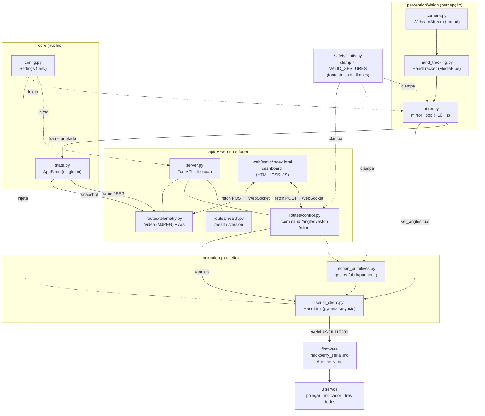

Leitura do diagrama:

- **`perception/vision` → `api/web`**: a visão produz frames anotados e flexões; a web apenas exibe (não processa imagem).
- **`actuation/serial` → `firmware`**: só o `HandLink` fala serial com o Arduino.
- **`safety` é transversal**: o `clamp` de `safety/limits.py` é aplicado em todos os caminhos que geram ângulo (controle por dedo, gestos e espelhamento).
- **`core/state` é a ponte**: o `mirror_loop` grava o frame e as flexões no `AppState`; a rota `/video` e o WebSocket leem do mesmo `AppState`. Os dois lados nunca se chamam diretamente.

---

### Papel de cada módulo

| Módulo | Arquivo | Responsabilidade |
|---|---|---|
| **Configuração** | `core/config.py` | `Settings` (pydantic-settings) lê o `.env` (porta serial, baud, heartbeat, índice/resolução da câmera, host/porta da API, log level, ambiente). `PROJECT_ROOT` e `get_settings()` cacheado. É a **única** fonte que toca o `.env`; o resto recebe `Settings` por injeção. |
| **Estado global** | `core/state.py` | `AppState` (singleton via `lru_cache`). Guarda: último frame JPEG anotado, `hand` (o `HandLink`), `mirror_enabled`, flexões em %, FPS, fila de eventos. Acesso ao frame é thread-safe (a captura roda em outra thread). `snapshot()` serializa tudo em JSON para o WebSocket. **Ponte visão↔web.** |
| **Segurança** | `safety/limits.py` | **Fonte única** dos limites de ângulo (`THUMB/INDEX/OTHER MIN=15, MAX=165` — espelha o firmware), `clamp`/`clamp_all`, `VALID_GESTURES` (`open, fist, point, pinch, shake`) e validação. Importado pela atuação e pela API. |
| **Cliente serial** | `actuation/serial_client.py` (`HandLink`) | Cliente serial **assíncrono** (pyserial-asyncio). Conecta, espera o banner `R`, envia 1 comando por vez (lock) e aguarda ACK com timeout, mantém **heartbeat** automático (~0,3 s), reconecta com backoff e libera o handle da porta em falha. Métodos: `set_angles(t,i,o)`, `gesture(nome)`, `stop()`, `query()`. |
| **Primitivas de movimento** | `actuation/motion_primitives.py` | Traduz **intenção → comando serial** via `HandLink`, sempre dentro dos limites. Funções `abrir`, `fechar_punho`, `apontar`, `pinca`, `apertar_a_mao`; o dicionário `GESTURES` mapeia `nome → função`. |
| **Servidor** | `api/server.py` | App FastAPI. No `lifespan`: em modo standalone conecta o `HandLink` na porta do `.env` e inicia o `mirror_loop` em background; serve o dashboard em `/`; inclui as rotas. Em uso unificado, a mão é gerenciada externamente (`managed_externally`). |
| **Rota — saúde** | `api/routes/health.py` | `/health` (liveness/readiness; informa se a mão está conectada e a versão). |
| **Rota — controle** | `api/routes/control.py` | `/command` (gesto nomeado), `/angles` (controle por dedo, com `clamp_all` antes de enviar), `/estop` (parada de emergência → abre a mão), `/mirror` (liga/desliga o espelhamento). |
| **Rota — telemetria** | `api/routes/telemetry.py` | `/video` (stream **MJPEG** do frame anotado, ~15 FPS no navegador) e `/ws` (**WebSocket** que empurra o `snapshot()` do estado ~3 Hz). |
| **Dashboard** | `web/static/index.html` | Página única (HTML+CSS+JS, tema escuro). Exibe o vídeo da visão, status da mão (modo/ângulos), botões de gesto, **Controle por Dedo** (3 sliders), **PARADA DE EMERGÊNCIA**, toggle "Espelhar minha mão", flexões % em tempo real e log de eventos. Atualiza por WebSocket; comanda por `fetch` POST. |

> Os módulos de visão (`camera.py`, `hand_tracking.py`) e `core/logging.py` (loguru) são detalhados na seção de Visão Computacional; aqui aparecem apenas como produtores de frame/flexão consumidos pelo `mirror_loop`.

---

### Fluxo de um comando (botão → servo)

Quando você clica em **"Punho"** no painel, o caminho é:

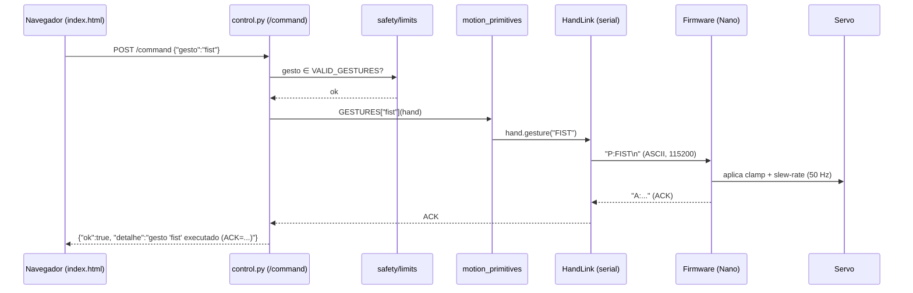

Em texto:

1. O botão dispara um `fetch` **POST `/command`** com `{"gesto": "fist"}`.
2. `control.py` normaliza o nome e valida contra `VALID_GESTURES` (gesto fora da lista → HTTP 400).
3. Chama `motion.GESTURES["fist"](hand)` → `fechar_punho` → `hand.gesture("FIST")`.
4. O `HandLink` serializa `P:FIST\n` na porta serial e **espera o ACK** (1 comando em voo por vez).
5. O firmware aplica o **clamp** (15..165), move com **slew-rate** suave (loop a 50 Hz) e responde `A:eco`.
6. A resposta sobe de volta como `CommandResponse(ok=true, detalhe=...)`.

O **controle por dedo** (`POST /angles {thumb,index,other}`) segue o mesmo trajeto, mas passa antes por `clamp_all(...)` em `control.py` (defesa em profundidade: o firmware também clampa) e envia `G:t,i,o`. O **e-stop** (`POST /estop`) chama `hand.stop()` → `S\n`, que **abre a mão** imediatamente.

```python
# control.py — núcleo do /command (resumo fiel)
gesto = req.gesto.strip().lower()
if gesto not in VALID_GESTURES:
    raise HTTPException(400, detail=f"gesto inválido; use {sorted(VALID_GESTURES)}")
ack = await motion.GESTURES[gesto](hand)   # -> HandLink -> serial -> firmware
```

---

### Fluxo do espelhamento (câmera → servos)

Com o toggle **"Espelhar minha mão"** ligado (`POST /mirror {enabled:true}` apenas seta `state.mirror_enabled`), o `mirror_loop` — que já roda em background desde o `lifespan` — começa a agir:

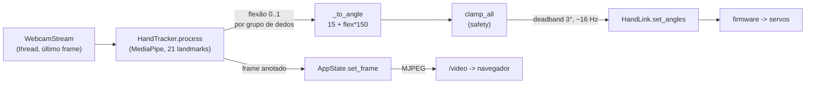

Passo a passo (`perception/vision/mirror.py`):

1. Enquanto `mirror_enabled` é `True`, abre a câmera (`WebcamStream`) e o `HandTracker` (uma vez); ao desligar, libera os dois.
2. Lê o último frame; `tracker.process(frame)` (rodado em `asyncio.to_thread`) devolve o **frame anotado** e as **flexões** (0=aberto, 1=fechado) por grupo de dedos.
3. O frame anotado é codificado em JPEG e publicado em `AppState.set_frame(...)` → consumido por `/video`.
4. As flexões viram ângulos lógicos com `_to_angle(f, 15, 165)` (`15 + flex*150`), passam por `clamp_all` e são enviadas com `hand.set_angles(t,i,o)`.
5. Dois cuidados evitam saturar o serial: **deadband** de 3° (só envia se algum ângulo mudou ≥ 3°) e **taxa máxima** de ~16 Hz (`_SEND_PERIOD = 0.06`).

> Observação: a **imagem é espelhada** (flip horizontal, visão de espelho), mas isso não afeta o cálculo — as flexões usam distâncias entre landmarks, que são invariantes ao flip.

---

### Rotas da API

| Método | Rota | Função |
|---|---|---|
| `GET` | `/` | Serve o dashboard (`web/static/index.html`). |
| `GET` | `/health` | Liveness/readiness: status, se a mão está conectada e a versão. |
| `POST` | `/command` | Executa um **gesto nomeado** (`open`, `fist`, `point`, `pinch`, `shake`). |
| `POST` | `/angles` | **Controle por dedo**: define ângulos absolutos `thumb,index,other` (passa por `clamp_all`). |
| `POST` | `/estop` | **Parada de emergência**: abre a mão imediatamente (`S`). |
| `POST` | `/mirror` | Liga/desliga o **espelhamento** da mão (câmera → servos). |
| `GET` | `/video` | Stream **MJPEG** do frame anotado pela visão (~15 FPS). |
| `WS` | `/ws` | **WebSocket** de telemetria: empurra o `snapshot()` do estado (~3 Hz). |

> A rota `/version` faz parte do conjunto de health/diagnóstico; o título do app no FastAPI e o cabeçalho do dashboard usam o nome do projeto.

---

### Como subir só o painel (standalone)

Sem agentes/IA, apenas o painel web de controle da mão:

```bash
# requisitos: Python 3.11 + dependências instaladas + .env com SERIAL_PORT/CAMERA_INDEX
python scripts/web.py
# -> Painel: http://127.0.0.1:8000   (mão na porta do .env)
```

O `scripts/web.py` adiciona `src/` ao path (dispensa `pip install -e .`), lê o `Settings` do `.env` e sobe o `app` FastAPI via `uvicorn`. Nesse modo, o **`lifespan` do servidor** conecta o `HandLink` na porta serial e inicia o `mirror_loop` automaticamente — basta abrir o navegador, clicar nos botões de gesto, mover os sliders por dedo ou ligar o espelhamento.

**Dependências de software (enxutas):** `opencv-python`, `mediapipe`, `numpy`, `pyserial`, `pyserial-asyncio`, `fastapi`, `uvicorn[standard]`, `websockets`, `pydantic`, `pydantic-settings`, `pyyaml`, `loguru` (dev: `pytest`, `pytest-asyncio`, `ruff`).

---

## Visão Computacional (teoria e aplicação)

Esta é a peça que torna o módulo "vivo": uma webcam comum observa a **sua** mão, um modelo de aprendizado de máquina extrai a pose dos dedos quadro a quadro, e o software traduz essa pose em ângulos para os três servomotores da mão HACKberry. O resultado é o **espelhamento**: você fecha a mão na frente da câmera e a prótese fecha junto, sem nenhum sensor preso ao corpo.

Esta seção tem duas partes: a **teoria** (como o MediaPipe enxerga a mão) e a **aplicação** (como nós convertemos os 21 pontos da mão em flexão de dedo e, daí, em ângulo de servo). O objetivo é que você consiga **entender e reproduzir** cada passo.

> Arquivos relevantes deste módulo:
> - `src/thoth/perception/vision/hand_tracking.py` — detecção da mão e cálculo da flexão.
> - `src/thoth/perception/vision/mirror.py` — loop câmera → flexão → ângulo → servo.
> - `src/thoth/perception/vision/camera.py` — captura da webcam em thread (último frame).
> - `scripts/download_models.py` — baixa o modelo `hand_landmarker.task`.

---

### 1. Teoria — MediaPipe Hands / HandLandmarker

O **MediaPipe** é um framework de pipelines de percepção do Google. Para mãos, usamos a tarefa **HandLandmarker** (a *Tasks API*, a versão mais nova da biblioteca — foi a única disponível no `mediapipe` 0.10.x que instalamos, por isso o projeto usa o modelo empacotado `hand_landmarker.task` em vez da API legada `mp.solutions.hands`).

A grande vantagem: ele roda em **tempo real na CPU**, sem GPU dedicada, o que é exatamente o que precisamos num notebook comum com uma webcam USB.

#### Pipeline de 2 estágios

O reconhecimento da mão é feito em **dois modelos encadeados**, não em um só. Isso é deliberado e é o que dá velocidade e precisão:

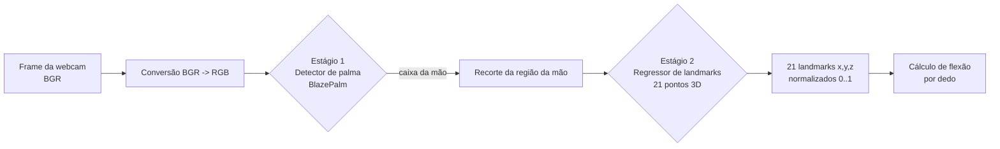

| Estágio | Modelo | O que faz | Saída |
|---|---|---|---|
| **1. Detecção** | **BlazePalm** (detector tipo SSD) | Localiza a região da palma no quadro inteiro. Detectar a *palma* (quase rígida, sem dedos articulados) é muito mais fácil e estável do que detectar a mão inteira aberta. | Caixa delimitadora (ROI) da mão |
| **2. Landmarks** | Regressor de landmarks | Recebe **só o recorte** da mão e regride 21 pontos 3D. Como trabalha numa imagem pequena e já centrada, é rápido e preciso. | 21 pontos `(x, y, z)` |

#### Modo VIDEO e rastreamento entre quadros

Configuramos o HandLandmarker em **`RunningMode.VIDEO`** (veja `HandLandmarkerOptions` em `hand_tracking.py`). Nesse modo o MediaPipe **rastreia** a mão entre quadros: depois de localizar a palma uma vez, ele reaproveita a posição anterior e **pula a detecção** nos quadros seguintes, rodando só o regressor de landmarks na região já conhecida. Isso é bem mais barato do que "detectar do zero a cada frame".

O modo VIDEO exige um **timestamp monotônico crescente** a cada chamada. No nosso código incrementamos `+33 ms` por quadro (≈ 30 fps de referência) antes de chamar `detect_for_video(...)`:

```python
self._ts_ms += 33  # timestamp monotônico (exigência do modo VIDEO)
res = self._lm.detect_for_video(mp_img, self._ts_ms)
```

Limitamos a **uma mão** (`num_hands=1`) — só precisamos de uma mão "professora" para o espelhamento.

#### O modelo `hand_landmarker.task`

A Tasks API carrega tudo (BlazePalm + regressor + metadados) de um **único arquivo** `hand_landmarker.task`. Ele não vem no repositório; baixe com:

```bash
python scripts/download_models.py
# grava em: models/mediapipe/hand_landmarker.task
```

Se o arquivo não existir, o `HandTracker` falha cedo com uma mensagem clara pedindo para rodar o script de download (evita um erro obscuro lá no meio do loop).

#### Os 21 landmarks da mão

O regressor devolve **21 pontos** com coordenadas **normalizadas** (x e y entre 0 e 1 em relação à largura/altura da imagem; z é a profundidade relativa). São o **pulso** + **4 pontos por dedo**:

```text
                8   12  16  20      <- pontas (TIP)
                |   |   |   |
                7   11  15  19      <- DIP
                |   |   |   |
                6   10  14  18      <- PIP
                |   |   |   |
            4   5   9   13  17      <- MCP (dedos) / IP (polegar)
            |    \  |   |  /
            3     \ |   | /
            2      \|   |/
            1       (palma)
             \       |
              \      |
               '---- 0 ----'        <- 0 = PULSO (WRIST)
```

| Índices | Dedo | Articulações (da base à ponta) |
|---|---|---|
| **0** | — | **Pulso (WRIST)** |
| 1, 2, 3, **4** | Polegar | CMC, MCP, IP, **ponta** |
| 5, 6, 7, **8** | Indicador | MCP, PIP, DIP, **ponta** |
| 9, 10, 11, **12** | Médio | MCP, PIP, DIP, **ponta** |
| 13, 14, 15, **16** | Anelar | MCP, PIP, DIP, **ponta** |
| 17, 18, 19, **20** | Mínimo | MCP, PIP, DIP, **ponta** |

> Dois landmarks são especialmente úteis para nós: o **0 (pulso)** como origem, e o **9 (base do médio, MCP)** como referência de **escala** da mão. Voltamos a eles a seguir.

---

### 2. Aplicação — dos landmarks à flexão dos dedos

A prótese tem **3 servos**, então precisamos de **3 valores de flexão**, cada um entre `0.0` (dedo **aberto/estendido**) e `1.0` (dedo **fechado/flexionado**):

| Flexão calculada | Servo / grupo | Como é obtida |
|---|---|---|
| `thumb` | Polegar | Distância ponta(4) → base do mínimo(17) |
| `index` | Indicador | Distância ponta(8) → pulso(0) |
| `other` | "Três dedos" (médio+anelar+mínimo) | **Média** das flexões de médio(12), anelar(16) e mínimo(20) |

A mão HACKberry agrupa médio, anelar e mínimo num **único servo**, então fazemos a média dos três e mandamos um só valor — é por isso que `other` é uma média.

#### A heurística central: razão "ponta → pulso" normalizada pela escala

A ideia é simples e geométrica. Quando um dedo está **estendido**, a ponta fica **longe** do pulso; quando ele **dobra**, a ponta se aproxima do pulso. Logo, a **distância ponta→pulso** já carrega a informação de flexão.

O problema: essa distância em pixels muda se a mão estiver **mais perto ou mais longe** da câmera. A solução é **normalizar** dividindo por uma referência interna da própria mão — a distância **pulso(0) → base do médio(9)**, que chamamos de **escala**:

```text
razão = distância(ponta_do_dedo, pulso) / distância(pulso, base_do_médio)
```

- Dedo **estendido** → ponta longe → razão **alta** → flexão ≈ **0** (aberto).
- Dedo **dobrado** → ponta perto → razão **baixa** → flexão ≈ **1** (fechado).

**Por que isso é robusto:**

- **Invariante à escala/distância da câmera:** numerador e denominador crescem juntos quando a mão se aproxima, então a razão é estável seja a mão perto ou longe.
- **Invariante à rotação no plano:** distâncias entre pontos não mudam se você girar a mão na frente da câmera — uma distância é a mesma independente do ângulo de rotação 2D.

O **polegar** é um caso à parte: ele não "dobra em direção ao pulso" como os outros. Por isso medimos a distância da **ponta(4) → base do mínimo(17)**: quando o polegar abre/abduz, ele se afasta do mínimo; quando fecha por cima da palma, se aproxima.

#### Calibração por dedo (limites estendido / fechado)

A razão "crua" não vai exatamente de 0 a 1 — cada dedo (e cada mão de pessoa) tem faixas diferentes. Por isso cada dedo tem um par **(estendido, fechado)** que mapeia a razão para `[0, 1]` com saturação (clip). Esses valores estão em `hand_tracking.py`:

```python
_EXT_CURL = {
    # (estendido = flex 0 , fechado = flex 1)
    "index":  (1.78, 1.05),   # 'estendido' menor p/ o indicador abrir 100%
    "middle": (2.10, 1.05),
    "ring":   (2.00, 1.00),
    "pinky":  (1.80, 0.95),
}
# Polegar (ponta 4 -> base do mínimo 17): 'aberto' menor para
# o polegar relaxado já contar como aberto e não contrair sozinho.
_THUMB_EXT, _THUMB_CURL = 1.25, 0.55
```

A normalização aplica a regra "estendido → 0, fechado → 1" e satura fora da faixa:

```python
def _norm(v, ext, curl):
    return clip((ext - v) / (ext - curl), 0.0, 1.0)
```

> **Por que esses números?** Eles saíram de calibração empírica (item 11 da jornada). O **indicador** ganhou um "estendido" menor (`1.78`) para conseguir **abrir 100%**. O **polegar** ganhou um "aberto" baixo (`1.25`) para não **contrair sozinho** assim que a câmera liga. Se você reproduzir com a sua mão e algum dedo não chegar a 0% ou 100%, ajuste o par correspondente.

#### Espelhamento (flip horizontal)

Antes de processar, espelhamos o quadro na horizontal (`cv2.flip(frame, 1)`), criando a sensação natural de **espelho** — você se vê como num espelho, sua mão direita aparece à direita da tela.

```python
if self._flip:
    frame_bgr = cv2.flip(frame_bgr, 1)  # visão de espelho
```

Detalhe importante: o flip **não altera o cálculo da flexão**. Todas as nossas medidas são **distâncias** entre pontos, e distância é invariante a espelhamento (espelhar troca a orientação, não os comprimentos). O flip é puramente para a experiência visual.

#### Pseudocódigo do cálculo de flexão (resumo fiel ao código)

```python
def flexao_dos_dedos(pts):           # pts = 21 landmarks (x, y) normalizados
    pulso  = pts[0]
    escala = distancia(pts[9], pulso) # pulso -> base do médio (referência de tamanho)

    def razao(idx):                   # razão da ponta 'idx' até o pulso
        return distancia(pts[idx], pulso) / escala

    index  = normaliza(razao(8),  ext=1.78, curl=1.05)
    middle = normaliza(razao(12), ext=2.10, curl=1.05)
    ring   = normaliza(razao(16), ext=2.00, curl=1.00)
    pinky  = normaliza(razao(20), ext=1.80, curl=0.95)
    other  = (middle + ring + pinky) / 3.0          # 3 dedos -> 1 servo

    razao_polegar = distancia(pts[4], pts[17]) / escala   # ponta -> base do mínimo
    thumb = normaliza(razao_polegar, ext=1.25, curl=0.55)

    return thumb, index, other       # cada um em [0..1] (0=aberto, 1=fechado)
```

---

### 3. Aplicação — da flexão ao ângulo do servo (o loop de espelhamento)

Com `(thumb, index, other)` em mãos, o `mirror_loop` (em `mirror.py`) converte cada flexão em **ângulo lógico** e envia para a prótese pelo `HandLink` (cliente serial assíncrono).

#### Mapeamento flexão → ângulo

O firmware aceita ângulos na faixa **15..165°** (mesmos limites em `safety/limits.py`). Mapeamos linearmente a flexão `0..1` para essa faixa:

```python
def _to_angle(f, lo=15, hi=165):
    return round(lo + f * (hi - lo))   # com lo=15, hi=165  ->  15 + f*150
```

Ou seja: **flexão 0 → 15°** (aberto), **flexão 1 → 165°** (fechado), o que dá a fórmula **`ângulo = 15 + flex·150`**. Os ângulos ainda passam por `clamp_all(...)` (a fonte única de limites) antes de irem para o servo — segurança em camadas.

#### Cadência (~16 Hz) e deadband

Não enviamos um comando por quadro: isso entupiria a serial e faria o servo "tremer". Duas travas controlam o ritmo (constantes em `mirror.py`):

| Constante | Valor | Efeito |
|---|---|---|
| `_SEND_PERIOD` | `0.06 s` | **Cadência máxima ≈ 16 Hz** — só envia se passaram ≥ 60 ms desde o último envio. |
| `_DEADBAND` | `3°` | **Banda morta** — só envia se **algum** ângulo mudou em ≥ 3° desde a última posição enviada. |

O **deadband** filtra o tremor natural da estimativa de pose (a mão parada ainda oscila alguns graus entre quadros): se nada mudou de forma significativa, **não mandamos comando**, e o servo descansa parado. Junto com o slew-rate do firmware (movimento suave) e o heartbeat (fail-safe), isso dá um movimento estável.

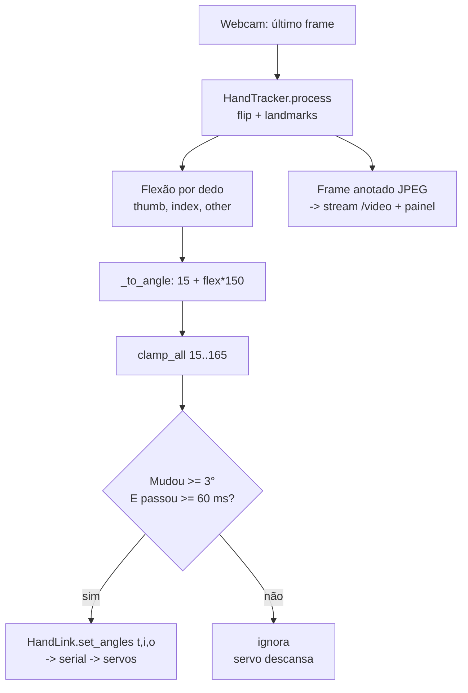

O frame anotado (esqueleto desenhado + percentuais de flexão) é publicado no `AppState` e aparece no painel web via stream MJPEG (`/video`), enquanto os percentuais em tempo real chegam pelo WebSocket (`/ws`). Para ligar/desligar o espelhamento, use o toggle **"Espelhar minha mão"** no dashboard (rota `POST /mirror`).

> **Nota de hardware:** o espelhamento envia comandos contínuos; é justamente o cenário em que a **fonte externa 5–6 V com GND comum** é indispensável — no 5 V do USB os três servos não seguram a posição contra as molas de retorno (ver seção de hardware).

---

## Como Usar

Esta seção é um guia completo, do zero ao painel funcionando, para você **entender e replicar** o controle da mão protética HACKberry: comandos diretos de gesto, controle por dedo e **espelhamento da sua mão por visão computacional**.

O fluxo é sempre o mesmo:

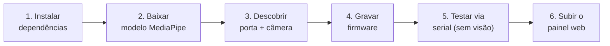

> **Importante:** todos os comandos abaixo são para **PowerShell no Windows** (ambiente em que o projeto foi desenvolvido). Em Linux/macOS, troque `COMx` por algo como `/dev/ttyUSB0` e `python` por `python3` conforme o seu sistema.

---

### ✅ Pré-requisitos

Antes de começar, garanta que você tem **tudo** desta lista. Faltando qualquer item, alguma etapa vai falhar.

| Item | Detalhe | Como verificar |
| --- | --- | --- |
| **Python 3.11** | O projeto exige `requires-python >=3.11`. | `python --version` |
| **arduino-cli** | Necessário **apenas** para gravar o firmware (etapa 4). Instalado via `winget`. | `arduino-cli version` |
| **Webcam USB** | Usada no espelhamento (etapa 6). No desenvolvimento foi uma Logitech C270 (índice de câmera **1** no Windows). | `python scripts/check_devices.py` |
| **Mão HACKberry montada** | Os 3 servos (polegar, indicador, três dedos) ligados ao Arduino Nano na protoboard, sinais nos pinos **D4 / D3 / D5**. | inspeção física |
| **Fonte externa de 5–6 V** | Os servos **NÃO** podem ser alimentados pelo 5 V do USB/Arduino (puxam muita corrente; sem ela o servo treme e não segura). | ver bloco crítico abaixo |
| **Cabo mini-USB de dados** | Conecta o Arduino Nano (chip CH340) ao PC. Tem de ser cabo de **dados**, não só de carga. | aparece em `check_devices.py` |

> ⚠️ **REGRA CRÍTICA DE ALIMENTAÇÃO E ATERRAMENTO (GND comum)**
> - O **+5 V externo** vai **SÓ no fio vermelho dos servos** — **nunca** no pino 5V do Nano.
> - O **negativo da fonte**, o **GND do Nano** e os **fios pretos/marrons dos servos** precisam estar **TODOS no mesmo ponto** (GND comum). Sem isso o sinal não é entendido pelos servos.
> - O **Nano continua alimentado pelo USB** (dados + lógica).
> - Cores dos servos: **vermelho = V+ (5 V)** · **preto/marrom = GND** · **branco/laranja = sinal**.

Recomendado, mas opcional, criar um ambiente virtual isolado:

```powershell
python -m venv .venv
.\.venv\Scripts\Activate.ps1
```

---

### 1️⃣ Instalar as dependências

Na raiz do projeto, instale o pacote em modo editável com os extras de desenvolvimento (recomendado):

```powershell
pip install -e ".[dev]"
```

Isso instala o runtime (OpenCV, MediaPipe, NumPy, pyserial/pyserial-asyncio, FastAPI, Uvicorn, websockets, Pydantic, loguru) **mais** as ferramentas de dev (`pytest`, `pytest-asyncio`, `ruff`).

Se preferir **somente o runtime** (sem dev), ou se não quiser instalar o pacote, use o `requirements.txt`:

```powershell
pip install -r requirements.txt
```

> 💡 Os scripts em `scripts/` adicionam `src/` ao `PYTHONPATH` automaticamente, então **funcionam mesmo sem `pip install -e .`**. Ainda assim, instalar as dependências (`requirements.txt`) é obrigatório.

---

### 2️⃣ Baixar o modelo de visão (MediaPipe HandLandmarker)

O rastreamento da mão usa o modelo `hand_landmarker.task` (Google MediaPipe Tasks API). Ele **não é versionado no Git** — baixe-o:

```powershell
python scripts/download_models.py
```

O arquivo é salvo em `models/mediapipe/hand_landmarker.task`. Se já existir, o script apenas confirma (`[ok] ... já existe`).

> Esta etapa só é necessária para o **espelhamento por visão**. Comandos de gesto e controle por dedo (etapas 5 e 6) funcionam sem o modelo — mas o toggle "Espelhar minha mão" precisa dele.

---

### 3️⃣ Descobrir a porta serial e a câmera, e ajustar o `.env`

Liste as portas seriais e as câmeras disponíveis:

```powershell
python scripts/check_devices.py
```

Saída de exemplo (a sua vai variar):

```text
=== Portas seriais ===
  COM16        USB-SERIAL CH340 (COM16)

=== Câmeras ===
  index 0: 640x480
  index 1: 1280x720
```

- A porta do **CH340** é a do seu Arduino (no desenvolvimento foi `COM16`).
- O **índice da câmera** que mostra a sua webcam (no desenvolvimento foi `1`, a Logitech).

Agora **crie o seu `.env`** copiando o exemplo e ajuste os valores:

```powershell
Copy-Item .env.example .env
notepad .env
```

Conteúdo a ajustar (campos relevantes):

```dotenv
# === Hardware / serial (Arduino) ===
SERIAL_PORT=COM16        # use a porta do CH340 que apareceu acima
SERIAL_BAUD=115200
SERIAL_HEARTBEAT_MS=300

# === Câmera (visão computacional) ===
CAMERA_INDEX=1           # use o índice da sua webcam
CAMERA_WIDTH=1280
CAMERA_HEIGHT=720

# === App / API ===
API_HOST=127.0.0.1
API_PORT=8000
LOG_LEVEL=INFO
```

> ⚠️ **Não use comentários inline com `=` no `.env`** de forma descuidada e **nunca versione o `.env`** (já está no `.gitignore`). O painel web lê `SERIAL_PORT` e `CAMERA_INDEX` daqui.

---

### 4️⃣ Gravar o firmware no Arduino

Com a mão conectada por USB, grave o firmware serial custom:

```powershell
python scripts/flash_firmware.py --port COM16
```

O script faz tudo sozinho:

1. **Localiza o `arduino-cli`** mesmo que não esteja no PATH da sessão atual (procura nos caminhos do `winget`).
2. **Instala o core `arduino:avr` e a biblioteca `Servo`** se faltarem.
3. **Tenta o bootloader ANTIGO primeiro** (`arduino:avr:nano:cpu=atmega328old`, avrdude a 57600) e cai para o novo como fallback.

> 🔑 **Por que o bootloader antigo?** O Nano deste projeto é um **clone com chip CH340**, que usa o **bootloader antigo**. Gravar com o bootloader novo dá o erro `not in sync`. Por isso o script tenta o antigo primeiro.

Forçar um bootloader específico, se precisar:

```powershell
# força SÓ o bootloader antigo (clone CH340)
python scripts/flash_firmware.py --port COM16 --old-bootloader

# força SÓ o bootloader novo (Nano original)
python scripts/flash_firmware.py --port COM16 --new-bootloader
```

Ao terminar você verá `OK: firmware gravado.`

> Para gravar **outro sketch** (por exemplo o `servo_scan`, usado para descobrir qual pino move qual dedo), use `--sketch`:
> ```powershell
> python scripts/flash_firmware.py --port COM16 --sketch firmware/servo_scan
> ```

---

### 5️⃣ Testar comandos **sem visão** (REPL serial)

Antes de abrir o painel, valide a mão pelo terminal. Isso isola problemas de **hardware/firmware** dos problemas de **web/visão**:

```powershell
python scripts/serial_repl.py --port COM16
```

Ao conectar, ele espera o banner de boot `R` do firmware e mostra a posição atual. Comandos disponíveis no prompt `>`:

| Comando | O que faz |
| --- | --- |
| `open` / `fist` / `point` / `pinch` / `shake` | Gestos nomeados (abrir, punho, apontar, pinça, apertar a mão). |
| `t <ang>` `i <ang>` `o <ang>` | Define o ângulo de **um** dedo: `t`=polegar, `i`=indicador, `o`=três dedos. Ex.: `i 90`. |
| `t+ t- i+ i- o+ o-` | Ajusta ±10° aquele dedo (calibração fina). |
| `G:<t>,<i>,<o>` | Envia os **3 ângulos** de uma vez (linha crua ao firmware). Ex.: `G:165,15,15`. |
| `status` ou `?` | Mostra os ângulos atuais e o modo (`HOST` / `SAFE`). |
| `stop` | Parada segura (a mão **abre**). |
| `q` | Sai. |

Convenção de ângulos: **~15° = ABERTO**, **~165° = FECHADO**. O firmware aplica **clamp** aos limites `15..165` automaticamente, então valores fora da faixa são apenas recortados.

Sessão de exemplo:

```text
conectando em COM16…
conectado!
> open
  -> A:open
> i 90
  indicador = 90
  -> G:15,90,15  (A:G:15,90,15)
> fist
  -> A:fist
> q
```

> Se a mão **treme ou não segura** a posição aqui, quase certamente é **falta de corrente**: revise a fonte externa de 5 V e o **GND comum**. (No desenvolvimento, lendo a serial, confirmamos que a placa **não reiniciava** — logo o problema era energia, não software.)

---

### 6️⃣ Subir o painel web (dashboard)

Com firmware gravado e mão testada, suba o painel:

```powershell
python scripts/web.py
```

Você verá algo como:

```text
Painel: http://127.0.0.1:8000   (mão em COM16)
```

Abra o navegador em **http://127.0.0.1:8000**.

No `startup` (lifespan do FastAPI), o servidor **conecta o `HandLink`** na porta do `.env` e inicia o loop de espelhamento em background. A partir daí, o navegador comanda a mão por requisições HTTP e recebe telemetria em tempo real.

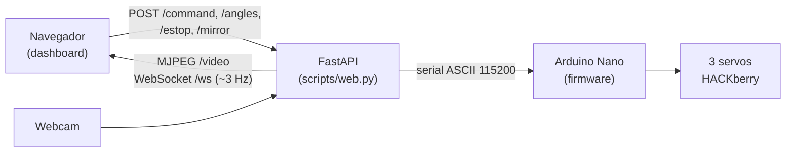

#### O que cada recurso do dashboard faz

O dashboard é uma página única (tema escuro) e atualiza o status por **WebSocket** (`/ws`, ~3 Hz) e o vídeo por **MJPEG** (`/video`). Todos os botões disparam `fetch POST`.

| Recurso | Para que serve | Endpoint / mecanismo |
| --- | --- | --- |
| **Vídeo da visão** | Imagem `` com o stream MJPEG da webcam, já com o esqueleto da mão (21 landmarks do MediaPipe) desenhado e a imagem **espelhada** (visão de espelho). | `GET /video` |
| **Status da mão** | Mostra o **modo** (`HOST` quando comandado, `SAFE` no fail-safe) e os **ângulos atuais** dos 3 dedos. Atualizado pelo WebSocket. | `GET /ws` |
| **Botões de gesto** | `Abrir`, `Punho`, `Apontar`, `Pinça`, `Apertar` — executam os gestos nomeados (`open` / `fist` / `point` / `pinch` / `shake`). | `POST /command` `{ "gesto": "fist" }` |
| **Controle por Dedo (3 sliders)** | Um slider para cada servo (polegar / indicador / três dedos). Os ângulos são **clampados aos limites** antes de ir ao firmware. | `POST /angles` `{ "thumb": …, "index": …, "other": … }` |
| **PARADA DE EMERGÊNCIA** | Botão de e-stop: manda a mão **abrir** imediatamente (posição segura). Use sempre que algo parecer errado. | `POST /estop` |
| **"Espelhar minha mão"** | Toggle que liga/desliga o espelhamento por visão. Ligado: a câmera lê a sua mão, calcula a **flexão** de cada grupo de dedos e move os servos (~16 Hz, com deadband de 3°). | `POST /mirror` `{ "enabled": true }` |
| **Flexões % em tempo real** | Mostra a flexão calculada de cada grupo de dedos (0 % = aberto, 100 % = fechado), vinda da visão. | `GET /ws` |
| **Log de eventos** | Lista os últimos eventos (comandos web, e-stop, troca do espelho), útil para acompanhar o que a interface fez. | `GET /ws` |

> 🪞 **Para usar o espelhamento:** ligue o toggle **"Espelhar minha mão"** e mostre a sua mão para a webcam (a câmera precisa estar no `CAMERA_INDEX` correto e o modelo da etapa 2 baixado). A flexão é estimada de forma **robusta à rotação e à distância** (razão ponta-do-dedo → pulso, normalizada pelo tamanho da mão), e há **calibração própria** para polegar e indicador.

> 🛟 **Watchdog de segurança (fail-safe):** o host envia um *heartbeat* automático (`H`) a cada ~0,3 s. Se o painel cair ou o cabo soltar e o firmware ficar ~1 s **sem heartbeat**, a mão **abre sozinha** e entra em modo `SAFE`. É um comportamento esperado, não um bug.

#### Parar tudo

Para encerrar o painel, volte ao terminal e pressione **Ctrl + C**. A conexão serial é fechada de forma limpa e a mão fica na última posição segura.

---

## Como Replicar em Casa

Esta seção é um guia prático e completo para você montar a mão protética HACKberry controlada por painel web (comandos diretos + espelhamento por visão computacional) **do zero**. A ideia é que, ao final, você consiga: imprimir e montar a mão, ligar a eletrônica com segurança, gravar o firmware, subir o painel e calibrar tudo para a **sua** mão impressa e para a **sua** mão real (na frente da câmera).

> A mão HACKberry NÃO é um braço posicionador: é uma **mão de 3 servomotores de dedos** (polegar, indicador e o conjunto médio+anelar+mínimo). O pulso é ajustado **manualmente** (sem motor). Tenha isso em mente ao planejar o que vai conseguir fazer (gestos de mão, preensão, apontar, pinça), e não trajetórias de braço.

A camada de EEG/EMG e a IA agêntica/voz fazem parte do roadmap maior do projeto — **não** são necessárias para replicar este módulo. Aqui você reproduz o **controle da mão por painel web + espelhamento por visão**.

---

### 📦 Lista de Materiais (BOM)

| Item | Descrição | Observação |
|------|-----------|------------|
| **Mão HACKberry (impressa em 3D)** | Estrutura da mão protética open-source da exiii Inc. / Mission ARM Japan, impressa em filamento (PLA ou nylon). Inclui palma, dorso, 5 dedos articulados e base de pulso. | Modelos STL/3D no GitHub `mission-arm/HACKberry`. Hardware sob licença **CC BY-NC-SA 4.0** (uso **não-comercial**). Dimensões ~225×150×60 mm, ~450–500 g montada. |
| **Kit de 3 servomotores** | 1 servo **GRANDE** (indicador, flexão) + 2 servos **pequenos** (polegar = abdução/rotação; "três dedos" = médio+anelar+mínimo, flexão). | Os servos costumam acompanhar o kit de montagem HACKberry. Anote o modelo para conferir tensão (5–6 V) e torque. |
| **Parafusos M2, eixos e molas de torção** | Ferragem de montagem: parafusos M2, eixos/pinos das articulações e **molas de retorno** dos dedos. | As molas fazem o dedo voltar sozinho — isso é importante para entender a lógica de manter o servo energizado (ver seção D). |
| **Arduino Nano (clone CH340)** | Microcontrolador ATmega328 que executa o firmware e fala com o PC por serial. Um **clone com chip USB-serial CH340** funciona perfeitamente. | Montado em **protoboard** (não a placa integrada HACKberry Mk2). Exige **bootloader antigo** ao gravar (ver seção C). |
| **Protoboard + jumpers** | Protoboard padrão e jumpers macho-macho/macho-fêmea para a fiação dos servos e do GND comum. | Mantém a montagem reversível e fácil de depurar (ex.: usar o `servo_scan`). |
| **Fonte externa 5–6 V (≥ 2 A)** | Alimenta **somente os servos**. Opções: 4 pilhas AA (≈ 6 V), BEC 5 V, power bank 5 V ou módulo step-down/buck. | **CRÍTICO.** Os 3 servos juntos puxam corrente demais para o 5 V do USB — sem fonte externa o servo treme e não segura a posição. |
| **Cabo mini-USB de DADOS** | Conecta o Arduino Nano ao PC (energia do MCU + serial). | Garanta que é cabo de **dados**, não só de carga. O Nano continua alimentado pelo USB. |
| **Webcam USB** | Captura a sua mão para o espelhamento por visão computacional. | No desenvolvimento usamos uma **Logitech C270** (índice de câmera **1** no Windows). Confirme o índice com `check_devices.py`. |
| **PC com Windows + Python 3.11** | Roda o painel web, a visão (MediaPipe) e o cliente serial. | Também precisa do `arduino-cli` para gravar o firmware. Python **3.11**. |

#### 💰 Estimativa de custo aproximada

| Componente | Faixa estimada (BRL) |
|------------|----------------------|
| Filamento + impressão 3D da mão | R$ 60 – 150 (se você tiver/usar impressora própria) |
| Kit de 3 servos + ferragem (M2, eixos, molas) | R$ 120 – 300 |
| Arduino Nano clone (CH340) | R$ 25 – 50 |
| Protoboard + jumpers | R$ 20 – 40 |
| Fonte 5–6 V ≥ 2 A (pilhas/BEC/buck/power bank) | R$ 20 – 60 |
| Webcam USB (ex.: C270) | R$ 90 – 180 |
| Cabo mini-USB de dados | R$ 10 – 25 |
| **Total aproximado (sem o PC)** | **≈ R$ 350 – 800** |

> Valores indicativos para o Brasil em 2025/2026; variam muito com fornecedor e câmbio. O PC com Windows é pré-requisito e não está somado. Impressão terceirizada da mão pode elevar bastante o custo.

---

### 🗺️ Visão geral do processo

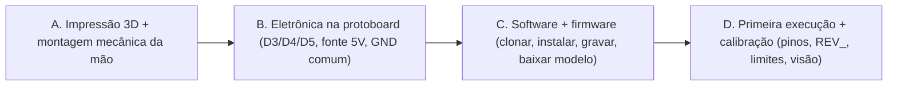

---

### 🅰️ Bloco A — Impressão 3D e montagem mecânica da mão

1. **Baixe os modelos open-source.** Acesse o repositório oficial no GitHub: **`mission-arm/HACKberry`** (https://github.com/mission-arm/HACKberry). Lá ficam os arquivos de impressão 3D (STL/CAD) da mão, além do manual de montagem.
   - Materiais de apoio deste projeto, em PT-BR, estão na pasta `documentos/`: **`manual_original.pdf`** e **`Manual_traduzido_PT-BR.pdf`** (siga o manual traduzido para montar).
2. **Imprima as peças.** Use **PLA** (mais fácil) ou **nylon** (mais resistente/flexível para articulações). Imprima palma, dorso, dedos e base de pulso conforme o manual.
   - Dica: imprima com bom preenchimento nas peças que sofrem esforço (articulações dos dedos) e revise as tolerâncias dos furos para os eixos M2.
3. **Monte os dedos e os servos seguindo o manual.** Encaixe os eixos/pinos das articulações, instale as **molas de torção** (retorno dos dedos) e fixe os 3 servomotores:
   - **Servo GRANDE → indicador** (flexão).
   - **Servo pequeno → polegar** (abdução/rotação).
   - **Servo pequeno → "três dedos"** (médio+anelar+mínimo, flexão).
4. **Ajuste o pulso manualmente.** O pulso não tem motor — posicione-o no ângulo desejado à mão.
5. **Teste mecânico a seco.** Antes da eletrônica, mova os dedos com o dedo (sem energia) e confirme que cada articulação volta pela mola e não trava. Corrija atritos/folgas agora — depois fica mais difícil.

> **Cuidado importante:** ainda **não** parafuse os braços (horns) dos servos na posição final. Os servos têm um curso/zero próprio e o firmware aplica inversão de sentido — é mais fácil acertar o "ponto zero" mecânico **depois** de energizar e rodar o firmware (Bloco D). Deixe os horns frouxos/provisórios por enquanto.

---

### 🅱️ Bloco B — Eletrônica na protoboard

> Os detalhes elétricos completos (diagrama de fiação, cores, regras de GND) estão na **seção de Eletrônica** deste README. Aqui está o essencial para replicar.

**Mapeamento de pinos (sinal dos servos → Arduino Nano):**

| Dedo | Servo | Pino de sinal (Nano) |
|------|-------|----------------------|
| Indicador | grande (flexão) | **D3** |
| Polegar | pequeno (abdução) | **D4** |
| Três dedos (médio+anelar+mínimo) | pequeno (flexão) | **D5** |

**Cores dos fios dos servos:**

| Cor | Função |
|-----|--------|
| Vermelho | **V+** (5–6 V da fonte externa) |
| Preto / marrom | **GND** |
| Branco / laranja | **Sinal** (vai para D3/D4/D5) |

**Regras de ouro da alimentação (NÃO ignore):**

- O **+5–6 V externo** vai **SÓ** nos fios vermelhos dos servos. **NUNCA** ligue o positivo da fonte externa no pino 5V do Nano.
- O **Nano continua alimentado pelo USB** (cabo mini-USB ao PC).
- **GND COMUM** é obrigatório: o **negativo da fonte**, o **GND do Nano** e os **fios pretos dos servos** devem se encontrar **no mesmo ponto** da protoboard. Sem GND comum, o sinal dos servos não tem referência e a mão treme / se comporta de forma errática.

```
Fonte 5–6V (+) ──────────────► fios VERMELHOS dos 3 servos
Fonte 5–6V (−) ──┐
                 ├──────────── PONTO DE GND COMUM ── fios PRETOS dos 3 servos
Arduino Nano GND ┘                                   

Arduino D3 ──► sinal (branco/laranja) do servo do INDICADOR
Arduino D4 ──► sinal (branco/laranja) do servo do POLEGAR
Arduino D5 ──► sinal (branco/laranja) do servo dos TRÊS DEDOS

PC ── cabo mini-USB de DADOS ──► Arduino Nano  (energia do MCU + serial)
```

> **Por que fonte externa?** Três servos juntos puxam mais corrente do que o 5 V do USB consegue entregar. No USB, o servo **treme, não segura a posição e pode até derrubar a placa**. Com fonte externa de 5–6 V (≥ 2 A) e GND comum, o servo segura firme. (No projeto, confirmamos lendo a serial que a placa **não reiniciava** — o problema era energia, não software.)

---

### 🅲 Bloco C — Software e firmware

Pré-requisitos: **Python 3.11** e **`arduino-cli`** instalados no PC. No Windows, o jeito mais simples de instalar o `arduino-cli` é via winget:

```bash
winget install -e --id ArduinoSA.CLI
```

**1) Clone o repositório e crie o ambiente Python:**

```bash
git clone <URL-do-seu-fork-ou-repo> Thoth-project
cd Thoth-project

python -m venv .venv
.venv\Scripts\activate           # Windows (PowerShell/CMD)
# source .venv/bin/activate      # Linux/macOS

pip install -e .                 # instala o pacote thoth + dependências de runtime
# (opcional, para desenvolvimento/testes)
pip install -e ".[dev]"
```

> As dependências são enxutas: `opencv-python`, `mediapipe`, `numpy`, `pyserial`, `pyserial-asyncio`, `fastapi`, `uvicorn[standard]`, `websockets`, `pydantic`, `pydantic-settings`, `pyyaml`, `loguru`. Dev: `pytest`, `pytest-asyncio`, `ruff`.

**2) Configure o `.env`** (copie o exemplo e ajuste):

```bash
copy .env.example .env           # Windows
# cp .env.example .env           # Linux/macOS
```

Edite o `.env` com a **sua** porta serial e o **seu** índice de câmera:

```bash
SERIAL_PORT=COM17                # sua porta (descubra com check_devices.py)
SERIAL_BAUD=115200
SERIAL_HEARTBEAT_MS=300

CAMERA_INDEX=1                   # índice da sua webcam
CAMERA_WIDTH=1280
CAMERA_HEIGHT=720

THOTH_ENV=dev
API_HOST=127.0.0.1
API_PORT=8000
LOG_LEVEL=INFO
```

> ⚠️ **Cuidado com comentários inline no `.env`:** em alguns parsers, um comentário na mesma linha de um valor (ex.: `CHAVE=valor # comentário`) pode ser lido como parte do valor e quebrar a config. Mantenha valores limpos. (Foi exatamente esse tipo de bug que blindamos no projeto.)

**3) Descubra a porta serial e o índice da câmera:**

```bash
python scripts/check_devices.py
```

Esse script lista as **portas seriais** (procure a do CH340) e as **câmeras** disponíveis com sua resolução. Anote a `COMx` e o índice da webcam e ajuste o `.env`.

**4) Baixe o modelo de visão (MediaPipe HandLandmarker):**

```bash
python scripts/download_models.py
```

Isso baixa o `hand_landmarker.task` para `models/mediapipe/`. O arquivo **não** é versionado no Git — sem ele, o espelhamento por visão não funciona.

**5) Grave o firmware no Arduino Nano:**

```bash
python scripts/flash_firmware.py --port COM17
```

O script:
- localiza o `arduino-cli` sozinho (mesmo que o PATH da sessão ainda não o enxergue);
- instala o **core `arduino:avr`** e a **lib `Servo`** se faltarem;
- tenta o **bootloader ANTIGO primeiro** (`arduino:avr:nano:cpu=atmega328old`, avrdude a 57600) e cai para o bootloader novo como fallback.

> **Por que o bootloader antigo?** O clone CH340 usa o bootloader antigo. Gravar com o perfil normal dá o erro **"not in sync"**. Se quiser forçar:
> ```bash
> python scripts/flash_firmware.py --port COM17 --old-bootloader
> python scripts/flash_firmware.py --port COM17 --new-bootloader
> ```

Ao final, abra um monitor serial (115200) e você deve ver o banner **`R`** (ready) ao resetar a placa.

---

### 🅳 Bloco D — Primeira execução e CALIBRAÇÃO

Esta é a parte que faz a **sua** mão impressa e a **sua** mão na câmera funcionarem de verdade. Faça nesta ordem.

#### D.1 — Suba o painel web

```bash
python scripts/web.py
```

Acesse **http://127.0.0.1:8000**. No painel você verá:
- vídeo da visão (stream MJPEG),
- status da mão (modo HOST/SAFE e ângulos),
- botões de gesto: **Abrir / Punho / Apontar / Pinça / Apertar**,
- **Controle por Dedo** (3 sliders),
- **PARADA DE EMERGÊNCIA**,
- toggle **"Espelhar minha mão"**,
- flexões % em tempo real e log de eventos.

Clique em **Abrir** e **Punho** e observe a mão física. Se algo estiver errado, use os passos a seguir.

#### D.2 — Conferir/ajustar os PINOS (se um dedo errado se mexer)

Se ao mandar um comando o dedo **errado** se mover, a fiação não bate com o mapeamento do firmware. Grave o sketch de varredura, que mexe um pino de cada vez e mostra qual dedo se move:

```bash
python scripts/flash_firmware.py --port COM17 --sketch firmware/servo_scan
```

Anote qual dedo corresponde a cada pino e, se necessário, ajuste as constantes no topo do firmware (`firmware/hackberry_serial/hackberry_serial.ino`):

```cpp
const uint8_t PIN_THUMB = 4;   // polegar
const uint8_t PIN_INDEX = 3;   // indicador
const uint8_t PIN_OTHER = 5;   // medio+anelar+minimo (tres dedos)
```

Depois **regrave** o firmware principal:

```bash
python scripts/flash_firmware.py --port COM17
```

#### D.3 — Corrigir SENTIDO invertido (se "abrir" fecha e "fechar" abre)

Os servos deste modelo giram ao contrário, então o firmware já inverte cada um com as flags `REV_*`. Se **um** dedo ainda ficar invertido (o gesto **Abrir** o fecha, ou vice-versa), alterne **apenas o flag desse dedo** em `hackberry_serial.ino`:

```cpp
const bool REV_THUMB = true;   // polegar
const bool REV_INDEX = true;   // indicador
const bool REV_OTHER = true;   // tres dedos
```

Regrave após mudar. (No nosso caso, os três ficaram `true`.)

#### D.4 — Calibrar os LIMITES de ângulo por dedo (curso curto/fraco)

Os limites lógicos por servo são **15..165 graus** (`MIN`/`MAX`), onde **15 ≈ aberto** e **165 ≈ fechado**. Eles vivem em **dois lugares que devem ficar coerentes**:
- firmware: `THUMB_MIN/MAX`, `INDEX_MIN/MAX`, `OTHER_MIN/MAX` em `hackberry_serial.ino`;
- Python (fonte única de verdade do lado do host): `src/thoth/safety/limits.py`.

Para calibrar sem ficar regravando o firmware, use o **REPL serial**, que controla a mão por gesto **e por dedo individual**:

```bash
python scripts/serial_repl.py --port COM17
```

Comandos úteis do REPL:

| Comando | O que faz |
|---------|-----------|
| `open` / `fist` / `point` / `pinch` / `shake` | gestos nomeados |
| `stop` / `status` (ou `?`) | parada segura (abre a mão) / consulta status |
| `t <ang>` `i <ang>` `o <ang>` | define o ângulo de UM dedo (polegar/indicador/três) |
| `t+ t- i+ i- o+ o-` | ajusta ±10° aquele dedo (calibração fina) |
| `G:<t>,<i>,<o>` | envia os 3 ângulos de uma vez (linha crua) |
| `q` | sair |

Vá ajustando dedo a dedo (`i+`/`i-`, `t 90`, etc.) até achar os ângulos de **aberto** e **fechado** que dão o melhor curso **sem** forçar a mecânica. Anote esses valores e atualize os limites no firmware **e** em `limits.py`.

> Se o curso ficar curto/fraco, alargue os limites com cuidado. Se um dedo "estala" ou força no fim de curso, **reduza** o limite — proteja a mecânica impressa.

#### D.5 — Movimento suave e "não para de mexer"

- O firmware já faz **slew-rate** (movimento suave): `STEP_BIG = 10` (indicador/três dedos) e `STEP_THUMB = 7` graus por ciclo, com loop de controle a **50 Hz** (`TICK_MS = 20`). Se o movimento estiver brusco, diminua o passo; se estiver lento demais, aumente.
- **Tremor / "não para de mexer":** quase sempre é **energia** (USB em vez de fonte externa) ou **GND comum solto**. Confirme o Bloco B antes de mexer em software.
- **Movimentos depois de cada comando:** é o servo soltando o PWM (detach) + a mola puxando o dedo de volta. O firmware já vem com `DETACH_WHEN_IDLE = false` (servo **segura** a posição). Mantenha assim, a menos que você queira economia de energia e aceite o dedo "relaxar".

#### D.6 — Segurança (heartbeat / fail-safe)

O firmware **não** usa watchdog de hardware (foi removido porque travava a regravação no bootloader antigo e podia causar bootloop). A segurança vem do **heartbeat**: o host envia `H` periodicamente (`SERIAL_HEARTBEAT_MS=300`); se o host parar por ~**1 s** (`WDT_MS = 1000`), a mão **abre sozinha** (fail-safe = solta o objeto) e entra em modo **SAFE**. O botão **PARADA DE EMERGÊNCIA** do painel envia o comando `S` (stop seguro).

#### D.7 — Calibrar a VISÃO (espelhamento da sua mão)

Com o painel aberto, ative o toggle **"Espelhar minha mão"** e mostre a mão para a webcam. A visão usa o **MediaPipe HandLandmarker** (21 landmarks), espelha a imagem (flip horizontal) e calcula a **flexão de cada grupo de dedos** (0 = aberto, 1 = fechado) pela razão *distância(ponta, pulso) / escala* (escala = pulso → base do médio). Essa flexão vira ângulo (`15 + flex × 150`) e é enviada à mão a ~**16 Hz**, com **deadband de 3°**.

A calibração da visão é **por pessoa/câmera**. Os limites por dedo ficam em `src/thoth/perception/vision/hand_tracking.py`:

```python
_EXT_CURL = {
    # (estendido = flex 0, fechado = flex 1)
    "index": (1.78, 1.05),   # indicador: 'estendido' menor para abrir 100%
    "middle": (2.1, 1.05),
    "ring": (2.0, 1.0),
    "pinky": (1.8, 0.95),
}
# Polegar: ponta(4) -> base do mínimo(17). 'aberto' menor para não contrair sozinho ao ligar a câmera.
_THUMB_EXT, _THUMB_CURL = 1.25, 0.55
```

Como ajustar:
- Mostre a mão **totalmente aberta** e veja a flexão %: se não chega a **0%**, **aumente** o valor "estendido" (primeiro número) do dedo.
- Feche a mão e veja se chega a **100%**: se não, **aproxime** o valor "fechado" (segundo número) da razão medida.
- **Polegar contraindo sozinho** ao ligar a câmera? **Diminua** `_THUMB_EXT` (o polegar relaxado passa a contar como aberto). Esse ajuste fino foi necessário no projeto.

> A imagem espelhada **não** afeta o cálculo de flexão (distâncias são invariantes ao flip) — o flip é só para você se ver como num espelho.

---

### ✅ Checklist final de replicação

- [ ] Mão HACKberry impressa e montada; dedos voltam pela mola; pulso ajustado.
- [ ] Servos: indicador → **D3**, polegar → **D4**, três dedos → **D5**.
- [ ] **Fonte externa 5–6 V** só nos servos; Nano no USB; **GND comum** em um único ponto.
- [ ] Python 3.11 + `arduino-cli` instalados; repo clonado; `pip install -e .` ok.
- [ ] `.env` com `SERIAL_PORT` e `CAMERA_INDEX` corretos (confirmados via `check_devices.py`).
- [ ] Modelo `hand_landmarker.task` baixado (`download_models.py`).
- [ ] Firmware gravado (bootloader antigo); banner `R` aparece na serial.
- [ ] Gestos **Abrir/Punho** corretos (pinos ok via `servo_scan`, sentido ok via `REV_*`).
- [ ] Limites por dedo calibrados no REPL e refletidos em `limits.py` + firmware.
- [ ] Espelhamento calibrado (mão abre a 0% e fecha a 100%; polegar não contrai sozinho).

### 📜 Licenças (replicação não-comercial)

- **Firmware:** GPLv3 (deriva do sketch HACKberry).
- **Hardware HACKberry:** CC BY-NC-SA 4.0 (**uso não-comercial**).
- **Código deste projeto:** GPL-3.0-or-later.

Respeite essas licenças ao replicar e compartilhar.

---

## A Jornada, Solução de Problemas e Referência

Esta seção conta **como o projeto saiu do papel e foi ao hardware real**: os tropeços, as descobertas e as decisões de engenharia que transformaram uma mão protética HACKberry impressa em 3D num módulo controlável por um painel web. A ideia aqui não é só listar o que funciona, mas explicar **por que** cada peça é do jeito que é — para que você consiga **entender e replicar**.

---

### Desafios e como resolvemos

A ordem abaixo segue mais ou menos a sequência real de bring-up. Cada item descreve o **sintoma observado**, a **causa-raiz** e a **solução de engenharia** adotada.

#### 1. "Braço 3DOF" na verdade é uma MÃO (HACKberry)

A primeira surpresa veio da leitura do `documentos/manual_original.pdf` e do `Manual_traduzido_PT-BR.pdf`: o que chamávamos genericamente de "braço robótico 3DOF" **não é um braço posicionador** (que move o cotovelo/ombro no espaço), e sim a **mão protética HACKberry** da exiii Inc. / Mission ARM Japan. Os "3 graus de liberdade" são, na verdade, **3 servomotores de dedos**:

| Grupo | Servo | Função | Pino |
|---|---|---|---|
| Polegar | pequeno | abdução/rotação | D4 |
| Indicador | **grande** | flexão | D3 |
| "Três dedos" (médio + anelar + mínimo) | pequeno | flexão conjunta | D5 |

O **pulso é ajustado manualmente** (não tem motor). Essa descoberta foi definidora: ela delimitou o que é viável construir — **gestos de mão** (abrir, punho, apontar, pinça, apertar) — em vez de movimentos de posicionamento no espaço.

#### 2. Toolchain de firmware: arduino-cli

Não usamos a IDE gráfica. Padronizamos a gravação por linha de comando com o **`arduino-cli`** (instalado via `winget`), o **core `arduino:avr`** e a **biblioteca `Servo`**. Isso torna a gravação **reprodutível e scriptável** — o `scripts/flash_firmware.py` localiza o `arduino-cli` sozinho e instala core/lib se faltarem.

```bash
# o script faz isso por você, mas por baixo é equivalente a:
arduino-cli core install arduino:avr
arduino-cli lib install Servo
```

#### 3. Gravação falhava com "not in sync": o bootloader antigo do clone CH340

Ao tentar gravar, o `avrdude` reclamava de **`not in sync`** e abortava. Causa: o Arduino Nano que temos é um **clone com chip USB-serial CH340**, e esse clone usa o **bootloader ANTIGO** do ATmega328. O bootloader antigo conversa a uma **velocidade diferente** (57600 baud) e responde a uma FQBN específica.

Solução: gravar com `cpu=atmega328old`. O `scripts/flash_firmware.py` **tenta o bootloader antigo PRIMEIRO** e cai para o novo como fallback automático:

```bash
# tentativa primária (clone CH340):
arduino-cli upload -b arduino:avr:nano:cpu=atmega328old -p COM16 ...
# fallback automático (bootloader novo):
arduino-cli upload -b arduino:avr:nano -p COM16 ...
```

#### 4. Só 2 servos mexiam: mapeamento de pinos descoberto com `servo_scan`

Depois de gravar, **apenas 2 dos 3 servos respondiam**. A fiação na protoboard não batia com os pinos que tínhamos assumido no firmware. Em vez de adivinhar, criamos um sketch de diagnóstico — **`firmware/servo_scan`** — que **varre cada pino digital, move o servo ligado nele e imprime na serial qual pino está ativo**, permitindo identificar qual dedo se move.

Resultado empírico do mapeamento real da nossa montagem:

```
indicador  -> D3
polegar    -> D4
três dedos -> D5
```

Esses valores viraram as constantes do firmware definitivo (`PIN_INDEX=3`, `PIN_THUMB=4`, `PIN_OTHER=5`).

#### 5. `open`/`fist` invertidos: servos giram ao contrário (flags `REV_`)

Com os 3 servos respondendo, percebemos que **abrir fechava e fechar abria**: os servos, do jeito que estão montados, **giram no sentido oposto** ao esperado pela lógica de ângulos. Em vez de remontar mecanicamente, resolvemos **em software**, com flags de **inversão de sentido por servo** no firmware:

```cpp
const bool REV_THUMB = true;
const bool REV_INDEX = true;
const bool REV_OTHER = true;   // os três servos giram ao contrário na nossa montagem
```

#### 6. Curso curto e força fraca: ajuste de limites e do slew-rate

Os dedos não abriam/fechavam por completo e o movimento parecia "fraco". Ajustamos os **limites de ângulo por servo** para aproveitar o curso útil (`15..165` graus) e calibramos o **passo do slew-rate** (movimento suave em incrementos por ciclo: `STEP_BIG=10`, `STEP_THUMB=7`, loop de controle a **50 Hz / 20 ms**). O slew-rate evita "trancos" e protege a mecânica.

#### 7. "Movimentos desnecessários" após cada comando: o `detach` + a mola de retorno

Notamos que, segundos depois de cada gesto, **o dedo voltava sozinho** um pouco. Causa: o firmware fazia **`detach`** do servo em repouso (soltava o sinal PWM) e, como **os dedos da HACKberry têm mola de retorno**, sem PWM o servo deixa de segurar e a mola puxa o dedo de volta.

Solução: **desligar o detach** para o servo **segurar a posição**:

```cpp
const bool DETACH_WHEN_IDLE = false;   // servo mantém a posição contra a mola
```

#### 8. "Não para de mexer / treme" no USB: energia externa + GND comum

O sintoma mais teimoso: ligado **só pelo USB**, o servo **tremia, não segurava** contra a mola e às vezes a placa parecia "engasgar". Confirmamos lendo a serial que **a placa NÃO estava reiniciando** — ou seja, **era energia, não software**: 3 servos juntos puxam corrente demais para o 5V do Arduino/USB.

Solução (regra crítica de hardware): **alimentar os servos por uma FONTE EXTERNA de 5–6 V** (bateria 5V / 4 pilhas AA / BEC / módulo buck), com **GND COMUM**.

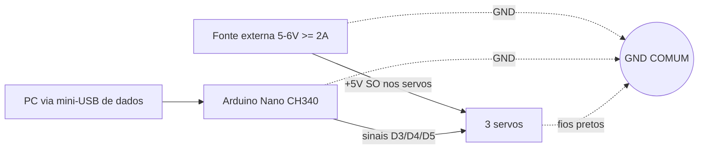

> **Regras de ouro da energia**
> - O **+5V externo vai SÓ nos servos** — **NUNCA** no pino 5V do Nano.
> - O **negativo da fonte, o GND do Nano e os fios pretos dos servos** ficam no **MESMO ponto** (GND comum). Sem GND comum, o sinal não tem referência e nada funciona de forma confiável.
> - O **Nano continua alimentado pelo USB** (dados + lógica).
> - Cores dos servos: **vermelho = V+ (5V)**, **preto/marrom = GND**, **branco/laranja = sinal**.

#### 9. Regravação travando: o `wdt_enable` atrapalhava o bootloader antigo

Tínhamos um **watchdog de hardware** (`wdt_enable`) para reset automático. Acontece que, no **bootloader antigo**, o watchdog de HW **travava a regravação** (`not in sync`) e podia causar **bootloop**. Removemos o `wdt_enable`; o `setup()` passou a chamar **`wdt_disable`**. A segurança não foi perdida: ela migrou para o **watchdog de heartbeat em software** (ver item de fail-safe), que é mais adequado ao nosso protocolo.

#### 10. Bug do `.env`: comentário inline lido como valor

A configuração quebrava ao subir o serviço. Causa: uma linha como `ESTOP_GPIO_PIN= # comentário` estava sendo **lida com o comentário inline incluído no valor**, corrompendo o parse. Blindamos e **enxugamos o `.env`** (ver `.env.example`), removendo comentários inline em chaves de valor.

#### 11. Visão: MediaPipe Tasks API + calibração por dedo

Na perceção, o `mediapipe` 0.10.x instalado **só expunha a API nova (Tasks)** — a API "legacy" de `Hands` não estava disponível. Migramos para o **`HandLandmarker` (Tasks API)** e baixamos o modelo **`hand_landmarker.task`** (via `scripts/download_models.py`). Em seguida calibramos:

- **Indicador**: limite "estendido" menor, para conseguir **abrir 100%**.
- **Polegar**: ajuste de limiar/faixa para **não contrair sozinho** assim que a câmera liga.
- **Imagem espelhada** (flip horizontal) para visão de espelho natural — e confirmamos que **o flip não afeta o cálculo de flexão**, pois ele usa **distâncias** entre landmarks, que são invariantes ao espelhamento.

> O fail-safe de tudo isso é o **watchdog de heartbeat**: se o host parar de mandar `H` por ~1 s, a mão **abre sozinha** — segurança garantida independentemente da camada de software acima.

---

### Solução de problemas (troubleshooting)

| Sintoma | Causa provável | Solução |
|---|---|---|
| Gravação falha com **`not in sync` / `programmer not responding`** | Clone CH340 usa **bootloader ANTIGO** | Grave com `cpu=atmega328old` (o `scripts/flash_firmware.py` já tenta isso primeiro e faz fallback). Confira também o cabo (precisa ser **USB de dados**, não só de carga). |
| A **porta muda de COM** (ex.: era COM16, virou outra) | Reenumeração USB do Windows ao reconectar | Rode `python scripts/check_devices.py` para listar as portas; atualize `SERIAL_PORT` no `.env`. |
| **"Acesso negado" / Access denied** na porta serial | A porta já está **aberta por outro processo** (REPL, monitor serial, outra instância do app) | Feche o outro programa que está usando a COM (Serial Monitor, `serial_repl.py`, outra aba do app) e tente de novo. |
| **Só 1–2 servos mexem** | Mapeamento de pinos não bate com a fiação | Rode o sketch **`firmware/servo_scan`** para descobrir qual pino move qual dedo; ajuste os pinos (referência: indicador=D3, polegar=D4, três dedos=D5). Verifique os jumpers de sinal. |
| **Dedo invertido** (abrir fecha, fechar abre) | Servo gira no sentido contrário ao da lógica | Ative a flag de inversão do servo no firmware (`REV_THUMB` / `REV_INDEX` / `REV_OTHER = true`). |
| **Treme / fica indo e voltando** sozinho | Falta de corrente (USB não segura 3 servos contra a mola) **ou** detach ligado | Use **fonte externa 5–6 V** com **GND comum** (nunca alimente o Nano pelo 5V externo). Garanta `DETACH_WHEN_IDLE=false`. Confirme pela serial que a placa **não reinicia** (se reinicia, é software; se não, é energia). |
| **Polegar contrai sozinho** ao ligar a câmera | Faixa/limiar de flexão do polegar mal calibrado para a sua mão | Recalibre os limites "estendido/fechado" do polegar na lógica de flexão (`hand_tracking.py` / calibração do `mirror.py`). |
| **Câmera errada** (abre a webcam interna, não a USB) | Índice de câmera incorreto | Rode `python scripts/check_devices.py` para listar as câmeras; ajuste `CAMERA_INDEX` no `.env` (na nossa máquina a Logitech C270 ficou no **índice 1**). |
| **Regravação trava / bootloop** depois de habilitar watchdog | `wdt_enable` (watchdog de HW) conflita com o bootloader antigo | Mantenha o `wdt_disable` no `setup()`; a segurança fica no **heartbeat por software**. |
| **Config não sobe / valores estranhos** | Comentário **inline** no `.env` sendo lido como valor | Remova comentários na mesma linha de uma chave; use o `.env.example` enxuto como base. |

---

### Estrutura de pastas

```text
Thoth-project/
├── src/thoth/                     # Pacote Python principal (Python 3.11)
│   ├── core/
│   │   ├── config.py              # Settings (pydantic-settings) lê o .env; PROJECT_ROOT; get_settings() cacheado
│   │   ├── state.py               # AppState (singleton): ponte visão <-> web (frame, status, flexões, eventos)
│   │   └── logging.py             # Logging via loguru
│   ├── safety/
│   │   └── limits.py              # FONTE ÚNICA de limites (15..165), clamp/clamp_all, VALID_GESTURES — espelha o firmware
│   ├── actuation/
│   │   ├── serial_client.py       # HandLink: cliente serial assíncrono (pyserial-asyncio), ACK/heartbeat/reconexão
│   │   ├── motion_primitives.py   # Gestos (abrir/punho/apontar/pinça/apertar) -> comandos seriais
│   │   └── kinematics.py          # frac() (interpolação 0..1 -> ângulo) e clamp
│   ├── perception/vision/
│   │   ├── camera.py              # WebcamStream: captura em thread (latest-frame), CAP_DSHOW + BUFFERSIZE=1
│   │   ├── hand_tracking.py       # HandTracker: MediaPipe HandLandmarker (Tasks), 21 landmarks, calcula flexão
│   │   └── mirror.py              # mirror_loop: flexão -> ângulos (15+flex*150) -> HandLink (~16 Hz, deadband 3°)
│   ├── api/
│   │   ├── server.py              # App FastAPI; lifespan conecta HandLink + inicia mirror_loop; serve dashboard
│   │   ├── schemas.py             # Modelos Pydantic (Command/Angles/Mirror Request, CommandResponse, Health)
│   │   └── routes/
│   │       ├── health.py          # /health, /version
│   │       ├── control.py         # /command, /angles, /estop, /mirror
│   │       └── telemetry.py       # /video (MJPEG anotado), /ws (snapshot do estado ~3 Hz)
│   └── web/static/index.html      # Dashboard de página única (tema escuro): vídeo, gestos, sliders, e-stop, espelho
├── firmware/
│   ├── hackberry_serial/          # Firmware definitivo (Arduino Nano, Servo.h): protocolo ASCII, clamp, slew, heartbeat
│   ├── servo_scan/                # Sketch de diagnóstico: varre pinos e revela qual dedo cada servo move
│   ├── reference/                 # Material de referência do firmware original HACKberry
│   └── README.md                  # Notas de firmware/gravação
├── scripts/
│   ├── web.py                     # Sobe SÓ o painel web (modo standalone, gerencia a mão)
│   ├── flash_firmware.py          # Grava o firmware (bootloader antigo automático + fallback, opção --sketch)
│   ├── serial_repl.py             # REPL serial (open/fist/...; controle por dedo "t/i/o <ang>"; nudge)
│   ├── check_devices.py           # Lista câmeras e portas seriais disponíveis
│   └── download_models.py         # Baixa o modelo hand_landmarker.task do MediaPipe
├── configs/                       # Perfis de configuração (default.yaml, dev.yaml, prod.yaml)
├── docs/                          # Documentação (protocolo, hardware, montagem, seções do README)
├── documentos/                    # Material acadêmico (manuais PT-BR/original, fotos da equipe, vídeo)
├── models/                        # Modelos baixados (ex.: hand_landmarker.task)
├── tests/                         # Testes (unit/, integration/, hardware/) + conftest
├── pyproject.toml                 # Metadados/projeto e config de ferramentas
├── requirements.txt               # Dependências enxutas
└── .env.example                   # Exemplo de configuração (sem comentários inline em valores)
```

---

### Licenças

Este projeto deriva de obras open-source com licenças distintas para **firmware** e **hardware**, que precisam ser respeitadas separadamente:

| Componente | Licença | Implicação |
|---|---|---|
| **Firmware** (sketch HACKberry e derivados) | **GPLv3** | Copyleft: redistribuições e derivados do firmware devem permanecer sob GPLv3 e disponibilizar o código-fonte. |
| **Hardware HACKberry** (modelos 3D, design mecânico) | **CC BY-NC-SA 4.0** | Atribuição obrigatória; **uso NÃO comercial**; compartilhar derivados sob a mesma licença. |
| **Código deste projeto** (Python, web, scripts) | **GPL-3.0-or-later** | Mesmo espírito copyleft do firmware; coerente com a base GPLv3 herdada. |

> Atenção ao caráter **não comercial (NC)** do hardware HACKberry: esta entrega é de natureza **acadêmica e de pesquisa**.

---

### Créditos e equipe

Este módulo é uma entrega concreta dentro de uma **visão de pesquisa mais ampla** — uma **prótese assistiva nacional**, com impressão 3D, eletrônica biomédica, sinais **EEG/EMG** e **IA agêntica**. O que está documentado aqui é o **controle da mão por um painel web**, com **comandos diretos** e **espelhamento da mão do usuário por visão computacional**. As camadas de EEG/EMG e de IA agêntica/voz fazem parte do **roadmap maior**, não desta entrega.

- **Universidade Federal do Rio Grande do Sul (UFRGS)** — instituição.
- **Enfitec Jr.** — Empresa Júnior de Engenharia Física (parceria): https://enfitecjunior.com/
- **CTA — Centro de Tecnologia Acadêmica (IF-UFRGS)** — apoio.
- **Marco Aurelio Andrade** — idealização: https://www.linkedin.com/in/-marcoandrade
- **Prof. Mauricio Tosin** — apoio acadêmico/técnico e equipamentos de EMG do IF-UFRGS: http://lattes.cnpq.br/8031556056127117
- **exiii Inc. / Mission ARM Japan** — pela mão protética open-source **HACKberry** (repositório `mission-arm/HACKberry`).

> **Título acadêmico do projeto:** *"Braço Robótico controlado por EEG, EMG e Sistema de IA"*.
