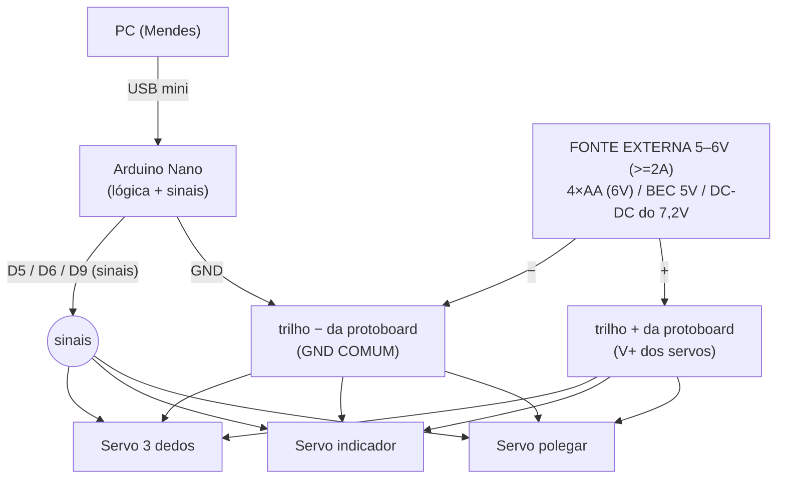

# Esquema de Montagem — Arduino Nano + 3 servos na PROTOBOARD

Para o setup real do projeto: **Arduino Nano (clone) numa protoboard**, servos da
mão ligados por jumpers (NÃO é a placa integrada HACKberry Mk2).

> 🔑 **O erro nº1 que trava tudo:** alimentar os servos pelo **5V do Nano / USB**.
> O USB dá ~500 mA — **3 servos juntos puxam 1–3 A** e não se mexem (ou resetam o
> Nano). **Use uma fonte externa de 5–6V** para os servos, com **GND comum**.

## 1. Diagrama elétrico



## 2. Tabela de ligações (o que vai em quê)

Cada servo tem **3 fios**: `vermelho = V+`, `preto/marrom = GND`, `branco/amarelo/laranja = sinal`.

| Fio | Vai para | Observação |
|-----|----------|------------|
| Servo **A** — sinal | Nano **D5** | jumper para o pino digital |
| Servo **B** — sinal | Nano **D6** | |
| Servo **C** — sinal | Nano **D9** | |
| **Todos** os servos — V+ (vermelho) | **trilho +** (5–6V externo) | **não** no 5V do Nano |
| **Todos** os servos — GND (preto) | **trilho −** (GND) | |
| Fonte externa **+** | trilho + | 5–6V, ≥2A |
| Fonte externa **−** | trilho − | |
| **Nano GND** | trilho − | ⚠️ **GND COMUM** — obrigatório! |
| Nano (mini-USB) | PC | programação + comunicação serial |

> Não sabemos ainda qual servo (A/B/C) é o polegar/indicador/três dedos — tudo bem:
> ligue os 3 sinais em D5/D6/D9 em qualquer ordem e depois rode o `servo_scan`
> (passo 4) para descobrir e acertar no firmware.

## 3. Sobre a fonte de 5–6V (escolha uma)

- **Mais simples:** suporte de **4 pilhas AA** (= 6V) ligado ao trilho.
- **BEC/UBEC 5V** (módulo de RC, dá 3–5A) — ótimo para servos.
- **Bateria 7,2V do HACKberry + conversor DC-DC (buck)** ajustado para **~5,5V**.
  ⚠️ **Não ligue 7,2V direto no servo** — micro servos são para ~4,8–6V e queimam.
- O Nano pode continuar no **USB** (ou alimentar o VIN do Nano com 7–12V). O que
  **não** pode é tirar a força dos servos do 5V do Nano.

## 4. Passo a passo

1. **Tudo desligado.**
2. Monte os **dois trilhos**: `+` (servo V+, da fonte externa) e `−` (GND).
3. Ligue **Nano GND → trilho −** (GND comum). **Sem isso, nada funciona.**
4. Para cada servo: `vermelho → trilho +`, `preto → trilho −`, `sinal → D5 / D6 / D9`.
5. Ligue a **fonte externa** dos servos e o **USB** do Nano.
6. Grave o firmware e mapeie os servos:
   ```powershell
   python scripts/flash_firmware.py --port COM16 --sketch firmware/servo_scan
   & "C:\Program Files\Arduino CLI\arduino-cli.exe" monitor -p COM16 -c baudrate=115200
   ```
   Anote qual dedo se move em cada pino (D5/D6/D9). Depois voltamos ao firmware
   principal e ajustamos `PIN_THUMB/PIN_INDEX/PIN_OTHER` + `REV_*` conforme o mapa.

## 5. Checklist de segurança

- [ ] **GND comum** entre Nano, fonte dos servos e trilho −.
- [ ] Servos no **5–6V externo**, nunca no 5V do Nano/USB.
- [ ] 7,2V só via **buck para ~5,5V** (nunca direto no servo).
- [ ] Polaridade do servo: vermelho=V+, preto=GND (não inverta).
- [ ] Fios de sinal firmes nos furos certos da protoboard (mesma coluna do jumper ao Nano).
