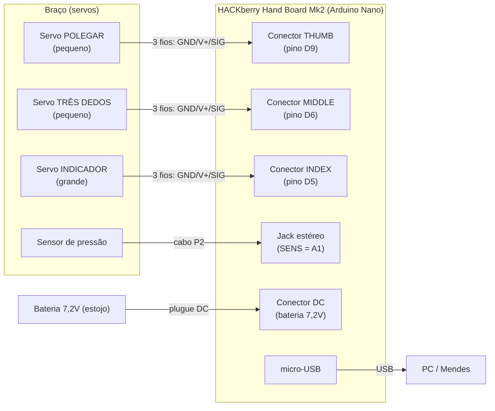

# Esquema de Montagem — HACKberry Hand Board Mk2 (Arduino Nano)

> ℹ️ **Este documento vale para a PLACA INTEGRADA HACKberry Mk2.** O setup atual do
> projeto é um **Arduino Nano numa protoboard** → use **[montagem_breadboard.md](montagem_breadboard.md)**.
> Mantenha este aqui como referência caso migre para a placa integrada.

Como reconectar os cabos à placa e como os pinos chegam aos servos do braço.
Fonte: manual oficial HACKberry (págs. 93, 112, 130, 134, 156) + scan no hardware.

> ⚠️ **Regra de ouro dos servos:** cada servo tem **3 fios**. Conecte com o
> **fio PRETO/MARROM (GND) para o lado de FORA da placa** (borda externa).
> Inverter os fios pode **queimar o servo**.
> Cores (Mk2): **preto/marrom = GND**, **vermelho = V+ (VCC)**, **branco/amarelo = SIG (sinal/PWM)**.

## 1. Mapa da placa (vista de cima)

```
            ┌──────────────────────────────────────────────┐
            │ [RESET]      HACKberry HandBoard Mk2   [USB]──┼──► PC (micro-USB)
            │                                               │
 borda  ◄── │  Conectores de SERVO (3 pinos: G  V+  S):     │
 externa    │     ┌─────────────────────────────────┐       │
 (GND p/ cá)│     │  THUMB   →  o o o   (G p/ fora)  │  → polegar
            │     │  MIDDLE  →  o o o   (G p/ fora)  │  → médio/anelar/mínimo
            │     │  INDEX   →  o o o   (G p/ fora)  │  → indicador (servo grande)
            │     └─────────────────────────────────┘       │
            │                                               │
            │  [JACK ESTÉREO P2] ◄── sensor de pressão       │
            │  [DC] ◄── plugue da bateria 7,2V   [⇅ liga]    │
            │                                               │
            │  Porta de EXPANSÃO (EMG/I2C/serial):           │
            │   GND  5V  SENS  A2  A3  SCL  SDA  RX  TX       │
            └──────────────────────────────────────────────┘
```



## 2. Tabela de conexões

| Cabo | Conector na placa (silk) | Pino do Arduino | Orientação / observação |
|------|--------------------------|-----------------|--------------------------|
| Servo **indicador** (grande) | **INDEX** | **D5** | GND(preto) p/ fora · V+(verm) meio · SIG(branco/amarelo) interno |
| Servo **três dedos** (pequeno) | **MIDDLE** | **D6** | idem — **marque** este servo p/ não trocar com o THUMB |
| Servo **polegar** (pequeno) | **THUMB** | **D9** | idem — **SEM PPTC** (mais frágil, cuidado) |
| **Sensor** de pressão | **jack estéreo (P2)** → SENS | **A1** | plugue chaveado (só entra de um jeito) |
| **Bateria** 7,2V | **plugue DC** → conector DC | (alimentação) | chaveado; ligue empurrando o interruptor deslizante |
| **USB** | micro-USB | — | vai ao PC (firmware + comunicação serial do Mendes) |

**Botões (já ligados na placa, normalmente não precisam mexer):** calibração = A6 · contração do polegar = A0 · mover três dedos = D10 · extra = A7. O botão central nas costas da mão liga/calibra.

**Opcional — sensor EMG (MyoWare) na porta de expansão:** 2 fios pretos → GND · 2 vermelhos → 5V · 1 branco → SENS · 1 branco → A2. (Não use se for o sensor de pressão padrão.)

## 3. Passo a passo de remontagem

1. **Energia desligada** (não plugue a bateria nem o USB ainda).
2. Reconecte os **3 servos** aos conectores **pelo nome no silk**: indicador→**INDEX**, três dedos→**MIDDLE**, polegar→**THUMB**. Em cada um, **fio preto para a borda externa**.
3. Reconecte o **sensor** no **jack estéreo** (P2) da placa.
4. Reconecte o **plugue DC da bateria** ao **conector DC** da placa.
5. Conecte o **USB** ao PC.
6. Ligue (interruptor deslizante). Ao ligar, a mão assume a posição inicial (dedos abrindo). Se algum dedo **forçar contra o batente e fizer “jijiji”**, **desligue na hora** — é só recalibrar o ângulo.

## 4. Tensão dos servos (só se necessário)

A placa tem um conversor DC-DC com um **trimpot dourado** que ajusta a tensão dos servos para **5V**. Se os servos estiverem recebendo a tensão cheia da bateria (~7,4V) e esquentando, gire o trimpot **no sentido anti-horário ~5–6 voltas** com a placa ligada até cair para ~5V (meça com multímetro). Se já estava funcionando antes, **não mexa**.

## 5. Depois de reconectar

O firmware já está na configuração **padrão** correspondente aos conectores rotulados:
**INDEX=D5, MIDDLE=D6, THUMB=D9**, com inversão de sentido ativada e curso seguro (40–140°).

1. Grave/atualize o firmware: `python scripts/flash_firmware.py --port COM16`
2. Teste: `python scripts/serial_repl.py --port COM16` → `open` / `fist`.
3. **Se um dedo abrir/fechar invertido** (só ele): alternamos o flag `REV_THUMB`/`REV_INDEX`/`REV_OTHER` no firmware.
4. **Se um dedo não mover**: rodamos de novo `firmware/servo_scan` para confirmar qual pino o move.
5. **Calibração fina:** ajustamos `*_MIN`/`*_MAX` por dedo (o manual usa, p/ mão direita, faixa ~30–150°, variando por dedo) para abrir/fechar no ponto exato do seu modelo impresso.
