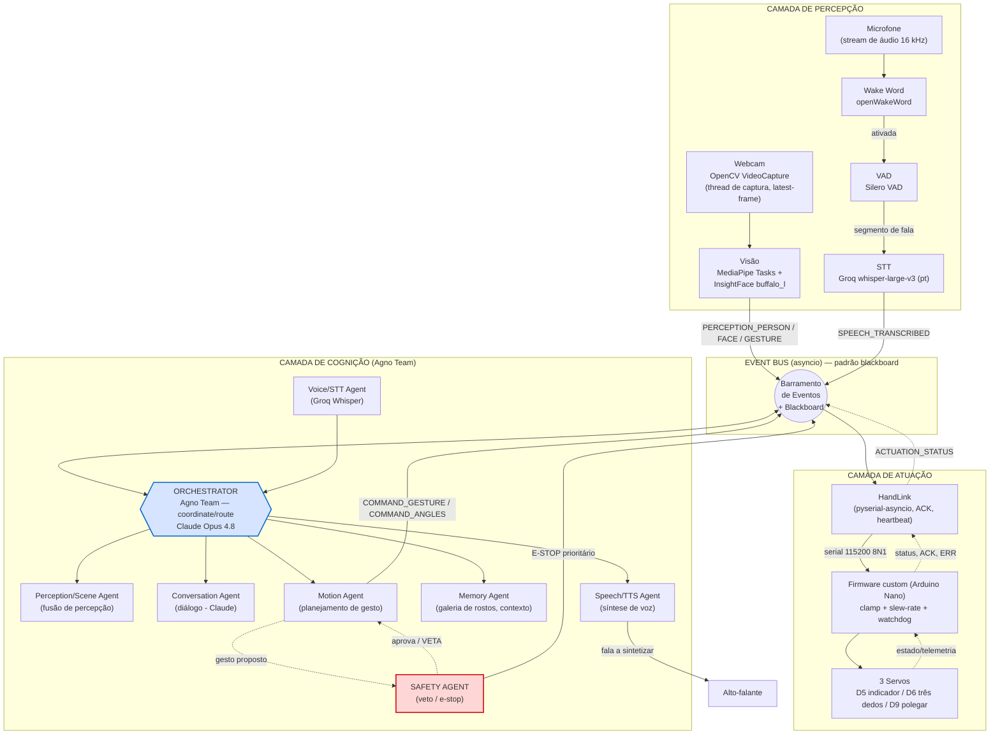
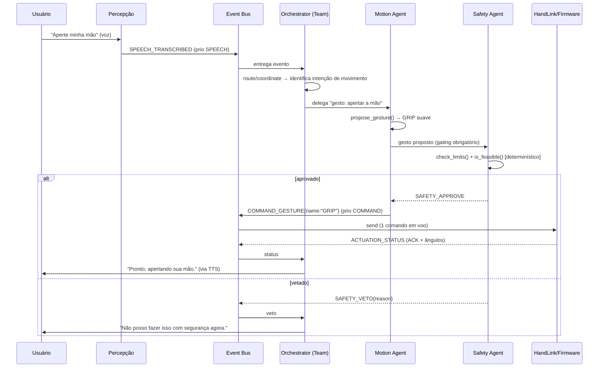
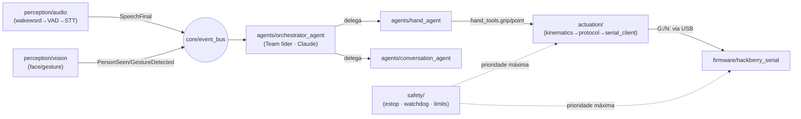
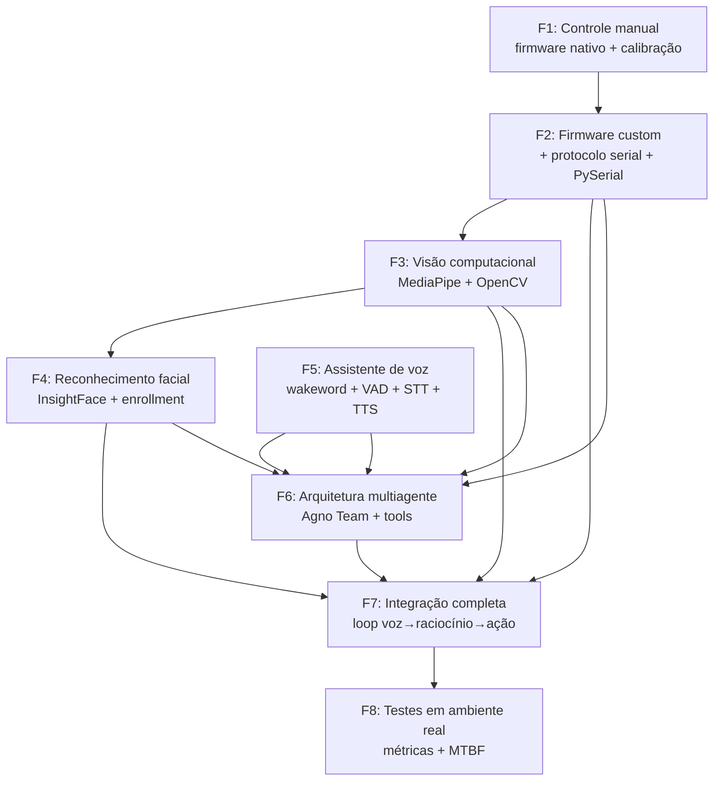
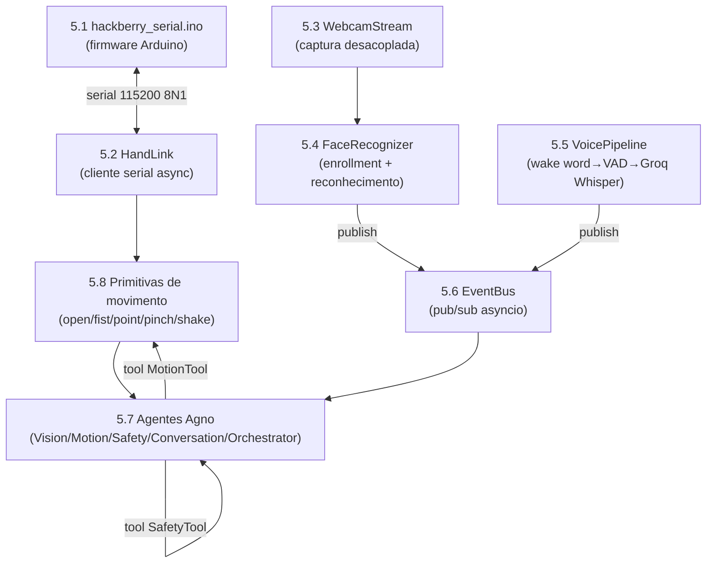
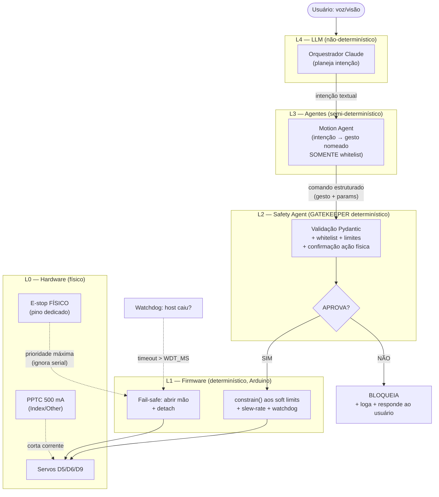
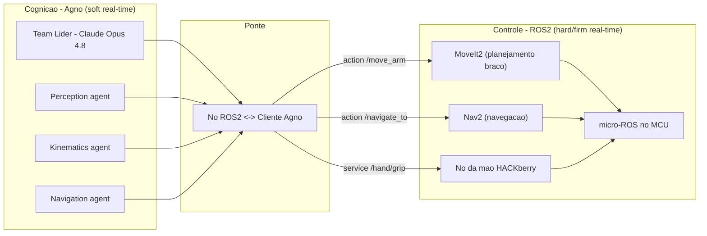

# Projeto Thoth — Plano de Implementação de Sistema Robótico Inteligente Multiagente

**Mão protética HACKberry + Arquitetura Multiagente Agno AI + Visão Computacional + Voz**

> Universidade Federal do Rio Grande do Sul (UFRGS) · Enfitec Jr. (Engenharia Física) · CTA — Centro de Tecnologia Acadêmica (IF-UFRGS)
> Documento técnico de planejamento · Versão 1.0

---

## 0. Sumário Executivo

Este documento é um plano de implementação de nível de laboratório de pesquisa para transformar a **mão protética HACKberry** (projeto open-source da exiii Inc. / Mission ARM Japan, hoje sob curadoria da Mission ARM Japan) em um **assistente robótico físico inteligente**, capaz de:

- **observar** o ambiente por visão computacional (detecção de pessoas, rostos, identidades e gestos);
- **conversar** naturalmente e **responder a comandos de voz** com escuta contínua e palavra de ativação;
- **executar gestos físicos** com a mão (preensão, apontar, pinça, "apertar a mão");
- **reconhecer indivíduos** conhecidos (ex.: cumprimentar automaticamente um professor);
- **decidir** com base em estímulos visuais e auditivos;
- operar de forma **modular** através de **agentes especializados** orquestrados pelo framework **Agno AI**.

A espinha dorsal cognitiva combina três provedores de IA por papel: **Claude** (planejamento, raciocínio, coordenação de agentes e diálogo), **Groq** (Speech-to-Text, análise multimodal de imagens e inferência de baixa latência) e **Cerebras** (inferência de altíssima velocidade complementar). A ponte com o hardware é um **firmware Arduino customizado** com protocolo serial seguro, comandado por um **cliente Python assíncrono**.

### Como ler este documento

| Seção | Conteúdo |
|------|----------|
| **0. Sumário Executivo** | Esta seção + a reconciliação de hardware (leitura obrigatória). |
| **1. Arquitetura Geral** | Camadas, catálogo de agentes, event bus, fluxogramas, tecnologias por camada. |
| **2. Estrutura de Pastas** | Árvore completa do projeto Python com Agno e arquivos de configuração. |
| **3. Roadmap de Desenvolvimento** | 8 fases com tarefas, entregáveis, critérios de aceite, riscos e cronograma. |
| **4. Tecnologias** | Justificativa de cada biblioteca, alternativas e atribuição de modelos de IA por papel. |
| **5. Exemplos de Código** | Firmware, cliente serial, webcam, reconhecimento facial, STT, event bus, agentes Agno e primitivas de movimento. |
| **6. Segurança** | Anticolisão, limites de movimento, parada de emergência, proteção dos servos e segurança da IA. |
| **7. Escalabilidade Futura** | Mais DOF, base móvel, LLM local, ROS2, manipulação e autonomia avançada. |

---

## 0.1 Reconciliação de Hardware × Objetivos — **leitura obrigatória**

> Este é o ponto técnico mais importante do plano. A descrição inicial do projeto trata o equipamento como um **"braço robótico 3DOF"** genérico que apontaria e levantaria. O manual oficial mostra que o hardware é, na verdade, a **mão protética HACKberry** — e isso muda fundamentalmente o que é viável.

### O que o hardware realmente é

A HACKberry **não é um braço posicionador**: é uma **mão protética** impressa em 3D. Os **"3 graus de liberdade"** correspondem a **três servomotores que controlam a preensão dos dedos**, e **não** ao posicionamento da mão no espaço:

| DOF | Servo | Função | Pino (Hand Board Mk2) |
|-----|-------|--------|------------------------|
| 1 | Servo grande | Flexão do **dedo indicador** | **D5** |
| 2 | Servo pequeno | Flexão dos **três dedos** (médio, anelar, mínimo) | **D6** |
| 3 | Servo pequeno | **Polegar** (abdução/rotação) | **D9** |

- **Microcontrolador:** Arduino Nano (ATmega328P-AU) na placa *HACKberry Hand Board Mk2* (a Mk1 usava Arduino Micro). Comunicação com o PC por **micro-USB**.
- **Sensor:** fotorrefletor de pressão **ou** EMG (MyoWare, 2 canais) na entrada **A1 (SENS)**.
- **Pulso:** ajustável **apenas manualmente**, em incrementos de **90°** (pronação/supinação, flexão/extensão, desvio radial/ulnar). **Não há motor** no pulso nem no antebraço/braço.
- **Energia:** bateria Li-ion **7,2 V / 2200 mAh**; entrada recomendada 7–12 V. Proteção de corrente **500 mA (PPTC)** nos servos do indicador e dos três dedos; **o servo do polegar não é protegido por PPTC**.

### Mapeamento dos comandos de voz desejados ao hardware real

| Comando desejado | Viável na HACKberry? | Como |
|------------------|----------------------|------|
| **"Aperte minha mão"** | ✅ **Sim** | Fechamento suave e controlado da preensão (gesto *shake*). |
| **"Aponte para mim"** | ⚠️ **Parcial** | A mão **forma** o gesto de apontar (indicador estendido + demais flexionados), mas **não consegue se reorientar** para mirar uma pessoa sem um braço posicionador. |
| **"Levante o braço"** | ❌ **Não (sem hardware adicional)** | Exige atuadores de ombro/cotovelo. Tratado como evolução na **Seção 7.1**. |
| **"Quem está na sala?"** | ✅ **Sim** | Depende apenas de visão computacional; independe do braço. |

### Consequência arquitetural decisiva

O **firmware nativo** da HACKberry é **autônomo**: lê o sensor (pressão ou EMG) e aciona os servos em malha fechada, **sem expor uma API serial de comandos**. Para que os agentes de IA controlem a mão a partir do PC, é **obrigatório** desenvolver um **firmware customizado** que:

1. aceite **comandos seriais** (gestos nomeados + ângulos por servo);
2. preserve os **limites de segurança nativos** (`outThumbMax`, `outIndexMax`, `outOtherMax` e o limite de corrente);
3. implemente **watchdog**, **slew-rate** e **parada de emergência**.

Esse firmware é o **marco crítico da Fase 2** (ver Seção 3) e está especificado por completo na **Seção 5.1**. Recomenda-se manter **dois modos**: *host-controlled* (comandado pela IA) e *autônomo/EMG* (o comportamento protético original), selecionáveis — preservando o propósito assistivo do projeto.

### Licenciamento (atenção)

- **Firmware** (Arduino sketch) da HACKberry: **GPLv3** — derivados do firmware herdam a GPLv3.
- **Hardware / modelos 3D / placas:** **Creative Commons BY-NC-SA 4.0** — uso **não-comercial**, atribuição e compartilhamento igual. Para uso comercial, contatar a exiii/Mission ARM Japan.

---

---

## 1. Arquitetura Geral

Esta seção descreve a arquitetura de software do Projeto Thoth: como os sinais do mundo físico (imagem e som) sobem até a camada cognitiva de agentes, como decisões viram comandos de movimento, e como esses comandos descem com segurança até os três servomotores da mão HACKberry. O sistema é desenhado em **três camadas** acopladas por um **barramento de eventos assíncrono** (asyncio), com um **agente orquestrador** (Agno `Team`) coordenando especialistas e um **agente de segurança com poder de veto** sobre toda a camada de atuação.

> Premissa de hardware que governa toda a arquitetura: a HACKberry é uma **mão** de 3 servos de preensão (indicador → D5, três dedos → D6, polegar → D9), **não** um braço posicionador. O pulso é manual (90°). Logo, a camada de atuação produz **gestos de dedos**, nunca reorientação espacial. Os limites disso são tratados em [§1.6 Reconciliação Hardware × Objetivos](#16-reconciliação-hardware--objetivos) e detalhados na Seção 7.

### 1.1 Visão de Camadas

O sistema segue um pipeline clássico de robótica cognitiva — **Sense → Think → Act** — porém com a camada "Think" implementada como um time de agentes LLM heterogêneos, não como uma máquina de estados fixa. As três camadas têm fronteiras de responsabilidade nítidas e se comunicam **somente** por mensagens no event bus (nunca por chamadas diretas de função entre camadas), o que permite trocar implementações sem reescrever consumidores.

| Camada | Papel | Componentes | Frequência típica | Tecnologia dominante |
|--------|-------|-------------|-------------------|----------------------|
| **Percepção** (Sense) | Transformar pixels e áudio em fatos simbólicos | Câmera (OpenCV), wake word, VAD, STT, detecção de rosto/gesto/pose | Visão: 5–30 Hz (com *frame skipping*); Áudio: contínuo segmentado por VAD | OpenCV, MediaPipe Tasks, InsightFace, openWakeWord, Silero VAD, Groq Whisper |
| **Cognição** (Think) | Interpretar, dialogar, planejar, decidir | Agentes Agno + orquestrador (`Team`) + memória de sessão | Sob demanda (event-driven); soft-real-time | Agno 2.x + Claude / Groq / Cerebras |
| **Atuação** (Act) | Converter intenção em movimento físico seguro | `HandLink` (pyserial-asyncio) → firmware custom → 3 servos | Loop de controle do firmware ~50 Hz (20 ms/tick) | Python asyncio + Arduino C++ (`<Servo.h>`) |

**Loop de tempo real.** O sistema não é um pipeline de mão única: ele opera como um **laço fechado contínuo** em que percepção alimenta cognição, cognição produz ação, e a ação muda o ambiente que a percepção volta a observar. Três sub-loops coexistem com cadências muito diferentes, e isso é deliberado:

```
┌───────────────────────────────────────────────────────────────────────┐
│  LOOP DE PERCEPÇÃO (rápido, contínuo)                                   │
│  webcam → frame → MediaPipe/InsightFace → evento PERCEPTION_*  ~5-30 Hz │
│  mic → VAD → segmento de fala → STT → evento SPEECH_TRANSCRIBED         │
└───────────────────────────────┬───────────────────────────────────────┘
                                 │ eventos no bus
┌───────────────────────────────▼───────────────────────────────────────┐
│  LOOP COGNITIVO (lento, sob demanda, soft-real-time)                    │
│  Orchestrator delega → especialistas (LLM) → decisão → COMMAND_*        │
│  latência dominada pelo provedor LLM (centenas de ms a alguns s)        │
└───────────────────────────────┬───────────────────────────────────────┘
                                 │ COMMAND_GESTURE / COMMAND_ANGLES
┌───────────────────────────────▼───────────────────────────────────────┐
│  LOOP DE CONTROLE (determinístico, no firmware, fora do PC)             │
│  slew-rate + clamp + watchdog → servo.write() a ~50 Hz                  │
│  Safety Agent pode emitir VETO/E-STOP a qualquer momento (prioridade)   │
└─────────────────────────────────────────────────────────────────────────┘
```

O ponto crítico de engenharia: **o controle de baixo nível (50 Hz, determinístico) NUNCA depende da latência do LLM**. O LLM é tratado como **soft-real-time** — ele decide *qual gesto*, mas a *execução suave e segura* do gesto é responsabilidade exclusiva do firmware (slew-rate, clamp aos limites nativos `outThumbMax`/`outIndexMax`/`outOtherMax`, watchdog). Se a nuvem cair ou um agente travar, o watchdog do firmware leva a mão à posição segura (aberta) sem esperar o PC. Esta separação é o que torna seguro colocar um LLM no laço de controle de uma prótese assistiva.

### 1.2 Diagrama de Fluxo do Sistema

O diagrama Mermaid abaixo mostra os dois caminhos principais — **visão** e **voz** — convergindo no orquestrador, e a descida segura até os servos com o Safety Agent interceptando a camada de atuação.



**Diagrama ASCII de fallback** (caso o renderizador Mermaid não esteja disponível):

```
                          PERCEPÇÃO                              COGNIÇÃO (Agno Team)                   ATUAÇÃO
  ┌──────────┐                                       ┌────────────────────────────────────┐
  │  Webcam  │──▶ OpenCV ──▶ MediaPipe + InsightFace │   ┌──────────────────────────────┐ │
  └──────────┘     (thread latest-frame)        │    │   │   ORCHESTRATOR (Agno Team)   │ │
                                                 │    │   │   coordinate / route         │ │
                       PERCEPTION_PERSON/FACE/   │    │   │   Claude Opus 4.8            │ │
                       GESTURE  ─────────────────┼───▶│   └──┬───────┬───────┬───────┬──┘ │
                                                 │    │      │       │       │       │    │
  ┌──────────┐   wake     ┌─────┐  fala   ┌────┐ │    │   Percep. Conv.   Motion  Memory  │
  │   Mic    │──▶openWW──▶│ VAD │────────▶│STT │─┼───▶│   /Scene  (Claude) (gesto) (rostos)│
  └──────────┘  (Silero)  └─────┘ (Groq   └────┘ │    │      │                  │          │
                                  whisper-v3)     │    │   Voice/STT          ┌──▼───┐      │
                                                 │    │   (Groq)             │SAFETY│◀─veto─┤
        ┌────────────[ EVENT BUS asyncio + BLACKBOARD ]──────────────┐       │AGENT │      │
        │  tipo | payload | timestamp | priority | source            │       └──┬───┘      │
        └────────────────────────────────────────────────────────────┘          │ E-STOP   │
                                                 │    │   TTS ──▶ Alto-falante    │ (prio.)  │
                                                 │    └───────────────────────────┼─────────┘
                                                 │                                │
   COMMAND_GESTURE / COMMAND_ANGLES  ────────────┼────────────────────────────────▼
                                                 │   ┌─────────┐ serial   ┌──────────────────┐    ┌──────────┐
                                                 └──▶│ HandLink│─────────▶│ Firmware custom  │──▶ │ 3 Servos │
                                                     │ asyncio │ 115200   │ clamp+slew+wdt   │    │ D5/D6/D9 │
                                                     │ +ACK/HB │◀─────────│ (Arduino Nano)   │◀───│          │
                                                     └─────────┘ status   └──────────────────┘    └──────────┘
```

### 1.3 Catálogo de Agentes

A camada cognitiva é composta por agentes especializados, cada um com responsabilidade única, contrato de entrada/saída explícito, conjunto de *tools* Agno e um modelo de IA escolhido **por papel** segundo o eixo latência × profundidade de raciocínio. A regra de atribuição é:

- **Claude (Opus 4.8)** — planejamento, orquestração, decisão e diálogo. Raciocínio profundo e *tool-use* confiável valem mais que latência aqui. Usa-se `Claude(id="claude-opus-4-8")` com `cache_system_prompt=True` e `max_tokens` elevado (≥ 16000) para tarefas de raciocínio.
- **Groq** — STT (Whisper) e visão/multimodal (Llama 4), além de respostas curtas de baixa latência. O gargalo prático é o TPM (≈ 6k no free tier): mantenha *system prompts* curtos.
- **Cerebras** — inferência de texto de altíssima velocidade (`gpt-oss-120b` ~3000 tok/s) para sub-agentes no laço crítico onde a latência domina.

> Nota de verificação: a doc da Agno ainda exibe um ID Claude legado (`claude-3-5-sonnet-...`) em exemplos — **substitua sempre por `claude-opus-4-8`**. Para Cerebras, o default da integração Agno é `id="llama-4-scout-17b-16e-instruct"`; modelos como `qwen-3-32b`/`llama-3.3-70b` têm deprecação anunciada — **verifique o ID atual em `inference-docs.cerebras.ai/models/overview` antes de fixar em produção**. Em Opus 4.8/4.7, `budget_tokens`, `temperature`/`top_p`/`top_k` e prefill de assistant retornam 400 — use `thinking={"type":"adaptive"}` + `output_config={"effort":"high"}`.

| Agente | Responsabilidade | Entradas | Saídas | Tools Agno | Modelo / Serviço | Justificativa de latência |
|--------|------------------|----------|--------|------------|------------------|----------------------------|
| **Orchestrator** | Roteia/coordena os especialistas; mantém estado de sessão compartilhado; sintetiza a resposta final | Todos os eventos relevantes do bus (percepção fundida, transcrição, status de atuação) | Delegações aos especialistas; resposta final ao usuário | É um `Team` (líder), não tem tools próprias além das dos membros | **Claude Opus 4.8** (líder do `Team`) | Decisão acontece sob demanda; profundidade > velocidade. Sequencial em `coordinate`. |
| **Perception/Scene Agent** | Funde eventos brutos de visão em uma descrição simbólica da cena ("1 pessoa conhecida — Prof. X — acenando à esquerda") | `PERCEPTION_PERSON`, `PERCEPTION_FACE`, `PERCEPTION_GESTURE`, embeddings | `SCENE_STATE` consolidado | `summarize_scene()`, `query_blackboard()` | **Cerebras** (`gpt-oss-120b`) ou **Groq** (`llama-4-scout`) | Roda frequente; precisa ser barato e rápido. Fan-out de baixa latência. |
| **Vision Agent** (análise sob demanda) | Responde perguntas multimodais sobre o frame atual ("quem está na sala?", "há algo perigoso?") | Frame JPEG (base64), pergunta | Descrição textual / lista de pessoas/objetos | `capture_frame()`, `analyze_image()` | **Groq** `meta-llama/llama-4-scout-17b-16e-instruct` (visão nativa) | Visão é cara; Groq dá throughput alto. Limite: ≤5 imgs, base64 ≤4 MB. |
| **Voice/STT Agent** | Transcreve segmentos de fala segmentados pelo VAD | Bytes de áudio (wav/16 kHz), `language="pt"` | `SPEECH_TRANSCRIBED` (texto) | `transcribe_audio()` (chama `audio.transcriptions.create`) | **Groq** `whisper-large-v3` (PT-BR, melhor acurácia) | ~216× tempo-real; só o segmento de fala é enviado (corta custo/latência). |
| **Conversation Agent** | Diálogo natural, formulação de respostas, *small talk*, esclarecimentos | Transcrição + `SCENE_STATE` + memória | Texto de resposta; intenção estruturada | `recall_memory()`, `request_gesture()` (gating) | **Claude Opus 4.8** (ou `claude-sonnet-4-6` p/ custo médio) | Qualidade conversacional importa mais que ms; usuário tolera latência de fala. |
| **Motion Agent** | Traduz intenção em gesto nomeado ou ângulos por servo; **sempre** passa pelo Safety antes de emitir | Intenção de movimento (do Orchestrator/Conversation) | `COMMAND_GESTURE` / `COMMAND_ANGLES` (após aprovação) | `propose_gesture()`, `list_capabilities()`, `send_to_hand()` (gated) | **Claude Opus 4.8** (planejamento) ou **Cerebras** (mapeamento rápido de gesto conhecido) | Gestos conhecidos (OPEN/CLOSE/POINT) podem usar Cerebras p/ baixa latência; planejamento ambíguo usa Claude. |
| **Safety Agent** | **Poder de veto** sobre toda saída de atuação; valida limites, viabilidade física e gera E-STOP | `COMMAND_*` propostos, `ACTUATION_STATUS`, eventos de e-stop | `SAFETY_APPROVE` / `SAFETY_VETO` / `EMERGENCY_STOP` (prioridade máxima) | `check_limits()`, `is_feasible()`, `emergency_stop()` | **Lógica determinística primária** (sem LLM no caminho crítico) + Claude apenas para *audit/log* assíncrono | O veto é determinístico e **não** espera LLM — segurança não pode depender de latência de nuvem. |
| **Memory Agent** | Mantém galeria de rostos (nome→embedding 512-D), preferências e contexto de longo prazo | Embeddings faciais, fatos de sessão | Identidade reconhecida; contexto recuperado | `enroll_face()`, `match_face()`, `recall()`, `remember()` | **Claude** (`enable_agentic_memory`/`memory_manager` + `db`) | Cosine similarity (numpy) no caminho rápido; LLM só para memória semântica. |
| **Speech/TTS Agent** | Sintetiza a resposta textual em áudio e a envia ao alto-falante | Texto a falar | Áudio reproduzido | `synthesize_speech()`, `play_audio()` | TTS dedicado (Piper local / Coqui / serviço cloud) — **ver Seção 4** | TTS local elimina round-trip de rede; cloud quando qualidade > latência. |

> **Observação sobre STT/TTS e os provedores:** nem Claude nem Cerebras oferecem STT ou TTS. STT é **Groq Whisper**. Para TTS, usa-se um serviço/biblioteca dedicado (a Seção 4 detalha a escolha). Visão nativa existe em Claude e em Groq Llama 4; aqui ela é alocada ao **Groq** pelo throughput, reservando Claude para raciocínio.

### 1.4 Comunicação entre Agentes — Event Bus + Blackboard

A comunicação **não** é feita por chamadas diretas entre agentes (acoplamento forte, difícil de testar e perigoso para segurança). Adota-se um **barramento de eventos assíncrono** (`asyncio.Queue` por assinante, *publish/subscribe*) combinado com um **blackboard** (estado partilhado consultável) — o padrão clássico de arquitetura de quadro-negro de sistemas multiagente. O `session_state` do Agno `Team` (compartilhado entre líder e membros via `run_context.session_state`) serve como o blackboard persistente da camada cognitiva.

**Por que asyncio (e não threads):** a `HandLink` usa `pyserial-asyncio`, a leitura serial vira *coroutine* não-bloqueante, e os agentes Agno expõem `await agent.arun(...)` / `await team.arun(...)`. Tudo vive no mesmo event loop — sem locks manuais, sem *thread* dedicada de polling serial. As tarefas de visão CPU-bound (MediaPipe/InsightFace) rodam em *thread* dedicada de captura (`latest-frame`) e publicam no bus via `loop.call_soon_threadsafe`, mantendo o loop principal livre.

#### Esquema de mensagem/evento

Todo evento no bus é um objeto imutável com campos fixos. Um esquema mínimo e versionado:

```python
from __future__ import annotations
import time
import uuid
from dataclasses import dataclass, field
from enum import IntEnum
from typing import Any

class Priority(IntEnum):
    """Menor número = maior prioridade. Safety/E-stop sempre no topo."""
    EMERGENCY = 0   # E-STOP, veto — drena à frente de tudo
    SAFETY    = 1   # avisos do Safety Agent
    COMMAND   = 2   # comandos de atuação
    SPEECH    = 3   # transcrições / fala
    PERCEPTION = 4  # percepção contínua (a mais barata de descartar)

@dataclass(frozen=True, order=True)
class Event:
    # 'order=True' + priority como 1º campo => PriorityQueue ordena por prioridade
    priority: Priority
    timestamp: float = field(default_factory=time.monotonic, compare=False)
    type: str = field(default="", compare=False)          # ex.: "SPEECH_TRANSCRIBED"
    payload: dict[str, Any] = field(default_factory=dict, compare=False)
    source: str = field(default="", compare=False)        # agente/origem
    event_id: str = field(default_factory=lambda: uuid.uuid4().hex, compare=False)
    corr_id: str | None = field(default=None, compare=False)  # correlação req↔resp
```

| Tipo de evento | `priority` | `payload` (campos-chave) | Produtor → Consumidor |
|----------------|-----------|--------------------------|------------------------|
| `PERCEPTION_PERSON` | PERCEPTION | `count`, `bboxes`, `frame_ts` | Visão → Perception/Scene |
| `PERCEPTION_FACE` | PERCEPTION | `embedding`, `bbox` | Visão → Memory/Perception |
| `PERCEPTION_GESTURE` | PERCEPTION | `gesture` (`Pointing_Up`, `Open_Palm`...), `hand` | Visão → Perception/Scene |
| `SCENE_STATE` | PERCEPTION | `summary`, `people[]`, `known_ids[]` | Perception/Scene → Orchestrator |
| `SPEECH_TRANSCRIBED` | SPEECH | `text`, `lang`, `conf` | Voice/STT → Orchestrator |
| `COMMAND_GESTURE` | COMMAND | `name` (`OPEN`/`CLOSE`/`POINT`/`PINCH`/`GRIP`), `corr_id` | Motion → Safety → HandLink |
| `COMMAND_ANGLES` | COMMAND | `thumb`, `index`, `other` (graus, pré-clamp) | Motion → Safety → HandLink |
| `SAFETY_VETO` | SAFETY | `reason`, `vetoed_corr_id` | Safety → Motion/Orchestrator |
| `EMERGENCY_STOP` | EMERGENCY | `trigger` (`physical`/`software`/`wdt`) | Safety → HandLink (bypassa fila normal) |
| `ACTUATION_STATUS` | COMMAND | `angles`, `mode`, `battery_mv` | HandLink → bus (telemetria) |

#### Ciclo evento → decisão → ação



#### Concorrência, backpressure e prioridade do Safety

- **Concorrência.** Cada assinante tem sua própria fila; um produtor lento (LLM) não bloqueia um rápido (visão). O Orchestrator processa um *turn* cognitivo por vez (modo `coordinate` é sequencial), mas percepção e atuação continuam fluindo em paralelo. **Serialização da serial:** apenas **1 comando em voo** na `HandLink` (fila FIFO interna), preservando a ordem de ACK — nunca se dispara um segundo gesto antes do ACK do anterior.
- **Backpressure.** Filas são **limitadas** (`asyncio.Queue(maxsize=N)`). Eventos de **percepção** são os mais descartáveis: aplica-se *drop-oldest* (mantém só o frame/estado mais recente — coerente com a estratégia *latest-frame* da câmera) quando a fila enche. Eventos de **comando/segurança nunca são descartados**. Quando o LLM está saturado, percepção degrada graciosamente (menos FPS efetivo) em vez de acumular *backlog* e introduzir latência crescente.
- **Prioridade do Safety (veto).** O Safety Agent é o único com prioridade `EMERGENCY`. Um `EMERGENCY_STOP` **não passa pela fila normal**: ele é entregue por um canal de prioridade que a `HandLink` drena antes de qualquer `COMMAND_*` pendente, resultando em `detach` imediato dos três servos no firmware. Além disso, **todo** `COMMAND_*` do Motion Agent é *gated* — ele só chega à `HandLink` após `SAFETY_APPROVE`. Em prótese assistiva, o veto é **fail-safe**: na ausência de aprovação, nada é atuado, e o watchdog do firmware (heartbeat ≥ 1 Hz) leva a mão à posição aberta se o PC silenciar. A lógica de veto é **determinística** (clamp aos limites nativos + checagem de viabilidade), sem LLM no caminho crítico; o Claude é usado apenas para *auditoria/log* assíncrono fora do laço de segurança.

### 1.5 Orquestração: como o Orchestrator delega aos especialistas

O Orchestrator é um **Agno `Team`** com Claude Opus 4.8 como líder. A coordenação usa os modos verificados da v2 do Agno:

- **`TeamMode.route`** — para intenções **classificáveis e de turno único** (ex.: "quem está na sala?" → roteia direto ao Vision Agent; "aperte minha mão" → roteia ao Motion Agent). Menor latência: o líder escolhe **um** especialista e devolve a resposta dele.
- **`TeamMode.coordinate`** (padrão) — para tarefas que exigem **vários especialistas em sequência** com contexto compartilhado (ex.: reconhecer a pessoa via Memory → formular saudação personalizada via Conversation → opcionalmente gesticular via Motion). O líder delega sequencialmente e **sintetiza** a resposta final, mantendo o `session_state` compartilhado.

> A nomenclatura "collaborate" do enunciado é da Agno 1.x; na v2 o equivalente colaborativo é **`coordinate`** (não confirmado se `collaborate` ainda é alias válido em 2.6.x). O plano usa `coordinate`/`route` explicitamente.

```python
from agno.team import Team, TeamMode
from agno.models.anthropic import Claude

orchestrator = Team(
    name="Thoth Orchestrator",
    mode=TeamMode.coordinate,          # ou TeamMode.route para turno único
    model=Claude(id="claude-opus-4-8", cache_system_prompt=True),  # líder
    members=[
        perception_agent,   # Cerebras / Groq
        voice_agent,        # Groq Whisper
        conversation_agent, # Claude
        motion_agent,       # Claude / Cerebras
        memory_agent,       # Claude + db
        tts_agent,          # TTS dedicado
        # safety_agent NÃO é membro delegável: opera como gate determinístico
    ],
    instructions=[
        "Você coordena uma mão protética HACKberry (3 servos de dedos).",
        "A mão NÃO se reorienta no espaço e NÃO levanta o braço.",
        "Todo movimento DEVE ser aprovado pelo Safety Agent antes de executar.",
        "Para perguntas sobre a cena, delegue ao Vision/Perception Agent.",
        "Para comandos de movimento, delegue ao Motion Agent.",
    ],
)
# Laço cognitivo: await orchestrator.arun(evento)  → não bloqueia o event loop
```

**Gating de ações sensíveis.** Seguindo a boa prática de *tool-use* (promover ações sensíveis a *tools* dedicadas para auditoria e gating), o envio de comando à mão **não** é uma chamada livre: é a *tool* `send_to_hand()`, que internamente publica no bus e **só efetiva após o `SAFETY_APPROVE`**. A `description` de cada *tool* descreve **quando** chamá-la (não só o que faz), pois o Opus 4.8 aciona *tools* de forma conservadora e gatilhos explícitos aumentam o acerto. *Tool inputs* são sempre parseados com `json.loads()` (nunca regex).

### 1.6 Tecnologias Recomendadas por Camada (resumo)

Resumo de referência rápida; a justificativa completa, alternativas comparadas e versões fixadas estão na **Seção 4**.

| Camada | Função | Tecnologia recomendada | Pacote PyPI | Papel do modelo de IA |
|--------|--------|------------------------|-------------|------------------------|
| Percepção | Captura de vídeo | OpenCV (`cv2.VideoCapture` + `CAP_DSHOW` no Windows, `BUFFERSIZE=1`) | `opencv-python` | — |
| Percepção | Rosto/gesto/pose | MediaPipe Tasks (`vision`, `RunningMode.LIVE_STREAM`) | `mediapipe` | — |
| Percepção | Reconhecimento facial | InsightFace `buffalo_l` (ArcFace, embedding 512-D) | `insightface` + `onnxruntime` | — |
| Percepção | Wake word | openWakeWord (Apache-2.0, sem chave) | `openwakeword` | — |
| Percepção | VAD | Silero VAD (rede neural, 16 kHz) | `silero-vad` | — |
| Percepção | STT | Groq `whisper-large-v3` (PT-BR); `faster-whisper` como fallback offline | `groq` / `faster-whisper` | **Groq** |
| Cognição | Framework de agentes | Agno 2.x (`Agent`, `Team`, `db`, `session_state`) | `agno` | — |
| Cognição | Planejamento/diálogo/orquestração | Claude Opus 4.8 (`adaptive thinking`, `effort: high`) | `anthropic` | **Claude** |
| Cognição | Visão multimodal | Groq Llama 4 Scout/Maverick | `groq` | **Groq** |
| Cognição | Inferência rápida complementar | Cerebras `gpt-oss-120b` (~3000 tok/s) | `cerebras-cloud-sdk` | **Cerebras** |
| Atuação | Ponte serial | pyserial-asyncio (ACK, heartbeat, reconexão) | `pyserial-asyncio` | — |
| Atuação | Firmware | Arduino C++ custom (`<Servo.h>`, clamp/slew/watchdog) | — (Arduino IDE/PlatformIO) | — |
| Voz (saída) | TTS | Serviço/biblioteca dedicado (ver Seção 4) | — | — |

### 1.7 Reconciliação Hardware × Objetivos

A arquitetura acima é desenhada em torno do que a HACKberry **realmente** pode fazer. Esta subseção torna explícita a fronteira entre o viável e o que exige hardware futuro — referência cruzada com a **Seção 0.1** (leitura obrigatória) e com a **Seção 7** (escalabilidade).

| Objetivo / comando | Camada que resolve | Viável com HACKberry? | Tratamento na arquitetura |
|--------------------|--------------------|------------------------|----------------------------|
| **Preensão / "aperte minha mão"** | Atuação (Motion → Safety → firmware) | ✅ **Sim** | Gesto `GRIP`/`CLOSE` suave (slew-rate), clampado a `outThumbMax`/`outIndexMax`/`outOtherMax`. |
| **Apontar (formar o gesto)** | Atuação | ⚠️ **Parcial** | A mão **forma** o gesto `POINT` (indicador estendido, demais flexionados), mas **não mira** uma pessoa: sem braço posicionador, não há reorientação espacial. O Motion Agent forma o gesto; o Orchestrator informa ao usuário a limitação. |
| **Pinça** | Atuação | ✅ **Sim** | Gesto `PINCH` (polegar + indicador). Atenção: o servo do polegar (D9) **não tem PPTC** — slew menor e timeout de *detach* mais curto. |
| **"Levante o braço"** | — | ❌ **Não** | Exige atuadores de ombro/cotovelo inexistentes. Sinalizado como **gap de hardware** → trabalho futuro na **Seção 7** (mais DOF / braço posicionador). O Safety Agent **veta** qualquer tentativa; o Orchestrator responde explicando o limite. |
| **Reorientar para mirar** | — | ❌ **Não** | Pulso é manual (90°). Mesmo *gap* de hardware acima. |
| **"Quem está na sala?" / reconhecer pessoas** | Percepção + Cognição (Vision/Memory) | ✅ **Sim** | Independe totalmente da mão; usa webcam + InsightFace + Groq Llama 4. Não há restrição de hardware do braço. |

**Princípio de projeto:** a arquitetura **não inventa atuadores**. Comandos fisicamente impossíveis (levantar o braço, mirar) são tratados como **caminhos de erro explícitos e seguros** — o Safety Agent veta, o Orchestrator comunica a limitação ao usuário em linguagem natural, e o *gap* é registrado como requisito de evolução de hardware na Seção 7. Isso mantém o sistema honesto sobre suas capacidades, requisito essencial em um dispositivo assistivo real (Braço robótico UFRGS / Enfitec Jr. / CTA-IF).

---

## 2. Estrutura de Pastas

Esta seção define a organização física do repositório `thoth/`. O layout não é decorativo: ele **materializa em diretórios a separação de camadas Percepção → Cognição → Atuação** descrita na Seção 1 e mapeia **1:1 cada pasta de `core/agents` em um agente Agno** do catálogo da arquitetura. A regra de ouro é: *a camada de atuação nunca importa diretamente da camada de percepção, e vice-versa* — toda comunicação cruzada passa pelo **event bus** (`core/event_bus.py`) e pelo **orquestrador** (`core/orchestrator.py`). Isso mantém os agentes substituíveis, testáveis em isolamento e impede que um bug de visão acione um servo por acidente.

### 2.1 Princípios de organização

| Princípio | Como aparece na árvore |
|-----------|------------------------|
| **Separação Percepção / Cognição / Atuação** | `perception/`, `agents/` + `llm/`, `actuation/` são pacotes irmãos sem dependências laterais diretas. |
| **Injeção de configuração** | `core/config.py` (Pydantic Settings) carrega `.env` + `configs/*.yaml` e é **injetado** em construtores; nenhum módulo lê `os.environ` diretamente fora de `config.py`. |
| **Fábrica de modelos centralizada** | `llm/factory.py` é o **único** lugar que instancia `Claude`/`Groq`/`Cerebras` — agentes recebem o modelo pronto, nunca o criam. |
| **Hardware isolado atrás de uma interface** | Toda a fala com o firmware está em `actuation/serial_client.py`; o resto do código fala em "gestos", não em bytes seriais. |
| **Artefatos versionados vs. dados** | Código em pacotes; pesos/modelos/encodings/logs em `data/` e `models/`, ambos majoritariamente fora do Git (ver `.gitignore`). |
| **Async-first** | O event bus, o orquestrador, o cliente serial e os agentes (`arun`) compartilham um único event loop `asyncio`. |

### 2.2 Onde ficam os artefatos não-código (decisão explícita)

- **Modelos `.task` do MediaPipe** (`face_landmarker.task`, `hand_landmarker.task`, `gesture_recognizer.task`, `blaze_face_short_range.task`): em **`models/mediapipe/`**, baixados por `scripts/download_models.py`. **Não** entram no Git (são grandes e redistribuíveis a partir de `ai.google.dev`); o `.gitignore` ignora `models/` exceto um `.gitkeep`.
- **Encodings/embeddings faciais** (galeria InsightFace `buffalo_l`, vetores 512-D): em **`data/embeddings/gallery.npz`** (matriz de embeddings + nomes), gerados por `scripts/enroll_face.py` a partir das fotos em **`data/known_faces/<nome>/*.jpg`**. Dados pessoais → **fora do Git** (privacidade/LGPD).
- **Pesos do InsightFace/ONNX**: cache do próprio `insightface` em `~/.insightface`; opcionalmente espelhados em `models/insightface/`.
- **Logs e telemetria**: `data/logs/` (rotacionados; ignorados no Git).

### 2.3 Árvore completa do projeto

```text
thoth/
├── README.md                      # Visão geral do código, setup, como rodar (aponta para docs/)
├── pyproject.toml                 # Metadados do pacote + dependências (PEP 621) + config de tools
├── requirements.txt               # Lock simples alternativo p/ quem não usar uv/poetry
├── .env.example                   # Modelo das variáveis de ambiente (sem segredos)
├── .gitignore                     # Ignora venv, .env, data/ privado, models/, caches, logs
├── .python-version                # Fixa Python 3.11 (pyenv/uv)
├── justfile                       # Atalhos de tarefas (setup, run, test, lint, enroll, flash)
├── Makefile                       # Equivalente ao justfile p/ ambientes sem `just`
│
├── src/
│   └── thoth/                     # Pacote raiz importável (`import thoth`)
│       ├── __init__.py
│       ├── __main__.py            # Entry point: `python -m thoth` -> sobe orquestrador + agentes
│       ├── app.py                 # Bootstrap: lê config, monta DI, instancia bus/agentes/atuação
│       │
│       ├── core/                  # ---------- NÚCLEO (infra transversal) ----------
│       │   ├── __init__.py
│       │   ├── config.py          # Settings (Pydantic): lê .env + configs/*.yaml; única fonte de verdade
│       │   ├── event_bus.py       # Bus assíncrono pub/sub (asyncio.Queue/anyio); desacopla camadas
│       │   ├── events.py          # Dataclasses dos eventos (PersonSeen, GestureDetected, SpeechFinal...)
│       │   ├── orchestrator.py    # Monta o Team Agno, roteia eventos do bus -> agentes -> atuação
│       │   ├── logging.py         # Config de logging estruturado (loguru/structlog) + correlação
│       │   ├── lifecycle.py       # Startup/shutdown gracioso de tasks, cancelamento, watchdog do host
│       │   └── types.py           # Tipos/enums compartilhados (GestureName, AgentRole, SafetyMode)
│       │
│       ├── llm/                   # ---------- COGNIÇÃO: provedores de modelo ----------
│       │   ├── __init__.py
│       │   ├── factory.py         # build_model(role) -> Claude | Groq | Cerebras (único ponto de instância)
│       │   ├── roles.py           # Mapa papel->modelo: planner=claude-opus-4-8, fast=cerebras/groq...
│       │   └── prompts/           # System prompts versionados (texto), carregados por papel
│       │       ├── orchestrator.md
│       │       ├── conversation.md
│       │       └── perception_analyst.md
│       │
│       ├── agents/                # ---------- COGNIÇÃO: agentes Agno (1:1 com Seção 1) ----------
│       │   ├── __init__.py
│       │   ├── base.py            # Helpers comuns: monta Agent com db/memory/instructions padrão
│       │   ├── orchestrator_agent.py  # Líder do Team (Claude): decide e delega; mapeia comando->ação
│       │   ├── conversation_agent.py  # Diálogo natural com o usuário (Claude); gera fala de resposta
│       │   ├── vision_agent.py        # Interpreta cena/identidade/gestos (Groq Llama-4 multimodal)
│       │   ├── speech_agent.py        # STT (Groq Whisper) + intenção da fala; emite SpeechFinal
│       │   ├── hand_agent.py          # Traduz intenção -> gesto/ângulos; chama tools de actuation/
│       │   └── tools/             # Tools Agno (funções) expostas aos agentes
│       │       ├── __init__.py
│       │       ├── hand_tools.py      # @tool: grip(), point(), pinch(), open_hand(), set_angles()
│       │       ├── vision_tools.py    # @tool: who_is_in_room(), describe_scene(), last_gesture()
│       │       └── memory_tools.py    # @tool: remember_person(), recall_last_seen()
│       │
│       ├── perception/            # ---------- PERCEPÇÃO (sensoriamento) ----------
│       │   ├── __init__.py
│       │   ├── vision/
│       │   │   ├── __init__.py
│       │   │   ├── camera.py          # cv2.VideoCapture + thread latest-frame (CAP_DSHOW, BUFFERSIZE=1)
│       │   │   ├── face_detector.py   # MediaPipe FaceDetector/FaceLandmarker (LIVE_STREAM + callback)
│       │   │   ├── face_recognizer.py # InsightFace buffalo_l: embedding 512-D + cosine vs. galeria
│       │   │   ├── gesture.py         # MediaPipe GestureRecognizer (Closed_Fist, Pointing_Up, ...)
│       │   │   ├── pose.py            # MediaPipe PoseLandmarker (presença/pose corporal) — opcional
│       │   │   └── pipeline.py        # Orquestra captura+modelos; publica eventos no bus (cadência N)
│       │   └── audio/
│       │       ├── __init__.py
│       │       ├── mic.py             # Captura de microfone (sounddevice), buffers de 16 kHz mono
│       │       ├── wakeword.py        # openWakeWord (Apache-2.0): ativa a escuta
│       │       ├── vad.py             # Silero VAD: segmenta fala, fecha após ~500 ms de silêncio
│       │       ├── stt.py             # Groq Whisper-large-v3 (PT-BR); fallback faster-whisper local
│       │       └── pipeline.py        # wakeword -> VAD -> STT; publica SpeechFinal no bus
│       │
│       ├── actuation/             # ---------- ATUAÇÃO (controle do hardware) ----------
│       │   ├── __init__.py
│       │   ├── serial_client.py       # HandLink async (pyserial-asyncio): handshake, ACK, heartbeat, reconnect
│       │   ├── protocol.py            # Codec do protocolo ASCII (G:/N:/H:/S:/Q + parser de A:/E:/S:)
│       │   ├── motion_primitives.py   # Gestos nomeados -> sequências de ângulos (grip/point/pinch/shake)
│       │   ├── kinematics.py          # Conversão alvo->ângulos por servo + clamp aos limites nativos
│       │   └── safety_actuation.py    # E-stop lógico, slew-rate do lado host, validação pré-envio
│       │
│       ├── memory/                # ---------- MEMÓRIA / ESTADO ----------
│       │   ├── __init__.py
│       │   ├── db.py              # BaseDb do Agno (SQLite p/ sessão/memória); injetado nos agentes
│       │   ├── identity.py        # Galeria facial: load/save embeddings, match, enrollment programático
│       │   └── session_state.py   # Helpers do session_state compartilhado do Team (poses, last_person)
│       │
│       └── safety/               # ---------- SEGURANÇA (transversal, prioridade máxima) ----------
│           ├── __init__.py
│           ├── limits.py          # Limites de ângulo por servo (espelham outThumbMax/Index/OtherMax)
│           ├── estop.py           # Parada de emergência: comando S\n + monitor de pino físico
│           ├── watchdog.py        # Heartbeat host<->firmware; fail-safe = abrir a mão
│           └── guards.py          # Gating de ações sensíveis dos agentes (auditoria + confirmação)
│
├── firmware/                     # ---------- FIRMWARE ARDUINO (GPLv3) ----------
│   ├── hackberry_serial/         # Sketch custom host-controlled (marco da Fase 2)
│   │   ├── hackberry_serial.ino  # Loop não-bloqueante: parse serial -> clamp -> slew-rate -> servo.write
│   │   ├── config.h              # Pinos (INDEX=D5, OTHER=D6, THUMB=D9), limites, WDT_MS, isRight
│   │   ├── protocol.h            # Definição do protocolo serial (deve casar com actuation/protocol.py)
│   │   ├── servo_control.h       # Wrapper sobre <Servo.h>: attach/detach, constrain, slew por tick
│   │   └── safety.h              # Watchdog (<avr/wdt.h>), e-stop por pino, fail-safe = open
│   ├── reference/                # Sketches NATIVOS originais (somente leitura, p/ comparação)
│   │   ├── Hackberryv3.0.ino     # Versão sensor de pressão (autônoma) — referência
│   │   └── HACKBERRY_V3.1_Mk2_EMG.ino  # Versão EMG (autônoma) — referência
│   └── README.md                 # Como compilar/flashar (arduino-cli), placa Mk2 V3/V4, pinagem
│
├── api/                          # ---------- API / TELEMETRIA ----------
│   ├── __init__.py
│   ├── server.py                 # FastAPI: REST (status, comandos manuais) + lifespan do app
│   ├── websockets.py             # WS de telemetria em tempo real (frames anotados, eventos, status servo)
│   ├── routes/
│   │   ├── __init__.py
│   │   ├── health.py             # /health, /version (liveness/readiness)
│   │   ├── control.py            # /command (gesto manual), /estop (POST e-stop) — protegido
│   │   └── vision.py             # /snapshot, /who (stream MJPEG/último frame anotado)
│   └── schemas.py                # Modelos Pydantic de request/response da API
│
├── configs/                      # ---------- CONFIGURAÇÃO DECLARATIVA ----------
│   ├── default.yaml              # Config base (resoluções, cadências, thresholds, papéis de modelo)
│   ├── dev.yaml                  # Overrides de desenvolvimento (logs verbosos, mock de serial)
│   ├── prod.yaml                 # Overrides de produção (timeouts, reconexão, e-stop estrito)
│   └── logging.yaml              # Níveis/handlers/formatadores de log
│
├── data/                         # ---------- DADOS (majoritariamente fora do Git) ----------
│   ├── known_faces/              # Fotos de enrollment: known_faces/<nome>/*.jpg  (PRIVADO)
│   │   └── .gitkeep
│   ├── embeddings/               # Galeria de embeddings faciais 512-D (PRIVADO)
│   │   └── .gitkeep              # gallery.npz é gerado por scripts/enroll_face.py
│   └── logs/                     # Logs rotacionados, telemetria, gravações de sessão (PRIVADO)
│       └── .gitkeep
│
├── models/                       # ---------- PESOS / MODELOS (fora do Git) ----------
│   ├── mediapipe/                # *.task baixados (face_landmarker, hand_landmarker, gesture_recognizer)
│   │   └── .gitkeep
│   └── insightface/              # Espelho opcional do pack buffalo_l (ONNX)
│       └── .gitkeep
│
├── scripts/                      # ---------- UTILITÁRIOS DE LINHA DE COMANDO ----------
│   ├── download_models.py        # Baixa os .task do MediaPipe para models/mediapipe/
│   ├── enroll_face.py            # Enrolla rosto: fotos -> embedding 512-D -> data/embeddings/gallery.npz
│   ├── flash_firmware.py         # Compila+grava o sketch via arduino-cli (placa Mk2)
│   ├── serial_repl.py            # REPL manual do protocolo serial (debug do firmware sem agentes)
│   └── check_devices.py          # Lista câmeras, microfones e portas seriais disponíveis
│
├── notebooks/                    # ---------- EXPLORAÇÃO / CALIBRAÇÃO ----------
│   ├── 01_calibrate_face_threshold.ipynb   # Calibra threshold de cosine similarity da galeria
│   ├── 02_gesture_latency.ipynb            # Mede latência do pipeline de gestos
│   └── 03_servo_slew_tuning.ipynb          # Ajusta STEP/slew-rate e detach observando corrente/jitter
│
├── tests/                        # ---------- TESTES ----------
│   ├── __init__.py
│   ├── conftest.py               # Fixtures: bus em memória, serial fake, config de teste
│   ├── unit/
│   │   ├── test_protocol.py      # Codec serial: round-trip G:/N:/parsing de A:/E:/S:
│   │   ├── test_kinematics.py    # Clamp e mapeamento de ângulos (nunca fora dos limites nativos)
│   │   ├── test_motion_primitives.py  # grip/point/pinch geram sequências válidas
│   │   ├── test_event_bus.py     # Pub/sub, ordem, cancelamento
│   │   └── test_config.py        # Carga de .env + YAML + precedência
│   ├── integration/
│   │   ├── test_serial_client.py # HandLink contra firmware emulado (loopback/pty fake)
│   │   ├── test_orchestrator.py  # Evento -> agente -> tool de atuação (Team mockado)
│   │   └── test_vision_pipeline.py    # Frame estático -> detecção/gesto -> evento no bus
│   └── hardware/                 # Testes marcados (@pytest.mark.hardware) que exigem a mão física
│       └── test_live_hand.py     # Smoke test com servos reais (e-stop coberto)
│
└── docs/                         # ---------- DOCUMENTAÇÃO ----------
    ├── plano/                    # Este plano de implementação (00_intro, 02_estrutura_pastas, ...)
    ├── architecture.md           # Diagramas e decisões (espelha a Seção 1)
    ├── protocol.md               # Especificação canônica do protocolo serial (fonte única)
    └── hardware.md               # Pinagem, energia, limites, reconciliação com o manual HACKberry
```

### 2.4 Mapeamento 1:1 dos agentes da Seção 1 → estrutura de pastas

Cada agente do catálogo da Seção 1 tem **um módulo dedicado em `src/thoth/agents/`**, recebe seu modelo de `llm/factory.py` por papel e atua exclusivamente sobre uma camada via **tools**. O `orchestrator_agent` é o **líder do `Team` Agno** (modo `coordinate` — em v2 o equivalente colaborativo ao antigo `collaborate`); os demais são *members*.

| Agente (Seção 1) | Módulo | Camada que toca | Modelo (via `llm/roles.py`) | Tools / dependências |
|------------------|--------|-----------------|------------------------------|----------------------|
| **Orquestrador** (líder do Team) | `agents/orchestrator_agent.py` | Cognição (decide/roteia) | `claude-opus-4-8` (adaptive thinking, effort `high`) | delega aos members; lê eventos do `core/event_bus` |
| **Conversação** | `agents/conversation_agent.py` | Cognição (diálogo) | `claude-sonnet-4-6` | gera fala de resposta; consulta `memory/` |
| **Visão** | `agents/vision_agent.py` | Percepção (interpreta) | Groq `meta-llama/llama-4-scout-17b-16e-instruct` | `tools/vision_tools.py` sobre `perception/vision/` |
| **Fala (STT/intenção)** | `agents/speech_agent.py` | Percepção (áudio) | Groq `whisper-large-v3` (STT) + `llama-3.3-70b-versatile` (intenção) | `perception/audio/pipeline.py` |
| **Mão (atuação)** | `agents/hand_agent.py` | Atuação | Cerebras `llama-4-scout-17b-16e-instruct` ou `claude-haiku-4-5` (baixa latência) | `tools/hand_tools.py` → `actuation/` |

> **Por que essa atribuição de modelos:** o raciocínio/coordenação fica com Claude Opus 4.8 (tool-use confiável, contexto longo); o loop crítico de baixa latência (gesto, intenção curta) usa Cerebras/Groq. A latência é dominada pelo provedor LLM — por isso o **controle de baixo nível (clamp, slew-rate, e-stop) vive no firmware e em `safety/`/`actuation/`, fora do agente**, tratando o LLM como *soft-real-time*.

A trajetória de um comando atravessa exatamente uma pasta por camada, sempre via bus:



### 2.5 `pyproject.toml` (dependências reais)

```toml
[project]
name = "thoth"
version = "0.1.0"
description = "Assistente robótico multiagente para a mão protética HACKberry"
requires-python = ">=3.11"
license = { text = "GPL-3.0-or-later" }  # firmware deriva do sketch HACKberry (GPLv3)
dependencies = [
    # --- Cognição / agentes ---
    "agno>=2.6,<3",                  # framework multiagente (ex-Phidata); API v2.x
    "anthropic>=0.40",               # Claude (planejamento/diálogo)
    "groq>=0.13",                    # STT Whisper + visão Llama-4 + texto rápido
    "cerebras-cloud-sdk>=1.0",       # inferência de altíssima velocidade
    # --- Percepção: visão ---
    "opencv-python>=4.10",           # captura de webcam (cv2.VideoCapture)
    "mediapipe>=0.10.14",            # Tasks API: face/hand/gesture/pose (.task)
    "insightface>=0.7.3",            # reconhecimento facial buffalo_l (ArcFace, 512-D)
    "onnxruntime>=1.18",             # backend do InsightFace (CPU; trocar p/ onnxruntime-gpu se houver CUDA)
    "numpy>=1.26",                   # embeddings, cosine similarity
    # --- Percepção: áudio ---
    "openwakeword>=0.6",             # wake word (Apache-2.0)
    "silero-vad>=5.1",               # VAD neural p/ segmentar fala
    "sounddevice>=0.4.6",            # captura de microfone
    "faster-whisper>=1.0",           # STT local de fallback (offline)
    # --- Atuação / hardware ---
    "pyserial>=3.5",                 # base serial
    "pyserial-asyncio>=0.6",         # cliente serial assíncrono (casa com asyncio do Agno)
    # --- Núcleo / API / config ---
    "fastapi>=0.115",                # API REST + lifespan
    "uvicorn[standard]>=0.30",       # servidor ASGI (inclui websockets)
    "websockets>=12.0",              # telemetria em tempo real
    "pydantic>=2.7",                 # modelos de dados
    "pydantic-settings>=2.3",        # Settings a partir de .env + YAML (injeção de config)
    "pyyaml>=6.0",                   # leitura dos configs/*.yaml
    "loguru>=0.7",                   # logging estruturado
    "anyio>=4.4",                    # primitivas async do event bus
]

[project.optional-dependencies]
dev = [
    "pytest>=8.2",
    "pytest-asyncio>=0.23",
    "pytest-cov>=5.0",
    "ruff>=0.5",
    "mypy>=1.10",
    "jupyter>=1.0",                  # notebooks/ de calibração
]

[project.scripts]
thoth = "thoth.__main__:main"        # `thoth` na linha de comando == python -m thoth

[build-system]
requires = ["hatchling"]
build-backend = "hatchling.build"

[tool.hatch.build.targets.wheel]
packages = ["src/thoth"]

[tool.ruff]
line-length = 100
target-version = "py311"

[tool.pytest.ini_options]
asyncio_mode = "auto"
markers = ["hardware: testes que exigem a mão HACKberry conectada"]
```

> **Nota de versões:** Agno 2.x está em evolução rápida (≈2.6.x em jun/2026); fixe a faixa `>=2.6,<3` e **verifique o caminho de import de `RunContext` na doc** antes de usar (provavelmente `from agno.run.context import RunContext`). Os IDs de modelo Cerebras (ex.: deprecações de `llama-3.3-70b`/`qwen-3-32b`) devem ser **reconfirmados em `inference-docs.cerebras.ai/models/overview`** antes de fixar em produção.

Para quem não usar `uv`/`hatch`, o **`requirements.txt`** espelha as `dependencies` acima (sem os extras `dev`).

### 2.6 `.env.example`

```bash
# === Provedores de IA ===
ANTHROPIC_API_KEY=sk-ant-...        # Claude (orquestração, diálogo, visão nativa)
GROQ_API_KEY=gsk_...                # Whisper STT + Llama-4 visão + texto rápido
CEREBRAS_API_KEY=csk-...            # inferência de altíssima velocidade (loop crítico)

# === Modelos por papel (override do default em llm/roles.py) ===
THOTH_MODEL_PLANNER=claude-opus-4-8          # SEM sufixo de data
THOTH_MODEL_CONVERSATION=claude-sonnet-4-6
THOTH_MODEL_VISION=meta-llama/llama-4-scout-17b-16e-instruct
THOTH_MODEL_STT=whisper-large-v3             # PT-BR (use language="pt")
THOTH_MODEL_FAST=llama-4-scout-17b-16e-instruct   # Cerebras p/ baixa latência

# === Hardware / serial ===
SERIAL_PORT=COM5                    # Windows: COMx | Linux: /dev/ttyUSB0 ou /dev/ttyACM0
SERIAL_BAUD=115200
SERIAL_HEARTBEAT_MS=300             # host -> firmware (watchdog WDT_MS ~1000 no firmware)
ESTOP_GPIO_PIN=                     # opcional: pino físico de e-stop, se houver

# === Percepção ===
CAMERA_INDEX=0
CAMERA_WIDTH=640
CAMERA_HEIGHT=480
MIC_DEVICE=                         # vazio = dispositivo padrão
WAKEWORD_MODEL=hey_jarvis           # openWakeWord
FACE_MATCH_THRESHOLD=0.4            # cosine similarity (calibrar empiricamente)

# === Caminhos de artefatos ===
MEDIAPIPE_MODELS_DIR=./models/mediapipe
FACE_GALLERY_PATH=./data/embeddings/gallery.npz
KNOWN_FACES_DIR=./data/known_faces

# === App / API ===
THOTH_ENV=dev                       # dev | prod (seleciona configs/<env>.yaml)
API_HOST=127.0.0.1
API_PORT=8000
LOG_LEVEL=INFO
```

> **Regra de injeção:** apenas `core/config.py` lê estas variáveis (via `pydantic-settings`), mesclando-as com `configs/<THOTH_ENV>.yaml`. Todos os demais módulos recebem um objeto `Settings` por **injeção**, nunca acessando `os.environ`. Isso torna os testes determinísticos (basta passar um `Settings` de teste em `conftest.py`).

### 2.7 `justfile` (atalhos de tarefa)

```makefile
# Uso: `just <alvo>`   (equivalente em Makefile incluído no repo)
setup:        # cria venv, instala deps + extras dev, copia .env
    uv venv && uv pip install -e ".[dev]"
    cp -n .env.example .env || true

models:       # baixa os .task do MediaPipe
    python scripts/download_models.py

enroll name:  # enrolla um rosto: just enroll "Prof. Fulano"
    python scripts/enroll_face.py --name "{{name}}" --src data/known_faces

run:          # sobe orquestrador + agentes + API
    python -m thoth

api:          # apenas a API/telemetria
    uvicorn thoth.api.server:app --reload --host $API_HOST --port $API_PORT

flash:        # compila e grava o firmware custom (arduino-cli)
    python scripts/flash_firmware.py --port $SERIAL_PORT

serial:       # REPL manual do protocolo serial (debug sem agentes)
    python scripts/serial_repl.py --port $SERIAL_PORT

test:         # testes (exclui os que exigem hardware)
    pytest -m "not hardware" --cov=thoth

test-hw:      # testes com a mão física conectada
    pytest -m hardware

lint:
    ruff check src tests && mypy src
```

### 2.8 `.gitignore` (trechos relevantes)

```gitignore
# Ambiente / segredos
.venv/
.env
*.key

# Dados privados (LGPD) e pesos de modelos — NÃO versionar
data/known_faces/*
data/embeddings/*
data/logs/*
models/**/*
!**/.gitkeep                 # mantém a estrutura de pastas vazia

# Caches Python e ferramentas
__pycache__/
*.py[cod]
.pytest_cache/
.mypy_cache/
.ruff_cache/
.ipynb_checkpoints/

# Artefatos Arduino
firmware/**/build/
*.hex
```

### 2.9 `README.md` do código (esqueleto)

O `README.md` da raiz documenta, em ordem: (1) o que é o Thoth e a **reconciliação de hardware** (a HACKberry é uma **mão** de 3 servos, sem motor no pulso/braço — link para `docs/hardware.md`); (2) requisitos (Python 3.11+, `arduino-cli`, webcam, microfone, a placa Mk2); (3) setup (`just setup` → `just models` → editar `.env`); (4) enrollment facial (`just enroll`); (5) gravação do firmware (`just flash`); (6) execução (`just run`); (7) tabela de **comandos viáveis vs. gaps de hardware** ("levante o braço" = trabalho futuro); (8) licenciamento duplo (**firmware GPLv3** / **hardware CC BY-NC-SA 4.0**). Ele **aponta para `docs/plano/`** como a especificação completa, evitando duplicação.

---

## 3. Roadmap de Desenvolvimento

Esta seção detalha o roadmap de implementação do Projeto Thoth em **8 fases sequenciais com sobreposições controladas**, partindo da validação do hardware HACKberry (uma MÃO protética de 3 servos, sem atuador de pulso/braço) até a operação assistiva em ambiente real com a camada agêntica de IA (Agno + Claude/Groq/Cerebras). Cada fase é projetada para **1 a 2 estudantes** trabalhando em regime de iniciação científica (~12–16h/semana por pessoa).

O princípio condutor é **incrementalidade verificável**: nenhuma fase agêntica avança sem que o substrato de controle de baixo nível tenha sido validado com métricas. O marco crítico é a **Fase 2** (firmware custom + protocolo serial), porque o firmware nativo da HACKberry é autônomo (`sensor → map → servo.write` em loop) e **não expõe API serial de comandos** — portanto, sem a F2, nenhuma orquestração de IA consegue atuar na mão.

> **Restrição de hardware reiterada em todo o roadmap:** comandos do tipo "levante o braço" ou "reoriente a mão para mirar em mim" são **fisicamente inviáveis** — não há motor no pulso (ajuste manual em incrementos de 90°) nem no antebraço/ombro. O roadmap trata esses casos como *gaps de hardware* a serem sinalizados ao usuário pela camada agêntica, não como funcionalidades a implementar.

### Visão geral das dependências



---

### Fase 1 — Controle manual do braço (validação de hardware)

**Objetivo.** Validar fisicamente a MÃO HACKberry usando **exclusivamente o firmware nativo** (`mission-arm/HACKberry`) e os controles de hardware originais (botões on-board e/ou sensor de pressão/EMG). Nenhuma linha de firmware é escrita nesta fase: o propósito é garantir que os 3 servos, a placa Mk2, a alimentação e a calibração estão íntegros **antes** de tocar no software de controle. É a fase de "conhecer o paciente".

**Pré-requisitos.**
- Mão HACKberry montada (impressa em 3D) com placa Mk2 V3/V4 (Arduino Nano ATmega328P-AU).
- Cabo micro-USB, Arduino IDE 2.x, biblioteca `<Servo.h>`.
- Bateria Li-ion 7,2V 2200mAh carregada e conversor DCDC verificados.
- Acesso ao repositório `mission-arm/HACKberry` (sketches `HACKberry_program/Hackberryv3.0.ino` e `Extra/HACKBERRY V3.1_Mk2_EMG_180412.ino`).

**Tarefas detalhadas.**
- [ ] Inspecionar a fiação dos 3 servos contra os FATOS de hardware do projeto: indicador → **D5**, três dedos (médio/anelar/mínimo) → **D6**, polegar → **D9**; sensor → **A1 (SENS)**.
- [ ] **ATENÇÃO — divergência de pinagem:** o sketch `Hackberryv3.0.ino` do repositório usa Index=D3, Other=D5, Thumb=D6, que **diverge** dos FATOS deste projeto (D5/D6/D9). Antes de gravar, **abrir o `.ino` e conferir os `#define`/`attach()` contra a sua placa física** — gravar pinagem errada faz o servo errado se mover. Documentar a pinagem real observada.
- [ ] Gravar o firmware nativo (versão sensor de pressão para começar; versão EMG depois).
- [ ] Configurar a variável `isRight` (0=direita, 1=esquerda) conforme a mão montada.
- [ ] Executar a **calibração nativa**: segurar o botão de calibração (A6) por ~4s repetindo o ciclo "fechar/relaxar" até os limites `outThumbMax`/`outIndexMax`/`outOtherMax` ficarem estáveis.
- [ ] Testar os 4 botões on-board: calibração (A6), contração do polegar (A0), movimento dos três dedos (D10), botão extra (A7).
- [ ] Acionar preensão completa (fechar) e abertura completa observando se algum servo trava (*stall*) ou treme (*jitter*).
- [ ] Medir corrente em repouso e em preensão; confirmar que o PPTC de 500mA protege Index/Middle e **registrar que o polegar (D9) NÃO tem PPTC** (servo mais vulnerável).
- [ ] Registrar amplitude angular real de cada servo (será reusada como *clamp* na F2).
- [ ] Testar o destacamento da mão do pulso (botão de fixação) e os 3 ajustes manuais de 90° (pronação/supinação, flexão/extensão, desvio radial/ulnar).

**Entregáveis.**
- Planilha de pinagem real verificada (D5/D6/D9 vs. D3/D5/D6 do repo) com foto da placa.
- Tabela de limites angulares calibrados por servo (`outThumbMax`, `outThumbMin`, `outIndexMax`, `outIndexMin`, `outOtherMax`, `outOtherMin`).
- Vídeo curto demonstrando preensão e abertura sob controle nativo (sensor/botões).
- Relatório de medições elétricas (corrente repouso/preensão/stall por servo, tensão de bateria).

**Critérios de aceite (mensuráveis).**
- Os 3 servos respondem a comando (sensor/botão) com 100% de repetibilidade em 10 ciclos consecutivos.
- Preensão completa atingida em ≤ 1,5s sem *stall* sustentado.
- Calibração nativa concluída e limites estáveis (variação < 3° entre 3 calibrações).
- Pinagem física documentada e conferida (zero divergência não resolvida).

**Riscos e mitigação.**

| Risco | Probabilidade | Mitigação |
|---|---|---|
| Pinagem do repo ≠ pinagem física → servo errado se move | Alta | Conferência obrigatória de `#define`/`attach()` antes de gravar; teste servo-a-servo isolado |
| Stall do polegar (sem PPTC) queima servo | Média | Nunca comandar contra batente; limitar tempo de teste; fonte com limite de corrente |
| Bateria/DCDC fora de spec | Baixa | Medir tensão antes de energizar servos; nunca alimentar servos pelo 5V do Nano |
| Mão impressa com folga mecânica | Média | Inspeção visual de juntas; reaperto de parafusos antes dos testes |

**Ferramentas/bibliotecas.** Arduino IDE 2.x, `<Servo.h>`, multímetro, sketches `Hackberryv3.0.ino` / `HACKBERRY V3.1_Mk2_EMG_180412.ino`.

**Estimativa de esforço.** **1–2 semanas** (1–2 estudantes). Maior parte do tempo em montagem mecânica, conferência de pinagem e calibração.

---

### Fase 2 — Integração Arduino + Python (MARCO CRÍTICO: firmware custom + protocolo serial)

**Objetivo.** **Escrever o firmware custom** que substitui o loop autônomo nativo por um servo de comandos seriais (gestos nomeados + ângulos por servo), preservando rigorosamente os limites nativos de segurança, e construir o **wrapper Python (PySerial)** que será a fronteira entre a camada agêntica e o hardware. Esta é a fase que **habilita todo o controle pela IA** — sem ela, o resto do projeto é impossível. Inclui obrigatoriamente **teste de latência** e **watchdog/heartbeat**.

**Pré-requisitos.**
- F1 concluída (hardware validado, limites calibrados, pinagem confirmada).
- Python 3.11+; ambiente virtual; `pyserial` e `pyserial-asyncio` instalados.

**Tarefas detalhadas — firmware custom (Arduino C++).**
- [ ] Definir o **protocolo serial ASCII por linha** (terminador `\n`, 115200 8N1), com ACK/ERR por comando. Esquema:
  ```
  Host→MCU:
    G:<thumb>,<index>,<other>\n   # ângulos absolutos em graus (pré-clamp)
    N:<nome>\n                    # gesto nomeado: OPEN|CLOSE|POINT|PINCH|GRIP
    H\n                           # heartbeat (mantém o watchdog vivo)
    S\n                           # STOP/e-stop lógico (idle seguro = OPEN)
    Q\n                           # query de status
  MCU→Host:
    A:G\n / A:N:CLOSE\n           # ACK do último comando aceito
    E:<code>:<msg>\n             # erro (E:1:range, E:2:parse, E:3:wdt)
    S:<th>,<idx>,<ot>,<mode>,<mv>\n  # status (ângulos atuais, modo, mV bateria opcional)
    R\n                          # banner de boot/ready
  ```
- [ ] Implementar **clamp por servo**: todo alvo passa por `constrain(angle, outXMin, outXMax)` usando os limites calibrados na F1. Gestos nomeados resolvem internamente para esses limites (CLOSE = max-flexão clampada).
- [ ] Implementar **slew-rate (limitação de taxa)**: a cada *tick* (~20ms via `millis()`, **sem `delay()`**), mover `current += clamp(target-current, -STEP, +STEP)` com `STEP` ~2–4°/tick. Usar `STEP` **menor para o polegar** (D9, sem PPTC).
- [ ] Implementar **watchdog/heartbeat**: se `millis()-lastHeartbeat > WDT_MS` (~1000ms), entrar em fail-safe = **abrir a mão** (libera objeto) e marcar `mode=SAFE`. Somar **WDT de hardware** (`<avr/wdt.h>`: `wdt_enable(WDTO_2S)` + `wdt_reset()` no loop) para travamento de software.
- [ ] Implementar **detach/idle**: após atingir o alvo e ficar parado X ms, `servo.detach()` para cortar PWM (elimina *jitter* e corrente de holding); re-`attach()` reescrevendo a posição atual antes de mover (evita salto).
- [ ] Implementar **anti-stall por timeout**: se o alvo não é alcançável em T ms, detach + `E` (provável stall). Timeout mais curto para o polegar.
- [ ] Implementar **flag de modo** alternável (`M:HOST` / `M:EMG`), default = EMG (degrada para comportamento nativo se o PC sumir).
- [ ] Implementar **e-stop físico** num pino de expansão (A2 ou A3), lido a cada loop com prioridade máxima → detach imediato dos 3 servos, ignorando serial.
- [ ] Parser robusto: ignorar linhas vazias; rejeitar frame sem terminador após N bytes (anti-overflow).

**Tarefas detalhadas — wrapper Python (PySerial).**
- [ ] Implementar classe `HandLink` baseada em **`pyserial-asyncio`** (coroutine de leitura não-bloqueante, casa com o event loop do Agno na F6):
  ```python
  class HandLink:
      async def connect(self): ...      # abre serial; aguarda banner "R"; inicia reader_task
      async def send(self, cmd: str): ...# escreve cmd+"\n"; aguarda future do ACK (timeout ~0.3s)
      async def _reader(self): ...       # async for line: roteia ACK/ERR/STATUS -> futures/callbacks
      async def _heartbeat(self): ...    # while open: send("H"); await sleep(0.3)
      # on SerialException: cancela tasks; backoff de reconexão (0.5->5s); re-handshake
  ```
- [ ] Fila serializada (1 comando em voo) para preservar a ordem dos ACKs.
- [ ] Timeout por comando (nunca travar o agente); nunca reenviar gesto perigoso sem re-confirmar após reconexão.
- [ ] Métodos de alto nível: `open()`, `close()`, `point()`, `pinch()`, `grip()`, `set_angles(th,idx,ot)`, `emergency_stop()`.

**Tarefas detalhadas — teste de latência e watchdog.**
- [ ] Script de *benchmark*: enviar 1000 comandos `G:` e medir o tempo `send → ACK` (RTT). Reportar p50/p95/p99.
- [ ] Teste de watchdog: parar o heartbeat e cronometrar até a mão entrar em fail-safe (deve abrir em ~1s).
- [ ] Teste de e-stop físico: acionar o pino e medir o tempo até detach dos servos.
- [ ] Teste de reconexão: desconectar/reconectar o USB e verificar re-handshake automático.

**Entregáveis.**
- Sketch `thoth_hand_firmware.ino` (firmware custom) versionado no repositório.
- Módulo `hand_link.py` (wrapper PySerial assíncrono) com testes.
- Documento do protocolo serial (tabela de comandos/respostas/erros).
- Relatório de latência (p50/p95/p99 do RTT comando→ACK) e de tempos de fail-safe.

**Critérios de aceite (mensuráveis).**
- 100% dos comandos válidos retornam `A:` (ACK); comandos fora de faixa retornam `E:1:range` e **nunca** escrevem fora dos limites calibrados.
- RTT comando→ACK **p95 ≤ 50ms** no benchmark de 1000 comandos.
- Watchdog: mão abre (fail-safe) em **≤ 1,2s** após cessar o heartbeat (3/3 testes).
- E-stop físico: detach dos 3 servos em **≤ 100ms** após acionamento.
- Reconexão USB automática com re-handshake em ≤ 5s, sem comando perigoso espúrio.
- Zero *jitter* observável após detach em repouso.

**Riscos e mitigação.**

| Risco | Probabilidade | Mitigação |
|---|---|---|
| Dessincronização serial corrompe comandos | Média | Protocolo ASCII re-sincroniza no `\n`; checksum opcional `*XOR` se corrupção USB persistir |
| Slew-rate mal ajustado causa stall do polegar | Média | `STEP` e timeout específicos para D9; anti-stall por timeout |
| PySerial síncrono trava o event loop na F6 | Alta (se não usar async) | Usar `pyserial-asyncio` desde já |
| Firmware custom remove o fail-safe fisiológico do usuário | Alta (segurança) | Default = modo EMG; modo HOST só sob comando; watchdog abre a mão |

**Ferramentas/bibliotecas.** Arduino IDE, `<Servo.h>`, `<avr/wdt.h>`, Python 3.11+, `pyserial`, `pyserial-asyncio`, `pytest`, `pytest-asyncio`.

**Estimativa de esforço.** **3–4 semanas** (1–2 estudantes). É a fase mais densa em engenharia de baixo nível; reservar tempo para depuração de timing e segurança.

---

### Fase 3 — Visão computacional

**Objetivo.** Construir o pipeline de percepção visual em tempo real: captura de webcam, detecção/landmarks de mãos e pose, e **reconhecimento de gestos**. Esta fase **independe do braço** (a câmera é um sensor separado) e pode rodar em paralelo com a F2 depois que o wrapper PySerial existir, mas formalmente depende da F2 apenas para a integração final.

**Pré-requisitos.**
- Webcam funcional; Python 3.11+.
- F2 concluída (para testes integrados de "ver gesto → reproduzir na mão").

**Tarefas detalhadas.**
- [ ] Captura com OpenCV usando `cv2.VideoCapture(0, cv2.CAP_DSHOW)` (Windows reduz latência de abertura), `CAP_PROP_BUFFERSIZE=1`, resolução 640×480, 30 FPS.
- [ ] Implementar **thread dedicada de captura** (padrão *latest-frame*): a thread mantém só o último frame; o loop de inferência consome esse frame (evita atraso acumulado de `cap.read()` bloqueante).
- [ ] Integrar **MediaPipe Tasks** (`mediapipe.tasks.python.vision`) em `RunningMode.LIVE_STREAM` com callback assíncrono:
  - `HandLandmarker` (`hand_landmarker.task`, 21 pts/mão).
  - `PoseLandmarker` (`pose_landmarker_lite.task`, 33 pts) — para gestos corporais (ex.: alguém acenando).
  - `GestureRecognizer` (`gesture_recognizer.task`) — classifica 7 gestos built-in: `Closed_Fist, Open_Palm, Pointing_Up, Thumb_Down, Thumb_Up, Victory, ILoveYou`.
- [ ] Garantir **timestamp monotônico crescente** nas chamadas `recognize_async` (requisito do LIVE_STREAM).
- [ ] Não rodar todos os modelos em série no mesmo frame a 30 FPS na CPU: processar detecção a cada N frames ou em threads separadas (cadência reduzida).
- [ ] Mapear gestos reconhecidos → comandos da mão via `HandLink` (ex.: `Closed_Fist` → `close()`, `Open_Palm` → `open()`, `Pointing_Up` → `point()`).

```python
from mediapipe.tasks import python
from mediapipe.tasks.python import vision
import mediapipe as mp

def on_result(result, output_image, timestamp_ms):
    if result.gestures:
        print(result.gestures[0][0].category_name)

opts = vision.GestureRecognizerOptions(
    base_options=python.BaseOptions(model_asset_path="gesture_recognizer.task"),
    running_mode=vision.RunningMode.LIVE_STREAM,
    result_callback=on_result,
)
recognizer = vision.GestureRecognizer.create_from_options(opts)
# no loop: mp_img = mp.Image(image_format=mp.ImageFormat.SRGB, data=rgb_frame)
#          recognizer.recognize_async(mp_img, timestamp_ms)  # timestamp monotônico
```

**Entregáveis.**
- Módulo `vision/capture.py` (thread de captura latest-frame).
- Módulo `vision/gestures.py` (GestureRecognizer + mapeamento para `HandLink`).
- Demo "espelho": gesto do usuário reproduzido pela mão HACKberry.
- Relatório de FPS e latência de inferência por modelo.

**Critérios de aceite (mensuráveis).**
- Captura sustenta ≥ 25 FPS reais a 640×480.
- GestureRecognizer classifica os 7 gestos built-in com latência de inferência p95 ≤ 80ms na máquina-alvo.
- Demo espelho: gesto → ação da mão em ≤ 300ms ponta-a-ponta (excluindo o tempo mecânico do servo).

**Riscos e mitigação.**

| Risco | Probabilidade | Mitigação |
|---|---|---|
| CPU insuficiente para múltiplos modelos a 30 FPS | Alta | Cadência reduzida (a cada N frames); threads separadas; resolução baixa |
| Timestamp não-monotônico quebra LIVE_STREAM | Média | Usar relógio monotônico único; testes unitários |
| Variação de iluminação degrada landmarks | Média | Calibração de exposição da câmera; testes em condições reais |

**Ferramentas/bibliotecas.** `opencv-python`, `mediapipe` (Tasks API), modelos `.task` de ai.google.dev.

**Estimativa de esforço.** **2–3 semanas** (1–2 estudantes).

---

### Fase 4 — Reconhecimento facial (enrollment de rostos conhecidos)

**Objetivo.** Adicionar **identificação de pessoas** ao pipeline de visão, com *enrollment* de rostos conhecidos (ex.: o professor de Equações Diferenciais, colegas de laboratório, o próprio usuário). Habilita o comando "quem está na sala?". **Independe do braço.**

**Pré-requisitos.**
- F3 concluída (pipeline de captura).
- 1–3 fotos por pessoa a cadastrar.

**Tarefas detalhadas.**
- [ ] Adotar **InsightFace** com o pacote `buffalo_l` (detecção + embedding ArcFace 512-D) sobre `onnxruntime` (rápido em CPU; `onnxruntime-gpu` se houver CUDA).
- [ ] Implementar **enrollment**: extrair embedding 512-D de 1–3 fotos por pessoa e gravar galeria `{nome: embedding}` (ex.: serializar em `gallery.npz`). Cadastrar nominalmente, por exemplo, "Prof. de Equações Diferenciais", "Maria (colega de lab)", o usuário.
- [ ] Implementar **reconhecimento**: para cada face detectada, calcular *cosine similarity* contra a galeria; classificar como conhecido se `sim ≥ threshold`, senão "desconhecido".
- [ ] **Calibrar o threshold empiricamente** (~0,35–0,5; depende de câmera/iluminação — não fixar cego) com um pequeno conjunto de validação.
- [ ] Expor função `who_is_present() -> list[str]` para a camada agêntica (F6).

```python
from insightface.app import FaceAnalysis
import numpy as np

app = FaceAnalysis(name="buffalo_l")
app.prepare(ctx_id=-1)  # -1 = CPU; 0 = GPU

def cosine(a, b):
    return float(np.dot(a, b) / (np.linalg.norm(a) * np.linalg.norm(b)))

def identify(bgr_frame, gallery, threshold=0.4):
    nomes = []
    for face in app.get(bgr_frame):          # face.embedding (512-D), face.bbox
        best_name, best = "desconhecido", -1.0
        for nome, emb in gallery.items():
            s = cosine(face.embedding, emb)
            if s > best:
                best_name, best = nome, s
        nomes.append(best_name if best >= threshold else "desconhecido")
    return nomes
```

**Entregáveis.**
- Módulo `vision/faces.py` (enrollment + reconhecimento).
- Galeria serializada `gallery.npz` com rostos conhecidos cadastrados.
- Relatório de calibração de threshold com matriz de confusão (conhecidos vs. desconhecidos).

**Critérios de aceite (mensuráveis).**
- Enrollment funcional: cadastrar uma pessoa nova em < 1 min a partir de fotos.
- Taxa de acerto de reconhecimento (*true accept* para conhecidos) ≥ 90% e *false accept* de desconhecidos ≤ 5% no conjunto de validação, com o threshold calibrado.
- `who_is_present()` retorna a lista correta de nomes em cena ≥ 90% das vezes em condições de iluminação normais.

**Riscos e mitigação.**

| Risco | Probabilidade | Mitigação |
|---|---|---|
| Threshold mal calibrado → falsos positivos/negativos | Alta | Calibração empírica com conjunto de validação; reportar matriz de confusão |
| Build do `onnxruntime`/InsightFace no Windows | Média | Usar wheels pré-compilados; documentar versão de Python suportada |
| Privacidade/LGPD ao armazenar embeddings | Média | Consentimento dos cadastrados; galeria local; não compartilhar imagens |
| Rostos não-frontais reduzem acurácia | Média | Cadastrar múltiplas fotos por pessoa; ArcFace é robusto, mas calibrar |

**Ferramentas/bibliotecas.** `insightface` (`buffalo_l`), `onnxruntime` (ou `onnxruntime-gpu`), `numpy`.

**Estimativa de esforço.** **2 semanas** (1–2 estudantes).

---

### Fase 5 — Assistente de voz (wake word + VAD + STT + TTS)

**Objetivo.** Construir a interface de voz completa: **detecção de palavra de ativação (wake word)** → **segmentação por VAD** → **transcrição (STT)** via Groq Whisper → resposta falada (**TTS**). Pode rodar em paralelo às fases de visão; depende da F6 apenas para o roteamento agêntico.

**Pré-requisitos.**
- Microfone funcional; Python 3.11+.
- Chave `GROQ_API_KEY` (para STT na nuvem). `$env:GROQ_API_KEY="gsk_..."` no PowerShell.

**Tarefas detalhadas.**
- [ ] **Wake word** com **openWakeWord** (`pip install openwakeword`, Apache-2.0, gratuito, sem chave) — escolha default para projeto acadêmico/open-source. Treinar/usar palavra custom (ex.: "Thoth"). *(Porcupine/pvporcupine só se for necessário footprint mínimo embarcado + suporte comercial; exige AccessKey.)*
- [ ] **VAD** com **Silero VAD** (`pip install silero-vad`, rede neural, 16 kHz): após a wake word, acumular frames enquanto há fala e fechar o segmento após ~300–700ms de silêncio (evita enviar silêncio à nuvem; corta custo/latência).
- [ ] **STT** com **Groq Whisper**: enviar **só o segmento** segmentado. Usar `whisper-large-v3` com `language="pt"` para PT-BR (melhor acurácia) — ou `whisper-large-v3-turbo` para custo/velocidade (sem tradução).
  ```python
  from groq import Groq
  client = Groq()  # lê GROQ_API_KEY do ambiente
  with open("segmento.wav", "rb") as f:
      t = client.audio.transcriptions.create(
          file=f,
          model="whisper-large-v3",   # PT-BR; ou whisper-large-v3-turbo p/ custo
          language="pt",
          response_format="verbose_json",
      )
  print(t.text)
  ```
- [ ] Fallback **STT offline** com **faster-whisper** (`base`/`small` em CPU) para quando não houver internet.
- [ ] **TTS** para resposta falada. *(Selecionar o motor TTS PT-BR na implementação — verificar disponibilidade/licença do motor escolhido na doc; opções comuns incluem motores locais e serviços de nuvem. Documentar a escolha.)*
- [ ] Orquestrar o fluxo: openWakeWord (ativa) → Silero VAD (segmenta) → Groq turbo (transcreve) → texto entra na F6 → resposta → TTS.

**Entregáveis.**
- Módulo `voice/wakeword.py`, `voice/vad.py`, `voice/stt.py`, `voice/tts.py`.
- Demo: dizer "Thoth, ..." e ver a transcrição correta + resposta falada.
- Relatório de latência por etapa (wake→VAD→STT→texto).

**Critérios de aceite (mensuráveis).**
- Wake word: taxa de detecção ≥ 90% e falsos disparos ≤ 1/hora em ambiente de laboratório.
- VAD segmenta a fala corretamente (sem cortar palavras) em ≥ 90% das frases de teste.
- STT (Groq `whisper-large-v3`, PT-BR): WER aceitável para comandos curtos; transcrição correta de comandos do projeto ("aperte minha mão", "quem está na sala") ≥ 90%.
- Latência wake→texto p95 ≤ 2,5s (incluindo a chamada Groq).

**Riscos e mitigação.**

| Risco | Probabilidade | Mitigação |
|---|---|---|
| Rate limit Groq (free: ~30 RPM, 6k TPM) | Média | System prompts curtos; **prompt caching** (não conta para rate limit); VAD reduz chamadas |
| Sem internet → STT cloud indisponível | Média | Fallback faster-whisper local |
| Ruído ambiente degrada VAD/STT | Média | Silero VAD (neural, robusto a ruído) > webrtcvad; testes em condição real |
| Wake word custom com baixa acurácia | Média | Treinar com amostras suficientes; ajustar threshold |

**Ferramentas/bibliotecas.** `openwakeword`, `silero-vad`, `groq` (Whisper), `faster-whisper` (fallback), motor TTS PT-BR a definir.

**Estimativa de esforço.** **3 semanas** (1–2 estudantes).

---

### Fase 6 — Arquitetura multiagente (Agno)

**Objetivo.** Implementar a **camada de orquestração agêntica** com **Agno (pacote `agno`, v2.x)**: um time (`Team`) de agentes especializados — percepção, planejamento e atuação — coordenado por um líder, com **tools customizadas** que expõem visão, voz e a mão HACKberry. Define a "inteligência" do robô.

**Pré-requisitos.**
- F2 (`HandLink`), F3 (visão), F4 (faces), F5 (voz) com APIs estáveis para serem expostas como tools.
- Chaves: `ANTHROPIC_API_KEY`, `GROQ_API_KEY`, `CEREBRAS_API_KEY` conforme os provedores usados.
- `pip install agno anthropic groq cerebras-cloud-sdk`.

**Tarefas detalhadas.**
- [ ] Definir os **agentes especializados** e o modelo de cada papel:
  - **Líder/Planejador** (raciocínio, tool-use coordenado): `Claude(id="claude-opus-4-8")` com **adaptive thinking** + effort `high`. (Confirmado via skill oficial `claude-api`: usar a string exata `claude-opus-4-8`, sem sufixo de data; `budget_tokens`/`temperature`/`top_p`/`top_k` retornam 400 nesse modelo — não enviar.)
  - **Agente de percepção** (respostas rápidas / classificação): provedor de baixa latência — Cerebras (`gpt-oss-120b`) ou Groq (`llama-3.1-8b-instant` / `llama-4-scout`). Verifique IDs ativos na doc Cerebras antes de fixar (catálogo muda; `qwen-3-32b`/`llama-3.3-70b` com deprecação anunciada).
  - **Agente de atuação** (traduz intenção → comandos da mão).
- [ ] Definir o `Agent` líder em Agno v2:
  ```python
  from agno.agent import Agent
  from agno.models.anthropic import Claude

  planner = Agent(
      model=Claude(id="claude-opus-4-8", cache_system_prompt=True),
      instructions=[
          "Você comanda uma MÃO protética HACKberry (3 servos: polegar, indicador, três-dedos).",
          "A mão NÃO tem pulso/braço motorizado: não pode se reorientar nem levantar.",
          "Use a tool de gesto para apertar a mão, apontar ou pinçar; sinalize gaps de hardware.",
      ],
      markdown=True,
  )
  # Agno usa max_tokens default 8192 — eleve para >=16000 em tarefas de raciocínio.
  ```
- [ ] Implementar **tools customizadas** (qualquer função Python vira tool; `@tool` permite hooks). Promover ações sensíveis a tools dedicadas (gating/auditoria):
  ```python
  from agno.tools import tool

  @tool
  def shake_hand() -> str:
      """Fecha a preensão da mão protética para 'apertar a mão' do usuário.
      Use quando o usuário pedir para apertar a mão ou cumprimentar."""
      ...  # chama HandLink.close() (async via ponte)
      return "preensão executada"

  @tool
  def point_finger() -> str:
      """Estende o indicador e flexiona os outros dedos (gesto de apontar).
      ATENÇÃO: a mão não consegue se reorientar para mirar uma pessoa (sem braço)."""
      ...

  @tool
  def who_is_present() -> str:
      """Retorna quem está na sala via reconhecimento facial. Independe da mão."""
      ...
  ```
- [ ] Mapear **comandos do usuário → hardware real**, tratando os gaps:
  - "aperte minha mão" → `shake_hand()` (fechar preensão) — **viável**.
  - "aponte para mim" → `point_finger()` (gesto viável); mas a tool/instrução deve **avisar** que a mão não reorienta para mirar.
  - "levante o braço" → **NÃO viável** sem atuador de ombro/cotovelo → a IA responde sinalizando o **gap de hardware (trabalho futuro)**.
  - "quem está na sala?" → `who_is_present()` (visão; independe da mão).
- [ ] Coordenar com **`Team`** (Agno v2):
  ```python
  from agno.team import Team, TeamMode
  team = Team(
      name="Thoth Ops",
      mode=TeamMode.coordinate,   # v2 expõe route/coordinate/broadcast;
                                  # "collaborate" era da 1.x -> equivalente é coordinate
      members=[perception_agent, planner, actuator_agent],
  )
  ```
  Observação: `coordinate` é sequencial (mais latência); use o provedor rápido (Cerebras/Groq) nos sub-agentes do loop crítico e Claude no planejamento.
- [ ] Usar **`session_state`** compartilhado (acessível via `run_context.session_state` nas tools; persistido com `db`). *Verificar o caminho de import de `RunContext` na doc (provavelmente `from agno.run.context import RunContext`).*
- [ ] Usar **async** (`await agent.arun(...)` / `await team.arun(...)`) para casar com o event loop do `HandLink` (PySerial async).
- [ ] **Não tratar o LLM como hard-real-time**: Agno não garante latência determinística. Manter o controle de baixo nível (clamp, slew, watchdog) **fora** do agente, no firmware da F2.

**Entregáveis.**
- Módulo `agents/` com definição do `Team`, agentes e tools.
- Mapa documentado comando→tool→hardware (incluindo os gaps sinalizados).
- Demo de orquestração textual: comando digitado → agente escolhe tool → mão atua.

**Critérios de aceite (mensuráveis).**
- Para cada comando do projeto, o agente seleciona a tool correta ≥ 95% das vezes (avaliação em conjunto de prompts).
- Gaps de hardware ("levante o braço") são sempre sinalizados como inviáveis (0 tentativas de atuar o que não existe).
- `session_state` compartilhado entre líder e membros funciona (estado lido nas tools).
- Loop crítico (percepção/atuação) usa provedor de baixa latência; planejamento usa Claude.

**Riscos e mitigação.**

| Risco | Probabilidade | Mitigação |
|---|---|---|
| API Agno v2 ≠ docs 1.x (memory/storage/collaborate) | Alta | Usar `db=` + `memory_manager`/`enable_agentic_memory`; `TeamMode.coordinate`; checar referência v2 |
| Latência do LLM no loop crítico | Alta | Cerebras/Groq nos sub-agentes rápidos; Claude só no planejamento; `coordinate` é sequencial |
| Modelo aciona tool perigosa indevidamente | Média | Gating em tools dedicadas; descrição prescritiva de *quando* usar; e-stop no firmware |
| IDs de modelo desatualizados (Cerebras/Groq) | Média | Verificar IDs ativos na doc antes de fixar; tratar deprecações anunciadas |

**Ferramentas/bibliotecas.** `agno` (v2.x), `anthropic`, `groq`, `cerebras-cloud-sdk`. Modelos: `claude-opus-4-8` (planejamento), `gpt-oss-120b`/`llama-3.1-8b-instant`/`llama-4-scout` (loop rápido — confirmar IDs na doc).

**Estimativa de esforço.** **3–4 semanas** (1–2 estudantes).

---

### Fase 7 — Integração completa

**Objetivo.** Unir todas as camadas no **loop ponta-a-ponta**: voz → raciocínio agêntico → percepção visual → atuação na mão, com estado compartilhado e tratamento de erros. É a montagem do sistema Thoth como um todo coerente.

**Pré-requisitos.** F2–F6 concluídas e individualmente validadas.

**Tarefas detalhadas.**
- [ ] Construir o **orquestrador principal** (`thoth/main.py`) que inicializa: `HandLink` (serial), pipelines de visão (F3/F4), pipeline de voz (F5) e o `Team` Agno (F6) sob um único event loop `asyncio`.
- [ ] Implementar o fluxo: wake word → STT → texto entra no `Team` → agente consulta visão/faces e aciona tools da mão → resposta TTS.
- [ ] Compartilhar `session_state` entre módulos (quem está na sala, último gesto, modo da mão).
- [ ] **Cenários canônicos de integração:**
  - "Thoth, aperte minha mão" → `shake_hand()` → mão fecha → "Pronto, apertei sua mão."
  - "Thoth, quem está na sala?" → `who_is_present()` → "Vejo o Prof. de Equações Diferenciais e a Maria."
  - "Thoth, aponte para mim" → `point_finger()` → gesto + aviso "Aponto, mas não consigo me reorientar para mirar — não tenho braço."
  - "Thoth, levante o braço" → resposta de gap: "Não consigo: não há motor no pulso nem no braço."
- [ ] Tratamento de erros ponta-a-ponta: STT vazio, tool falha, serial desconectado (re-handshake), e-stop.
- [ ] Logging estruturado de todo o loop para a F8 (timestamps por etapa).

**Entregáveis.**
- Aplicação integrada `thoth/main.py` executável.
- Roteiro de demonstração com os 4 cenários canônicos.
- Logs estruturados de cada loop (para métricas na F8).

**Critérios de aceite (mensuráveis).**
- Os 4 cenários canônicos executam fim-a-fim sem intervenção manual.
- Falhas em qualquer etapa são tratadas sem travar o sistema (degradação graciosa).
- Estado compartilhado consistente entre voz, visão e atuação.

**Riscos e mitigação.**

| Risco | Probabilidade | Mitigação |
|---|---|---|
| Conflitos de event loop (serial async + visão em thread + voz) | Alta | Arquitetura assíncrona única; visão em thread com fila para o loop |
| Latência acumulada inaceitável | Média | Medir por etapa; provedor rápido no loop crítico; cache de system prompt |
| Falha de um módulo derruba o todo | Média | Isolamento por try/except; degradação graciosa; watchdog do firmware |

**Ferramentas/bibliotecas.** Todas as anteriores + `asyncio`, logging estruturado.

**Estimativa de esforço.** **2–3 semanas** (1–2 estudantes).

---

### Fase 8 — Testes em ambiente real

**Objetivo.** Validar o sistema Thoth integrado em **condições reais de uso assistivo**, com um **protocolo de teste quantitativo** e métricas de confiabilidade. Fecha o ciclo de qualidade "laboratório de pesquisa".

**Pré-requisitos.** F7 concluída (sistema integrado com logging).

**Tarefas detalhadas — protocolo de teste com métricas.**
- [ ] Definir um **protocolo de teste reprodutível**: roteiro de N execuções por cenário, condições controladas (iluminação, ruído, distância da câmera/mic) e usuários de teste (incluindo, se possível, voluntários do público-alvo assistivo).
- [ ] Medir as métricas principais:

  | Métrica | Definição | Meta |
  |---|---|---|
  | **Taxa de acerto de reconhecimento** | % de identificações faciais corretas (conhecido/desconhecido) | ≥ 90% |
  | **Taxa de acerto de gestos** | % de gestos classificados corretamente | ≥ 90% |
  | **Latência fim-a-fim voz→ação** | tempo de fim-da-fala até início do movimento da mão | p95 ≤ 4s |
  | **Taxa de comandos executados com segurança** | % de comandos cujo resultado respeitou clamp/limites e nunca causou stall ou ação inviável | 100% |
  | **MTBF** (Mean Time Between Failures) | tempo médio de operação contínua entre falhas (travamento, desconexão, fail-safe não-intencional) | a estabelecer como baseline; meta ≥ 2h |
  | **Taxa de gaps corretamente sinalizados** | % de comandos inviáveis ("levante o braço") corretamente recusados com explicação | 100% |

- [ ] Executar **sessões de estresse**: operação contínua de ≥ 2h para medir MTBF; ciclos repetidos de preensão para verificar aquecimento do regulador e dos servos (especialmente o polegar sem PPTC).
- [ ] Registrar **falsos disparos** da wake word ao longo de horas.
- [ ] Coletar **feedback qualitativo** dos usuários (usabilidade, naturalidade da fala, conforto).
- [ ] Consolidar resultados, identificar regressões e abrir backlog de melhorias.

**Entregáveis.**
- Documento de **protocolo de teste** (roteiro, condições, instrumentação).
- **Relatório de métricas** com todas as medições (acerto, latência, segurança, MTBF) e gráficos.
- Backlog priorizado de correções/melhorias.
- (Opcional) artigo/pôster de iniciação científica com os resultados.

**Critérios de aceite (mensuráveis).**
- Todas as métricas-alvo da tabela atingidas ou explicitamente justificadas quando não.
- **Taxa de comandos executados com segurança = 100%** (nenhum comando violou limites, causou stall sustentado ou tentou ação fisicamente inviável).
- MTBF medido e reportado com baseline; sessão de 2h contínua concluída.
- Relatório de métricas revisado e versionado.

**Riscos e mitigação.**

| Risco | Probabilidade | Mitigação |
|---|---|---|
| Aquecimento do servo do polegar (sem PPTC) em uso contínuo | Média | Detach em repouso; monitorar temperatura; pausas; reportar tensão de bateria |
| Variabilidade real degrada métricas vs. laboratório | Alta | Testar em condições reais cedo; recalibrar threshold facial e VAD |
| MTBF baixo por desconexões USB | Média | Backoff de reconexão robusto (F2); cabo de qualidade; fixação mecânica do conector |
| Viés do conjunto de teste (poucos usuários) | Média | Diversificar voluntários; documentar limitações |

**Ferramentas/bibliotecas.** Sistema Thoth integrado, scripts de coleta de métricas, planilhas/gráficos (`pandas`, `matplotlib`).

**Estimativa de esforço.** **2–3 semanas** (1–2 estudantes).

---

### Tabela-resumo das fases

| Fase | Título | Duração estimada | Marco principal |
|---|---|---|---|
| **F1** | Controle manual do braço (validação de HW) | 1–2 semanas | Hardware validado, calibrado, pinagem confirmada |
| **F2** | Integração Arduino + Python | 3–4 semanas | **MARCO CRÍTICO**: firmware custom + protocolo serial + PySerial async, com latência e watchdog validados |
| **F3** | Visão computacional | 2–3 semanas | Gestos reconhecidos em tempo real (≥ 25 FPS) |
| **F4** | Reconhecimento facial | 2 semanas | Enrollment de conhecidos + `who_is_present()` |
| **F5** | Assistente de voz | 3 semanas | wake word → VAD → STT (Groq) → TTS funcionando |
| **F6** | Arquitetura multiagente (Agno) | 3–4 semanas | `Team` Agno + tools mapeando comando→hardware |
| **F7** | Integração completa | 2–3 semanas | Loop voz→raciocínio→ação fim-a-fim |
| **F8** | Testes em ambiente real | 2–3 semanas | Relatório de métricas (acerto, latência, segurança, MTBF) |

**Duração total (caminho crítico):** ~20–26 semanas (~5–6,5 meses) para 1–2 estudantes, **considerando a sobreposição** das fases de visão/voz com o desenvolvimento do firmware. F3, F4 e F5 podem progredir em paralelo após a F2; F6 depende de todas as camadas de capacidade; F7 e F8 são sequenciais ao final.

---

### Diagrama de Gantt

```mermaid
gantt
    title Roadmap Thoth — cronograma (semanas)
    dateFormat  X
    axisFormat  S%L

    section Controle baixo nível
    F1 Validação de hardware        :f1, 0, 2w
    F2 Firmware custom + serial (CRÍTICO) :crit, f2, after f1, 4w

    section Percepção
    F3 Visão computacional          :f3, after f2, 3w
    F4 Reconhecimento facial        :f4, after f3, 2w

    section Voz (paralela)
    F5 Assistente de voz            :f5, after f2, 3w

    section Inteligência e integração
    F6 Multiagente (Agno)           :f6, after f4, 4w
    F7 Integração completa          :f7, after f6, 3w
    F8 Testes em ambiente real      :milestone, f8, after f7, 3w
```



> Nota sobre o Gantt: F5 (voz) inicia em paralelo após a F2, junto com a trilha de visão (F3→F4); ambas convergem na F6. A F6 só pode iniciar quando visão, faces e voz tiverem APIs estáveis (modeladas aqui como dependência de F4, com F5 já disponível em paralelo). O caminho crítico passa por F1→F2→F3→F4→F6→F7→F8.

---

## 4. Tecnologias

Esta seção justifica cada dependência do Projeto Thoth no contexto real do hardware (a **mão protética HACKberry** — três servos de dedo, sem atuador de pulso/braço) e do pipeline cognitivo (visão + voz + agentes). Para cada tecnologia: **papel exato no sistema**, **versão/instalação**, **por que esta escolha** e **1–2 alternativas com trade-offs**. As versões e IDs de modelo refletem a pesquisa de junho/2026; onde a pesquisa marcou incerteza, o texto sinaliza defensivamente — confirme o ID na doc oficial antes de fixar em produção.

> **Premissa de versão:** o ecossistema `agno` migrou para a linha **v2.x** (API diferente da 1.x). Todo o código deste plano assume `agno>=2.6`. A versão verificada mais recente é **2.6.13** (2026-06-10).

### 4.1 Matriz-resumo de tecnologias

| Biblioteca | Camada | Papel | Por que | Alternativa | Roda em CPU? | Licença |
|---|---|---|---|---|---|---|
| `agno` | Orquestração | Framework multiagente (`Agent`, `Team`, tools, `session_state`) | Multi-provedor sem lock-in, tools = funções Python, estado compartilhado entre agentes | LangGraph / CrewAI (mais pesados, mais opinativos) | Sim (LLM é remoto) | MPL-2.0 |
| `anthropic` | Cognição | SDK Claude (planejamento, coordenação, diálogo) | Raciocínio e tool-use confiáveis para o agente orquestrador | SDK OpenAI/Gemini (troca de provedor) | Sim (API remota) | MIT |
| `groq` | Cognição/Percepção | SDK Groq: STT (Whisper) + visão (Llama 4) + LLM rápido | STT em PT-BR e visão multimodal a baixa latência, baixo custo | `openai` apontado p/ base_url Groq | Sim (API remota) | Apache-2.0 (cliente) |
| `cerebras-cloud-sdk` | Cognição | Inferência de altíssima velocidade (sub-agentes/fan-out) | ~3000 tok/s; reduz latência do loop reativo | Groq (também rápido); Claude Haiku | Sim (API remota) | Apache-2.0 (cliente) |
| `opencv-python` | Percepção | Captura de webcam, pré-processamento de frames | Padrão de fato; controle fino de FPS/buffer | `imageio`/`picamera2` (menos completo) | Sim | Apache-2.0 |
| `mediapipe` | Percepção | Detecção de face/pose/mãos e **gestos** (LIVE_STREAM) | Tasks otimizadas, 7 gestos built-in, callback assíncrono | YOLO-pose (mais pesado, sem gestos prontos) | Sim | Apache-2.0 |
| `insightface` + `onnxruntime` | Percepção | Reconhecimento facial (embeddings ArcFace 512-D) | SOTA, rápido em CPU via ONNX | `face_recognition` (dlib, build difícil no Windows) | Sim | MIT (código)¹ |
| `openwakeword` | Voz | Palavra de ativação ("acordar" o robô) | Apache-2.0, grátis, sem chave/registro | Porcupine/Picovoice (comercial, AccessKey) | Sim | Apache-2.0 |
| `silero-vad` | Voz | Detecção de atividade de voz (segmentar fala) | Rede neural; corta silêncio antes do STT | `webrtcvad` (leve, mas confunde ruído) | Sim | MIT |
| `faster-whisper` | Voz | STT **offline** (fallback sem internet) | Privacidade, latência local previsível | Vosk (menor acurácia); Groq cloud | Sim (lento p/ modelos grandes) | MIT |
| **TTS** (Piper) | Voz | Síntese de fala (resposta falada) | Local, PT-BR, ONNX, sem custo/rede | gTTS / ElevenLabs (nuvem, dependência de rede) | Sim | MIT |
| `pyserial` + `pyserial-asyncio` | Hardware | Ponte serial com o firmware HACKberry | Async casa com event loop do Agno | Comunicação síncrona + thread/fila (mais frágil) | Sim | BSD-3-Clause |
| `fastapi` | Interface | API HTTP (telemetria, controle, dashboard) | Async-nativo, validação Pydantic, docs OpenAPI | Flask (síncrono); Litestar | Sim | MIT |
| `websockets` (via FastAPI) | Interface | Stream bidirecional em tempo real (eventos/UI) | Empurra estado da mão/percepção para o cliente | SSE (unidirecional); MQTT (broker extra) | Sim | BSD-3-Clause |
| `pydantic` | Núcleo | Schemas de mensagens, config, structured outputs | Validação em runtime; integra Agno/FastAPI | `dataclasses` + validação manual | Sim | MIT |
| `python-dotenv` | Núcleo | Carregar chaves de API de `.env` | Tira segredos do código | `os.environ` puro / `pydantic-settings` | Sim | BSD-3-Clause |
| `numpy` | Núcleo | Álgebra de frames, embeddings, áudio | Base de toda a stack de visão/áudio | — (incontornável) | Sim | BSD-3-Clause |
| `asyncio` (stdlib) | Núcleo | Loop de eventos, concorrência I/O | Casa com Agno/FastAPI/pyserial-asyncio | `threading` (mais difícil de raciocinar) | Sim | PSF |
| `uv` | Tooling | Gerenciador de ambiente/dependências | Resolução e instalação muito rápidas | Poetry (mais maduro, mais lento) | Sim | Apache-2.0/MIT |
| `pytest` | Tooling | Testes (protocolo serial, parsers, gestos) | Padrão; fixtures, `pytest-asyncio` | `unittest` (stdlib, menos ergonômico) | Sim | MIT |
| `loguru` | Tooling | Logging estruturado de todo o pipeline | Configuração trivial, sinks rotativos | `logging` (stdlib, verboso) | Sim | MIT |

> ¹ **Atenção de licença do InsightFace:** o *código* é MIT, porém vários **modelos pré-treinados** (incl. `buffalo_l`) são distribuídos para **uso não-comercial / acadêmico**. Para um projeto acadêmico da UFRGS isto é adequado, mas qualquer uso comercial exige revisão da licença do pacote de modelos. Ver também a Seção 4.5.

---

### 4.2 Camada de orquestração e cognição

#### Agno AI (`agno`)

- **Papel:** espinha dorsal multiagente. Cada capacidade do robô vira um agente (`PerceptionAgent`, `VoiceAgent`, `HandActuatorAgent`, `PlannerAgent`), e um `Team` orquestra a colaboração. As *tools* são funções Python comuns — incluindo a função que envia gestos ao firmware. O **estado compartilhado** (última pessoa vista, modo de operação, posição atual dos servos) vive em `session_state`, acessível por todos os agentes.
- **Instalação:** `uv pip install agno` (ou `pip install agno`). Versão verificada: **2.6.13**. Python 3.11+ recomendado.
- **Por que:** Agno trata qualquer função Python como tool (baixo atrito para expor `mover_servo`, `fechar_mao`, `descrever_cena`); é **multi-provedor** (Claude + Groq + Cerebras no mesmo programa, sem lock-in); e o overhead de instanciação por agente é mínimo (claim do vendor: ~3µs / ~5KiB — não verificado independentemente, mas favorável a um loop de robô). Importante: Agno é **soft-real-time** — a latência real é dominada pelo provedor LLM. **O controle de baixo nível (limites de servo, parada de emergência) NÃO deve depender do agente**; fica no firmware e no cliente serial.
- **API v2 essencial (verificada):**

```python
from agno.agent import Agent
from agno.models.anthropic import Claude
from agno.tools import tool
from agno.run.context import RunContext  # caminho provável; CONFIRME na doc v2

@tool
def fechar_mao(run_context: RunContext) -> str:
    """Fecha a preensão da mão HACKberry (gesto CLOSE)."""
    run_context.session_state.setdefault("hand", {})["grip"] = "closed"
    # ...envia comando serial ao firmware (ver Seção 5)...
    return "preensão fechada"

planner = Agent(
    model=Claude(id="claude-opus-4-8", cache_system_prompt=True),
    instructions=["Você coordena uma mão protética. Acione tools com gatilhos explícitos."],
    tools=[fechar_mao],
    add_history_to_context=True,
)
```

- **Coordenação multiagente — nota de nomenclatura:** o enunciado original fala em modo *"collaborate"*, mas a **v2 atual expõe `route` / `coordinate` / `broadcast`** (`from agno.team import Team, TeamMode`). O equivalente colaborativo em v2 é **`TeamMode.coordinate`** (líder delega em sequência e sintetiza, mantendo contexto compartilhado). Para o loop reativo crítico, `broadcast` (paralelo) reduz latência; `coordinate` é sequencial (mais lento, mais coerente). *Não confirmado* se `collaborate` ainda é alias válido em 2.6 — use `coordinate`.
- **Memória/estado:** em v2 **não existe mais** parâmetro `memory=`/`storage=` separado (era da 1.x). Usa-se `db=<BaseDb>` + `memory_manager`/`enable_agentic_memory`. O `session_state` (dict) é persistido via `db` entre runs e é o canal de **estado compartilhado do time** (`run_context.session_state`, verificado).
- **Alternativas:**
  - **LangGraph** — grafos de estado explícitos, ótimo para fluxos determinísticos complexos; trade-off: mais verboso e opinativo, curva mais íngreme, menos "função-Python-é-tool".
  - **CrewAI** — abstração de "crew/role" agradável; trade-off: mais pesado, historicamente mais acoplado a um estilo de orquestração e menos flexível para o estado compartilhado de baixa latência que um robô exige.

#### Claude API (`anthropic`)

- **Papel:** cérebro de **planejamento, raciocínio, coordenação de agentes e diálogo** — o agente orquestrador (`PlannerAgent`) e o tradutor de comando-em-linguagem-natural para gestos (ex.: "aperte minha mão" → tool `fechar_mao`).
- **Instalação:** `pip install anthropic`. Autenticação por `ANTHROPIC_API_KEY` (env). No Agno: `Claude(id="claude-opus-4-8")`.
- **IDs de modelo atuais (verificados via skill oficial Claude API, cache 2026-06):** use as strings **exatas**, **sem sufixo de data**.

| Modelo | ID | Contexto | Saída máx | Preço in / out (US$/1M) |
|---|---|---|---|---|
| Claude Opus 4.8 | `claude-opus-4-8` | 1M | 128K | 5,00 / 25,00 |
| Claude Sonnet 4.6 | `claude-sonnet-4-6` | 1M | 64K | 3,00 / 15,00 |
| Claude Haiku 4.5 | `claude-haiku-4-5` | 200K | 64K | 1,00 / 5,00 |

- **Thinking e effort (verificados):** Opus 4.8/4.7 usam **adaptive thinking** — `thinking={"type": "adaptive"}`. **Atenção:** em Opus 4.7/4.8, `budget_tokens`, `temperature`/`top_p`/`top_k` e *prefill* de assistant **retornam 400** (foram removidos). Controle a profundidade via `output_config={"effort": "..."}` — níveis `low` | `medium` | `high` | `xhigh` | `max` (`high` é o default; `xhigh`/`high` recomendados para coordenação agêntica). Eleve `max_tokens` para **≥16000** em tarefas de raciocínio (o default do Agno é 8192).

```python
import anthropic
client = anthropic.Anthropic()  # lê ANTHROPIC_API_KEY
resp = client.messages.create(
    model="claude-opus-4-8",
    max_tokens=16000,
    thinking={"type": "adaptive"},
    output_config={"effort": "high"},
    tools=[{
        "name": "fechar_mao",
        "description": "Use quando o usuário pedir para apertar/fechar a mão, segurar um objeto ou cumprimentar com aperto.",
        "input_schema": {"type": "object", "properties": {}},
    }],
    messages=[{"role": "user", "content": "Pode apertar minha mão?"}],
)
```

- **Boa prática de tool-use (verificada):** descreva *quando* chamar cada tool (não só o que faz) — Opus 4.8 aciona tools de forma conservadora; gatilhos explícitos na `description` aumentam o acerto. Sempre `json.loads()` no `input` (nunca regex). No loop manual: itere até `stop_reason == "end_turn"`, anexe `response.content` completo a cada turno e cada `tool_result` deve casar o `tool_use_id`.
- **Nota Agno:** a doc do Agno ainda mostra um ID legado (`claude-3-5-sonnet-...`) — **substitua por `claude-opus-4-8`**.
- **Alternativas:** SDK **OpenAI** (GPT) ou **Google Gemini** — viáveis pela camada multi-provedor do Agno; trade-off: troca o perfil de tool-use/raciocínio e a economia. Mantém-se Claude por confiabilidade de coordenação agêntica e tool-use, que aqui valem mais que custo bruto.

#### Groq API (`groq`)

- **Papel triplo:** **(1) STT** via Whisper (transcrição de PT-BR); **(2) visão multimodal** via Llama 4 (descrever cena, detectar objetos perigosos); **(3) LLM rápido** para respostas curtas de baixa latência no loop reativo.
- **Instalação:** `pip install groq`. `GROQ_API_KEY` no ambiente. PowerShell: `$env:GROQ_API_KEY="gsk_..."`.
- **IDs de modelo (verificados):**
  - **STT:** `whisper-large-v3` (multilíngue, **inclui PT-BR**, melhor acurácia, suporta tradução) ou `whisper-large-v3-turbo` (mais rápido/barato, só transcrição). Use **v3 com `language="pt"`** para acurácia. Endpoint: `audio.transcriptions.create`. Limite 25 MB (free) / 100 MB (dev).
  - **Visão:** `meta-llama/llama-4-scout-17b-16e-instruct` (17B ativos/109B) ou `meta-llama/llama-4-maverick-17b-128e-instruct` (17B/400B). Até 5 imagens/request; base64 ≤ 4 MB (HTTP 413 se exceder).
  - **Texto rápido:** `llama-3.1-8b-instant` (mais rápido/barato) ou `llama-3.3-70b-versatile` (128K, tool use, JSON mode).

```python
from groq import Groq
client = Groq()  # lê GROQ_API_KEY
with open("fala.wav", "rb") as f:
    t = client.audio.transcriptions.create(
        file=f, model="whisper-large-v3", language="pt",
        response_format="verbose_json",
    )
print(t.text)
```

- **Por que:** Groq roda Whisper em velocidade muito acima de tempo-real (~200x+ para o turbo), cobre **PT-BR** e ainda oferece visão multimodal — três necessidades do robô num só provedor. **Gargalo prático:** rate limit por **TPM (free ~6.000)** — mantenha system prompts curtos e use *prompt caching* (não conta para rate limit) no prompt fixo do robô. 30 RPM ≈ 1 req/2s no free; uso concorrente exige tier pago.
- **Alternativas:** SDK **`openai`** apontado para `base_url="https://api.groq.com/openai/v1"` (API compatível) — útil se já houver código OpenAI; trade-off: menos idiomático que o cliente nativo. Para STT/visão sem nuvem, ver `faster-whisper` (offline) e Claude (visão nativa) — porém **Cerebras NÃO faz STT nem (na doc atual) visão**.

#### Cerebras API (`cerebras-cloud-sdk`)

- **Papel:** **inferência de altíssima velocidade** complementar — sub-agentes, fan-out e respostas reativas onde tokens/segundo importam mais que profundidade de raciocínio.
- **Instalação:** `pip install cerebras-cloud-sdk`. `CEREBRAS_API_KEY` no ambiente. Base URL OpenAI-compatível: `https://api.cerebras.ai/v1`. No Agno: `from agno.models.cerebras import Cerebras` (há também `CerebrasOpenAI`, endpoint OpenAI-compatível).
- **IDs de modelo (verificados na doc oficial):** produção `gpt-oss-120b` (~3000 tok/s); preview `zai-glm-4.7`. A família `llama-4-scout-17b-16e-instruct` / `llama-3.3-70b` / `qwen-3-*` aparece no catálogo. **Atenção:** `qwen-3-32b` e `llama-3.3-70b` têm **deprecação anunciada para 2026-02-16** (não reconfirmada na overview atual). **CONFIRME o ID em `inference-docs.cerebras.ai/models/overview`** antes de fixar em produção; o default do Agno é `Cerebras(id="llama-4-scout-17b-16e-instruct")`.

```python
from agno.agent import Agent
from agno.models.cerebras import Cerebras
reflexo = Agent(model=Cerebras(id="gpt-oss-120b"), markdown=False)
```

- **Por que:** quando o robô precisa de uma decisão imediata (ex.: classificar rapidamente um gesto reconhecido em "apertar/apontar/parar"), a velocidade de geração do Cerebras corta latência percebida. **Limitação:** Cerebras **não oferece STT** e a doc atual **não confirma visão** — para áudio→texto use Groq/Whisper, para visão use Groq (Llama 4) ou Claude.
- **Alternativas:** **Groq** (também baixa latência, e ainda cobre STT/visão) ou **Claude Haiku 4.5** (mais rápido/barato dentro do ecossistema Anthropic) — trade-off: Haiku não atinge os tok/s do Cerebras, mas simplifica o stack para um só provedor.

---

### 4.3 Camada de percepção (visão)

#### OpenCV (`opencv-python`)

- **Papel:** captura de webcam e pré-processamento dos frames que alimentam MediaPipe, reconhecimento facial e a visão multimodal.
- **Instalação:** `pip install opencv-python` (ou `opencv-contrib-python` para módulos extras).
- **Por que:** controle fino e portável da câmera. No Windows, `cv2.VideoCapture(0, cv2.CAP_DSHOW)` reduz latência de abertura; `cap.set(cv2.CAP_PROP_BUFFERSIZE, 1)` evita frames atrasados. **Padrão obrigatório:** `cap.read()` é bloqueante — use uma **thread dedicada de captura** que mantém apenas o último frame ("latest-frame"), e o loop de inferência consome esse frame. **Não** rode 5 modelos MediaPipe em série no mesmo frame a 30 FPS na CPU; processe em cadência menor (a cada N frames) e a 640×480.
- **Alternativas:** **`imageio`**/**`picamera2`** (este último específico de Raspberry Pi) — trade-off: menos completos para o controle de FPS/buffer e o pipeline de visão em tempo real.

#### MediaPipe (`mediapipe`)

- **Papel:** detecção em tempo real de **face, pose e mãos** e, crucialmente, **reconhecimento de gestos** — a ponte natural entre "o que a pessoa faz" e "o que a mão responde".
- **Instalação:** `pip install mediapipe`. Modelos `.task` baixados de ai.google.dev.
- **API atual (verificada):** namespace `mediapipe.tasks.python.vision`. Três `RunningMode`: `IMAGE`, `VIDEO`, `LIVE_STREAM` (este usa **callback assíncrono** — ideal para webcam). O `GestureRecognizer` já classifica **7 gestos built-in**: `Closed_Fist`, `Open_Palm`, `Pointing_Up`, `Thumb_Down`, `Thumb_Up`, `Victory`, `ILoveYou`.

```python
from mediapipe.tasks import python
from mediapipe.tasks.python import vision
import mediapipe as mp

def on_result(result, output_image, timestamp_ms):
    if result.gestures:
        print(result.gestures[0][0].category_name)

opts = vision.GestureRecognizerOptions(
    base_options=python.BaseOptions(model_asset_path="gesture_recognizer.task"),
    running_mode=vision.RunningMode.LIVE_STREAM,
    result_callback=on_result)
rec = vision.GestureRecognizer.create_from_options(opts)
# loop: rec.recognize_async(mp_img, timestamp_ms)  # timestamp DEVE ser monotônico crescente
```

- **Por que:** tarefas prontas e leves (CPU), gestos built-in que mapeiam direto para a semântica da mão (ex.: `Closed_Fist` ↔ confirmar fechamento; `Pointing_Up` ↔ gesto de apontar). **Ressalva de hardware:** MediaPipe reconhece o gesto da **pessoa**; a HACKberry *responde* com seus 3 servos, mas **não se reorienta no espaço** (não há atuador de pulso/braço).
- **Alternativas:** **YOLO-pose**/Ultralytics — boa para detecção de pose robusta; trade-off: mais pesado, exige treino/curadoria e **não traz reconhecimento de gestos pronto**.

#### Reconhecimento facial — `face_recognition` **vs** InsightFace (recomendação: **InsightFace**)

- **Papel:** identificar indivíduos conhecidos (ex.: cumprimentar automaticamente um professor cadastrado).
- **Recomendação: InsightFace (`buffalo_l`, ArcFace, embeddings 512-D) sobre `onnxruntime`.**
  - **Instalação:** `pip install insightface onnxruntime` (use `onnxruntime-gpu` se houver CUDA).
  - **Por que:** acurácia SOTA, robusto a rostos não-frontais, e **roda bem em CPU** via ONNX. Fluxo: extrair embedding 512-D de 1–3 fotos por pessoa (*enrollment*) → guardar `{nome: embedding}` → reconhecer por **similaridade de cosseno** contra a galeria.

```python
from insightface.app import FaceAnalysis
import numpy as np
app = FaceAnalysis(name="buffalo_l"); app.prepare(ctx_id=-1)  # ctx_id=-1 => CPU
faces = app.get(bgr_frame)                # cada face tem .embedding e .bbox
sim = np.dot(emb, known) / (np.linalg.norm(emb) * np.linalg.norm(known))
```

- **Threshold:** ~0,35–0,5 de similaridade de cosseno — **calibre empiricamente** com sua câmera e iluminação (incerto por depender do hardware/ambiente).
- **Alternativa — `face_recognition` (dlib):** mais simples de usar; trade-off: **build do dlib no Windows é o ponto de dor**, acurácia cai em rostos não-frontais, e GPU exige dlib compilado com CUDA. **DeepFace** é um wrapper de conveniência (envolve ArcFace/FaceNet/dlib) — útil para comparar backbones, porém menos eficiente que usar a engine ONNX diretamente.
- **Licença:** ver nota ¹ na matriz e a Seção 4.5 (modelos `buffalo_l` para uso não-comercial/acadêmico).

---

### 4.4 Camada de voz

A arquitetura de voz é uma cascata: **openWakeWord** (ativa) → **Silero VAD** (segmenta a fala) → **Groq Whisper** (transcreve; `faster-whisper` como fallback offline) → agentes → **Piper TTS** (responde falando).

#### Palavra de ativação — openWakeWord **vs** Porcupine (recomendação: **openWakeWord**)

- **Papel:** "acordar" o robô sem processar áudio continuamente nos modelos caros.
- **Recomendação: `openwakeword`** — `pip install openwakeword`. **Apache-2.0, grátis, sem chave/registro**, com modelos pré-treinados e treino de palavra customizada. Escolha default para um projeto acadêmico/open-source.
- **Alternativa — Porcupine/Picovoice (`pvporcupine`):** qualidade alta e estável, footprint mínimo para embarcado; trade-off: **comercial**, exige **AccessKey**, free tier limitado e licença paga para produção/escala. Use só se precisar de footprint embarcado mínimo com suporte comercial.

#### VAD — Silero VAD **vs** webrtcvad (recomendação: **Silero VAD**)

- **Papel:** segmentar a fala (acumular frames enquanto há voz; fechar o segmento após ~300–700 ms de silêncio) antes de enviar ao STT — corta custo e latência ao não mandar silêncio à Groq.
- **Recomendação: `silero-vad`** — `pip install silero-vad`. Rede neural, multilíngue, muito mais preciso; trivial num PC.

```python
from silero_vad import load_silero_vad, get_speech_timestamps
model = load_silero_vad()
ts = get_speech_timestamps(audio_16k, model, sampling_rate=16000)
```

- **Alternativa — `webrtcvad`:** leve, baseado em energia/GMM (chunks de 10/20/30 ms a 8/16 kHz); trade-off: rápido porém **confunde ruído/música com fala** — pior em ambiente de laboratório barulhento.

#### STT offline — `faster-whisper` (fallback)

- **Papel:** transcrição **sem internet** / com latência local previsível, como fallback do Groq cloud.
- **Instalação:** `pip install faster-whisper` (backend CTranslate2).
- **Por que:** privacidade, sem custo por chamada, latência previsível. Em GPU `large-v3` é rápido; em CPU pura, prefira `base`/`small` (modelos grandes ficam lentos). **Arquitetura recomendada:** Groq turbo como caminho primário (velocidade/qualidade) e `faster-whisper` como rede de segurança offline.
- **Alternativa:** **Vosk** (mais leve) — trade-off: acurácia menor, sobretudo em PT-BR.

#### TTS — Piper (recomendação local)

- **Papel:** **síntese de fala** — converter a resposta textual dos agentes em voz (a tecnologia que faltava no enunciado para fechar o loop conversacional).
- **Recomendação: Piper** (`pip install piper-tts`) — TTS **local**, baseado em ONNX, com vozes em **PT-BR**, MIT, sem custo nem dependência de rede; consistente com a filosofia open-source/acadêmica do projeto e com a privacidade do fallback offline.
- **Alternativas:** **gTTS** (Google, simples) ou **ElevenLabs** (qualidade premium) — trade-off: ambas são **na nuvem**, adicionam dependência de rede e, no caso do ElevenLabs, custo por caractere; minam o caminho offline.

---

### 4.5 Camada de hardware (ponte serial)

#### PySerial + pyserial-asyncio

- **Papel:** transportar comandos (gestos nomeados + ângulos por servo) e telemetria entre o cliente Python e o **firmware Arduino customizado** da HACKberry (Arduino Nano / ATmega328P, Mk2). Lembrete: o firmware **nativo é autônomo (sensor→servo) e não expõe API de comandos** — por isso o plano exige firmware custom (ver Seções 5 e 6).
- **Instalação:** `pip install pyserial pyserial-asyncio`.
- **Por que `pyserial-asyncio`:** casa com o **event loop** do Agno/FastAPI — a leitura serial vira coroutine não-bloqueante, sem thread de polling. O `pyserial` síncrono exigiria thread dedicada + filas (`run_in_executor`), viável porém mais frágil. Padrão: handshake no boot (esperar banner `R`), fila serializada (1 comando em voo para preservar a ordem de ACK), `heartbeat` periódico (200–500 ms) para o **watchdog** do firmware, e backoff de reconexão.
- **Alternativa:** **pyserial síncrono em thread dedicada** — funciona, mas adiciona complexidade de sincronização entre threads e o loop assíncrono.

---

### 4.6 Camada de interface (API e tempo real)

#### FastAPI

- **Papel:** API HTTP para telemetria (estado dos servos, bateria, modo), controle (disparar gestos, alternar HOST/EMG), e backend de um dashboard/diagnóstico.
- **Instalação:** `pip install "fastapi[standard]"` (traz Uvicorn). Versão estável atual da linha 0.1xx.
- **Por que:** **async-nativo** (mesmo loop do Agno e do pyserial-asyncio), validação automática via **Pydantic** e docs OpenAPI grátis — ideal para um projeto de pesquisa que precisa de instrumentação e reprodutibilidade.
- **Alternativa:** **Flask** (síncrono, ecossistema enorme) — trade-off: integra pior com o pipeline assíncrono; **Litestar** é alternativa async moderna, porém com comunidade menor.

#### WebSockets (via Starlette/FastAPI; `websockets`)

- **Papel:** **stream bidirecional em tempo real** — empurrar para o cliente os eventos de percepção (pessoa reconhecida, gesto detectado) e o estado da mão à medida que mudam, e receber comandos interativos.
- **Instalação:** já disponível via FastAPI; cliente standalone com `pip install websockets`.
- **Por que:** o robô produz um fluxo contínuo de eventos; polling HTTP teria latência e desperdício. WebSocket dá baixa latência e canal de volta.
- **Alternativas:** **SSE** (Server-Sent Events) — mais simples, porém **unidirecional** (só servidor→cliente); **MQTT** — ótimo para frota de dispositivos IoT, mas adiciona um **broker** externo, excessivo para um robô único.

---

### 4.7 Núcleo, tooling e qualidade

| Tecnologia | Papel | Instalação | Por que | Alternativa (trade-off) |
|---|---|---|---|---|
| **Pydantic** | Schemas de mensagens serial/eventos, config tipada, structured outputs dos agentes | `pip install pydantic` | Validação em runtime; é a base de validação do FastAPI e integra `output_schema` do Agno | `dataclasses` + checagem manual (sem validação automática) |
| **python-dotenv** | Carregar `ANTHROPIC_API_KEY`, `GROQ_API_KEY`, `CEREBRAS_API_KEY` de `.env` | `pip install python-dotenv` | Mantém segredos fora do código/VCS | `os.environ` puro (sem `.env`); `pydantic-settings` (config tipada — boa evolução) |
| **NumPy** | Embeddings faciais, buffers de áudio (16 kHz), manipulação de frames | `pip install numpy` | Dependência incontornável de OpenCV/InsightFace/Silero | — (não há substituto realista) |
| **asyncio** (stdlib) | Loop de eventos único que une Agno, FastAPI, pyserial-asyncio e WebSockets | Python 3.11+ | Concorrência I/O-bound sem threads; é o "tecido conjuntivo" do sistema | `threading`/`multiprocessing` (mais difícil de coordenar com I/O assíncrono) |
| **uv** | Ambiente virtual e resolução/instalação de dependências | Instalador oficial (`pipx install uv` ou script) | Muito mais rápido que pip/Poetry; lockfile reprodutível | **Poetry** (mais maduro/estável, porém mais lento) |
| **pytest** | Testes do parser de protocolo serial, clamps de ângulo, mapeamento de gestos, mocks de LLM | `pip install pytest pytest-asyncio` | Padrão de fato; fixtures e suporte async | `unittest` (stdlib, menos ergonômico) |
| **loguru** | Logging estruturado de percepção→decisão→atuação, com sinks rotativos | `pip install loguru` | Configuração trivial, ótimo para depurar o pipeline e auditar ações da mão | `logging` (stdlib, mais verboso de configurar) |

> **Sugestão (opcional):** `pydantic-settings` para centralizar config (pinos, baudrate, thresholds, IDs de modelo) num único objeto tipado, alimentado por `.env` — reduz "números mágicos" espalhados pelo código.

---

### 4.8 Atribuição de modelos de IA por papel

Princípio de projeto (verificado na pesquisa): **a latência real é dominada pelo provedor LLM**, e Agno é soft-real-time. Logo, separe **raciocínio profundo** (Claude) de **reatividade de baixa latência** (Cerebras/Groq), e mantenha o controle crítico fora do agente.

| Agente / papel | Provedor | ID de modelo (verificado) | Justificativa (latência · custo · capacidade) |
|---|---|---|---|
| **PlannerAgent / Orquestrador** (líder do `Team`) | Claude | `claude-opus-4-8` (adaptive thinking, `effort: "high"`/`"xhigh"`) | Capacidade: melhor raciocínio e tool-use confiável p/ coordenar agentes. Latência: maior, aceitável fora do loop crítico. Custo: 5/25 por 1M — mais caro, reservado a decisões importantes. |
| **DialogueAgent** (conversa natural) | Claude | `claude-sonnet-4-6` | Equilíbrio velocidade/inteligência (3/15 por 1M); diálogo fluido sem o custo do Opus. Subir p/ Opus só em conversas que exijam raciocínio profundo. |
| **VoiceAgent — STT** | Groq | `whisper-large-v3` (`language="pt"`) | Capacidade: PT-BR com boa acurácia. Latência: ~200x+ tempo-real. Custo: ~US$0,04/h de áudio. *Turbo* (`whisper-large-v3-turbo`) se priorizar custo/velocidade. |
| **PerceptionAgent — visão multimodal** | Groq | `meta-llama/llama-4-scout-17b-16e-instruct` | Capacidade: fusão texto+imagem nativa p/ descrever cena/objetos. Latência baixa. Custo baixo. *Maverick* se precisar de mais capacidade. Alternativa: visão nativa do Claude. |
| **ReflexAgent / sub-agentes reativos** (classificar gesto, decisão imediata) | Cerebras | `gpt-oss-120b` (~3000 tok/s) — **confirme o ID na overview** | Latência: a mais baixa (tokens/s extremos). Capacidade: suficiente p/ classificação curta. Custo: competitivo. Não faz STT/visão. |
| **Respostas curtas de baixa latência** (confirmações, fala curta) | Groq | `llama-3.1-8b-instant` | Latência/custo mínimos p/ respostas triviais; evita gastar Opus/Sonnet em "ok, fechando a mão". |
| **Fallback de raciocínio econômico** | Claude | `claude-haiku-4-5` | Mantém o ecossistema Anthropic quando se quer baixo custo (1/5 por 1M) sem trocar de SDK; mais rápido que Opus/Sonnet. |
| **STT offline (sem rede)** | Local | `faster-whisper` (`base`/`small` em CPU, `large-v3` em GPU) | Capacidade: privacidade, latência local previsível. Sem custo por chamada. Fallback do Groq. |

> **Sinalizações de incerteza (não inventar):** (a) o **ID Cerebras** de produção deve ser confirmado em `inference-docs.cerebras.ai/models/overview` — há deprecações anunciadas para alguns modelos Llama/Qwen; (b) o caminho de import `from agno.run.context import RunContext` é **provável**, não 100% confirmado — verifique na doc v2; (c) `distil-whisper` da Groq é **só inglês** — não serve PT-BR.

---

### 4.9 Considerações de licença (leitura obrigatória)

O Projeto Thoth herda licenças de três fontes que **co-existem** mas têm restrições distintas. Tratar isto corretamente é parte da qualidade de pesquisa.

| Componente | Licença | Implicação prática |
|---|---|---|
| **Hardware HACKberry** (peças impressas em 3D, design mecânico) | **CC BY-NC-SA 4.0** | **NÃO-comercial** + atribuição + **ShareAlike**. Você pode imprimir, modificar e usar academicamente, mas **não pode vender** nem incorporar em produto comercial sem permissão; derivados do *design* devem manter a mesma licença. |
| **Firmware HACKberry** (sketch Arduino, incl. o **firmware custom** deste plano) | **GPLv3** | **Copyleft forte.** Como o plano deriva do `Hackberryv3.0.ino` (reaproveita limites nativos `outThumbMax`/`outIndexMax`/`outOtherMax` e a lógica de clamp), o **firmware custom também deve ser GPLv3** e ter seu código-fonte disponibilizado. |
| **Software do host** (cliente Python, agentes, visão, voz) | Permissivas (MIT/Apache-2.0/BSD/MPL) — `agno` MPL-2.0; demais MIT/Apache/BSD | Compatíveis entre si para uso acadêmico. **Atenção ao MPL-2.0 do Agno:** copyleft *por arquivo* — modificações **nos arquivos do próprio Agno** devem ser publicadas; seu código que apenas *usa* a biblioteca não é contaminado. |

**Pontos de atenção específicos:**

- **Fronteira GPLv3 ↔ host Python:** o firmware GPLv3 roda **no microcontrolador** e se comunica com o host **por protocolo serial** (separação de processos / "mere aggregation"). Logo, o cliente Python (MIT/Apache) **não** é obrigado a virar GPLv3 — mas o **firmware custom é**, e seu fonte deve acompanhar qualquer distribuição do robô.
- **Uso NÃO-comercial do hardware (CC BY-NC-SA):** este é o alerta mais importante. O projeto é **acadêmico (UFRGS/Enfitec Jr./CTA-IF)** — adequado à cláusula NC. **Qualquer tentativa de comercializar** a prótese (venda, spin-off, produto) exige negociar licenciamento com a exiii Inc. / Mission ARM Japan.
- **Modelos InsightFace `buffalo_l`:** *código* MIT, **modelos** tipicamente **não-comerciais/acadêmicos** — alinhado ao contexto da UFRGS, mas reavaliar antes de qualquer uso comercial.
- **Modelos open-weights via API (Llama 4, gpt-oss, Whisper):** aqui você consome **serviços** (Groq/Cerebras) sob seus respectivos termos de uso; as licenças dos pesos (ex.: Llama Community License) recaem sobre *redistribuição de pesos*, não sobre chamadas de API — mas registre os termos de cada provedor.
- **Atribuição (BY) e ShareAlike (SA):** mantenha um arquivo `THIRD_PARTY_LICENSES`/`NOTICE` no repositório creditando a HACKberry (exiii Inc. / Mission ARM Japan) e listando todas as dependências e suas licenças. É exigência da CC BY-NC-SA e boa prática de pesquisa reprodutível.

---

## 5. Exemplos de Código

Esta é a seção de referência de implementação. Todo o código aqui é **executável e coerente entre si**: o mesmo `HandLink` (cliente serial) é consumido pelas primitivas de movimento e pela tool do agente Motion; o mesmo `EventBus` conecta Visão, Orquestrador e demais agentes. Os trechos assumem **Python 3.11+**, **Arduino IDE / arduino-cli** para o firmware, e as bibliotecas justificadas na Seção 4.

> **Convenções de hardware respeitadas em todos os trechos.** A HACKberry é uma **MÃO** de 3 servos de dedos — não há atuador no pulso nem no braço. Os pinos usados são os dos FATOS deste projeto: **THUMB=D9, INDEX=D5, OTHER=D6**, sensor em **A1**. O repositório oficial `mission-arm/HACKberry` (sketch `Hackberryv3.0.ino`) usa um mapeamento diferente (Index=D3, Other=D5, Thumb=D6) — **confirme o silk da sua placa Mk2 V3/V4 antes de compilar** e ajuste as constantes de pino se necessário.

> **Nota sobre IDs de modelo de IA.** Os IDs abaixo foram verificados no momento da redação (jun/2026). IDs de provedores externos mudam — sempre confirme em `console.groq.com/docs/models`, `inference-docs.cerebras.ai/models/overview` e na documentação da Anthropic. Em particular, `qwen-3-32b`/`llama-3.3-70b` na Cerebras tinham deprecação anunciada; e a doc do Agno pode ainda exibir IDs Claude legados — substitua por `claude-opus-4-8`.

### Mapa de dependências entre os trechos



---

### 5.1 Firmware Arduino custom — `hackberry_serial.ino`

Sketch completo para **Arduino Nano (ATmega328P)** da placa HACKberry Mk2. O firmware nativo é autônomo (sensor→servo) e **não expõe API de comandos**; este firmware custom substitui essa lógica por um **loop controlado por host** com protocolo serial, preservando os limites de ângulo nativos (`outThumbMax`/`outIndexMax`/`outOtherMax`) como clamps de segurança.

**Recursos implementados:** parse linha-a-linha (`\n`), comandos `G`/`P`/`S`/`?`/`H`, CLAMP por servo, **slew-rate** (incremento máx por ciclo), **watchdog de heartbeat** (abre a mão se o host sumir), `detach()` em repouso para eliminar jitter/corrente de holding, e ACK/ERR a cada comando.

```cpp
/*
 * hackberry_serial.ino — Firmware host-controlled para a MÃO HACKberry (Mk2 / Arduino Nano)
 * Projeto Thoth — UFRGS / Enfitec Jr. / CTA-IF
 *
 * Protocolo serial (ASCII, 115200 8N1, terminador '\n'):
 *   Host -> MCU:
 *     G:<thumb>,<index>,<other>   define angulos absolutos (graus); aplica CLAMP
 *     P:<nome>                    gesto nomeado: OPEN | FIST | POINT | PINCH | SHAKE
 *     S                           STOP seguro = abre a mao (libera objeto)
 *     H                           heartbeat (mantem o watchdog vivo)
 *     ?                           query de status
 *   MCU -> Host:
 *     R                           banner de boot/ready
 *     A:<eco>                     ACK do comando aceito (ex.: A:G  A:P:FIST)
 *     E:<cod>:<msg>               erro (1=range,2=parse,3=wdt,4=cmd)
 *     S:<th>,<idx>,<ot>,<mode>    status (angulos atuais + modo: HOST|SAFE)
 *
 * ATENCAO DE PINAGEM: estes pinos seguem os FATOS do projeto Thoth.
 * O sketch oficial mission-arm/HACKberry usa D3/D5/D6 — confira a SUA placa.
 */

#include <Servo.h>
#include <avr/wdt.h>     // watchdog de hardware (anti-travamento de software)

// ---------- Pinos dos 3 servos de dedos (FATOS do projeto) ----------
const uint8_t PIN_THUMB = 9;   // servo pequeno -> polegar (abducao/rotacao). SEM PPTC!
const uint8_t PIN_INDEX = 5;   // servo grande  -> indicador. Protegido por PPTC 500mA
const uint8_t PIN_OTHER = 6;   // servo pequeno -> medio+anelar+minimo. Protegido por PPTC

// ---------- Limites de angulo por servo (equivalentes a outThumbMax/Min etc.) ----------
// 0 grau = totalmente ABERTO/ESTENDIDO; valor MAX = totalmente FLEXIONADO/FECHADO.
// CALIBRE estes valores com a SUA mao montada antes de operar com objeto na mao.
const int THUMB_MIN = 10,  THUMB_MAX = 150;   // polegar
const int INDEX_MIN = 10,  INDEX_MAX = 160;   // indicador
const int OTHER_MIN = 10,  OTHER_MAX = 160;   // tres dedos

// ---------- Parametros de controle ----------
const uint8_t STEP_BIG   = 4;     // graus/ciclo para Index/Other (tem PPTC)
const uint8_t STEP_THUMB = 2;     // graus/ciclo para o polegar (SEM PPTC -> mais suave)
const uint16_t TICK_MS   = 20;    // periodo do loop de controle (50 Hz)
const uint16_t WDT_MS    = 1000;  // sem heartbeat por este tempo -> fail-safe = abrir
const uint16_t IDLE_MS   = 800;   // parado neste tempo apos atingir alvo -> detach()

// ---------- Estado ----------
Servo svThumb, svIndex, svOther;
int curThumb, curIndex, curOther;     // angulos atuais (suavizados)
int tgtThumb, tgtIndex, tgtOther;     // angulos alvo
bool attached = false;
bool safeMode = false;                // true apos watchdog/STOP
unsigned long lastHeartbeat = 0;
unsigned long lastTick = 0;
unsigned long reachedAt = 0;          // quando atingiu o alvo (para detach por ociosidade)

// ---------- Buffer de linha serial ----------
char lineBuf[48];
uint8_t lineLen = 0;

// --- utilidades -------------------------------------------------------------
int clampThumb(int a) { return constrain(a, THUMB_MIN, THUMB_MAX); }
int clampIndex(int a) { return constrain(a, INDEX_MIN, INDEX_MAX); }
int clampOther(int a) { return constrain(a, OTHER_MIN, OTHER_MAX); }

void attachAll() {
  if (!attached) {
    svThumb.attach(PIN_THUMB);
    svIndex.attach(PIN_INDEX);
    svOther.attach(PIN_OTHER);
    // re-escreve a posicao atual ANTES de mover, para evitar salto brusco
    svThumb.write(curThumb);
    svIndex.write(curIndex);
    svOther.write(curOther);
    attached = true;
  }
}

void detachAll() {
  if (attached) {
    svThumb.detach();   // corta PWM -> elimina jitter e corrente de holding
    svIndex.detach();
    svOther.detach();
    attached = false;
  }
}

void sendStatus() {
  Serial.print(F("S:"));
  Serial.print(curThumb); Serial.print(',');
  Serial.print(curIndex); Serial.print(',');
  Serial.print(curOther); Serial.print(',');
  Serial.println(safeMode ? F("SAFE") : F("HOST"));
}

// Define alvos absolutos com CLAMP. Retorna false se algum vier fora do range.
bool setTargets(int t, int i, int o) {
  int ct = clampThumb(t), ci = clampIndex(i), co = clampOther(o);
  bool inRange = (ct == t && ci == i && co == o);
  tgtThumb = ct; tgtIndex = ci; tgtOther = co;
  safeMode = false;          // novo comando valido sai do modo seguro
  attachAll();
  reachedAt = 0;
  return inRange;
}

// Gestos nomeados -> resolvem para combinacoes dos limites (sempre dentro do CLAMP).
bool applyGesture(const char* name) {
  if      (!strcmp(name, "OPEN"))  return setTargets(THUMB_MIN, INDEX_MIN, OTHER_MIN);
  else if (!strcmp(name, "FIST"))  return setTargets(THUMB_MAX, INDEX_MAX, OTHER_MAX);
  else if (!strcmp(name, "POINT")) return setTargets(THUMB_MAX, INDEX_MIN, OTHER_MAX); // indicador estendido
  else if (!strcmp(name, "PINCH")) return setTargets(THUMB_MAX, (INDEX_MIN+INDEX_MAX)/2, OTHER_MIN);
  else if (!strcmp(name, "SHAKE")) // "apertar a mao": fecho suave (~70% do curso)
    return setTargets(THUMB_MIN + (THUMB_MAX-THUMB_MIN)*7/10,
                      INDEX_MIN + (INDEX_MAX-INDEX_MIN)*7/10,
                      OTHER_MIN + (OTHER_MAX-OTHER_MIN)*7/10);
  return false; // gesto desconhecido -> trata como erro de comando
}

void goSafeOpen() {            // fail-safe: abre a mao e marca SAFE
  tgtThumb = THUMB_MIN; tgtIndex = INDEX_MIN; tgtOther = OTHER_MIN;
  safeMode = true;
  attachAll();
}

// --- parser de comando ------------------------------------------------------
void handleLine(char* s) {
  if (s[0] == '\0') return;            // ignora linha vazia
  wdt_reset();

  switch (s[0]) {
    case 'H':                          // heartbeat
      lastHeartbeat = millis();
      Serial.println(F("A:H"));
      return;

    case '?':                          // status
      sendStatus();
      return;

    case 'S':                          // STOP seguro
      goSafeOpen();
      Serial.println(F("A:S"));
      return;

    case 'P': {                        // gesto nomeado: "P:FIST"
      if (s[1] != ':') { Serial.println(F("E:2:parse")); return; }
      char* name = s + 2;
      if (applyGesture(name)) { Serial.print(F("A:P:")); Serial.println(name); }
      else                    { Serial.println(F("E:4:cmd")); }
      return;
    }

    case 'G': {                        // angulos: "G:120,30,30"
      if (s[1] != ':') { Serial.println(F("E:2:parse")); return; }
      int t, i, o;
      // sscanf e' pesado mas roda fora do hot-path (so a cada comando)
      if (sscanf(s + 2, "%d,%d,%d", &t, &i, &o) != 3) {
        Serial.println(F("E:2:parse")); return;
      }
      if (setTargets(t, i, o)) Serial.println(F("A:G"));
      else                     Serial.println(F("E:1:range"));  // ainda assim aplica o CLAMP
      return;
    }

    default:
      Serial.println(F("E:4:cmd"));
  }
}

// --- loop de controle nao-bloqueante (slew-rate) ----------------------------
void controlTick() {
  bool moving = false;
  if (curThumb != tgtThumb) { curThumb += constrain(tgtThumb - curThumb, -STEP_THUMB, STEP_THUMB); moving = true; }
  if (curIndex != tgtIndex) { curIndex += constrain(tgtIndex - curIndex, -STEP_BIG,   STEP_BIG);   moving = true; }
  if (curOther != tgtOther) { curOther += constrain(tgtOther - curOther, -STEP_BIG,   STEP_BIG);   moving = true; }

  if (attached) {
    svThumb.write(curThumb);
    svIndex.write(curIndex);
    svOther.write(curOther);
  }

  unsigned long now = millis();
  if (moving) {
    reachedAt = 0;
  } else {
    if (reachedAt == 0) reachedAt = now;
    // anti-stall / anti-jitter: detach apos ficar parado IDLE_MS no alvo
    if (now - reachedAt > IDLE_MS) detachAll();
  }
}

void setup() {
  Serial.begin(115200);
  // posicao inicial segura = mao aberta
  curThumb = tgtThumb = THUMB_MIN;
  curIndex = tgtIndex = INDEX_MIN;
  curOther = tgtOther = OTHER_MIN;
  attachAll();
  lastHeartbeat = millis();
  wdt_enable(WDTO_2S);          // watchdog de HW: se o loop travar > 2s, reseta a placa
  Serial.println(F("R"));       // banner de ready
}

void loop() {
  wdt_reset();
  unsigned long now = millis();

  // 1) leitura serial nao-bloqueante, linha a linha
  while (Serial.available()) {
    char c = (char)Serial.read();
    if (c == '\n' || c == '\r') {
      lineBuf[lineLen] = '\0';
      handleLine(lineBuf);
      lineLen = 0;
    } else if (lineLen < sizeof(lineBuf) - 1) {
      lineBuf[lineLen++] = c;
    } else {
      lineLen = 0;                       // overflow -> descarta a linha (anti-desync)
      Serial.println(F("E:2:parse"));
    }
  }

  // 2) watchdog de heartbeat -> fail-safe = abrir a mao
  if (!safeMode && (now - lastHeartbeat > WDT_MS)) {
    goSafeOpen();
    Serial.println(F("E:3:wdt"));
  }

  // 3) tick de controle a 50 Hz (slew-rate + detach por ociosidade)
  if (now - lastTick >= TICK_MS) {
    lastTick = now;
    controlTick();
  }
}
```

> **Por que abrir a mão no fail-safe?** Em prótese assistiva, perder comunicação enquanto se segura um objeto deve **liberar** o objeto (posição segura), nunca apertar mais forte. O `detach()` em repouso reduz a dissipação contínua do regulador de 3 terminais e protege o servo do polegar, que **não tem PPTC**.

---

### 5.2 Comunicação Arduino ↔ Python — `HandLink`

Cliente serial assíncrono com **`pyserial-asyncio`** (casa com o event loop do Agno: leitura não-bloqueante, sem thread de polling). Implementa conexão/handshake, reconexão com backoff, envio de comando com **ACK e timeout**, **heartbeat assíncrono** e parsing de status. É a classe consumida por toda a Seção 5.8 e pela tool do Motion (5.7).

```python
# thoth/hardware/hand_link.py
"""Cliente serial assíncrono para o firmware hackberry_serial.ino."""
from __future__ import annotations

import asyncio
import logging
from dataclasses import dataclass

import serial_asyncio  # pip install pyserial-asyncio

log = logging.getLogger("thoth.hand")


@dataclass
class HandStatus:
    thumb: int
    index: int
    other: int
    mode: str            # "HOST" | "SAFE"


class HandLink:
    """Mantém a sessão serial com a mão. Uma instância, compartilhada por todo o app."""

    def __init__(self, port: str, baud: int = 115200,
                 ack_timeout: float = 0.4, heartbeat_period: float = 0.3):
        self.port = port
        self.baud = baud
        self.ack_timeout = ack_timeout
        self.heartbeat_period = heartbeat_period

        self._reader: asyncio.StreamReader | None = None
        self._writer: asyncio.StreamWriter | None = None
        self._ack_waiter: asyncio.Future[str] | None = None
        self._send_lock = asyncio.Lock()          # 1 comando "em voo" -> preserva ordem dos ACKs
        self._tasks: list[asyncio.Task] = []
        self._connected = asyncio.Event()
        self.last_status: HandStatus | None = None

    # ---- ciclo de vida -----------------------------------------------------
    async def connect(self) -> None:
        """Conecta, espera o banner 'R' e dispara reader + heartbeat."""
        backoff = 0.5
        while True:
            try:
                self._reader, self._writer = await serial_asyncio.open_serial_connection(
                    url=self.port, baudrate=self.baud)
                # após abrir a porta, o Nano reinicia (auto-reset DTR): aguarda o banner 'R'
                await self._await_ready(timeout=5.0)
                self._connected.set()
                self._tasks = [
                    asyncio.create_task(self._reader_loop(), name="hand-reader"),
                    asyncio.create_task(self._heartbeat_loop(), name="hand-heartbeat"),
                ]
                log.info("HandLink conectado em %s", self.port)
                return
            except Exception as exc:  # noqa: BLE001
                log.warning("Falha ao conectar (%s); retry em %.1fs", exc, backoff)
                await asyncio.sleep(backoff)
                backoff = min(backoff * 2, 5.0)

    async def _await_ready(self, timeout: float) -> None:
        deadline = asyncio.get_event_loop().time() + timeout
        while asyncio.get_event_loop().time() < deadline:
            line = await asyncio.wait_for(self._reader.readline(), timeout=timeout)
            if line.strip() == b"R":
                return
        raise TimeoutError("banner 'R' não recebido")

    async def close(self) -> None:
        for t in self._tasks:
            t.cancel()
        if self._writer:
            self._writer.close()
        self._connected.clear()

    # ---- envio com ACK -----------------------------------------------------
    async def _send_raw(self, line: str) -> str:
        """Envia uma linha e aguarda a próxima resposta (ACK/ERR). Serializado."""
        async with self._send_lock:
            self._ack_waiter = asyncio.get_event_loop().create_future()
            self._writer.write((line + "\n").encode())
            await self._writer.drain()
            try:
                return await asyncio.wait_for(self._ack_waiter, self.ack_timeout)
            except asyncio.TimeoutError:
                log.error("timeout aguardando ACK de %r", line)
                raise
            finally:
                self._ack_waiter = None

    async def set_angles(self, thumb: int, index: int, other: int) -> str:
        return await self._send_raw(f"G:{thumb},{index},{other}")

    async def gesture(self, name: str) -> str:
        return await self._send_raw(f"P:{name.upper()}")

    async def stop(self) -> str:
        """E-stop lógico: abre a mão imediatamente."""
        return await self._send_raw("S")

    async def query(self) -> HandStatus | None:
        await self._send_raw("?")
        return self.last_status

    # ---- loops internos ----------------------------------------------------
    async def _reader_loop(self) -> None:
        try:
            while True:
                raw = await self._reader.readline()
                if not raw:
                    raise ConnectionError("EOF na serial")
                line = raw.decode(errors="replace").strip()
                if not line:
                    continue
                self._route(line)
        except Exception as exc:  # noqa: BLE001
            log.error("reader_loop caiu: %s — reconectando", exc)
            self._connected.clear()
            asyncio.create_task(self._reconnect())

    def _route(self, line: str) -> None:
        if line.startswith("S:"):                       # status assíncrono
            try:
                t, i, o, mode = line[2:].split(",")
                self.last_status = HandStatus(int(t), int(i), int(o), mode)
            except ValueError:
                log.warning("status malformado: %r", line)
        # ACK/ERR resolvem o future do comando em voo
        if self._ack_waiter and not self._ack_waiter.done():
            if line.startswith("E:"):
                self._ack_waiter.set_exception(RuntimeError(line))
            else:
                self._ack_waiter.set_result(line)

    async def _heartbeat_loop(self) -> None:
        while True:
            await asyncio.sleep(self.heartbeat_period)
            if self._connected.is_set():
                try:
                    await self._send_raw("H")
                except Exception:  # noqa: BLE001
                    pass  # falha de heartbeat é tratada pela reconexão do reader

    async def _reconnect(self) -> None:
        await self.close()
        await asyncio.sleep(0.5)
        await self.connect()
        # política de segurança: NÃO reenviar gesto perigoso automaticamente.
        await self.stop()  # deixa a mão aberta após reconectar
```

> **Por que `pyserial-asyncio` e não PySerial síncrono?** O Agno opera num event loop asyncio; uma leitura bloqueante exigiria thread dedicada + filas (`run_in_executor`), mais frágil. Aqui a leitura é uma coroutine, o heartbeat é uma task, e o `_send_lock` garante 1 comando em voo (ordem de ACK preservada).

---

### 5.3 Captura de webcam (OpenCV) com thread desacoplada — `WebcamStream`

`cap.read()` é bloqueante. O padrão correto é uma **thread dedicada** que mantém apenas o **último frame** (latest-frame); o loop de inferência consome esse frame sem travar. No Windows, `CAP_DSHOW` reduz a latência de abertura; `BUFFERSIZE=1` evita frames atrasados.

```python
# thoth/vision/webcam.py
"""Captura de webcam desacoplada do consumo (latest-frame), com medição de FPS."""
from __future__ import annotations

import threading
import time

import cv2
import numpy as np


class WebcamStream:
    def __init__(self, src: int = 0, width: int = 640, height: int = 480, fps: int = 30):
        # CAP_DSHOW: backend DirectShow no Windows (abertura mais rápida/estável)
        self.cap = cv2.VideoCapture(src, cv2.CAP_DSHOW)
        self.cap.set(cv2.CAP_PROP_FRAME_WIDTH, width)
        self.cap.set(cv2.CAP_PROP_FRAME_HEIGHT, height)
        self.cap.set(cv2.CAP_PROP_FPS, fps)
        self.cap.set(cv2.CAP_PROP_BUFFERSIZE, 1)   # mantém só o frame mais recente

        if not self.cap.isOpened():
            raise RuntimeError(f"não foi possível abrir a câmera src={src}")

        self._frame: np.ndarray | None = None
        self._lock = threading.Lock()
        self._running = False
        self._thread: threading.Thread | None = None

        # medição de FPS efetivo
        self._tick = time.monotonic()
        self._count = 0
        self.fps_measured = 0.0

    def start(self) -> "WebcamStream":
        self._running = True
        self._thread = threading.Thread(target=self._loop, daemon=True)
        self._thread.start()
        return self

    def _loop(self) -> None:
        while self._running:
            ok, frame = self.cap.read()
            if not ok:
                time.sleep(0.005)
                continue
            with self._lock:
                self._frame = frame
            self._count += 1
            now = time.monotonic()
            if now - self._tick >= 1.0:
                self.fps_measured = self._count / (now - self._tick)
                self._tick, self._count = now, 0

    def read(self) -> np.ndarray | None:
        """Retorna uma cópia do último frame (ou None se ainda não há frame)."""
        with self._lock:
            return None if self._frame is None else self._frame.copy()

    def stop(self) -> None:
        self._running = False
        if self._thread:
            self._thread.join(timeout=1.0)
        self.cap.release()


# Exemplo de uso: NÃO rodar 5 modelos em série no mesmo frame a 30 FPS na CPU.
# Processe a uma cadência menor (ex.: reconhecimento facial a cada N frames).
if __name__ == "__main__":
    cam = WebcamStream().start()
    try:
        n = 0
        while True:
            frame = cam.read()
            if frame is None:
                continue
            n += 1
            if n % 5 == 0:                       # inferência pesada a cada 5 frames
                print(f"FPS captura ≈ {cam.fps_measured:.1f}")
            cv2.imshow("thoth", frame)
            if cv2.waitKey(1) & 0xFF == ord("q"):
                break
    finally:
        cam.stop()
        cv2.destroyAllWindows()
```

---

### 5.4 Reconhecimento facial — enrollment + reconhecimento em tempo real

Usa a biblioteca **`face_recognition`** (mais simples de integrar; encodings de 128 dimensões). Para máxima precisão/robustez em rostos não-frontais, **a alternativa recomendada é InsightFace (`buffalo_l`, ArcFace, embeddings de 512-D)** — incluída como bloco comentado ao final.

**Enrollment:** lê `data/known_faces/<Nome>/*.jpg`, gera encodings e salva uma galeria em `data/encodings.pkl`.

```python
# thoth/vision/face_enroll.py
"""Enrollment: gera encodings das imagens em data/known_faces/<Nome>/*.jpg."""
from __future__ import annotations

import pickle
from pathlib import Path

import face_recognition  # pip install face_recognition  (depende de dlib)
import numpy as np

KNOWN_DIR = Path("data/known_faces")
OUT_FILE = Path("data/encodings.pkl")


def build_gallery() -> dict[str, np.ndarray]:
    """Para cada pessoa, média dos encodings das suas fotos."""
    gallery: dict[str, list[np.ndarray]] = {}
    for person_dir in sorted(KNOWN_DIR.iterdir()):
        if not person_dir.is_dir():
            continue
        name = person_dir.name
        for img_path in person_dir.glob("*.jp*g"):
            image = face_recognition.load_image_file(img_path)   # RGB
            boxes = face_recognition.face_locations(image, model="hog")  # "cnn" se tiver GPU
            encs = face_recognition.face_encodings(image, boxes)
            if not encs:
                print(f"[aviso] nenhum rosto em {img_path}")
                continue
            gallery.setdefault(name, []).append(encs[0])
        if name in gallery:
            print(f"{name}: {len(gallery[name])} foto(s)")

    # média por pessoa -> 1 vetor 128-D representativo
    averaged = {n: np.mean(np.stack(v), axis=0) for n, v in gallery.items()}
    OUT_FILE.parent.mkdir(parents=True, exist_ok=True)
    with OUT_FILE.open("wb") as f:
        pickle.dump(averaged, f)
    print(f"galeria salva: {len(averaged)} pessoa(s) -> {OUT_FILE}")
    return averaged


if __name__ == "__main__":
    build_gallery()
```

**Reconhecimento em tempo real:** consome frames do `WebcamStream`, retorna `(identidade, confiança)`.

```python
# thoth/vision/face_recognizer.py
"""Reconhecimento facial em tempo real: identidade + confiança."""
from __future__ import annotations

import pickle
from pathlib import Path

import cv2
import face_recognition
import numpy as np

ENC_FILE = Path("data/encodings.pkl")


class FaceRecognizer:
    def __init__(self, tolerance: float = 0.45):
        # tolerance: distância euclidiana máx. para considerar "match".
        # ~0.6 é o default da lib; 0.4–0.5 reduz falsos positivos. CALIBRE.
        with ENC_FILE.open("rb") as f:
            self.gallery: dict[str, np.ndarray] = pickle.load(f)
        self.names = list(self.gallery.keys())
        self.matrix = np.stack(list(self.gallery.values())) if self.gallery else np.empty((0, 128))
        self.tolerance = tolerance

    def identify(self, frame_bgr: np.ndarray) -> list[tuple[str, float, tuple]]:
        """Retorna lista de (nome, confiança 0–1, bbox) para cada rosto no frame."""
        rgb = cv2.cvtColor(frame_bgr, cv2.COLOR_BGR2RGB)
        boxes = face_recognition.face_locations(rgb, model="hog")
        encs = face_recognition.face_encodings(rgb, boxes)
        results: list[tuple[str, float, tuple]] = []

        for enc, box in zip(encs, boxes):
            if self.matrix.shape[0] == 0:
                results.append(("Desconhecido", 0.0, box))
                continue
            dists = np.linalg.norm(self.matrix - enc, axis=1)
            best = int(np.argmin(dists))
            dist = float(dists[best])
            if dist <= self.tolerance:
                # confiança aproximada: 1 quando dist=0, 0 quando dist=tolerance
                conf = max(0.0, 1.0 - dist / self.tolerance)
                results.append((self.names[best], conf, box))
            else:
                results.append(("Desconhecido", 0.0, box))
        return results


# ---------------------------------------------------------------------------
# ALTERNATIVA DE MAIOR PRECISÃO — InsightFace (ArcFace, 512-D), via ONNX:
#
#   from insightface.app import FaceAnalysis
#   import numpy as np
#   app = FaceAnalysis(name="buffalo_l")
#   app.prepare(ctx_id=-1)          # ctx_id=-1 => CPU; 0 => GPU (onnxruntime-gpu)
#   faces = app.get(frame_bgr)      # cada face: .embedding (512-D) e .bbox
#   # match por similaridade de cosseno contra a galeria (threshold ~0.35–0.5; CALIBRE)
#   def cosine(a, b): return float(np.dot(a, b) / (np.linalg.norm(a) * np.linalg.norm(b)))
#
# InsightFace roda bem em CPU via ONNX e é mais robusto a pose/iluminação.
# Os thresholds dependem da sua câmera/iluminação — calibre empiricamente.
# ---------------------------------------------------------------------------
```

> **Cadência, não série.** Não rode o reconhecedor a 30 FPS na CPU. Processe a cada N frames (ver 5.3) ou numa task separada, e **publique no EventBus** apenas quando a identidade mudar (ver 5.6).

---

### 5.5 Speech-to-Text — wake word → VAD → Groq Whisper

Pipeline: **openWakeWord** (Apache-2.0, sem chave) ativa a escuta → **Silero VAD** segmenta a fala (fecha o segmento após ~600 ms de silêncio) → envia **só o segmento** à **Groq** (modelo `whisper-large-v3` para PT-BR com melhor acurácia; `whisper-large-v3-turbo` para custo/velocidade) → devolve o texto. Evita mandar silêncio (corta custo e latência).

```python
# thoth/voice/stt_pipeline.py
"""Pipeline de voz: wake word -> VAD -> grava segmento -> Groq Whisper -> texto."""
from __future__ import annotations

import io
import os
import wave

import numpy as np
import sounddevice as sd            # pip install sounddevice
from groq import Groq               # pip install groq
from openwakeword.model import Model as WakeModel  # pip install openwakeword
from silero_vad import load_silero_vad, VADIterator  # pip install silero-vad

SAMPLE_RATE = 16_000               # Whisper e Silero operam a 16 kHz
FRAME = 512                        # tamanho de frame para wake/VAD (~32 ms)
SILENCE_TAIL_S = 0.6               # silêncio que fecha um segmento de fala


def _pcm_to_wav_bytes(pcm: np.ndarray, sr: int = SAMPLE_RATE) -> bytes:
    """Empacota PCM int16 mono em um WAV em memória (formato aceito pela Groq)."""
    buf = io.BytesIO()
    with wave.open(buf, "wb") as wf:
        wf.setnchannels(1)
        wf.setsampwidth(2)         # int16
        wf.setframerate(sr)
        wf.writeframes(pcm.tobytes())
    return buf.getvalue()


class VoicePipeline:
    def __init__(self, wakeword: str = "hey_jarvis", groq_model: str = "whisper-large-v3"):
        # GROQ_API_KEY no ambiente:  PowerShell -> $env:GROQ_API_KEY="gsk_..."
        self.client = Groq(api_key=os.environ["GROQ_API_KEY"])
        self.groq_model = groq_model
        self.wake = WakeModel(wakeword_models=[wakeword])  # modelos pré-treinados Apache-2.0
        self.vad_model = load_silero_vad()
        self.vad = VADIterator(self.vad_model, sampling_rate=SAMPLE_RATE)

    def listen_once(self) -> str | None:
        """Bloqueia até detectar a wake word, grava a fala e transcreve. Retorna o texto."""
        print("aguardando wake word…")
        with sd.InputStream(samplerate=SAMPLE_RATE, channels=1, dtype="int16",
                            blocksize=FRAME) as stream:
            # 1) espera a palavra de ativação
            while True:
                block, _ = stream.read(FRAME)
                samples = block.reshape(-1).astype(np.int16)
                scores = self.wake.predict(samples)
                if max(scores.values()) > 0.5:
                    break

            # 2) grava o segmento de fala usando VAD para detectar o fim
            print("escutando comando…")
            collected: list[np.ndarray] = []
            silence_frames = 0
            max_silence = int(SILENCE_TAIL_S * SAMPLE_RATE / FRAME)
            while True:
                block, _ = stream.read(FRAME)
                samples = block.reshape(-1).astype(np.int16)
                collected.append(samples)
                # Silero espera float32 normalizado [-1, 1]
                f32 = samples.astype(np.float32) / 32768.0
                speech = self.vad(f32, return_seconds=False)
                if speech is None:            # frame sem fala
                    silence_frames += 1
                    if silence_frames >= max_silence and len(collected) > max_silence:
                        break
                else:
                    silence_frames = 0

        self.vad.reset_states()
        pcm = np.concatenate(collected)
        if pcm.size < SAMPLE_RATE // 2:        # < 0,5 s -> provavelmente ruído
            return None

        # 3) envia o segmento à Groq Whisper
        wav_bytes = _pcm_to_wav_bytes(pcm)
        resp = self.client.audio.transcriptions.create(
            file=("speech.wav", wav_bytes),
            model=self.groq_model,             # "whisper-large-v3" (PT-BR) | "...-turbo"
            language="pt",                     # ISO-639-1
            response_format="text",
        )
        text = resp if isinstance(resp, str) else getattr(resp, "text", "")
        return text.strip() or None


if __name__ == "__main__":
    vp = VoicePipeline()
    while True:
        t = vp.listen_once()
        if t:
            print("usuário disse:", t)
```

> **Fallback offline.** Para privacidade/sem internet, troque a chamada Groq por **faster-whisper** local (`WhisperModel("base", device="cpu")`). A arquitetura recomendada é: openWakeWord → Silero VAD → Groq turbo (online) com faster-whisper como fallback.

---

### 5.6 Sistema de eventos entre agentes — `EventBus`

Barramento publish/subscribe sobre `asyncio`, com `dataclass` de evento (tipo, payload, prioridade, timestamp). É o ponto de desacoplamento entre os produtores (Visão, Voz) e os consumidores (Orquestrador, demais agentes). Mesmo `EventBus` é usado por toda a Seção 5.7.

```python
# thoth/core/event_bus.py
"""EventBus assíncrono (pub/sub) para coordenação entre módulos do Thoth."""
from __future__ import annotations

import asyncio
import time
from collections import defaultdict
from dataclasses import dataclass, field
from enum import IntEnum
from typing import Any, Awaitable, Callable


class Priority(IntEnum):
    LOW = 0
    NORMAL = 1
    HIGH = 2
    CRITICAL = 3      # ex.: parada de emergência


@dataclass(order=True)
class Event:
    # 'order=True' + sort_index permite usar em PriorityQueue (maior prioridade primeiro)
    sort_index: float = field(init=False, repr=False)
    type: str = field(compare=False)
    payload: dict[str, Any] = field(default_factory=dict, compare=False)
    priority: Priority = field(default=Priority.NORMAL, compare=False)
    timestamp: float = field(default_factory=time.time, compare=False)

    def __post_init__(self) -> None:
        # negativo: prioridade alta sai primeiro; desempate por timestamp (mais antigo primeiro)
        self.sort_index = -float(self.priority) * 1e12 + self.timestamp


Handler = Callable[[Event], Awaitable[None]]


class EventBus:
    def __init__(self) -> None:
        self._subs: dict[str, list[Handler]] = defaultdict(list)
        self._queue: asyncio.PriorityQueue[Event] = asyncio.PriorityQueue()
        self._task: asyncio.Task | None = None

    def subscribe(self, event_type: str, handler: Handler) -> None:
        """Inscreve um handler. Use '*' para receber todos os eventos."""
        self._subs[event_type].append(handler)

    async def publish(self, event: Event) -> None:
        await self._queue.put(event)

    async def emit(self, type: str, payload: dict[str, Any] | None = None,
                   priority: Priority = Priority.NORMAL) -> None:
        """Atalho de publicação."""
        await self.publish(Event(type=type, payload=payload or {}, priority=priority))

    def start(self) -> None:
        if self._task is None:
            self._task = asyncio.create_task(self._dispatch_loop(), name="eventbus")

    async def stop(self) -> None:
        if self._task:
            self._task.cancel()

    async def _dispatch_loop(self) -> None:
        while True:
            event = await self._queue.get()
            handlers = self._subs.get(event.type, []) + self._subs.get("*", [])
            # executa handlers concorrentemente; um erro não derruba os demais
            await asyncio.gather(
                *(self._safe(h, event) for h in handlers),
                return_exceptions=True,
            )

    @staticmethod
    async def _safe(handler: Handler, event: Event) -> None:
        try:
            await handler(event)
        except Exception as exc:  # noqa: BLE001
            import logging
            logging.getLogger("thoth.bus").exception("handler falhou: %s", exc)
```

**Exemplo: Visão publica `pessoa_reconhecida`, Orquestrador reage.**

```python
# thoth/core/example_wiring.py
"""Demonstra Visão publicando e Orquestrador reagindo via EventBus."""
from __future__ import annotations

import asyncio

from thoth.core.event_bus import EventBus, Event, Priority


# --- produtor (camada de Visão) ---
async def vision_producer(bus: EventBus, recognizer, cam) -> None:
    """Publica 'pessoa_reconhecida' quando a identidade muda (debounce simples)."""
    last_seen: str | None = None
    while True:
        frame = cam.read()
        if frame is not None:
            for name, conf, _box in recognizer.identify(frame):
                if name != "Desconhecido" and name != last_seen and conf > 0.5:
                    last_seen = name
                    await bus.emit(
                        "pessoa_reconhecida",
                        {"nome": name, "confianca": round(conf, 2)},
                        priority=Priority.NORMAL,
                    )
        await asyncio.sleep(0.2)   # cadência ~5 Hz


# --- consumidor (Orquestrador) ---
async def on_person(event: Event) -> None:
    nome = event.payload["nome"]
    conf = event.payload["confianca"]
    print(f"[orquestrador] {nome} reconhecido (conf={conf}) -> cumprimentar")
    # aqui o Orquestrador acionaria o ConversationAgent (saudação)
    # e o MotionAgent (gesto SHAKE), via suas tools (ver 5.7 / 5.8)


async def main() -> None:
    bus = EventBus()
    bus.subscribe("pessoa_reconhecida", on_person)
    bus.start()
    # ... vision_producer(bus, recognizer, cam) rodaria como task ...
    await asyncio.sleep(1)


if __name__ == "__main__":
    asyncio.run(main())
```

---

### 5.7 Agentes Agno — Vision / Motion / Safety / Conversation / Orchestrator

Usa o **Agno v2** (`pip install agno`; mais `anthropic`, `groq`, `cerebras-cloud-sdk`). Atribuição de modelos por papel: **Claude** (`claude-opus-4-8`) para o Orquestrador (planejamento, tool-use coordenado); **Groq** (`llama-4-scout` / Whisper) e **Cerebras** (`gpt-oss-120b`) para inferência rápida dos sub-agentes.

> **Atenção a fatos de hardware nas instruções dos agentes.** O `MotionAgent` só executa gestos de dedos. "Levantar o braço" e "reorientar a mão para mirar uma pessoa" **não são viáveis** (não há atuador de pulso/ombro) — o `SafetyAgent` deve recusar esses comandos e sinalizá-los como gap de hardware.

```python
# thoth/agents/team.py
"""Definição dos agentes Agno e do Orquestrador (Team coordinate)."""
from __future__ import annotations

import json

from agno.agent import Agent
from agno.team import Team, TeamMode
from agno.tools import tool
from agno.models.anthropic import Claude
from agno.models.groq import Groq
from agno.models.cerebras import Cerebras

from thoth.hardware.hand_link import HandLink
from thoth.hardware import motion  # módulo da Seção 5.8


# Limites usados pela validação do Safety (espelham os clamps do firmware 5.1).
LIMITS = {
    "thumb": (10, 150),
    "index": (10, 160),
    "other": (10, 160),
}

# Comandos do usuário que NÃO são viáveis no hardware atual (sem atuador de braço).
HARDWARE_GAPS = {"levantar o braço", "levante o braço", "erguer o braço",
                 "mirar", "apontar para mim girando a mão"}


def build_team(hand: HandLink) -> Team:
    # ----- TOOLS customizadas -----------------------------------------------

    @tool
    async def executar_gesto(gesto: str) -> str:
        """Executa um gesto físico na MÃO HACKberry.

        Use SEMPRE que o usuário pedir uma ação física da mão (fechar, abrir,
        apontar, pinça, apertar a mão). Gestos válidos: open, fist, point,
        pinch, shake. Esta é a única forma de atuar no hardware.
        """
        g = gesto.strip().lower()
        fn = {
            "open": motion.abrir,
            "fist": motion.fechar_punho,
            "point": motion.apontar,
            "pinch": motion.pinca,
            "shake": motion.apertar_a_mao,
        }.get(g)
        if fn is None:
            return f"ERRO: gesto desconhecido '{gesto}'. Válidos: open/fist/point/pinch/shake."
        ack = await fn(hand)            # chama o cliente serial (5.2 + 5.8)
        return f"ok: gesto '{g}' executado (ACK={ack})"

    @tool
    async def parada_emergencia() -> str:
        """Aborta qualquer movimento e ABRE a mão imediatamente (e-stop lógico).

        Use quando houver risco, comando ambíguo perigoso, ou pedido explícito de parar.
        """
        ack = await hand.stop()
        return f"e-stop acionado: mão aberta (ACK={ack})"

    @tool
    def validar_comando(comando: str, angulos_json: str = "") -> str:
        """Valida se um comando do usuário é fisicamente seguro e viável NESTA mão.

        Use ANTES de qualquer movimento não-nomeado. Rejeita comandos que exigem
        braço/ombro/pulso motorizado (gaps de hardware) e ângulos fora dos limites.
        Retorna 'OK' ou a razão da recusa.
        """
        c = comando.strip().lower()
        if any(gap in c for gap in HARDWARE_GAPS):
            return ("RECUSADO: este hardware é uma MÃO de 3 servos; não há atuador de "
                    "pulso/braço/ombro. 'Levantar o braço' ou 'mirar' não são viáveis "
                    "(gap de hardware — trabalho futuro).")
        if angulos_json:
            try:
                ang = json.loads(angulos_json)   # nunca regex: sempre json.loads
            except json.JSONDecodeError:
                return "RECUSADO: angulos_json inválido."
            for servo, (lo, hi) in LIMITS.items():
                v = ang.get(servo)
                if v is not None and not (lo <= v <= hi):
                    return f"RECUSADO: {servo}={v} fora do limite [{lo},{hi}]."
        return "OK"

    # ----- AGENTES especialistas --------------------------------------------

    vision_agent = Agent(
        name="Vision",
        role="Interpreta descrições de cena e identidades vindas da visão computacional.",
        model=Groq(id="meta-llama/llama-4-scout-17b-16e-instruct"),  # multimodal rápido
        instructions=[
            "Você resume o que a câmera vê: pessoas presentes, identidades reconhecidas "
            "e gestos. Seja factual e conciso. Não invente identidades.",
        ],
    )

    motion_agent = Agent(
        name="Motion",
        role="Traduz intenções em gestos físicos da MÃO HACKberry.",
        model=Cerebras(id="gpt-oss-120b"),    # inferência de baixa latência
        tools=[executar_gesto, parada_emergencia],
        instructions=[
            "Você comanda uma MÃO de 3 servos de dedos. Só pode: open, fist, point, "
            "pinch, shake. NÃO há atuador de pulso ou braço — nunca prometa levantar o "
            "braço ou reorientar a mão. Antes de mover, confie na validação do Safety.",
        ],
    )

    safety_agent = Agent(
        name="Safety",
        role="Valida segurança e viabilidade física de cada comando antes da execução.",
        model=Cerebras(id="gpt-oss-120b"),
        tools=[validar_comando],
        instructions=[
            "Você é o portão de segurança. Use validar_comando em TODO pedido de "
            "movimento. Recuse gaps de hardware (braço/ombro/mirar) e ângulos fora dos "
            "limites. Em dúvida, recuse e explique.",
        ],
    )

    conversation_agent = Agent(
        name="Conversation",
        role="Dialoga em português do Brasil com o usuário de forma natural e breve.",
        model=Claude(id="claude-opus-4-8", cache_system_prompt=True),
        instructions=[
            "Responda em PT-BR, com tom cordial e respostas curtas. Quando cumprimentar "
            "alguém reconhecido, use o nome. Não descreva capacidades que o robô não tem.",
        ],
    )

    # ----- ORQUESTRADOR (Team coordinate) -----------------------------------
    # 'coordinate' (padrão v2): o líder delega sequencialmente às members e
    # sintetiza, mantendo contexto compartilhado. O termo 1.x "collaborate"
    # mapeia para 'coordinate' na v2.
    orchestrator = Team(
        name="ThothOrchestrator",
        mode=TeamMode.coordinate,
        model=Claude(id="claude-opus-4-8"),   # raciocínio/planejamento no líder
        members=[vision_agent, safety_agent, motion_agent, conversation_agent],
        instructions=[
            "Você coordena um robô assistente baseado na MÃO HACKberry.",
            "Fluxo: (1) entenda o pedido; (2) se envolver movimento, peça ao Safety "
            "para validar ANTES; (3) se aprovado, peça ao Motion para executar; "
            "(4) responda ao usuário pelo Conversation.",
            "Mapeamento de comandos -> hardware real:",
            " - 'aperte minha mão' = gesto SHAKE (fecho suave). Viável.",
            " - 'aponte' = gesto POINT (indicador estendido). Viável, mas a mão NÃO se "
            "   reorienta para mirar uma pessoa (sem braço posicionador).",
            " - 'feche/abra a mão' = FIST/OPEN. Viável.",
            " - 'levante o braço' = NÃO viável (gap de hardware). Explique ao usuário.",
            " - 'quem está na sala?' = pergunte ao Vision; independe da mão.",
            "Para o loop crítico, prefira respostas curtas (menos tokens).",
        ],
    )
    return orchestrator


# Ponte EventBus -> Orquestrador (consome eventos de Visão/Voz e aciona o Team).
async def handle_event(orchestrator: Team, event) -> None:
    if event.type == "comando_voz":
        await orchestrator.aprint_response(event.payload["texto"])
    elif event.type == "pessoa_reconhecida":
        nome = event.payload["nome"]
        await orchestrator.aprint_response(
            f"A câmera reconheceu {nome}. Cumprimente-o(a) e ofereça apertar a mão."
        )
```

> **Latência é dominada pelo provedor LLM.** O Agno trata o LLM como *soft real-time* — não oferece garantias de tempo real determinístico. Por isso o **controle de baixo nível (slew-rate, watchdog, e-stop) vive no firmware** (5.1), nunca no agente. Para o loop crítico use Cerebras/Groq; reserve Claude para planejamento.

---

### 5.8 Primitivas de movimento da HACKberry

Funções Python que traduzem intenções em comandos seriais, **respeitando os limites** e usando o mesmo `HandLink` (5.2). São consumidas pela tool `executar_gesto` (5.7). Os ângulos espelham os limites do firmware (5.1): `0°≈aberto`, `MAX≈fechado`.

```python
# thoth/hardware/motion.py
"""Primitivas de movimento da MÃO HACKberry. Cada função retorna o ACK do firmware.

Convenção de ângulos (espelha hackberry_serial.ino):
  thumb: 10..150   index: 10..160   other: 10..160
  menor = ABERTO/ESTENDIDO   maior = FLEXIONADO/FECHADO
"""
from __future__ import annotations

from thoth.hardware.hand_link import HandLink

# Limites (mantenha sincronizados com o firmware 5.1)
THUMB_MIN, THUMB_MAX = 10, 150
INDEX_MIN, INDEX_MAX = 10, 160
OTHER_MIN, OTHER_MAX = 10, 160


def _frac(lo: int, hi: int, f: float) -> int:
    """Interpola entre lo e hi pela fração f∈[0,1], com clamp."""
    f = max(0.0, min(1.0, f))
    return int(round(lo + (hi - lo) * f))


async def abrir(hand: HandLink) -> str:
    """Mão totalmente aberta (posição segura). Gesto nomeado no firmware."""
    return await hand.gesture("OPEN")


async def fechar_punho(hand: HandLink) -> str:
    """Punho fechado (preensão máxima). Gesto nomeado no firmware."""
    return await hand.gesture("FIST")


async def apontar(hand: HandLink) -> str:
    """Apontar: indicador ESTENDIDO + demais dedos FLEXIONados + polegar recolhido.

    NOTA: a mão aponta no eixo em que estiver fixada manualmente no pulso —
    NÃO consegue se reorientar para mirar uma pessoa (sem braço posicionador).
    """
    # Estende indicador (INDEX_MIN), flexiona os três dedos (OTHER_MAX),
    # recolhe o polegar (THUMB_MAX) para não atrapalhar o gesto.
    return await hand.set_angles(thumb=THUMB_MAX, index=INDEX_MIN, other=OTHER_MAX)


async def pinca(hand: HandLink) -> str:
    """Pinça: polegar contra o indicador (a meio curso), demais dedos abertos."""
    return await hand.set_angles(
        thumb=THUMB_MAX,
        index=_frac(INDEX_MIN, INDEX_MAX, 0.5),  # indicador a meio caminho
        other=OTHER_MIN,
    )


async def apertar_a_mao(hand: HandLink) -> str:
    """'Apertar a mão' = fecho SUAVE (~70% do curso), não esmagador.

    Usa fração do curso em vez do batente para reduzir corrente/pico no servo
    do polegar (que não tem PPTC) e tornar o aperto confortável/seguro.
    """
    return await hand.set_angles(
        thumb=_frac(THUMB_MIN, THUMB_MAX, 0.70),
        index=_frac(INDEX_MIN, INDEX_MAX, 0.70),
        other=_frac(OTHER_MIN, OTHER_MAX, 0.70),
    )


# Exemplo de uso isolado (sem agentes), útil para testes de bancada:
if __name__ == "__main__":
    import asyncio

    async def demo() -> None:
        hand = HandLink(port="COM5")     # ajuste a porta (Linux: /dev/ttyUSB0)
        await hand.connect()
        try:
            print(await abrir(hand))
            await asyncio.sleep(1.0)
            print(await apertar_a_mao(hand))
            await asyncio.sleep(1.0)
            print(await apontar(hand))
            await asyncio.sleep(1.0)
            print(await pinca(hand))
            await asyncio.sleep(1.0)
            print(await abrir(hand))     # sempre termina em posição segura
        finally:
            await hand.close()

    asyncio.run(demo())
```

> **Coerência garantida.** `motion.py` usa exatamente o `HandLink` de 5.2; a tool `executar_gesto` (5.7) chama estas funções; e os limites refletem os clamps do firmware (5.1). Qualquer recalibração deve ser feita **nos três lugares** (firmware, `motion.py`, `LIMITS` do Safety) para manter o sistema consistente.

---

## 6. Segurança

> A HACKberry é uma **prótese assistiva** que entra em contato com objetos e, potencialmente, com a **pele de pessoas**. Diferente de um robô industrial enjaulado, ela opera no mesmo espaço que humanos e é comandada por uma camada de IA não-determinística (LLMs). Isso impõe um princípio inegociável: **a IA propõe; um caminho de segurança determinístico dispõe**. Nenhum comando de movimento gerado por um modelo de linguagem chega ao firmware sem passar por validação determinística — e nenhuma camada de software substitui a parada de emergência física.

Esta seção especifica a segurança em seis frentes: arquitetura em camadas (6.1), anticolisão dentro dos limites de uma *mão* (6.2), limitação de movimento (6.3), parada de emergência (6.4), proteção elétrica/mecânica dos servos (6.5) e segurança específica da camada agêntica (6.6). Os números de pino, limites de corrente e nomes de variáveis seguem os **fatos de hardware** consolidados na Seção 0.1 e o firmware especificado na Seção 5.1.

---

### 6.1 Arquitetura de segurança em camadas (defense-in-depth)

A premissa de projeto é que **qualquer camada pode falhar ou alucinar** — em especial o LLM. Por isso a segurança é distribuída em camadas independentes, cada uma capaz de barrar um movimento perigoso por conta própria (*defense-in-depth*). A camada mais profunda (firmware) é a mais confiável porque é **determinística, auditável e fisicamente próxima do atuador**; a mais externa (LLM) é a menos confiável e tem o **menor** poder direto sobre o hardware.

O elemento central é o **Safety Agent**, que atua como **gatekeeper**: todo comando de movimento — venha do orquestrador, de um agente de motion ou de um gesto nomeado — passa por ele **antes** de ser serializado para o firmware. O Safety Agent tem **poder de veto** absoluto e não negociável: ele não "sugere", ele **autoriza ou bloqueia**. Ao contrário das demais camadas, o Safety Agent **não é um agente LLM** — é um componente Python determinístico (validadores Pydantic + máquina de estados + whitelist). Chamá-lo de "agente" é uma escolha de nomenclatura arquitetural; ele não chama nenhum modelo de linguagem no caminho crítico, justamente para não herdar a não-determinação do LLM.

| Camada | Onde roda | Natureza | Responsabilidade de segurança | Poder |
|--------|-----------|----------|-------------------------------|-------|
| **L0 — Hardware** | Placa Mk2 / servos | Físico | PPTC 500 mA (Index/Other), regulador de 3 terminais, e-stop físico, fonte 7,2 V | Corte físico de corrente |
| **L1 — Firmware** | Arduino Nano | Determinístico (C++) | `constrain()` aos soft limits, slew-rate, watchdog, fail-safe (abrir mão), detach idle | Última linha de defesa em software |
| **L2 — Safety Agent (gatekeeper)** | Host (Python) | Determinístico (não-LLM) | Validação Pydantic, whitelist de gestos, limites de velocidade, confirmação de ação física, e-stop de software | **Veto** sobre todo comando |
| **L3 — Orquestrador / Motion Agent** | Host (Agno) | Semi-determinístico | Resolve intenção → gesto nomeado; **só** emite comandos da whitelist | Propõe movimento |
| **L4 — LLM (Claude/Groq/Cerebras)** | Nuvem | Não-determinístico | Planejamento e diálogo; **nunca** escreve ângulos diretamente no hardware | Propõe intenção (texto) |

**Regra de ouro do fluxo:** a confiança **diminui** de L0 para L4, e o poder direto sobre o atuador **também** diminui de L0 para L4. O LLM (L4) tem a maior capacidade cognitiva e o **menor** acesso físico; o firmware (L1) e o hardware (L0) têm a menor "inteligência" e o **maior** poder de corte. Um comando precisa ser aprovado por **todas** as camadas determinísticas (L2 e L1) para chegar ao servo.



**Por que o gatekeeper roda no host e não só no firmware?** Porque o host tem contexto que o firmware não tem (ex.: "há uma pessoa na frente da câmera", "o usuário não confirmou a ação"), e o firmware tem garantias que o host não tem (latência determinística, proximidade física, independência da rede). As duas camadas são **redundantes de propósito**: o firmware re-aplica `constrain()` mesmo que o Safety Agent já tenha validado — *belt and suspenders*. Se o host for comprometido ou travar, o firmware ainda protege; se o firmware tiver um bug de limite, o Safety Agent já barrou antes.

---

### 6.2 Como evitar colisões

> **Honestidade de engenharia primeiro:** a HACKberry é uma **mão**, não um braço posicionador. Ela **não tem percepção 3D do espaço** e não pode "desviar" de obstáculos no ambiente — não há sensor de profundidade, IMU no efetuador, nem cinemática de braço a planejar. O que chamamos aqui de "colisão" é **estritamente** o evento em que os **dedos forçam contra um objeto ou contra a pele** durante o fechamento. Anticolisão espacial real é um **gap de hardware** discutido na Seção 7 (base móvel, braço com mais DOF, sensores de proximidade).

Dentro do escopo de uma mão, há três classes de colisão a tratar:

**(a) Colisão dedo↔objeto/pele (força de preensão excessiva).** Esta é a mais crítica em uma prótese assistiva. Sem sensor de corrente dedicado por servo, usamos dois *proxies* de força:

1. **Sinal do sensor da porta A1 (SENS):** o fotorrefletor de pressão (ou o canal EMG) pode ser lido como telemetria mesmo em modo *host-controlled*. Um aumento abrupto/anômalo durante o fechamento indica resistência.
2. **Proxy por estagnação (stall) no firmware:** se o servo recebe um alvo de fechamento mas a posição **não progride** dentro de um tempo `T` (sem sensor de corrente, inferimos pelo tempo decorrido vs. deslocamento esperado pelo slew-rate), tratamos como "encontrou resistência" → **paramos o fechamento**, fazemos `detach()` daquele servo e emitimos `E:` (provável stall). Isso protege ao mesmo tempo o objeto/pele **e** o servo (ver 6.5).

A regra é: **parar ao detectar resistência**, nunca insistir contra ela. O firmware **nunca** mantém torque crescente contra um obstáculo.

```cpp
// Firmware (trecho): parada por resistência durante fechamento.
// Sem sensor de corrente -> usamos progresso esperado vs. real como proxy.
void stepServoTowards(ServoState &s) {
  if (s.current == s.target) return;
  int dir  = (s.target > s.current) ? +1 : -1;
  int step = min(s.maxStep, abs(s.target - s.current)); // slew-rate (6.3)
  s.current += dir * step;
  s.servo.write(constrain(s.current, s.outMin, s.outMax)); // clamp duro (6.3)

  // Proxy de stall: alvo não foi alcançado dentro do orçamento de tempo?
  if (millis() - s.moveStartMs > s.stallTimeoutMs && s.current != s.target) {
    s.servo.detach();              // libera torque -> não força contra objeto/pele
    serialPrintf("E:1:stall:%c\n", s.tag);
    s.target = s.current;          // congela: para de empurrar
  }
}
```

**(b) Auto-colisão entre dedos.** Os três servos podem, em combinação, levar o polegar contra os dedos flexionados. Isso é evitado **por construção** com os **soft limits** (`outThumbMax`, `outIndexMax`, `outOtherMax`): os limites são calibrados de modo que mesmo o fechamento máximo simultâneo dos três servos não force mecanicamente uma parte contra a outra além do batente natural da preensão. Como os limites são aplicados **independentemente por servo** no firmware (6.3), não existe combinação de comando da whitelist que ultrapasse esses ângulos.

**(c) "Colisão" por gesto impossível/perigoso.** Tratada na camada L2/L3: o Motion Agent só emite **gestos da whitelist** (6.6), e o Safety Agent rejeita ângulos arbitrários. Não há como o LLM pedir "feche o indicador a 200°".

**Limitação assumida explicitamente:** sem o hardware da Seção 7, o sistema **não detecta** que está prestes a fechar sobre algo frágil *antes* do contato — ele reage **ao** contato (proxy de força). Para preensão segura de objetos delicados, o caminho recomendado é fechamento **lento** (slew-rate reduzido) + parada por resistência, aceitando que a detecção é reativa, não preditiva. Esta é uma limitação de hardware, não de software.

---

### 6.3 Como limitar movimentos

A limitação de movimento é **dupla e redundante**: validada no **host** (L2) e re-aplicada no **firmware** (L1). Se uma falhar, a outra cobre.

**(1) Soft limits por servo (host + firmware).** As variáveis nativas `outThumbMax`/`outIndexMax`/`outOtherMax` (e os respectivos mínimos) definem a faixa angular fisicamente segura de cada servo. Elas são a **fonte única de verdade**, replicadas como constantes no host e no firmware. No firmware, **todo** valor escrito passa por `constrain()`:

```cpp
// Firmware: clamp duro -- NUNCA escrever fora dos limites nativos.
int safeWrite(Servo &sv, int angle, int outMin, int outMax) {
  int a = constrain(angle, outMin, outMax);
  sv.write(a);
  return a; // retorna o valor efetivamente aplicado (para telemetria/ACK)
}
```

**(2) Slew-rate / ramp (limite de velocidade).** Em vez de escrever o ângulo-alvo de uma vez (pico de corrente, *jerk*, possível stall), o firmware integra a posição a cada *tick* (ex.: 20 ms) por um passo máximo `STEP` (~2–4°/tick). Isso impõe um **limite de velocidade angular** efetivo e suaviza a preensão. O loop é **não-bloqueante** (`millis()`, máquina de estados — **nunca** `delay()`).

**(3) Whitelist de gestos (host).** Movimento livre por ângulo arbitrário é **proibido** pela política padrão. O Motion Agent trabalha com um conjunto fechado de gestos nomeados, cada um resolvendo para ângulos pré-validados:

| Gesto (`name`) | Comando do usuário | Resolve para |
|----------------|--------------------|--------------|
| `OPEN` | "abra a mão" / fail-safe | todos os servos em `outMin` (mão relaxada/aberta) |
| `CLOSE` / `GRIP` | "aperte minha mão" / "segure" | fechamento clampado a `outMax` (slew-rate reduzido) |
| `POINT` | "aponte" | indicador estendido + médio/anelar/mínimo flexionados |
| `PINCH` | "pinça" | polegar + indicador aproximados, demais flexionados |

**(4) Validação de parâmetros (Pydantic, host — L2).** Mesmo o caminho de ângulos absolutos (uso de baixo nível, calibração) é validado por modelos Pydantic com limites embutidos, antes de virar bytes na serial. Isso barra valores fora de faixa, tipos errados e velocidades excessivas **antes** de chegarem ao firmware.

```python
from pydantic import BaseModel, Field, field_validator

# Fonte única de verdade no host (espelha os limites nativos do firmware).
SERVO_LIMITS = {          # (out_min, out_max) por servo -- CALIBRAR na placa real
    "thumb": (35, 130),   # D9  -- polegar (SEM PPTC: cuidado redobrado, ver 6.5)
    "index": (40, 150),   # D5  -- indicador
    "other": (40, 150),   # D6  -- médio/anelar/mínimo
}
MAX_DEG_PER_S = 180       # limite de velocidade angular (casa com o slew-rate do firmware)

class ServoCommand(BaseModel):
    servo: str = Field(..., pattern="^(thumb|index|other)$")
    angle: int
    speed_deg_s: int = Field(120, ge=10, le=MAX_DEG_PER_S)

    @field_validator("angle")
    @classmethod
    def within_soft_limits(cls, v, info):
        servo = info.data.get("servo")
        if servo is None:                      # 'servo' falhou na validação antes
            return v
        lo, hi = SERVO_LIMITS[servo]
        if not (lo <= v <= hi):
            raise ValueError(f"angle {v} fora do soft limit [{lo},{hi}] de '{servo}'")
        return v

class GestureCommand(BaseModel):               # caminho preferencial (whitelist)
    name: str = Field(..., pattern="^(OPEN|CLOSE|GRIP|POINT|PINCH)$")
    speed_deg_s: int = Field(120, ge=10, le=MAX_DEG_PER_S)
```

> **Defesa em profundidade na prática:** mesmo que o Pydantic do host fosse contornado (bug, comando direto, host comprometido), o `constrain()` do firmware ainda recusaria o ângulo ilegal. A validação do host existe para **falhar cedo, com mensagem clara e auditável**; a do firmware existe para **falhar seguro, sempre**.

---

### 6.4 Parada de emergência (e-stop)

> Em uma prótese assistiva, a parada de emergência é **mandatória** e deve existir em **múltiplas vias independentes**, sem depender de que o software de alto nível esteja são. O estado seguro definido para a HACKberry é **mão ABERTA com servos RELAXADOS (detach)**: libera qualquer objeto/pele preso na preensão e elimina torque de retenção.

Vias de parada, em ordem de confiabilidade (da mais robusta à mais frágil):

| Via | Camada | Aciona | Independe de |
|-----|--------|--------|--------------|
| **1. Botão físico de e-stop** | L0/L1 | Pino dedicado (porta de expansão **A2/A3**), lido a cada loop com prioridade máxima | Serial, host, rede, LLM |
| **2. Watchdog de firmware** | L1 | `millis() - lastHeartbeat > WDT_MS` (host caiu/travou) | Host vivo |
| **3. WDT de hardware (AVR)** | L1 | `wdt_enable()` reseta o MCU se o loop travar | Software do firmware estar são |
| **4. Comando serial `S`** | L2 | Safety Agent envia `S\n` (e-stop de software) | — (precisa de serial + host) |
| **5. Kill switch de software** | L2/L3 | Flag do Safety Agent: rejeita todo comando de movimento | — |

**Sequência de e-stop (qualquer via que dispare leva ao mesmo estado FAIL-SAFE):**

```mermaid
sequenceDiagram
    participant Trigger as Gatilho de e-stop
    participant FW as Firmware (L1)
    participant Servos
    participant Host as Safety Agent (L2)

    Trigger->>FW: e-stop (botão físico / watchdog / cmd S)
    Note over FW: PRIORIDADE MÁXIMA<br/>ignora fila serial pendente
    FW->>Servos: write(outMin) em todos (abrir mão)
    Note over FW,Servos: aguarda slew curto / direto p/ aberto
    FW->>Servos: detach() em D5, D6, D9 (relaxa, corta PWM)
    FW->>FW: mode = SAFE
    FW-->>Host: E:3:wdt  /  A:S  (notifica)
    Host->>Host: kill switch ON; recusa novos movimentos
    Note over Host,FW: recuperação SÓ por re-handshake<br/>+ re-confirmação explícita do usuário
```

**Watchdog de firmware (heartbeat do host).** O host deve enviar `H\n` periodicamente (recomendado a cada 200–500 ms). Se o firmware ficar `WDT_MS` (~1000 ms) sem heartbeat — host travou, USB caiu, processo Python morreu — ele assume o estado seguro **sozinho**:

```cpp
#include <avr/wdt.h>

const unsigned long WDT_MS = 1000;
unsigned long lastHeartbeat = 0;
enum Mode { HOST, EMG, SAFE };
Mode mode = EMG;                 // default seguro: degrada ao comportamento nativo

void setup() {
  Serial.begin(115200);
  wdt_enable(WDTO_2S);           // WDT de HARDWARE: reseta o MCU se o loop travar
}

void loop() {
  wdt_reset();                   // alimenta o WDT de hardware todo loop
  if (digitalRead(PIN_ESTOP) == LOW) { enterFailSafe(); }   // via 1: prioridade máxima

  // via 2: heartbeat do host
  if (mode == HOST && (millis() - lastHeartbeat > WDT_MS)) {
    enterFailSafe();             // host sumiu -> estado seguro autônomo
  }
  // ... leitura serial não-bloqueante, slew-rate, telemetria ...
}

void enterFailSafe() {
  // estado FAIL-SAFE: mão ABERTA + servos RELAXADOS
  openHandImmediate();           // write(outMin) nos três servos
  servoThumb.detach();           // D9
  servoIndex.detach();           // D5
  servoOther.detach();           // D6
  mode = SAFE;
  Serial.print(F("E:3:wdt\n"));
  // permanece em SAFE até re-handshake explícito (R + re-confirmação)
}
```

Pontos-chave: (i) o e-stop **físico** tem prioridade sobre qualquer comando serial — é lido antes de processar a fila; (ii) o estado `SAFE` é **pegajoso**: o sistema não volta a aceitar movimento por conta própria — exige re-handshake e **re-confirmação do usuário**, e o cliente Python **nunca** reenvia automaticamente um gesto de fechamento sem nova confirmação (ver 6.6); (iii) o default de boot é `EMG`, de modo que, sem o host, a mão **degrada graciosamente** para o comportamento protético nativo em vez de ficar inerte.

---

### 6.5 Proteção dos servomotores

A proteção elétrica/térmica dos servos é parte da segurança porque um servo em **stall** aquece, drena corrente, pode danificar a placa **e** indica que a mão está forçando contra algo (6.2). Os fatos de hardware impõem cuidados assimétricos:

| Servo | Pino | Proteção PPTC (500 mA) | Risco | Mitigação no firmware |
|-------|------|------------------------|-------|------------------------|
| Indicador | **D5** | ✅ Sim | Médio | slew-rate, detach idle |
| Médio/anelar/mínimo | **D6** | ✅ Sim | Médio | slew-rate, detach idle |
| **Polegar** | **D9** | ❌ **NÃO** | **Alto** | **cuidado redobrado**: `STEP` menor, `stallTimeoutMs` mais curto, detach mais agressivo |

> **O polegar (D9) é o ponto fraco elétrico.** Como **não** tem PPTC, um stall prolongado no polegar não é cortado por fusível rearmável — pode levar a sobreaquecimento do servo e estresse do regulador. Toda a lógica de anti-stall deve ser **mais conservadora** para o polegar.

**Regras de proteção (firmware):**

1. **Nunca manter torque contra batente.** Atingiu o alvo (ou detectou stall por timeout) → para de comandar movimento naquela direção. Insistir contra um batente mecânico é a causa nº 1 de aquecimento e dano.
2. **Detach quando idle.** Após atingir o alvo e ficar parado por `X` ms, `servo.detach()` corta o PWM → elimina jitter e a corrente de retenção (*holding torque*), reduzindo dissipação contínua no regulador de 3 terminais. No próximo comando, re-escrever a posição atual **antes** de `attach()` para evitar salto.
3. **Slew-rate (6.3)** reduz o pico de corrente de partida — principal fonte de jitter e de disparo do PPTC.
4. **Duty cycle / térmico.** Evitar ciclos de fechamento repetidos e rápidos (ex.: o LLM "espremendo" a mão em loop). O Safety Agent impõe **debounce/rate-limit** entre comandos de movimento; o detach idle dá tempo de resfriamento ao regulador.
5. **Fonte de alimentação correta — NUNCA alimentar os servos pela USB.** Os servos são alimentados pela bateria **Li-ion 7,2 V** através do regulador do servo (entrada máx 20 V). O 5 V do Nano (via USB) **não** sustenta o stall somado dos três servos e pode causar brown-out/reset do MCU. Capacitor de desacoplamento (≥470 µF) próximo aos servos; fios de potência soldados.
6. **Monitoramento.** Sem sensor de corrente por servo, monitore a **tensão de bateria** por divisor de tensão e reporte no status (`S:...,<mv>`); faça **corte preventivo em sub-tensão**. Stall é inferido por timeout (6.2). Se houver hardware futuro (sensor de corrente/temperatura), integrá-lo como gatilho adicional de detach.

```cpp
// Firmware: detach por inatividade (térmico + anti-jitter).
// Polegar (D9, sem PPTC) usa idleTimeout MAIS CURTO.
void maybeDetachIdle(ServoState &s) {
  if (s.current == s.target && s.attached &&
      (millis() - s.reachedAt > s.idleTimeoutMs)) {  // thumb: idleTimeoutMs menor
    s.servo.detach();        // corta PWM: sem holding torque, menos calor
    s.attached = false;
  }
}
```

---

### 6.6 Segurança de IA / agêntica

O risco distintivo deste projeto é que parte da cadeia de comando é um **LLM não-determinístico**, capaz de **alucinar** uma ação física. As salvaguardas a seguir partem de um princípio: **o LLM nunca tem acesso direto ao atuador** — ele só produz *texto/intenção*, que é traduzido por código determinístico em comandos da whitelist.

**(1) Tratamento de alucinação — a salvaguarda central.** O Motion Agent expõe ao LLM **apenas tools com gestos da whitelist** (`OPEN`, `CLOSE`/`GRIP`, `POINT`, `PINCH`). **Não existe** uma tool que aceite "ângulo arbitrário" no caminho do LLM. Se o modelo alucinar um gesto inexistente (`"WAVE"`, `"CRUSH"`) ou um ângulo fora de faixa, o `pattern` do Pydantic (6.3) **rejeita** antes de qualquer byte ir à serial. O ângulo absoluto só é acessível por uma rotina de **calibração de baixo nível**, fora do alcance do agente conversacional.

> **Defesa explícita contra "ângulos do LLM":** o Motion Agent **nunca** repassa ângulos numéricos gerados pelo LLM diretamente ao firmware. O LLM escolhe um **nome** de gesto; o **código** (não o modelo) resolve o nome para ângulos pré-validados.

```python
from agno.tools import tool

@tool  # Única superfície de movimento exposta ao LLM. Gatilho explícito na docstring.
def perform_gesture(name: str) -> str:
    """Executa um gesto FÍSICO com a mão protética. Use SOMENTE quando o usuário
    pedir explicitamente uma ação física (ex.: 'aperte minha mão', 'aponte', 'pinça').
    'name' DEVE ser um de: OPEN, CLOSE, GRIP, POINT, PINCH. Qualquer outro valor é
    rejeitado. NÃO aceita ângulos numéricos."""
    cmd = GestureCommand(name=name)          # Pydantic: barra alucinação/whitelist
    return safety_agent.submit(cmd)          # L2 gatekeeper: pode VETAR (6.1)
```

**(2) Confirmação para ações físicas (human-in-the-loop).** Movimentos que tocam uma pessoa ou aplicam força exigem **confirmação explícita** antes de executar. `CLOSE`/`GRIP` ("aperte minha mão") são *gating actions*: o orquestrador verbaliza a intenção e aguarda confirmação por voz antes do Safety Agent liberar. Em Claude (Opus 4.8), promover essas ações sensíveis a **tools dedicadas** facilita auditoria e *gating*. O loop de tool use deve preservar o conteúdo completo da resposta (`tool_use`/thinking) e casar cada `tool_result` ao `tool_use_id`; o `input` da tool é sempre lido com `json.loads()` — nunca por regex.

**(3) Sandbox de comandos.** O Safety Agent é o **único** componente autorizado a abrir/escrever na porta serial. Agentes LLM **não** têm acesso ao objeto serial nem a uma tool de "serial cru". A whitelist + Pydantic formam o *sandbox*: a superfície de ataque/erro do LLM é reduzida a um enum de cinco gestos.

**(4) Limites de autonomia.** O grau de autonomia é **configurável e conservador por padrão**:

| Nível | Movimento autônomo permitido | Confirmação |
|-------|------------------------------|-------------|
| **Restrito (default)** | Nenhum movimento físico sem confirmação por voz | Sempre |
| **Assistido** | `OPEN`/`POINT` (não-aplicam força) autônomos; `CLOSE`/`GRIP`/`PINCH` exigem confirmação | Para ações de força |
| **Autônomo (debug/lab)** | Todos os gestos da whitelist | Nunca — **só** em bancada supervisionada |

Rate-limit de movimento (debounce, ver 6.5) e *cooldown* impedem que um LLM em loop "martele" os servos.

**(5) Logging / auditoria.** Toda decisão de segurança é registrada de forma estruturada e imutável: comando recebido (origem L3/L4), veredito do Safety Agent (aprovado/vetado + motivo), valor efetivamente enviado, ACK/ERR do firmware, eventos de e-stop e mudanças de modo. Isso permite reconstruir *post-mortem* exatamente por que a mão se moveu — requisito em dispositivo assistivo.

```python
import logging, json, time

audit = logging.getLogger("thoth.safety.audit")

def log_decision(source: str, cmd: dict, verdict: str, reason: str = "", applied=None):
    audit.info(json.dumps({
        "ts": time.time(), "source": source,   # ex.: "MotionAgent", "Orchestrator"
        "command": cmd, "verdict": verdict,     # "APPROVED" | "VETOED"
        "reason": reason, "applied": applied,   # valor real enviado ao firmware
    }))
```

**(6) Falha segura por padrão na camada de IA.** Em qualquer ambiguidade, conflito ou erro de parsing, o Safety Agent **veta** (nega por padrão), não executa. Perda de conexão com o provedor LLM **não** dispara movimento; perda de conexão com o firmware aciona o watchdog (6.4). O kill switch de software pode ser acionado por voz ("pare", "stop") e por qualquer das vias da Seção 6.4.

> **Resumo do contrato de segurança da IA:** o LLM pode *pensar* o que quiser, mas só consegue *mover* a mão por meio de um gesto nomeado da whitelist, validado por Pydantic, autorizado pelo Safety Agent (com confirmação humana para ações de força), re-clampado pelo firmware e interrompível por um e-stop físico que ignora todo o software. Cada elo é independente; nenhum sozinho é confiável; juntos, são seguros.

---

## 7. Escalabilidade Futura

Esta seção descreve como o Projeto Thoth pode evoluir além da mão HACKberry de 3 servos sem que a arquitetura cognitiva precise ser reescrita. O princípio condutor é o **desacoplamento por camadas e por agentes**: a inteligência (orquestrador Agno + Claude) raciocina sobre *intenções* ("apertar a mão", "ir até a porta", "pegar o copo"), enquanto agentes especializados traduzem cada intenção em comandos para o subsistema físico correspondente. Adicionar um novo subsistema (braço, base, sensor 3D) significa, na prática, **adicionar um agente e um novo "device link"** — não refatorar o núcleo.

> **Premissa de honestidade de hardware.** Tudo nesta seção que excede a preensão dos três dedos exige **hardware que a HACKberry não possui**. A mão atual não tem motor no pulso nem no braço (Seção 0.1). Portanto, "apontar para uma pessoa", "levantar o braço" e "navegar até alguém" são marcados explicitamente como **evoluções com custo de hardware**, e não como capacidades latentes do equipamento atual. Cada subseção separa claramente o que é **software/arquitetura** do que é **investimento físico**.

### Como a arquitetura Agno absorve novos subsistemas

A arquitetura proposta na Seção 1 é um `Team` Agno em modo `coordinate` (líder Claude que delega e sintetiza), comunicando-se com o mundo físico por um **EventBus** interno e por *device links* assíncronos (o `HandLink` serial da Seção 5). O padrão de expansão é sempre o mesmo:

1. **Novo hardware** ganha um **device link** (serial/USB, ROS2, TCP) com seu próprio protocolo e watchdog.
2. **Nova capacidade** é exposta como **tools Python** (`@tool`) que validam, fazem *clamp* de segurança e despacham para o device link.
3. **Novo agente** Agno encapsula essas tools, recebe um `role` descritivo e entra como *member* do `Team`. O líder passa a poder delegar a ele.
4. O **EventBus** ganha novos tópicos; o `session_state` compartilhado (acessível via `run_context.session_state`) carrega o estado do novo subsistema entre agentes.

```python
# Padrão de expansão: adicionar um agente sem tocar no núcleo
from agno.agent import Agent
from agno.team import Team, TeamMode
from agno.models.anthropic import Claude
from agno.models.cerebras import Cerebras

# Agentes já existentes (Seção 1): percepcao, dialogo, atuador_mao
# --- novo subsistema entra como mais um member ---
arm_agent = Agent(
    name="ArmKinematics",
    model=Cerebras(id="llama-4-scout-17b-16e-instruct"),  # baixa latencia p/ resolver poses
    role="Resolve cinematica inversa e planeja trajetorias do braco posicionador (6 DOF).",
    tools=[plan_reach, move_to_pose, retract_arm],  # @tool com clamp de juntas
)

robot_team = Team(
    name="Thoth",
    mode=TeamMode.coordinate,
    model=Claude(id="claude-opus-4-8"),   # lider raciocina/orquestra
    members=[percepcao, dialogo, atuador_mao, arm_agent],  # <- adicao incremental
)
```

> **Nota de versão (Agno v2).** O modo colaborativo da v2 chama-se `coordinate` (a nomenclatura `collaborate` era da 1.x; verifique a doc da versão fixada antes de assumir alias). Para orquestração determinística de subsistemas físicos — onde a ordem importa por segurança (ex.: *abrir mão antes de recuar o braço*) — considere migrar do `Team` para um `Workflow` Agno (`Step`, `Condition`, `Loop`), que dá controle explícito de sequência. Trate sempre o LLM como **soft-real-time**: o controle de baixo nível (clamp, slew-rate, e-stop) vive no firmware/ROS2, nunca no agente.

---

### 7.1 Mais graus de liberdade — braço posicionador

**Problema que resolve.** Hoje a HACKberry **forma** o gesto de apontar, mas **não mira**, e **não levanta** (Seção 0.1). Um braço posicionador de **4 a 6 DOF** (ombro 2–3 DOF + cotovelo + pulso motorizado 1–2 DOF) acoplado à base da mão converte "aponte para mim" e "levante o braço" de *gaps de hardware* em capacidades reais.

#### O que muda em hardware

| Item | Atual (HACKberry) | Evolução (braço 4–6 DOF) |
|------|-------------------|---------------------------|
| Atuadores | 3 micro-servos de dedo | Servos de **alto torque** (ex.: Dynamixel série X, com feedback de posição/corrente) **ou** motores de passo (NEMA 17/23) + drivers (TMC2209/A4988) com redução |
| Carga | ~0 (só dedos) | Suporta peso do antebraço + mão (450–500 g) + objeto; torque cresce com o comprimento do elo |
| Sensoriamento | Posição em malha aberta (servo hobby) | **Encoders** absolutos ou Dynamixel com leitura de ângulo/corrente → malha fechada |
| Estrutura | Mão impressa em 3D | Elos rígidos, mancais, limites mecânicos de fim-de-curso |
| Energia | Li-ion 7,2 V (servos de dedo) | Barramento dedicado de maior corrente; **fonte separada** dos servos da mão; e-stop físico de série (Seção 6) |
| Controlador | Arduino Nano (mão) | MCU/SBC adicional para o braço (ex.: ESP32/Teensy ou diretamente um SBC) — **não** sobrecarregar o Nano da mão |

> **Atenção elétrica.** Não alimentar atuadores de alto torque do regulador da mão. O regulador de 3 terminais e o PPTC de 500 mA da HACKberry (e o polegar **sem** PPTC) foram dimensionados para micro-servos; um braço exige seu próprio barramento de potência, capacitores de desacople e proteção de corrente independente.

#### O que muda em software — cinemática

O braço introduz **cinemática direta (FK)** e **inversa (IK)**: dado um alvo no espaço (x, y, z) — por exemplo, a posição do rosto detectado pela visão — calcular os ângulos das juntas.

- **Modelagem rápida / prototipagem:** [`ikpy`](https://github.com/Phylliade/ikpy) (IK analítica/numérica a partir de uma cadeia de elos descrita em URDF ou montada em código). Leve, roda em Python puro, ideal para 4–6 DOF.
- **Validação e simulação física:** **PyBullet** (carrega URDF, simula colisões, gravidade e torque) — permite testar trajetórias **antes** de mover hardware real, reduzindo risco de colisão e stall.
- **Limites de junta como segurança:** cada junta recebe `min/max` (análogo aos `outIndexMax`/`outThumbMax` da mão) e a IK só aceita soluções dentro do envelope; *clamp* obrigatório no device link.

```python
# Esboco: IK para apontar a mao em direcao a um ponto detectado pela visao
import numpy as np
from ikpy.chain import Chain

arm = Chain.from_urdf_file("thoth_arm.urdf")  # 6 DOF: ombro x3, cotovelo, pulso x2

def solve_pointing(target_xyz: np.ndarray) -> list[float]:
    """Retorna angulos de junta (rad) para apontar a mao ao alvo."""
    ik = arm.inverse_kinematics(target_position=target_xyz)
    # clamp por junta antes de enviar ao firmware do braco
    return [clamp(a, lo, hi) for a, (lo, hi) in zip(ik, JOINT_LIMITS)]
```

#### O que muda em arquitetura

Surge um novo **agente `Kinematics/Planning`** (esboçado acima como `ArmKinematics`), responsável por: receber um alvo simbólico do líder ("aponte para o professor"), obter as coordenadas 3D do `Perception agent` (que já localiza rostos), resolver IK, planejar trajetória sem colisão e despachar via `ArmLink` (novo device link serial/USB para o MCU do braço). O `atuador_mao` continua independente: o líder coordena **braço posiciona → mão executa gesto** em sequência (caso de uso forte para `Workflow` com `Step` ordenado). **Isto resolve definitivamente "levante o braço" e "aponte para mim".**

---

### 7.2 Base móvel — locomoção e navegação

**Problema que resolve.** Permite que o robô **vá até** uma pessoa/objeto antes de interagir, ampliando "quem está na sala?" para "vá cumprimentar quem chegou".

#### Hardware

- **Plataforma diferencial** (2 rodas motrizes + roda boba): simples, robusta, suficiente para ambiente interno — recomendada como ponto de partida.
- **Plataforma omnidirecional** (rodas mecanum/omni): movimento holonômico (lateral sem girar), melhor para espaços apertados, mais cara e mecanicamente complexa.
- **Sensores de navegação:** encoders de roda (**odometria**), IMU (fusão de pose), e um **LiDAR 2D** (ex.: RPLIDAR) ou câmera de profundidade para mapeamento/obstáculos.
- **Motores:** DC com encoder + driver (ponte-H tipo TB6612/VNH) ou BLDC; controlador de motor dedicado (não o MCU da mão).

#### Software e arquitetura

A pilha clássica é **odometria → SLAM → navegação**:

- **SLAM** (mapeamento + localização simultâneos): em projeto fora do ROS, bibliotecas como `slam-toolbox` (no ecossistema ROS2) ou implementações com filtro de partículas; fora do ROS, soluções leves de *occupancy grid* + scan matching.
- **Navegação** (planejamento de caminho global + local + desvio de obstáculo): `Nav2` é a referência madura, mas pressupõe ROS2 (ver 7.4).
- **Arquitetura Agno:** entra um **`Navigation agent`** com tools `go_to(location)`, `stop()`, `where_am_i()`. O líder delega "vá até a porta" → o agente consulta o mapa, planeja e executa, publicando progresso no EventBus (`nav/status`). O `session_state` ganha a pose atual do robô, disponível para todos os agentes.

> **Quando isto justifica ROS2.** Assim que entram SLAM + navegação + múltiplos sensores em tempo real, a complexidade favorece fortemente a migração para ROS2 (Seção 7.4), onde Nav2, *costmaps* e *tf2* já resolvem o grosso do problema.

---

### 7.3 LLM local — soberania, latência e custo

**Problema que resolve.** Hoje cognição depende de nuvem (Claude/Groq/Cerebras): há latência de rede, custo por chamada, *rate limits* (TPM da Groq é o gargalo prático — Seção 4) e o áudio/imagem sai do dispositivo. Rodar **modelos locais** dá privacidade, operação offline e custo marginal zero por inferência — ao preço de qualidade/latência inferiores em hardware acessível.

#### Runtimes e trade-offs

| Runtime | Uso ideal | Notas |
|---------|-----------|-------|
| **Ollama** | Prototipagem, single-box, troca rápida de modelo | Expõe endpoint **OpenAI-compatible** (`http://localhost:11434/v1`); ótimo para começar |
| **llama.cpp** | Borda/CPU, quantização agressiva (GGUF Q4/Q5) | Máximo controle de memória; bom para SBC/Jetson |
| **vLLM** | Servir com throughput alto (multi-requisição, *paged attention*) | Requer GPU decente; melhor para um servidor local dedicado |

- **Quantização:** Q4_K_M/Q5 (GGUF) ou AWQ/GPTQ reduzem VRAM em troca de leve perda de qualidade — viabiliza 7B–8B em GPUs modestas e até 14B–32B em GPUs maiores.
- **Hardware-alvo:** **Jetson Orin** (Nano/NX/AGX) embarca GPU para inferência local no robô; alternativamente um **PC com GPU** (≥12–24 GB VRAM) servindo via rede local.
- **Trade-off central:** modelo local 7B–8B **não** iguala Claude Opus 4.8 em planejamento. **Estratégia recomendada (híbrida):** raciocínio profundo/orquestração continua em Claude na nuvem quando há rede; **percepção rápida e respostas curtas** (classificar intenção, descrever cena) caem para o modelo local — degradação graciosa offline.

#### Como Agno acomoda — sem mudar a arquitetura

Como Ollama/vLLM/llama.cpp expõem **API OpenAI-compatible**, basta apontar um modelo Agno OpenAI-like para o `base_url` local. **Nenhum agente, tool ou EventBus muda** — só a configuração de modelo do agente.

```python
# Trocar um agente para LLM local: so muda o 'model' (endpoint OpenAI-compatible)
from agno.agent import Agent
from agno.models.openai import OpenAILike  # cliente OpenAI-compatible

local_perception = Agent(
    name="PerceptionFast",
    model=OpenAILike(
        id="llama-3.1-8b-instant",          # confira o id servido pelo seu runtime
        base_url="http://localhost:11434/v1",  # Ollama; vLLM/llama.cpp expoem URL similar
        api_key="ollama",                    # placeholder; runtimes locais ignoram
    ),
    role="Classifica intencao e descreve cena rapidamente, offline.",
    tools=[describe_scene],
)
```

> **Verifique** o nome exato do modelo servido pelo runtime (varia por *pull*/deploy) e o caminho de import do cliente OpenAI-compatible na versão do Agno fixada (`agno.models.openai`). Mantenha o líder em Claude quando houver rede; configure *fallback* para o modelo local quando a chamada de nuvem falhar ou exceder timeout.

---

### 7.4 ROS2 — quando o controle vira tempo real

**Por que e quando migrar.** Agno orquestra **cognição** (soft-real-time, orientada a LLM). À medida que entram **braço com IK em malha fechada, base móvel, múltiplos sensores e controle síncrono**, surge a necessidade de *middleware* de robótica com garantias de tempo, descoberta de nós, *transforms* (tf2) e ferramentas de visualização (RViz2). **ROS2** (Humble/Jazzy) é a escolha padrão. **Regra prática:** migre quando ≥2 dos seguintes forem verdade — base móvel + SLAM, braço com trajetória controlada, >3 sensores concorrentes, ou necessidade de *playback*/diagnóstico (rosbag).

#### Coexistência: Agno (cognição) + ROS2 (controle)

A migração **não substitui** o Agno: o `Team` continua sendo o cérebro; o ROS2 vira a "medula" de tempo real. A ponte é um **nó ROS2 que também é cliente Agno** (ou um nó dedicado que assina/publica em nome dos agentes).

#### Mapeamento EventBus → primitivas ROS2

| Conceito Thoth (atual) | Equivalente ROS2 | Quando usar |
|------------------------|------------------|-------------|
| Evento de estado contínuo (pose, status da mão, frame) | **Tópico** (pub/sub) | Telemetria, *streaming* de percepção |
| Comando com resposta imediata (ler bateria, abrir mão já) | **Service** (req/resp) | Operações curtas e síncronas |
| Comando de longa duração com feedback/cancelamento ("vá até a porta", "execute trajetória") | **Action** | Navegação, trajetória do braço, gestos longos |
| `session_state` compartilhado | **Parameters** + tópicos de estado | Configuração e estado global |



- **MoveIt2** assume o **planejamento de movimento do braço** (IK, trajetória, colisão) — substitui a prototipagem com `ikpy`/PyBullet da Seção 7.1 por uma solução madura e testada.
- **micro-ROS** roda **no microcontrolador** (ex.: ESP32/Teensy do braço; o Arduino Nano da mão é limitado, mas a placa pode publicar/assinar tópicos via *agent* serial), transformando o firmware custom (Seção 5) em um **nó ROS2** que recebe comandos por tópico/action em vez do protocolo ASCII serial proprietário — preservando, ainda assim, clamp, slew-rate e watchdog locais.
- **Coexistência prática:** Agno decide *o quê* e *por quê* (linguagem, contexto, prioridade), ROS2 garante *como* e *quando* (sincronia, segurança, feedback contínuo). O e-stop físico (Seção 6) permanece em hardware, fora de ambas as camadas.

---

### 7.5 Manipulação de objetos — de "fechar a mão" a "pegar o copo"

**O que a HACKberry já permite.** Preensão **por gesto nomeado** (CLOSE/PINCH/GRIP) com fechamento controlado por slew-rate (Seção 5). Com isso, segurar objetos leves de geometria simples (apoiados/entregues à mão) é viável.

**O que a HACKberry NÃO permite (limite físico).** Preensão **por força regulada** real e *grasp* autônomo confiável exigem o que a mão atual não tem:

- **Sensor de força/contato por dedo:** a HACKberry controla **posição** dos servos, não força. Sem PPTC no polegar e sem sensor de corrente por dedo, "apertar até X newtons sem esmagar" é estimado por **timeout/posição**, não medido. Mão de manipulação séria precisa de **sensores de força/táteis** (FSR, células de carga, ou dedos com sensoriamento de corrente).
- **Reorientação da mão:** sem o braço da Seção 7.1, a mão não se posiciona para envolver um objeto arbitrário no espaço.

#### Visão 3D e *grasp planning* (software)

| Componente | Ferramenta | Papel |
|------------|-----------|-------|
| Profundidade | **Intel RealSense** (D435/D455) + `pyrealsense2` | Nuvem de pontos / mapa de profundidade da cena |
| Detecção/segmentação | YOLO (detecção), **SAM**/segmentação de instâncias | Isolar o objeto-alvo e sua máscara 3D |
| Pose 3D do objeto | Estimadores de pose 6D / centroide da nuvem de pontos | Onde e como o objeto está orientado |
| Planejamento de preensão | **GraspNet**/heurísticas de *antipodal grasp* | Onde e com que abertura fechar os dedos |
| Execução com realimentação | Loop força/posição + slew-rate | Fechar até contato; abortar em stall (Seção 6) |

#### Arquitetura

Entra um **`Manipulation agent`** que compõe percepção 3D + *grasp planning* + (na evolução completa) o braço da 7.1: o líder delega "pegue o copo azul" → segmentação identifica o objeto → RealSense dá a pose 3D → `grasp planner` propõe a abertura/aproximação → braço posiciona (7.1) → mão executa PINCH/GRIP com realimentação. Na HACKberry **atual**, isso fica restrito a **entrega assistida** (objeto colocado na mão; a mão fecha controladamente); manipulação autônoma plena é evolução de hardware (mão com mais sensores + braço).

---

### 7.6 Agentes autônomos avançados — memória, planejamento e aprendizado

Eixo puramente **cognitivo/software**: aumenta a autonomia da camada Agno sem necessariamente mexer no hardware.

- **Memória de longo prazo + RAG.** Hoje o `session_state` persiste sessão via `db` (Seção 4). A evolução adiciona **memória de longo prazo** (`memory_manager` / `enable_agentic_memory`) e um **store vetorial** (RAG) para o robô lembrar preferências, rostos e episódios ("o professor Silva pediu para não acender a luz forte"). Implementação direta nos parâmetros já existentes do `Agent`/`Team`.
- **Planejamento hierárquico.** Decompor objetivos de alto nível em subtarefas: líder Claude gera o plano; sub-agentes executam passos; `Workflow` Agno (`Step`/`Condition`/`Loop`) dá estrutura determinística e auditável. Permite tarefas multi-etapa ("receba a visita, identifique, cumprimente e avise no chat").
- **Aprendizado (IL/RLHF).** Coletar demonstrações de teleoperação (*imitation learning*) para gestos/trajetórias; refinar políticas com *feedback* humano (RLHF) sobre quais respostas/ações foram boas. Aplica-se sobretudo às camadas de planejamento de movimento (7.1/7.5).
- **Sim2real.** Treinar/validar políticas de manipulação e navegação em simulação (**PyBullet** já citado, **Isaac Sim** no ecossistema NVIDIA) e transferir para o robô real — reduz desgaste de hardware e risco em fases de aprendizado. URDF compartilhado entre sim e ROS2 (7.4) facilita a ponte.
- **Self-reflection.** Usar `reasoning=True`/`reasoning_model` do Agno (ou um passo de crítica) para o agente revisar o próprio plano antes de atuar — relevante quando ações têm consequência física.

> **Segurança cresce com a autonomia.** Quanto mais o robô decide e age sozinho, mais críticas as salvaguardas da Seção 6: **gating de ações sensíveis em tools dedicadas** (toda ação física passa por uma tool auditável que faz clamp e checa pré-condições), **human-in-the-loop** para ações de alto impacto, watchdog/e-stop sempre no hardware, e *logging* completo de decisão→ação para auditoria. Autonomia avançada **não** remove o e-stop físico nem os limites de firmware — empilha-se sobre eles.

---

### Quadro de maturidade do projeto (Nível 0 → 5)

Escala de maturidade tecnológica do Projeto Thoth, do estado atual à autonomia plena. O projeto-base desta documentação posiciona-se entre os Níveis 1 e 2.

| Nível | Designação | Hardware | Cognição / Software | Capacidades representativas |
|:---:|------------|----------|---------------------|------------------------------|
| **0** | Protótico nativo | HACKberry stock (3 servos) | Firmware autônomo EMG/pressão, **sem PC** | Preensão controlada por sinal fisiológico; nenhuma IA |
| **1** | Mão agêntica *(alvo deste plano)* | HACKberry + firmware custom serial | `Team` Agno (Claude+Groq+Cerebras), visão, voz | "Aperte a mão", "aponte" (forma o gesto), "quem está na sala?"; e-stop, watchdog, slew-rate |
| **2** | Percepção rica | + RealSense / mais sensores | + RAG/memória longa, reconhecimento robusto, *self-reflection* | Reconhece e lembra pessoas; descreve cena 3D; entrega assistida de objetos |
| **3** | Braço posicionador | + braço 4–6 DOF (alto torque/encoders) | + `Kinematics agent` (IK: ikpy/PyBullet), `Workflow` ordenado | **Levanta o braço**, **mira** ao apontar, alcança e posiciona a mão no espaço |
| **4** | Plataforma móvel + tempo real | + base móvel + LiDAR/profundidade | **Migração ROS2** (Nav2 + MoveIt2 + micro-ROS); Agno como cognição | Navega o ambiente, vai até pessoas, planeja trajetórias com colisão; coexistência cognição/controle |
| **5** | Autonomia plena | + mão com sensores de força/táteis + LLM local (Jetson/GPU) | Planejamento hierárquico, IL/RLHF, sim2real, operação offline | Manipulação autônoma com *grasp planning* e força regulada; aprende com demonstração; opera com privacidade e degradação graciosa |

> **Critério de transição.** Sobe-se de nível **somente** quando as salvaguardas do nível anterior estão validadas (e-stop, clamps, watchdog, testes em simulação antes do real). A escalada de autonomia (Níveis 4–5) é **gated** pela maturidade de segurança, não pela disponibilidade de hardware — coerente com o propósito assistivo e com o público (prótese real, UFRGS/Enfitec Jr./CTA-IF).

---

> Documento gerado para o Projeto Thoth (UFRGS / Enfitec Jr. / CTA-IF). Baseado no manual oficial da mão protética HACKberry (exiii / Mission ARM Japan). Firmware sob GPLv3; hardware sob CC BY-NC-SA 4.0 (uso não-comercial).
