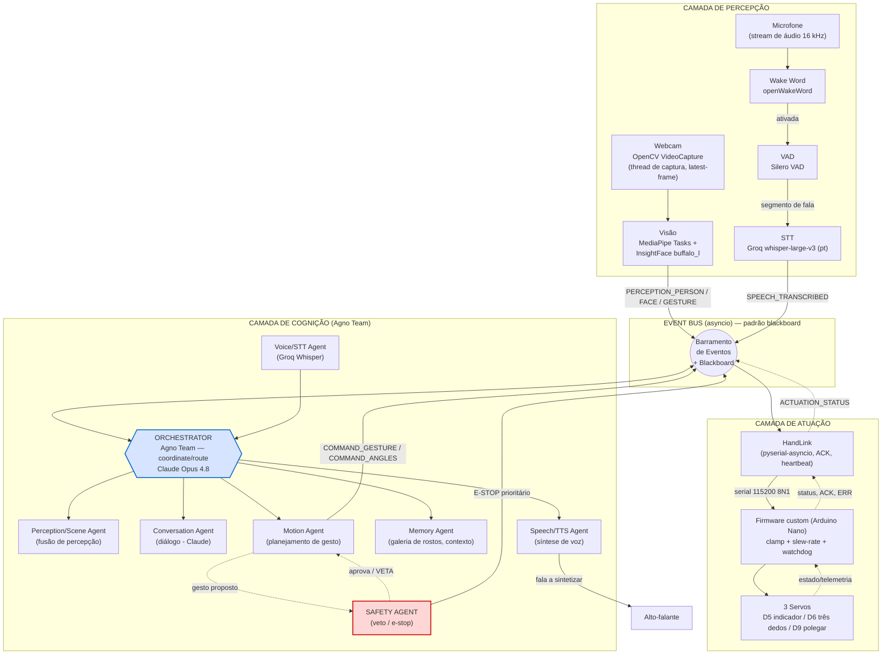
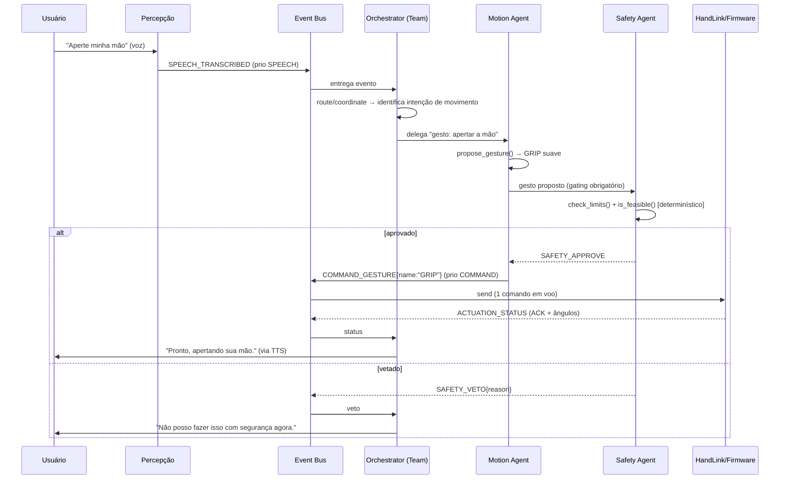

## 1. Arquitetura Geral

Esta seção descreve a arquitetura de software do Projeto Thoth: como os sinais do mundo físico (imagem e som) sobem até a camada cognitiva de agentes, como decisões viram comandos de movimento, e como esses comandos descem com segurança até os três servomotores da mão HACKberry. O sistema é desenhado em **três camadas** acopladas por um **barramento de eventos assíncrono** (asyncio), com um **agente orquestrador** (Agno `Team`) coordenando especialistas e um **agente de segurança com poder de veto** sobre toda a camada de atuação.

> Premissa de hardware que governa toda a arquitetura: a HACKberry é uma **mão** de 3 servos de preensão (indicador → D5, três dedos → D6, polegar → D9), **não** um braço posicionador. O pulso é manual (90°). Logo, a camada de atuação produz **gestos de dedos**, nunca reorientação espacial. Os limites disso são tratados em [§1.6 Reconciliação Hardware × Objetivos](#16-reconciliação-hardware--objetivos) e detalhados na Seção 7.

### 1.1 Visão de Camadas

O sistema segue um pipeline clássico de robótica cognitiva — **Sense → Think → Act** — porém com a camada "Think" implementada como um time de agentes LLM heterogêneos, não como uma máquina de estados fixa. As três camadas têm fronteiras de responsabilidade nítidas e se comunicam **somente** por mensagens no event bus (nunca por chamadas diretas de função entre camadas), o que permite trocar implementações sem reescrever consumidores.

| Camada | Papel | Componentes | Frequência típica | Tecnologia dominante |
|--------|-------|-------------|-------------------|----------------------|
| **Percepção** (Sense) | Transformar pixels e áudio em fatos simbólicos | Câmera (OpenCV), wake word, VAD, STT, detecção de rosto/gesto/pose | Visão: 5–30 Hz (com *frame skipping*); Áudio: contínuo segmentado por VAD | OpenCV, MediaPipe Tasks, InsightFace, openWakeWord, Silero VAD, Groq Whisper |
| **Cognição** (Think) | Interpretar, dialogar, planejar, decidir | Agentes Agno + orquestrador (`Team`) + memória de sessão | Sob demanda (event-driven); soft-real-time | Agno 2.x + Claude / Groq / Cerebras |
| **Atuação** (Act) | Converter intenção em movimento físico seguro | `HandLink` (pyserial-asyncio) → firmware custom → 3 servos | Loop de controle do firmware ~50 Hz (20 ms/tick) | Python asyncio + Arduino C++ (`<Servo.h>`) |

**Loop de tempo real.** O sistema não é um pipeline de mão única: ele opera como um **laço fechado contínuo** em que percepção alimenta cognição, cognição produz ação, e a ação muda o ambiente que a percepção volta a observar. Três sub-loops coexistem com cadências muito diferentes, e isso é deliberado:

```
┌───────────────────────────────────────────────────────────────────────┐
│  LOOP DE PERCEPÇÃO (rápido, contínuo)                                   │
│  webcam → frame → MediaPipe/InsightFace → evento PERCEPTION_*  ~5-30 Hz │
│  mic → VAD → segmento de fala → STT → evento SPEECH_TRANSCRIBED         │
└───────────────────────────────┬───────────────────────────────────────┘
                                 │ eventos no bus
┌───────────────────────────────▼───────────────────────────────────────┐
│  LOOP COGNITIVO (lento, sob demanda, soft-real-time)                    │
│  Orchestrator delega → especialistas (LLM) → decisão → COMMAND_*        │
│  latência dominada pelo provedor LLM (centenas de ms a alguns s)        │
└───────────────────────────────┬───────────────────────────────────────┘
                                 │ COMMAND_GESTURE / COMMAND_ANGLES
┌───────────────────────────────▼───────────────────────────────────────┐
│  LOOP DE CONTROLE (determinístico, no firmware, fora do PC)             │
│  slew-rate + clamp + watchdog → servo.write() a ~50 Hz                  │
│  Safety Agent pode emitir VETO/E-STOP a qualquer momento (prioridade)   │
└─────────────────────────────────────────────────────────────────────────┘
```

O ponto crítico de engenharia: **o controle de baixo nível (50 Hz, determinístico) NUNCA depende da latência do LLM**. O LLM é tratado como **soft-real-time** — ele decide *qual gesto*, mas a *execução suave e segura* do gesto é responsabilidade exclusiva do firmware (slew-rate, clamp aos limites nativos `outThumbMax`/`outIndexMax`/`outOtherMax`, watchdog). Se a nuvem cair ou um agente travar, o watchdog do firmware leva a mão à posição segura (aberta) sem esperar o PC. Esta separação é o que torna seguro colocar um LLM no laço de controle de uma prótese assistiva.

### 1.2 Diagrama de Fluxo do Sistema

O diagrama Mermaid abaixo mostra os dois caminhos principais — **visão** e **voz** — convergindo no orquestrador, e a descida segura até os servos com o Safety Agent interceptando a camada de atuação.



**Diagrama ASCII de fallback** (caso o renderizador Mermaid não esteja disponível):

```
                          PERCEPÇÃO                              COGNIÇÃO (Agno Team)                   ATUAÇÃO
  ┌──────────┐                                       ┌────────────────────────────────────┐
  │  Webcam  │──▶ OpenCV ──▶ MediaPipe + InsightFace │   ┌──────────────────────────────┐ │
  └──────────┘     (thread latest-frame)        │    │   │   ORCHESTRATOR (Agno Team)   │ │
                                                 │    │   │   coordinate / route         │ │
                       PERCEPTION_PERSON/FACE/   │    │   │   Claude Opus 4.8            │ │
                       GESTURE  ─────────────────┼───▶│   └──┬───────┬───────┬───────┬──┘ │
                                                 │    │      │       │       │       │    │
  ┌──────────┐   wake     ┌─────┐  fala   ┌────┐ │    │   Percep. Conv.   Motion  Memory  │
  │   Mic    │──▶openWW──▶│ VAD │────────▶│STT │─┼───▶│   /Scene  (Claude) (gesto) (rostos)│
  └──────────┘  (Silero)  └─────┘ (Groq   └────┘ │    │      │                  │          │
                                  whisper-v3)     │    │   Voice/STT          ┌──▼───┐      │
                                                 │    │   (Groq)             │SAFETY│◀─veto─┤
        ┌────────────[ EVENT BUS asyncio + BLACKBOARD ]──────────────┐       │AGENT │      │
        │  tipo | payload | timestamp | priority | source            │       └──┬───┘      │
        └────────────────────────────────────────────────────────────┘          │ E-STOP   │
                                                 │    │   TTS ──▶ Alto-falante    │ (prio.)  │
                                                 │    └───────────────────────────┼─────────┘
                                                 │                                │
   COMMAND_GESTURE / COMMAND_ANGLES  ────────────┼────────────────────────────────▼
                                                 │   ┌─────────┐ serial   ┌──────────────────┐    ┌──────────┐
                                                 └──▶│ HandLink│─────────▶│ Firmware custom  │──▶ │ 3 Servos │
                                                     │ asyncio │ 115200   │ clamp+slew+wdt   │    │ D5/D6/D9 │
                                                     │ +ACK/HB │◀─────────│ (Arduino Nano)   │◀───│          │
                                                     └─────────┘ status   └──────────────────┘    └──────────┘
```

### 1.3 Catálogo de Agentes

A camada cognitiva é composta por agentes especializados, cada um com responsabilidade única, contrato de entrada/saída explícito, conjunto de *tools* Agno e um modelo de IA escolhido **por papel** segundo o eixo latência × profundidade de raciocínio. A regra de atribuição é:

- **Claude (Opus 4.8)** — planejamento, orquestração, decisão e diálogo. Raciocínio profundo e *tool-use* confiável valem mais que latência aqui. Usa-se `Claude(id="claude-opus-4-8")` com `cache_system_prompt=True` e `max_tokens` elevado (≥ 16000) para tarefas de raciocínio.
- **Groq** — STT (Whisper) e visão/multimodal (Llama 4), além de respostas curtas de baixa latência. O gargalo prático é o TPM (≈ 6k no free tier): mantenha *system prompts* curtos.
- **Cerebras** — inferência de texto de altíssima velocidade (`gpt-oss-120b` ~3000 tok/s) para sub-agentes no laço crítico onde a latência domina.

> Nota de verificação: a doc da Agno ainda exibe um ID Claude legado (`claude-3-5-sonnet-...`) em exemplos — **substitua sempre por `claude-opus-4-8`**. Para Cerebras, o default da integração Agno é `id="llama-4-scout-17b-16e-instruct"`; modelos como `qwen-3-32b`/`llama-3.3-70b` têm deprecação anunciada — **verifique o ID atual em `inference-docs.cerebras.ai/models/overview` antes de fixar em produção**. Em Opus 4.8/4.7, `budget_tokens`, `temperature`/`top_p`/`top_k` e prefill de assistant retornam 400 — use `thinking={"type":"adaptive"}` + `output_config={"effort":"high"}`.

| Agente | Responsabilidade | Entradas | Saídas | Tools Agno | Modelo / Serviço | Justificativa de latência |
|--------|------------------|----------|--------|------------|------------------|----------------------------|
| **Orchestrator** | Roteia/coordena os especialistas; mantém estado de sessão compartilhado; sintetiza a resposta final | Todos os eventos relevantes do bus (percepção fundida, transcrição, status de atuação) | Delegações aos especialistas; resposta final ao usuário | É um `Team` (líder), não tem tools próprias além das dos membros | **Claude Opus 4.8** (líder do `Team`) | Decisão acontece sob demanda; profundidade > velocidade. Sequencial em `coordinate`. |
| **Perception/Scene Agent** | Funde eventos brutos de visão em uma descrição simbólica da cena ("1 pessoa conhecida — Prof. X — acenando à esquerda") | `PERCEPTION_PERSON`, `PERCEPTION_FACE`, `PERCEPTION_GESTURE`, embeddings | `SCENE_STATE` consolidado | `summarize_scene()`, `query_blackboard()` | **Cerebras** (`gpt-oss-120b`) ou **Groq** (`llama-4-scout`) | Roda frequente; precisa ser barato e rápido. Fan-out de baixa latência. |
| **Vision Agent** (análise sob demanda) | Responde perguntas multimodais sobre o frame atual ("quem está na sala?", "há algo perigoso?") | Frame JPEG (base64), pergunta | Descrição textual / lista de pessoas/objetos | `capture_frame()`, `analyze_image()` | **Groq** `meta-llama/llama-4-scout-17b-16e-instruct` (visão nativa) | Visão é cara; Groq dá throughput alto. Limite: ≤5 imgs, base64 ≤4 MB. |
| **Voice/STT Agent** | Transcreve segmentos de fala segmentados pelo VAD | Bytes de áudio (wav/16 kHz), `language="pt"` | `SPEECH_TRANSCRIBED` (texto) | `transcribe_audio()` (chama `audio.transcriptions.create`) | **Groq** `whisper-large-v3` (PT-BR, melhor acurácia) | ~216× tempo-real; só o segmento de fala é enviado (corta custo/latência). |
| **Conversation Agent** | Diálogo natural, formulação de respostas, *small talk*, esclarecimentos | Transcrição + `SCENE_STATE` + memória | Texto de resposta; intenção estruturada | `recall_memory()`, `request_gesture()` (gating) | **Claude Opus 4.8** (ou `claude-sonnet-4-6` p/ custo médio) | Qualidade conversacional importa mais que ms; usuário tolera latência de fala. |
| **Motion Agent** | Traduz intenção em gesto nomeado ou ângulos por servo; **sempre** passa pelo Safety antes de emitir | Intenção de movimento (do Orchestrator/Conversation) | `COMMAND_GESTURE` / `COMMAND_ANGLES` (após aprovação) | `propose_gesture()`, `list_capabilities()`, `send_to_hand()` (gated) | **Claude Opus 4.8** (planejamento) ou **Cerebras** (mapeamento rápido de gesto conhecido) | Gestos conhecidos (OPEN/CLOSE/POINT) podem usar Cerebras p/ baixa latência; planejamento ambíguo usa Claude. |
| **Safety Agent** | **Poder de veto** sobre toda saída de atuação; valida limites, viabilidade física e gera E-STOP | `COMMAND_*` propostos, `ACTUATION_STATUS`, eventos de e-stop | `SAFETY_APPROVE` / `SAFETY_VETO` / `EMERGENCY_STOP` (prioridade máxima) | `check_limits()`, `is_feasible()`, `emergency_stop()` | **Lógica determinística primária** (sem LLM no caminho crítico) + Claude apenas para *audit/log* assíncrono | O veto é determinístico e **não** espera LLM — segurança não pode depender de latência de nuvem. |
| **Memory Agent** | Mantém galeria de rostos (nome→embedding 512-D), preferências e contexto de longo prazo | Embeddings faciais, fatos de sessão | Identidade reconhecida; contexto recuperado | `enroll_face()`, `match_face()`, `recall()`, `remember()` | **Claude** (`enable_agentic_memory`/`memory_manager` + `db`) | Cosine similarity (numpy) no caminho rápido; LLM só para memória semântica. |
| **Speech/TTS Agent** | Sintetiza a resposta textual em áudio e a envia ao alto-falante | Texto a falar | Áudio reproduzido | `synthesize_speech()`, `play_audio()` | TTS dedicado (Piper local / Coqui / serviço cloud) — **ver Seção 4** | TTS local elimina round-trip de rede; cloud quando qualidade > latência. |

> **Observação sobre STT/TTS e os provedores:** nem Claude nem Cerebras oferecem STT ou TTS. STT é **Groq Whisper**. Para TTS, usa-se um serviço/biblioteca dedicado (a Seção 4 detalha a escolha). Visão nativa existe em Claude e em Groq Llama 4; aqui ela é alocada ao **Groq** pelo throughput, reservando Claude para raciocínio.

### 1.4 Comunicação entre Agentes — Event Bus + Blackboard

A comunicação **não** é feita por chamadas diretas entre agentes (acoplamento forte, difícil de testar e perigoso para segurança). Adota-se um **barramento de eventos assíncrono** (`asyncio.Queue` por assinante, *publish/subscribe*) combinado com um **blackboard** (estado partilhado consultável) — o padrão clássico de arquitetura de quadro-negro de sistemas multiagente. O `session_state` do Agno `Team` (compartilhado entre líder e membros via `run_context.session_state`) serve como o blackboard persistente da camada cognitiva.

**Por que asyncio (e não threads):** a `HandLink` usa `pyserial-asyncio`, a leitura serial vira *coroutine* não-bloqueante, e os agentes Agno expõem `await agent.arun(...)` / `await team.arun(...)`. Tudo vive no mesmo event loop — sem locks manuais, sem *thread* dedicada de polling serial. As tarefas de visão CPU-bound (MediaPipe/InsightFace) rodam em *thread* dedicada de captura (`latest-frame`) e publicam no bus via `loop.call_soon_threadsafe`, mantendo o loop principal livre.

#### Esquema de mensagem/evento

Todo evento no bus é um objeto imutável com campos fixos. Um esquema mínimo e versionado:

```python
from __future__ import annotations
import time
import uuid
from dataclasses import dataclass, field
from enum import IntEnum
from typing import Any

class Priority(IntEnum):
    """Menor número = maior prioridade. Safety/E-stop sempre no topo."""
    EMERGENCY = 0   # E-STOP, veto — drena à frente de tudo
    SAFETY    = 1   # avisos do Safety Agent
    COMMAND   = 2   # comandos de atuação
    SPEECH    = 3   # transcrições / fala
    PERCEPTION = 4  # percepção contínua (a mais barata de descartar)

@dataclass(frozen=True, order=True)
class Event:
    # 'order=True' + priority como 1º campo => PriorityQueue ordena por prioridade
    priority: Priority
    timestamp: float = field(default_factory=time.monotonic, compare=False)
    type: str = field(default="", compare=False)          # ex.: "SPEECH_TRANSCRIBED"
    payload: dict[str, Any] = field(default_factory=dict, compare=False)
    source: str = field(default="", compare=False)        # agente/origem
    event_id: str = field(default_factory=lambda: uuid.uuid4().hex, compare=False)
    corr_id: str | None = field(default=None, compare=False)  # correlação req↔resp
```

| Tipo de evento | `priority` | `payload` (campos-chave) | Produtor → Consumidor |
|----------------|-----------|--------------------------|------------------------|
| `PERCEPTION_PERSON` | PERCEPTION | `count`, `bboxes`, `frame_ts` | Visão → Perception/Scene |
| `PERCEPTION_FACE` | PERCEPTION | `embedding`, `bbox` | Visão → Memory/Perception |
| `PERCEPTION_GESTURE` | PERCEPTION | `gesture` (`Pointing_Up`, `Open_Palm`...), `hand` | Visão → Perception/Scene |
| `SCENE_STATE` | PERCEPTION | `summary`, `people[]`, `known_ids[]` | Perception/Scene → Orchestrator |
| `SPEECH_TRANSCRIBED` | SPEECH | `text`, `lang`, `conf` | Voice/STT → Orchestrator |
| `COMMAND_GESTURE` | COMMAND | `name` (`OPEN`/`CLOSE`/`POINT`/`PINCH`/`GRIP`), `corr_id` | Motion → Safety → HandLink |
| `COMMAND_ANGLES` | COMMAND | `thumb`, `index`, `other` (graus, pré-clamp) | Motion → Safety → HandLink |
| `SAFETY_VETO` | SAFETY | `reason`, `vetoed_corr_id` | Safety → Motion/Orchestrator |
| `EMERGENCY_STOP` | EMERGENCY | `trigger` (`physical`/`software`/`wdt`) | Safety → HandLink (bypassa fila normal) |
| `ACTUATION_STATUS` | COMMAND | `angles`, `mode`, `battery_mv` | HandLink → bus (telemetria) |

#### Ciclo evento → decisão → ação



#### Concorrência, backpressure e prioridade do Safety

- **Concorrência.** Cada assinante tem sua própria fila; um produtor lento (LLM) não bloqueia um rápido (visão). O Orchestrator processa um *turn* cognitivo por vez (modo `coordinate` é sequencial), mas percepção e atuação continuam fluindo em paralelo. **Serialização da serial:** apenas **1 comando em voo** na `HandLink` (fila FIFO interna), preservando a ordem de ACK — nunca se dispara um segundo gesto antes do ACK do anterior.
- **Backpressure.** Filas são **limitadas** (`asyncio.Queue(maxsize=N)`). Eventos de **percepção** são os mais descartáveis: aplica-se *drop-oldest* (mantém só o frame/estado mais recente — coerente com a estratégia *latest-frame* da câmera) quando a fila enche. Eventos de **comando/segurança nunca são descartados**. Quando o LLM está saturado, percepção degrada graciosamente (menos FPS efetivo) em vez de acumular *backlog* e introduzir latência crescente.
- **Prioridade do Safety (veto).** O Safety Agent é o único com prioridade `EMERGENCY`. Um `EMERGENCY_STOP` **não passa pela fila normal**: ele é entregue por um canal de prioridade que a `HandLink` drena antes de qualquer `COMMAND_*` pendente, resultando em `detach` imediato dos três servos no firmware. Além disso, **todo** `COMMAND_*` do Motion Agent é *gated* — ele só chega à `HandLink` após `SAFETY_APPROVE`. Em prótese assistiva, o veto é **fail-safe**: na ausência de aprovação, nada é atuado, e o watchdog do firmware (heartbeat ≥ 1 Hz) leva a mão à posição aberta se o PC silenciar. A lógica de veto é **determinística** (clamp aos limites nativos + checagem de viabilidade), sem LLM no caminho crítico; o Claude é usado apenas para *auditoria/log* assíncrono fora do laço de segurança.

### 1.5 Orquestração: como o Orchestrator delega aos especialistas

O Orchestrator é um **Agno `Team`** com Claude Opus 4.8 como líder. A coordenação usa os modos verificados da v2 do Agno:

- **`TeamMode.route`** — para intenções **classificáveis e de turno único** (ex.: "quem está na sala?" → roteia direto ao Vision Agent; "aperte minha mão" → roteia ao Motion Agent). Menor latência: o líder escolhe **um** especialista e devolve a resposta dele.
- **`TeamMode.coordinate`** (padrão) — para tarefas que exigem **vários especialistas em sequência** com contexto compartilhado (ex.: reconhecer a pessoa via Memory → formular saudação personalizada via Conversation → opcionalmente gesticular via Motion). O líder delega sequencialmente e **sintetiza** a resposta final, mantendo o `session_state` compartilhado.

> A nomenclatura "collaborate" do enunciado é da Agno 1.x; na v2 o equivalente colaborativo é **`coordinate`** (não confirmado se `collaborate` ainda é alias válido em 2.6.x). O plano usa `coordinate`/`route` explicitamente.

```python
from agno.team import Team, TeamMode
from agno.models.anthropic import Claude

orchestrator = Team(
    name="Thoth Orchestrator",
    mode=TeamMode.coordinate,          # ou TeamMode.route para turno único
    model=Claude(id="claude-opus-4-8", cache_system_prompt=True),  # líder
    members=[
        perception_agent,   # Cerebras / Groq
        voice_agent,        # Groq Whisper
        conversation_agent, # Claude
        motion_agent,       # Claude / Cerebras
        memory_agent,       # Claude + db
        tts_agent,          # TTS dedicado
        # safety_agent NÃO é membro delegável: opera como gate determinístico
    ],
    instructions=[
        "Você coordena uma mão protética HACKberry (3 servos de dedos).",
        "A mão NÃO se reorienta no espaço e NÃO levanta o braço.",
        "Todo movimento DEVE ser aprovado pelo Safety Agent antes de executar.",
        "Para perguntas sobre a cena, delegue ao Vision/Perception Agent.",
        "Para comandos de movimento, delegue ao Motion Agent.",
    ],
)
# Laço cognitivo: await orchestrator.arun(evento)  → não bloqueia o event loop
```

**Gating de ações sensíveis.** Seguindo a boa prática de *tool-use* (promover ações sensíveis a *tools* dedicadas para auditoria e gating), o envio de comando à mão **não** é uma chamada livre: é a *tool* `send_to_hand()`, que internamente publica no bus e **só efetiva após o `SAFETY_APPROVE`**. A `description` de cada *tool* descreve **quando** chamá-la (não só o que faz), pois o Opus 4.8 aciona *tools* de forma conservadora e gatilhos explícitos aumentam o acerto. *Tool inputs* são sempre parseados com `json.loads()` (nunca regex).

### 1.6 Tecnologias Recomendadas por Camada (resumo)

Resumo de referência rápida; a justificativa completa, alternativas comparadas e versões fixadas estão na **Seção 4**.

| Camada | Função | Tecnologia recomendada | Pacote PyPI | Papel do modelo de IA |
|--------|--------|------------------------|-------------|------------------------|
| Percepção | Captura de vídeo | OpenCV (`cv2.VideoCapture` + `CAP_DSHOW` no Windows, `BUFFERSIZE=1`) | `opencv-python` | — |
| Percepção | Rosto/gesto/pose | MediaPipe Tasks (`vision`, `RunningMode.LIVE_STREAM`) | `mediapipe` | — |
| Percepção | Reconhecimento facial | InsightFace `buffalo_l` (ArcFace, embedding 512-D) | `insightface` + `onnxruntime` | — |
| Percepção | Wake word | openWakeWord (Apache-2.0, sem chave) | `openwakeword` | — |
| Percepção | VAD | Silero VAD (rede neural, 16 kHz) | `silero-vad` | — |
| Percepção | STT | Groq `whisper-large-v3` (PT-BR); `faster-whisper` como fallback offline | `groq` / `faster-whisper` | **Groq** |
| Cognição | Framework de agentes | Agno 2.x (`Agent`, `Team`, `db`, `session_state`) | `agno` | — |
| Cognição | Planejamento/diálogo/orquestração | Claude Opus 4.8 (`adaptive thinking`, `effort: high`) | `anthropic` | **Claude** |
| Cognição | Visão multimodal | Groq Llama 4 Scout/Maverick | `groq` | **Groq** |
| Cognição | Inferência rápida complementar | Cerebras `gpt-oss-120b` (~3000 tok/s) | `cerebras-cloud-sdk` | **Cerebras** |
| Atuação | Ponte serial | pyserial-asyncio (ACK, heartbeat, reconexão) | `pyserial-asyncio` | — |
| Atuação | Firmware | Arduino C++ custom (`<Servo.h>`, clamp/slew/watchdog) | — (Arduino IDE/PlatformIO) | — |
| Voz (saída) | TTS | Serviço/biblioteca dedicado (ver Seção 4) | — | — |

### 1.7 Reconciliação Hardware × Objetivos

A arquitetura acima é desenhada em torno do que a HACKberry **realmente** pode fazer. Esta subseção torna explícita a fronteira entre o viável e o que exige hardware futuro — referência cruzada com a **Seção 0.1** (leitura obrigatória) e com a **Seção 7** (escalabilidade).

| Objetivo / comando | Camada que resolve | Viável com HACKberry? | Tratamento na arquitetura |
|--------------------|--------------------|------------------------|----------------------------|
| **Preensão / "aperte minha mão"** | Atuação (Motion → Safety → firmware) | ✅ **Sim** | Gesto `GRIP`/`CLOSE` suave (slew-rate), clampado a `outThumbMax`/`outIndexMax`/`outOtherMax`. |
| **Apontar (formar o gesto)** | Atuação | ⚠️ **Parcial** | A mão **forma** o gesto `POINT` (indicador estendido, demais flexionados), mas **não mira** uma pessoa: sem braço posicionador, não há reorientação espacial. O Motion Agent forma o gesto; o Orchestrator informa ao usuário a limitação. |
| **Pinça** | Atuação | ✅ **Sim** | Gesto `PINCH` (polegar + indicador). Atenção: o servo do polegar (D9) **não tem PPTC** — slew menor e timeout de *detach* mais curto. |
| **"Levante o braço"** | — | ❌ **Não** | Exige atuadores de ombro/cotovelo inexistentes. Sinalizado como **gap de hardware** → trabalho futuro na **Seção 7** (mais DOF / braço posicionador). O Safety Agent **veta** qualquer tentativa; o Orchestrator responde explicando o limite. |
| **Reorientar para mirar** | — | ❌ **Não** | Pulso é manual (90°). Mesmo *gap* de hardware acima. |
| **"Quem está na sala?" / reconhecer pessoas** | Percepção + Cognição (Vision/Memory) | ✅ **Sim** | Independe totalmente da mão; usa webcam + InsightFace + Groq Llama 4. Não há restrição de hardware do braço. |

**Princípio de projeto:** a arquitetura **não inventa atuadores**. Comandos fisicamente impossíveis (levantar o braço, mirar) são tratados como **caminhos de erro explícitos e seguros** — o Safety Agent veta, o Orchestrator comunica a limitação ao usuário em linguagem natural, e o *gap* é registrado como requisito de evolução de hardware na Seção 7. Isso mantém o sistema honesto sobre suas capacidades, requisito essencial em um dispositivo assistivo real (Braço robótico UFRGS / Enfitec Jr. / CTA-IF).
