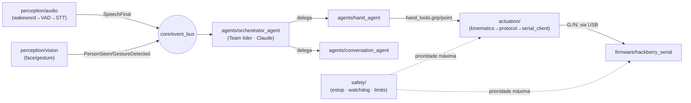

## 2. Estrutura de Pastas

Esta seção define a organização física do repositório `thoth/`. O layout não é decorativo: ele **materializa em diretórios a separação de camadas Percepção → Cognição → Atuação** descrita na Seção 1 e mapeia **1:1 cada pasta de `core/agents` em um agente Agno** do catálogo da arquitetura. A regra de ouro é: *a camada de atuação nunca importa diretamente da camada de percepção, e vice-versa* — toda comunicação cruzada passa pelo **event bus** (`core/event_bus.py`) e pelo **orquestrador** (`core/orchestrator.py`). Isso mantém os agentes substituíveis, testáveis em isolamento e impede que um bug de visão acione um servo por acidente.

### 2.1 Princípios de organização

| Princípio | Como aparece na árvore |
|-----------|------------------------|
| **Separação Percepção / Cognição / Atuação** | `perception/`, `agents/` + `llm/`, `actuation/` são pacotes irmãos sem dependências laterais diretas. |
| **Injeção de configuração** | `core/config.py` (Pydantic Settings) carrega `.env` + `configs/*.yaml` e é **injetado** em construtores; nenhum módulo lê `os.environ` diretamente fora de `config.py`. |
| **Fábrica de modelos centralizada** | `llm/factory.py` é o **único** lugar que instancia `Claude`/`Groq`/`Cerebras` — agentes recebem o modelo pronto, nunca o criam. |
| **Hardware isolado atrás de uma interface** | Toda a fala com o firmware está em `actuation/serial_client.py`; o resto do código fala em "gestos", não em bytes seriais. |
| **Artefatos versionados vs. dados** | Código em pacotes; pesos/modelos/encodings/logs em `data/` e `models/`, ambos majoritariamente fora do Git (ver `.gitignore`). |
| **Async-first** | O event bus, o orquestrador, o cliente serial e os agentes (`arun`) compartilham um único event loop `asyncio`. |

### 2.2 Onde ficam os artefatos não-código (decisão explícita)

- **Modelos `.task` do MediaPipe** (`face_landmarker.task`, `hand_landmarker.task`, `gesture_recognizer.task`, `blaze_face_short_range.task`): em **`models/mediapipe/`**, baixados por `scripts/download_models.py`. **Não** entram no Git (são grandes e redistribuíveis a partir de `ai.google.dev`); o `.gitignore` ignora `models/` exceto um `.gitkeep`.
- **Encodings/embeddings faciais** (galeria InsightFace `buffalo_l`, vetores 512-D): em **`data/embeddings/gallery.npz`** (matriz de embeddings + nomes), gerados por `scripts/enroll_face.py` a partir das fotos em **`data/known_faces/<nome>/*.jpg`**. Dados pessoais → **fora do Git** (privacidade/LGPD).
- **Pesos do InsightFace/ONNX**: cache do próprio `insightface` em `~/.insightface`; opcionalmente espelhados em `models/insightface/`.
- **Logs e telemetria**: `data/logs/` (rotacionados; ignorados no Git).

### 2.3 Árvore completa do projeto

```text
thoth/
├── README.md                      # Visão geral do código, setup, como rodar (aponta para docs/)
├── pyproject.toml                 # Metadados do pacote + dependências (PEP 621) + config de tools
├── requirements.txt               # Lock simples alternativo p/ quem não usar uv/poetry
├── .env.example                   # Modelo das variáveis de ambiente (sem segredos)
├── .gitignore                     # Ignora venv, .env, data/ privado, models/, caches, logs
├── .python-version                # Fixa Python 3.11 (pyenv/uv)
├── justfile                       # Atalhos de tarefas (setup, run, test, lint, enroll, flash)
├── Makefile                       # Equivalente ao justfile p/ ambientes sem `just`
│
├── src/
│   └── thoth/                     # Pacote raiz importável (`import thoth`)
│       ├── __init__.py
│       ├── __main__.py            # Entry point: `python -m thoth` -> sobe orquestrador + agentes
│       ├── app.py                 # Bootstrap: lê config, monta DI, instancia bus/agentes/atuação
│       │
│       ├── core/                  # ---------- NÚCLEO (infra transversal) ----------
│       │   ├── __init__.py
│       │   ├── config.py          # Settings (Pydantic): lê .env + configs/*.yaml; única fonte de verdade
│       │   ├── event_bus.py       # Bus assíncrono pub/sub (asyncio.Queue/anyio); desacopla camadas
│       │   ├── events.py          # Dataclasses dos eventos (PersonSeen, GestureDetected, SpeechFinal...)
│       │   ├── orchestrator.py    # Monta o Team Agno, roteia eventos do bus -> agentes -> atuação
│       │   ├── logging.py         # Config de logging estruturado (loguru/structlog) + correlação
│       │   ├── lifecycle.py       # Startup/shutdown gracioso de tasks, cancelamento, watchdog do host
│       │   └── types.py           # Tipos/enums compartilhados (GestureName, AgentRole, SafetyMode)
│       │
│       ├── llm/                   # ---------- COGNIÇÃO: provedores de modelo ----------
│       │   ├── __init__.py
│       │   ├── factory.py         # build_model(role) -> Claude | Groq | Cerebras (único ponto de instância)
│       │   ├── roles.py           # Mapa papel->modelo: planner=claude-opus-4-8, fast=cerebras/groq...
│       │   └── prompts/           # System prompts versionados (texto), carregados por papel
│       │       ├── orchestrator.md
│       │       ├── conversation.md
│       │       └── perception_analyst.md
│       │
│       ├── agents/                # ---------- COGNIÇÃO: agentes Agno (1:1 com Seção 1) ----------
│       │   ├── __init__.py
│       │   ├── base.py            # Helpers comuns: monta Agent com db/memory/instructions padrão
│       │   ├── orchestrator_agent.py  # Líder do Team (Claude): decide e delega; mapeia comando->ação
│       │   ├── conversation_agent.py  # Diálogo natural com o usuário (Claude); gera fala de resposta
│       │   ├── vision_agent.py        # Interpreta cena/identidade/gestos (Groq Llama-4 multimodal)
│       │   ├── speech_agent.py        # STT (Groq Whisper) + intenção da fala; emite SpeechFinal
│       │   ├── hand_agent.py          # Traduz intenção -> gesto/ângulos; chama tools de actuation/
│       │   └── tools/             # Tools Agno (funções) expostas aos agentes
│       │       ├── __init__.py
│       │       ├── hand_tools.py      # @tool: grip(), point(), pinch(), open_hand(), set_angles()
│       │       ├── vision_tools.py    # @tool: who_is_in_room(), describe_scene(), last_gesture()
│       │       └── memory_tools.py    # @tool: remember_person(), recall_last_seen()
│       │
│       ├── perception/            # ---------- PERCEPÇÃO (sensoriamento) ----------
│       │   ├── __init__.py
│       │   ├── vision/
│       │   │   ├── __init__.py
│       │   │   ├── camera.py          # cv2.VideoCapture + thread latest-frame (CAP_DSHOW, BUFFERSIZE=1)
│       │   │   ├── face_detector.py   # MediaPipe FaceDetector/FaceLandmarker (LIVE_STREAM + callback)
│       │   │   ├── face_recognizer.py # InsightFace buffalo_l: embedding 512-D + cosine vs. galeria
│       │   │   ├── gesture.py         # MediaPipe GestureRecognizer (Closed_Fist, Pointing_Up, ...)
│       │   │   ├── pose.py            # MediaPipe PoseLandmarker (presença/pose corporal) — opcional
│       │   │   └── pipeline.py        # Orquestra captura+modelos; publica eventos no bus (cadência N)
│       │   └── audio/
│       │       ├── __init__.py
│       │       ├── mic.py             # Captura de microfone (sounddevice), buffers de 16 kHz mono
│       │       ├── wakeword.py        # openWakeWord (Apache-2.0): ativa a escuta
│       │       ├── vad.py             # Silero VAD: segmenta fala, fecha após ~500 ms de silêncio
│       │       ├── stt.py             # Groq Whisper-large-v3 (PT-BR); fallback faster-whisper local
│       │       └── pipeline.py        # wakeword -> VAD -> STT; publica SpeechFinal no bus
│       │
│       ├── actuation/             # ---------- ATUAÇÃO (controle do hardware) ----------
│       │   ├── __init__.py
│       │   ├── serial_client.py       # HandLink async (pyserial-asyncio): handshake, ACK, heartbeat, reconnect
│       │   ├── protocol.py            # Codec do protocolo ASCII (G:/N:/H:/S:/Q + parser de A:/E:/S:)
│       │   ├── motion_primitives.py   # Gestos nomeados -> sequências de ângulos (grip/point/pinch/shake)
│       │   ├── kinematics.py          # Conversão alvo->ângulos por servo + clamp aos limites nativos
│       │   └── safety_actuation.py    # E-stop lógico, slew-rate do lado host, validação pré-envio
│       │
│       ├── memory/                # ---------- MEMÓRIA / ESTADO ----------
│       │   ├── __init__.py
│       │   ├── db.py              # BaseDb do Agno (SQLite p/ sessão/memória); injetado nos agentes
│       │   ├── identity.py        # Galeria facial: load/save embeddings, match, enrollment programático
│       │   └── session_state.py   # Helpers do session_state compartilhado do Team (poses, last_person)
│       │
│       └── safety/               # ---------- SEGURANÇA (transversal, prioridade máxima) ----------
│           ├── __init__.py
│           ├── limits.py          # Limites de ângulo por servo (espelham outThumbMax/Index/OtherMax)
│           ├── estop.py           # Parada de emergência: comando S\n + monitor de pino físico
│           ├── watchdog.py        # Heartbeat host<->firmware; fail-safe = abrir a mão
│           └── guards.py          # Gating de ações sensíveis dos agentes (auditoria + confirmação)
│
├── firmware/                     # ---------- FIRMWARE ARDUINO (GPLv3) ----------
│   ├── hackberry_serial/         # Sketch custom host-controlled (marco da Fase 2)
│   │   ├── hackberry_serial.ino  # Loop não-bloqueante: parse serial -> clamp -> slew-rate -> servo.write
│   │   ├── config.h              # Pinos (INDEX=D5, OTHER=D6, THUMB=D9), limites, WDT_MS, isRight
│   │   ├── protocol.h            # Definição do protocolo serial (deve casar com actuation/protocol.py)
│   │   ├── servo_control.h       # Wrapper sobre <Servo.h>: attach/detach, constrain, slew por tick
│   │   └── safety.h              # Watchdog (<avr/wdt.h>), e-stop por pino, fail-safe = open
│   ├── reference/                # Sketches NATIVOS originais (somente leitura, p/ comparação)
│   │   ├── Hackberryv3.0.ino     # Versão sensor de pressão (autônoma) — referência
│   │   └── HACKBERRY_V3.1_Mk2_EMG.ino  # Versão EMG (autônoma) — referência
│   └── README.md                 # Como compilar/flashar (arduino-cli), placa Mk2 V3/V4, pinagem
│
├── api/                          # ---------- API / TELEMETRIA ----------
│   ├── __init__.py
│   ├── server.py                 # FastAPI: REST (status, comandos manuais) + lifespan do app
│   ├── websockets.py             # WS de telemetria em tempo real (frames anotados, eventos, status servo)
│   ├── routes/
│   │   ├── __init__.py
│   │   ├── health.py             # /health, /version (liveness/readiness)
│   │   ├── control.py            # /command (gesto manual), /estop (POST e-stop) — protegido
│   │   └── vision.py             # /snapshot, /who (stream MJPEG/último frame anotado)
│   └── schemas.py                # Modelos Pydantic de request/response da API
│
├── configs/                      # ---------- CONFIGURAÇÃO DECLARATIVA ----------
│   ├── default.yaml              # Config base (resoluções, cadências, thresholds, papéis de modelo)
│   ├── dev.yaml                  # Overrides de desenvolvimento (logs verbosos, mock de serial)
│   ├── prod.yaml                 # Overrides de produção (timeouts, reconexão, e-stop estrito)
│   └── logging.yaml              # Níveis/handlers/formatadores de log
│
├── data/                         # ---------- DADOS (majoritariamente fora do Git) ----------
│   ├── known_faces/              # Fotos de enrollment: known_faces/<nome>/*.jpg  (PRIVADO)
│   │   └── .gitkeep
│   ├── embeddings/               # Galeria de embeddings faciais 512-D (PRIVADO)
│   │   └── .gitkeep              # gallery.npz é gerado por scripts/enroll_face.py
│   └── logs/                     # Logs rotacionados, telemetria, gravações de sessão (PRIVADO)
│       └── .gitkeep
│
├── models/                       # ---------- PESOS / MODELOS (fora do Git) ----------
│   ├── mediapipe/                # *.task baixados (face_landmarker, hand_landmarker, gesture_recognizer)
│   │   └── .gitkeep
│   └── insightface/              # Espelho opcional do pack buffalo_l (ONNX)
│       └── .gitkeep
│
├── scripts/                      # ---------- UTILITÁRIOS DE LINHA DE COMANDO ----------
│   ├── download_models.py        # Baixa os .task do MediaPipe para models/mediapipe/
│   ├── enroll_face.py            # Enrolla rosto: fotos -> embedding 512-D -> data/embeddings/gallery.npz
│   ├── flash_firmware.py         # Compila+grava o sketch via arduino-cli (placa Mk2)
│   ├── serial_repl.py            # REPL manual do protocolo serial (debug do firmware sem agentes)
│   └── check_devices.py          # Lista câmeras, microfones e portas seriais disponíveis
│
├── notebooks/                    # ---------- EXPLORAÇÃO / CALIBRAÇÃO ----------
│   ├── 01_calibrate_face_threshold.ipynb   # Calibra threshold de cosine similarity da galeria
│   ├── 02_gesture_latency.ipynb            # Mede latência do pipeline de gestos
│   └── 03_servo_slew_tuning.ipynb          # Ajusta STEP/slew-rate e detach observando corrente/jitter
│
├── tests/                        # ---------- TESTES ----------
│   ├── __init__.py
│   ├── conftest.py               # Fixtures: bus em memória, serial fake, config de teste
│   ├── unit/
│   │   ├── test_protocol.py      # Codec serial: round-trip G:/N:/parsing de A:/E:/S:
│   │   ├── test_kinematics.py    # Clamp e mapeamento de ângulos (nunca fora dos limites nativos)
│   │   ├── test_motion_primitives.py  # grip/point/pinch geram sequências válidas
│   │   ├── test_event_bus.py     # Pub/sub, ordem, cancelamento
│   │   └── test_config.py        # Carga de .env + YAML + precedência
│   ├── integration/
│   │   ├── test_serial_client.py # HandLink contra firmware emulado (loopback/pty fake)
│   │   ├── test_orchestrator.py  # Evento -> agente -> tool de atuação (Team mockado)
│   │   └── test_vision_pipeline.py    # Frame estático -> detecção/gesto -> evento no bus
│   └── hardware/                 # Testes marcados (@pytest.mark.hardware) que exigem a mão física
│       └── test_live_hand.py     # Smoke test com servos reais (e-stop coberto)
│
└── docs/                         # ---------- DOCUMENTAÇÃO ----------
    ├── plano/                    # Este plano de implementação (00_intro, 02_estrutura_pastas, ...)
    ├── architecture.md           # Diagramas e decisões (espelha a Seção 1)
    ├── protocol.md               # Especificação canônica do protocolo serial (fonte única)
    └── hardware.md               # Pinagem, energia, limites, reconciliação com o manual HACKberry
```

### 2.4 Mapeamento 1:1 dos agentes da Seção 1 → estrutura de pastas

Cada agente do catálogo da Seção 1 tem **um módulo dedicado em `src/thoth/agents/`**, recebe seu modelo de `llm/factory.py` por papel e atua exclusivamente sobre uma camada via **tools**. O `orchestrator_agent` é o **líder do `Team` Agno** (modo `coordinate` — em v2 o equivalente colaborativo ao antigo `collaborate`); os demais são *members*.

| Agente (Seção 1) | Módulo | Camada que toca | Modelo (via `llm/roles.py`) | Tools / dependências |
|------------------|--------|-----------------|------------------------------|----------------------|
| **Orquestrador** (líder do Team) | `agents/orchestrator_agent.py` | Cognição (decide/roteia) | `claude-opus-4-8` (adaptive thinking, effort `high`) | delega aos members; lê eventos do `core/event_bus` |
| **Conversação** | `agents/conversation_agent.py` | Cognição (diálogo) | `claude-sonnet-4-6` | gera fala de resposta; consulta `memory/` |
| **Visão** | `agents/vision_agent.py` | Percepção (interpreta) | Groq `meta-llama/llama-4-scout-17b-16e-instruct` | `tools/vision_tools.py` sobre `perception/vision/` |
| **Fala (STT/intenção)** | `agents/speech_agent.py` | Percepção (áudio) | Groq `whisper-large-v3` (STT) + `llama-3.3-70b-versatile` (intenção) | `perception/audio/pipeline.py` |
| **Mão (atuação)** | `agents/hand_agent.py` | Atuação | Cerebras `llama-4-scout-17b-16e-instruct` ou `claude-haiku-4-5` (baixa latência) | `tools/hand_tools.py` → `actuation/` |

> **Por que essa atribuição de modelos:** o raciocínio/coordenação fica com Claude Opus 4.8 (tool-use confiável, contexto longo); o loop crítico de baixa latência (gesto, intenção curta) usa Cerebras/Groq. A latência é dominada pelo provedor LLM — por isso o **controle de baixo nível (clamp, slew-rate, e-stop) vive no firmware e em `safety/`/`actuation/`, fora do agente**, tratando o LLM como *soft-real-time*.

A trajetória de um comando atravessa exatamente uma pasta por camada, sempre via bus:



### 2.5 `pyproject.toml` (dependências reais)

```toml
[project]
name = "thoth"
version = "0.1.0"
description = "Assistente robótico multiagente para a mão protética HACKberry"
requires-python = ">=3.11"
license = { text = "GPL-3.0-or-later" }  # firmware deriva do sketch HACKberry (GPLv3)
dependencies = [
    # --- Cognição / agentes ---
    "agno>=2.6,<3",                  # framework multiagente (ex-Phidata); API v2.x
    "anthropic>=0.40",               # Claude (planejamento/diálogo)
    "groq>=0.13",                    # STT Whisper + visão Llama-4 + texto rápido
    "cerebras-cloud-sdk>=1.0",       # inferência de altíssima velocidade
    # --- Percepção: visão ---
    "opencv-python>=4.10",           # captura de webcam (cv2.VideoCapture)
    "mediapipe>=0.10.14",            # Tasks API: face/hand/gesture/pose (.task)
    "insightface>=0.7.3",            # reconhecimento facial buffalo_l (ArcFace, 512-D)
    "onnxruntime>=1.18",             # backend do InsightFace (CPU; trocar p/ onnxruntime-gpu se houver CUDA)
    "numpy>=1.26",                   # embeddings, cosine similarity
    # --- Percepção: áudio ---
    "openwakeword>=0.6",             # wake word (Apache-2.0)
    "silero-vad>=5.1",               # VAD neural p/ segmentar fala
    "sounddevice>=0.4.6",            # captura de microfone
    "faster-whisper>=1.0",           # STT local de fallback (offline)
    # --- Atuação / hardware ---
    "pyserial>=3.5",                 # base serial
    "pyserial-asyncio>=0.6",         # cliente serial assíncrono (casa com asyncio do Agno)
    # --- Núcleo / API / config ---
    "fastapi>=0.115",                # API REST + lifespan
    "uvicorn[standard]>=0.30",       # servidor ASGI (inclui websockets)
    "websockets>=12.0",              # telemetria em tempo real
    "pydantic>=2.7",                 # modelos de dados
    "pydantic-settings>=2.3",        # Settings a partir de .env + YAML (injeção de config)
    "pyyaml>=6.0",                   # leitura dos configs/*.yaml
    "loguru>=0.7",                   # logging estruturado
    "anyio>=4.4",                    # primitivas async do event bus
]

[project.optional-dependencies]
dev = [
    "pytest>=8.2",
    "pytest-asyncio>=0.23",
    "pytest-cov>=5.0",
    "ruff>=0.5",
    "mypy>=1.10",
    "jupyter>=1.0",                  # notebooks/ de calibração
]

[project.scripts]
thoth = "thoth.__main__:main"        # `thoth` na linha de comando == python -m thoth

[build-system]
requires = ["hatchling"]
build-backend = "hatchling.build"

[tool.hatch.build.targets.wheel]
packages = ["src/thoth"]

[tool.ruff]
line-length = 100
target-version = "py311"

[tool.pytest.ini_options]
asyncio_mode = "auto"
markers = ["hardware: testes que exigem a mão HACKberry conectada"]
```

> **Nota de versões:** Agno 2.x está em evolução rápida (≈2.6.x em jun/2026); fixe a faixa `>=2.6,<3` e **verifique o caminho de import de `RunContext` na doc** antes de usar (provavelmente `from agno.run.context import RunContext`). Os IDs de modelo Cerebras (ex.: deprecações de `llama-3.3-70b`/`qwen-3-32b`) devem ser **reconfirmados em `inference-docs.cerebras.ai/models/overview`** antes de fixar em produção.

Para quem não usar `uv`/`hatch`, o **`requirements.txt`** espelha as `dependencies` acima (sem os extras `dev`).

### 2.6 `.env.example`

```bash
# === Provedores de IA ===
ANTHROPIC_API_KEY=sk-ant-...        # Claude (orquestração, diálogo, visão nativa)
GROQ_API_KEY=gsk_...                # Whisper STT + Llama-4 visão + texto rápido
CEREBRAS_API_KEY=csk-...            # inferência de altíssima velocidade (loop crítico)

# === Modelos por papel (override do default em llm/roles.py) ===
THOTH_MODEL_PLANNER=claude-opus-4-8          # SEM sufixo de data
THOTH_MODEL_CONVERSATION=claude-sonnet-4-6
THOTH_MODEL_VISION=meta-llama/llama-4-scout-17b-16e-instruct
THOTH_MODEL_STT=whisper-large-v3             # PT-BR (use language="pt")
THOTH_MODEL_FAST=llama-4-scout-17b-16e-instruct   # Cerebras p/ baixa latência

# === Hardware / serial ===
SERIAL_PORT=COM5                    # Windows: COMx | Linux: /dev/ttyUSB0 ou /dev/ttyACM0
SERIAL_BAUD=115200
SERIAL_HEARTBEAT_MS=300             # host -> firmware (watchdog WDT_MS ~1000 no firmware)
ESTOP_GPIO_PIN=                     # opcional: pino físico de e-stop, se houver

# === Percepção ===
CAMERA_INDEX=0
CAMERA_WIDTH=640
CAMERA_HEIGHT=480
MIC_DEVICE=                         # vazio = dispositivo padrão
WAKEWORD_MODEL=hey_jarvis           # openWakeWord
FACE_MATCH_THRESHOLD=0.4            # cosine similarity (calibrar empiricamente)

# === Caminhos de artefatos ===
MEDIAPIPE_MODELS_DIR=./models/mediapipe
FACE_GALLERY_PATH=./data/embeddings/gallery.npz
KNOWN_FACES_DIR=./data/known_faces

# === App / API ===
THOTH_ENV=dev                       # dev | prod (seleciona configs/<env>.yaml)
API_HOST=127.0.0.1
API_PORT=8000
LOG_LEVEL=INFO
```

> **Regra de injeção:** apenas `core/config.py` lê estas variáveis (via `pydantic-settings`), mesclando-as com `configs/<THOTH_ENV>.yaml`. Todos os demais módulos recebem um objeto `Settings` por **injeção**, nunca acessando `os.environ`. Isso torna os testes determinísticos (basta passar um `Settings` de teste em `conftest.py`).

### 2.7 `justfile` (atalhos de tarefa)

```makefile
# Uso: `just <alvo>`   (equivalente em Makefile incluído no repo)
setup:        # cria venv, instala deps + extras dev, copia .env
    uv venv && uv pip install -e ".[dev]"
    cp -n .env.example .env || true

models:       # baixa os .task do MediaPipe
    python scripts/download_models.py

enroll name:  # enrolla um rosto: just enroll "Prof. Fulano"
    python scripts/enroll_face.py --name "{{name}}" --src data/known_faces

run:          # sobe orquestrador + agentes + API
    python -m thoth

api:          # apenas a API/telemetria
    uvicorn thoth.api.server:app --reload --host $API_HOST --port $API_PORT

flash:        # compila e grava o firmware custom (arduino-cli)
    python scripts/flash_firmware.py --port $SERIAL_PORT

serial:       # REPL manual do protocolo serial (debug sem agentes)
    python scripts/serial_repl.py --port $SERIAL_PORT

test:         # testes (exclui os que exigem hardware)
    pytest -m "not hardware" --cov=thoth

test-hw:      # testes com a mão física conectada
    pytest -m hardware

lint:
    ruff check src tests && mypy src
```

### 2.8 `.gitignore` (trechos relevantes)

```gitignore
# Ambiente / segredos
.venv/
.env
*.key

# Dados privados (LGPD) e pesos de modelos — NÃO versionar
data/known_faces/*
data/embeddings/*
data/logs/*
models/**/*
!**/.gitkeep                 # mantém a estrutura de pastas vazia

# Caches Python e ferramentas
__pycache__/
*.py[cod]
.pytest_cache/
.mypy_cache/
.ruff_cache/
.ipynb_checkpoints/

# Artefatos Arduino
firmware/**/build/
*.hex
```

### 2.9 `README.md` do código (esqueleto)

O `README.md` da raiz documenta, em ordem: (1) o que é o Thoth e a **reconciliação de hardware** (a HACKberry é uma **mão** de 3 servos, sem motor no pulso/braço — link para `docs/hardware.md`); (2) requisitos (Python 3.11+, `arduino-cli`, webcam, microfone, a placa Mk2); (3) setup (`just setup` → `just models` → editar `.env`); (4) enrollment facial (`just enroll`); (5) gravação do firmware (`just flash`); (6) execução (`just run`); (7) tabela de **comandos viáveis vs. gaps de hardware** ("levante o braço" = trabalho futuro); (8) licenciamento duplo (**firmware GPLv3** / **hardware CC BY-NC-SA 4.0**). Ele **aponta para `docs/plano/`** como a especificação completa, evitando duplicação.
