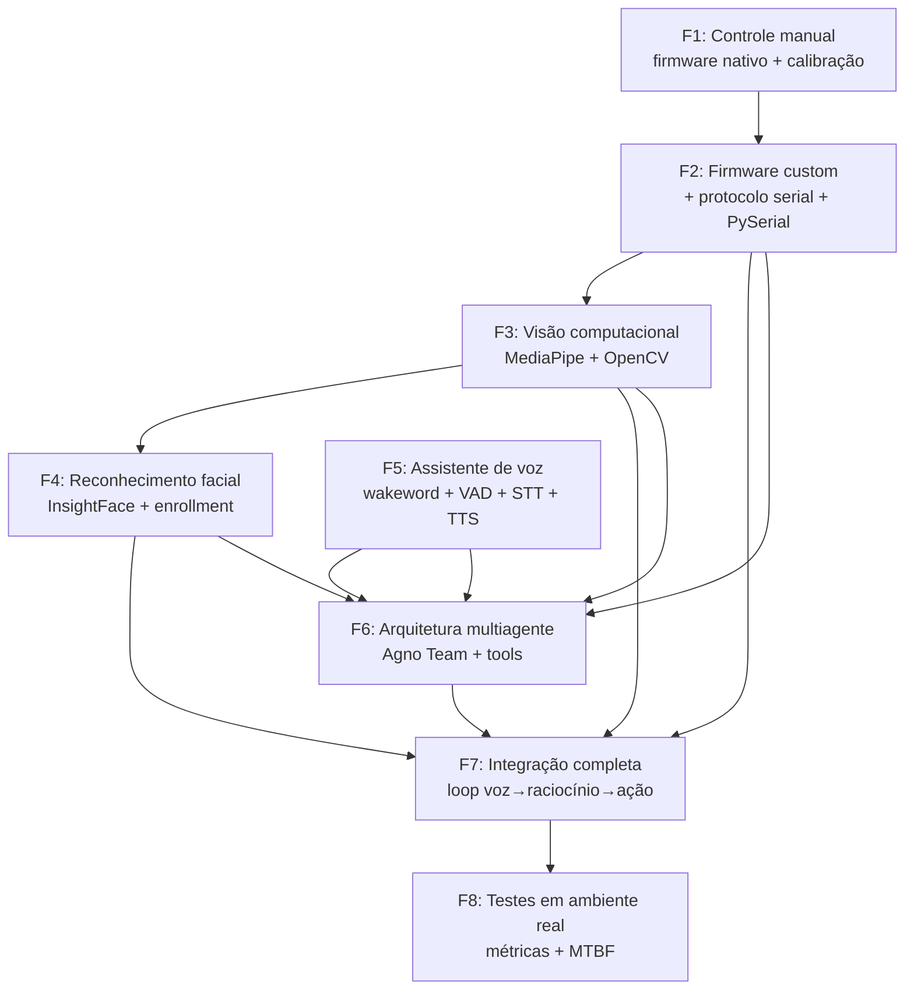

## 3. Roadmap de Desenvolvimento

Esta seção detalha o roadmap de implementação do Projeto Thoth em **8 fases sequenciais com sobreposições controladas**, partindo da validação do hardware HACKberry (uma MÃO protética de 3 servos, sem atuador de pulso/braço) até a operação assistiva em ambiente real com a camada agêntica de IA (Agno + Claude/Groq/Cerebras). Cada fase é projetada para **1 a 2 estudantes** trabalhando em regime de iniciação científica (~12–16h/semana por pessoa).

O princípio condutor é **incrementalidade verificável**: nenhuma fase agêntica avança sem que o substrato de controle de baixo nível tenha sido validado com métricas. O marco crítico é a **Fase 2** (firmware custom + protocolo serial), porque o firmware nativo da HACKberry é autônomo (`sensor → map → servo.write` em loop) e **não expõe API serial de comandos** — portanto, sem a F2, nenhuma orquestração de IA consegue atuar na mão.

> **Restrição de hardware reiterada em todo o roadmap:** comandos do tipo "levante o braço" ou "reoriente a mão para mirar em mim" são **fisicamente inviáveis** — não há motor no pulso (ajuste manual em incrementos de 90°) nem no antebraço/ombro. O roadmap trata esses casos como *gaps de hardware* a serem sinalizados ao usuário pela camada agêntica, não como funcionalidades a implementar.

### Visão geral das dependências



---

### Fase 1 — Controle manual do braço (validação de hardware)

**Objetivo.** Validar fisicamente a MÃO HACKberry usando **exclusivamente o firmware nativo** (`mission-arm/HACKberry`) e os controles de hardware originais (botões on-board e/ou sensor de pressão/EMG). Nenhuma linha de firmware é escrita nesta fase: o propósito é garantir que os 3 servos, a placa Mk2, a alimentação e a calibração estão íntegros **antes** de tocar no software de controle. É a fase de "conhecer o paciente".

**Pré-requisitos.**
- Mão HACKberry montada (impressa em 3D) com placa Mk2 V3/V4 (Arduino Nano ATmega328P-AU).
- Cabo micro-USB, Arduino IDE 2.x, biblioteca `<Servo.h>`.
- Bateria Li-ion 7,2V 2200mAh carregada e conversor DCDC verificados.
- Acesso ao repositório `mission-arm/HACKberry` (sketches `HACKberry_program/Hackberryv3.0.ino` e `Extra/HACKBERRY V3.1_Mk2_EMG_180412.ino`).

**Tarefas detalhadas.**
- [ ] Inspecionar a fiação dos 3 servos contra os FATOS de hardware do projeto: indicador → **D5**, três dedos (médio/anelar/mínimo) → **D6**, polegar → **D9**; sensor → **A1 (SENS)**.
- [ ] **ATENÇÃO — divergência de pinagem:** o sketch `Hackberryv3.0.ino` do repositório usa Index=D3, Other=D5, Thumb=D6, que **diverge** dos FATOS deste projeto (D5/D6/D9). Antes de gravar, **abrir o `.ino` e conferir os `#define`/`attach()` contra a sua placa física** — gravar pinagem errada faz o servo errado se mover. Documentar a pinagem real observada.
- [ ] Gravar o firmware nativo (versão sensor de pressão para começar; versão EMG depois).
- [ ] Configurar a variável `isRight` (0=direita, 1=esquerda) conforme a mão montada.
- [ ] Executar a **calibração nativa**: segurar o botão de calibração (A6) por ~4s repetindo o ciclo "fechar/relaxar" até os limites `outThumbMax`/`outIndexMax`/`outOtherMax` ficarem estáveis.
- [ ] Testar os 4 botões on-board: calibração (A6), contração do polegar (A0), movimento dos três dedos (D10), botão extra (A7).
- [ ] Acionar preensão completa (fechar) e abertura completa observando se algum servo trava (*stall*) ou treme (*jitter*).
- [ ] Medir corrente em repouso e em preensão; confirmar que o PPTC de 500mA protege Index/Middle e **registrar que o polegar (D9) NÃO tem PPTC** (servo mais vulnerável).
- [ ] Registrar amplitude angular real de cada servo (será reusada como *clamp* na F2).
- [ ] Testar o destacamento da mão do pulso (botão de fixação) e os 3 ajustes manuais de 90° (pronação/supinação, flexão/extensão, desvio radial/ulnar).

**Entregáveis.**
- Planilha de pinagem real verificada (D5/D6/D9 vs. D3/D5/D6 do repo) com foto da placa.
- Tabela de limites angulares calibrados por servo (`outThumbMax`, `outThumbMin`, `outIndexMax`, `outIndexMin`, `outOtherMax`, `outOtherMin`).
- Vídeo curto demonstrando preensão e abertura sob controle nativo (sensor/botões).
- Relatório de medições elétricas (corrente repouso/preensão/stall por servo, tensão de bateria).

**Critérios de aceite (mensuráveis).**
- Os 3 servos respondem a comando (sensor/botão) com 100% de repetibilidade em 10 ciclos consecutivos.
- Preensão completa atingida em ≤ 1,5s sem *stall* sustentado.
- Calibração nativa concluída e limites estáveis (variação < 3° entre 3 calibrações).
- Pinagem física documentada e conferida (zero divergência não resolvida).

**Riscos e mitigação.**

| Risco | Probabilidade | Mitigação |
|---|---|---|
| Pinagem do repo ≠ pinagem física → servo errado se move | Alta | Conferência obrigatória de `#define`/`attach()` antes de gravar; teste servo-a-servo isolado |
| Stall do polegar (sem PPTC) queima servo | Média | Nunca comandar contra batente; limitar tempo de teste; fonte com limite de corrente |
| Bateria/DCDC fora de spec | Baixa | Medir tensão antes de energizar servos; nunca alimentar servos pelo 5V do Nano |
| Mão impressa com folga mecânica | Média | Inspeção visual de juntas; reaperto de parafusos antes dos testes |

**Ferramentas/bibliotecas.** Arduino IDE 2.x, `<Servo.h>`, multímetro, sketches `Hackberryv3.0.ino` / `HACKBERRY V3.1_Mk2_EMG_180412.ino`.

**Estimativa de esforço.** **1–2 semanas** (1–2 estudantes). Maior parte do tempo em montagem mecânica, conferência de pinagem e calibração.

---

### Fase 2 — Integração Arduino + Python (MARCO CRÍTICO: firmware custom + protocolo serial)

**Objetivo.** **Escrever o firmware custom** que substitui o loop autônomo nativo por um servo de comandos seriais (gestos nomeados + ângulos por servo), preservando rigorosamente os limites nativos de segurança, e construir o **wrapper Python (PySerial)** que será a fronteira entre a camada agêntica e o hardware. Esta é a fase que **habilita todo o controle pela IA** — sem ela, o resto do projeto é impossível. Inclui obrigatoriamente **teste de latência** e **watchdog/heartbeat**.

**Pré-requisitos.**
- F1 concluída (hardware validado, limites calibrados, pinagem confirmada).
- Python 3.11+; ambiente virtual; `pyserial` e `pyserial-asyncio` instalados.

**Tarefas detalhadas — firmware custom (Arduino C++).**
- [ ] Definir o **protocolo serial ASCII por linha** (terminador `\n`, 115200 8N1), com ACK/ERR por comando. Esquema:
  ```
  Host→MCU:
    G:<thumb>,<index>,<other>\n   # ângulos absolutos em graus (pré-clamp)
    N:<nome>\n                    # gesto nomeado: OPEN|CLOSE|POINT|PINCH|GRIP
    H\n                           # heartbeat (mantém o watchdog vivo)
    S\n                           # STOP/e-stop lógico (idle seguro = OPEN)
    Q\n                           # query de status
  MCU→Host:
    A:G\n / A:N:CLOSE\n           # ACK do último comando aceito
    E:<code>:<msg>\n             # erro (E:1:range, E:2:parse, E:3:wdt)
    S:<th>,<idx>,<ot>,<mode>,<mv>\n  # status (ângulos atuais, modo, mV bateria opcional)
    R\n                          # banner de boot/ready
  ```
- [ ] Implementar **clamp por servo**: todo alvo passa por `constrain(angle, outXMin, outXMax)` usando os limites calibrados na F1. Gestos nomeados resolvem internamente para esses limites (CLOSE = max-flexão clampada).
- [ ] Implementar **slew-rate (limitação de taxa)**: a cada *tick* (~20ms via `millis()`, **sem `delay()`**), mover `current += clamp(target-current, -STEP, +STEP)` com `STEP` ~2–4°/tick. Usar `STEP` **menor para o polegar** (D9, sem PPTC).
- [ ] Implementar **watchdog/heartbeat**: se `millis()-lastHeartbeat > WDT_MS` (~1000ms), entrar em fail-safe = **abrir a mão** (libera objeto) e marcar `mode=SAFE`. Somar **WDT de hardware** (`<avr/wdt.h>`: `wdt_enable(WDTO_2S)` + `wdt_reset()` no loop) para travamento de software.
- [ ] Implementar **detach/idle**: após atingir o alvo e ficar parado X ms, `servo.detach()` para cortar PWM (elimina *jitter* e corrente de holding); re-`attach()` reescrevendo a posição atual antes de mover (evita salto).
- [ ] Implementar **anti-stall por timeout**: se o alvo não é alcançável em T ms, detach + `E` (provável stall). Timeout mais curto para o polegar.
- [ ] Implementar **flag de modo** alternável (`M:HOST` / `M:EMG`), default = EMG (degrada para comportamento nativo se o PC sumir).
- [ ] Implementar **e-stop físico** num pino de expansão (A2 ou A3), lido a cada loop com prioridade máxima → detach imediato dos 3 servos, ignorando serial.
- [ ] Parser robusto: ignorar linhas vazias; rejeitar frame sem terminador após N bytes (anti-overflow).

**Tarefas detalhadas — wrapper Python (PySerial).**
- [ ] Implementar classe `HandLink` baseada em **`pyserial-asyncio`** (coroutine de leitura não-bloqueante, casa com o event loop do Agno na F6):
  ```python
  class HandLink:
      async def connect(self): ...      # abre serial; aguarda banner "R"; inicia reader_task
      async def send(self, cmd: str): ...# escreve cmd+"\n"; aguarda future do ACK (timeout ~0.3s)
      async def _reader(self): ...       # async for line: roteia ACK/ERR/STATUS -> futures/callbacks
      async def _heartbeat(self): ...    # while open: send("H"); await sleep(0.3)
      # on SerialException: cancela tasks; backoff de reconexão (0.5->5s); re-handshake
  ```
- [ ] Fila serializada (1 comando em voo) para preservar a ordem dos ACKs.
- [ ] Timeout por comando (nunca travar o agente); nunca reenviar gesto perigoso sem re-confirmar após reconexão.
- [ ] Métodos de alto nível: `open()`, `close()`, `point()`, `pinch()`, `grip()`, `set_angles(th,idx,ot)`, `emergency_stop()`.

**Tarefas detalhadas — teste de latência e watchdog.**
- [ ] Script de *benchmark*: enviar 1000 comandos `G:` e medir o tempo `send → ACK` (RTT). Reportar p50/p95/p99.
- [ ] Teste de watchdog: parar o heartbeat e cronometrar até a mão entrar em fail-safe (deve abrir em ~1s).
- [ ] Teste de e-stop físico: acionar o pino e medir o tempo até detach dos servos.
- [ ] Teste de reconexão: desconectar/reconectar o USB e verificar re-handshake automático.

**Entregáveis.**
- Sketch `thoth_hand_firmware.ino` (firmware custom) versionado no repositório.
- Módulo `hand_link.py` (wrapper PySerial assíncrono) com testes.
- Documento do protocolo serial (tabela de comandos/respostas/erros).
- Relatório de latência (p50/p95/p99 do RTT comando→ACK) e de tempos de fail-safe.

**Critérios de aceite (mensuráveis).**
- 100% dos comandos válidos retornam `A:` (ACK); comandos fora de faixa retornam `E:1:range` e **nunca** escrevem fora dos limites calibrados.
- RTT comando→ACK **p95 ≤ 50ms** no benchmark de 1000 comandos.
- Watchdog: mão abre (fail-safe) em **≤ 1,2s** após cessar o heartbeat (3/3 testes).
- E-stop físico: detach dos 3 servos em **≤ 100ms** após acionamento.
- Reconexão USB automática com re-handshake em ≤ 5s, sem comando perigoso espúrio.
- Zero *jitter* observável após detach em repouso.

**Riscos e mitigação.**

| Risco | Probabilidade | Mitigação |
|---|---|---|
| Dessincronização serial corrompe comandos | Média | Protocolo ASCII re-sincroniza no `\n`; checksum opcional `*XOR` se corrupção USB persistir |
| Slew-rate mal ajustado causa stall do polegar | Média | `STEP` e timeout específicos para D9; anti-stall por timeout |
| PySerial síncrono trava o event loop na F6 | Alta (se não usar async) | Usar `pyserial-asyncio` desde já |
| Firmware custom remove o fail-safe fisiológico do usuário | Alta (segurança) | Default = modo EMG; modo HOST só sob comando; watchdog abre a mão |

**Ferramentas/bibliotecas.** Arduino IDE, `<Servo.h>`, `<avr/wdt.h>`, Python 3.11+, `pyserial`, `pyserial-asyncio`, `pytest`, `pytest-asyncio`.

**Estimativa de esforço.** **3–4 semanas** (1–2 estudantes). É a fase mais densa em engenharia de baixo nível; reservar tempo para depuração de timing e segurança.

---

### Fase 3 — Visão computacional

**Objetivo.** Construir o pipeline de percepção visual em tempo real: captura de webcam, detecção/landmarks de mãos e pose, e **reconhecimento de gestos**. Esta fase **independe do braço** (a câmera é um sensor separado) e pode rodar em paralelo com a F2 depois que o wrapper PySerial existir, mas formalmente depende da F2 apenas para a integração final.

**Pré-requisitos.**
- Webcam funcional; Python 3.11+.
- F2 concluída (para testes integrados de "ver gesto → reproduzir na mão").

**Tarefas detalhadas.**
- [ ] Captura com OpenCV usando `cv2.VideoCapture(0, cv2.CAP_DSHOW)` (Windows reduz latência de abertura), `CAP_PROP_BUFFERSIZE=1`, resolução 640×480, 30 FPS.
- [ ] Implementar **thread dedicada de captura** (padrão *latest-frame*): a thread mantém só o último frame; o loop de inferência consome esse frame (evita atraso acumulado de `cap.read()` bloqueante).
- [ ] Integrar **MediaPipe Tasks** (`mediapipe.tasks.python.vision`) em `RunningMode.LIVE_STREAM` com callback assíncrono:
  - `HandLandmarker` (`hand_landmarker.task`, 21 pts/mão).
  - `PoseLandmarker` (`pose_landmarker_lite.task`, 33 pts) — para gestos corporais (ex.: alguém acenando).
  - `GestureRecognizer` (`gesture_recognizer.task`) — classifica 7 gestos built-in: `Closed_Fist, Open_Palm, Pointing_Up, Thumb_Down, Thumb_Up, Victory, ILoveYou`.
- [ ] Garantir **timestamp monotônico crescente** nas chamadas `recognize_async` (requisito do LIVE_STREAM).
- [ ] Não rodar todos os modelos em série no mesmo frame a 30 FPS na CPU: processar detecção a cada N frames ou em threads separadas (cadência reduzida).
- [ ] Mapear gestos reconhecidos → comandos da mão via `HandLink` (ex.: `Closed_Fist` → `close()`, `Open_Palm` → `open()`, `Pointing_Up` → `point()`).

```python
from mediapipe.tasks import python
from mediapipe.tasks.python import vision
import mediapipe as mp

def on_result(result, output_image, timestamp_ms):
    if result.gestures:
        print(result.gestures[0][0].category_name)

opts = vision.GestureRecognizerOptions(
    base_options=python.BaseOptions(model_asset_path="gesture_recognizer.task"),
    running_mode=vision.RunningMode.LIVE_STREAM,
    result_callback=on_result,
)
recognizer = vision.GestureRecognizer.create_from_options(opts)
# no loop: mp_img = mp.Image(image_format=mp.ImageFormat.SRGB, data=rgb_frame)
#          recognizer.recognize_async(mp_img, timestamp_ms)  # timestamp monotônico
```

**Entregáveis.**
- Módulo `vision/capture.py` (thread de captura latest-frame).
- Módulo `vision/gestures.py` (GestureRecognizer + mapeamento para `HandLink`).
- Demo "espelho": gesto do usuário reproduzido pela mão HACKberry.
- Relatório de FPS e latência de inferência por modelo.

**Critérios de aceite (mensuráveis).**
- Captura sustenta ≥ 25 FPS reais a 640×480.
- GestureRecognizer classifica os 7 gestos built-in com latência de inferência p95 ≤ 80ms na máquina-alvo.
- Demo espelho: gesto → ação da mão em ≤ 300ms ponta-a-ponta (excluindo o tempo mecânico do servo).

**Riscos e mitigação.**

| Risco | Probabilidade | Mitigação |
|---|---|---|
| CPU insuficiente para múltiplos modelos a 30 FPS | Alta | Cadência reduzida (a cada N frames); threads separadas; resolução baixa |
| Timestamp não-monotônico quebra LIVE_STREAM | Média | Usar relógio monotônico único; testes unitários |
| Variação de iluminação degrada landmarks | Média | Calibração de exposição da câmera; testes em condições reais |

**Ferramentas/bibliotecas.** `opencv-python`, `mediapipe` (Tasks API), modelos `.task` de ai.google.dev.

**Estimativa de esforço.** **2–3 semanas** (1–2 estudantes).

---

### Fase 4 — Reconhecimento facial (enrollment de rostos conhecidos)

**Objetivo.** Adicionar **identificação de pessoas** ao pipeline de visão, com *enrollment* de rostos conhecidos (ex.: o professor de Equações Diferenciais, colegas de laboratório, o próprio usuário). Habilita o comando "quem está na sala?". **Independe do braço.**

**Pré-requisitos.**
- F3 concluída (pipeline de captura).
- 1–3 fotos por pessoa a cadastrar.

**Tarefas detalhadas.**
- [ ] Adotar **InsightFace** com o pacote `buffalo_l` (detecção + embedding ArcFace 512-D) sobre `onnxruntime` (rápido em CPU; `onnxruntime-gpu` se houver CUDA).
- [ ] Implementar **enrollment**: extrair embedding 512-D de 1–3 fotos por pessoa e gravar galeria `{nome: embedding}` (ex.: serializar em `gallery.npz`). Cadastrar nominalmente, por exemplo, "Prof. de Equações Diferenciais", "Maria (colega de lab)", o usuário.
- [ ] Implementar **reconhecimento**: para cada face detectada, calcular *cosine similarity* contra a galeria; classificar como conhecido se `sim ≥ threshold`, senão "desconhecido".
- [ ] **Calibrar o threshold empiricamente** (~0,35–0,5; depende de câmera/iluminação — não fixar cego) com um pequeno conjunto de validação.
- [ ] Expor função `who_is_present() -> list[str]` para a camada agêntica (F6).

```python
from insightface.app import FaceAnalysis
import numpy as np

app = FaceAnalysis(name="buffalo_l")
app.prepare(ctx_id=-1)  # -1 = CPU; 0 = GPU

def cosine(a, b):
    return float(np.dot(a, b) / (np.linalg.norm(a) * np.linalg.norm(b)))

def identify(bgr_frame, gallery, threshold=0.4):
    nomes = []
    for face in app.get(bgr_frame):          # face.embedding (512-D), face.bbox
        best_name, best = "desconhecido", -1.0
        for nome, emb in gallery.items():
            s = cosine(face.embedding, emb)
            if s > best:
                best_name, best = nome, s
        nomes.append(best_name if best >= threshold else "desconhecido")
    return nomes
```

**Entregáveis.**
- Módulo `vision/faces.py` (enrollment + reconhecimento).
- Galeria serializada `gallery.npz` com rostos conhecidos cadastrados.
- Relatório de calibração de threshold com matriz de confusão (conhecidos vs. desconhecidos).

**Critérios de aceite (mensuráveis).**
- Enrollment funcional: cadastrar uma pessoa nova em < 1 min a partir de fotos.
- Taxa de acerto de reconhecimento (*true accept* para conhecidos) ≥ 90% e *false accept* de desconhecidos ≤ 5% no conjunto de validação, com o threshold calibrado.
- `who_is_present()` retorna a lista correta de nomes em cena ≥ 90% das vezes em condições de iluminação normais.

**Riscos e mitigação.**

| Risco | Probabilidade | Mitigação |
|---|---|---|
| Threshold mal calibrado → falsos positivos/negativos | Alta | Calibração empírica com conjunto de validação; reportar matriz de confusão |
| Build do `onnxruntime`/InsightFace no Windows | Média | Usar wheels pré-compilados; documentar versão de Python suportada |
| Privacidade/LGPD ao armazenar embeddings | Média | Consentimento dos cadastrados; galeria local; não compartilhar imagens |
| Rostos não-frontais reduzem acurácia | Média | Cadastrar múltiplas fotos por pessoa; ArcFace é robusto, mas calibrar |

**Ferramentas/bibliotecas.** `insightface` (`buffalo_l`), `onnxruntime` (ou `onnxruntime-gpu`), `numpy`.

**Estimativa de esforço.** **2 semanas** (1–2 estudantes).

---

### Fase 5 — Assistente de voz (wake word + VAD + STT + TTS)

**Objetivo.** Construir a interface de voz completa: **detecção de palavra de ativação (wake word)** → **segmentação por VAD** → **transcrição (STT)** via Groq Whisper → resposta falada (**TTS**). Pode rodar em paralelo às fases de visão; depende da F6 apenas para o roteamento agêntico.

**Pré-requisitos.**
- Microfone funcional; Python 3.11+.
- Chave `GROQ_API_KEY` (para STT na nuvem). `$env:GROQ_API_KEY="gsk_..."` no PowerShell.

**Tarefas detalhadas.**
- [ ] **Wake word** com **openWakeWord** (`pip install openwakeword`, Apache-2.0, gratuito, sem chave) — escolha default para projeto acadêmico/open-source. Treinar/usar palavra custom (ex.: "Thoth"). *(Porcupine/pvporcupine só se for necessário footprint mínimo embarcado + suporte comercial; exige AccessKey.)*
- [ ] **VAD** com **Silero VAD** (`pip install silero-vad`, rede neural, 16 kHz): após a wake word, acumular frames enquanto há fala e fechar o segmento após ~300–700ms de silêncio (evita enviar silêncio à nuvem; corta custo/latência).
- [ ] **STT** com **Groq Whisper**: enviar **só o segmento** segmentado. Usar `whisper-large-v3` com `language="pt"` para PT-BR (melhor acurácia) — ou `whisper-large-v3-turbo` para custo/velocidade (sem tradução).
  ```python
  from groq import Groq
  client = Groq()  # lê GROQ_API_KEY do ambiente
  with open("segmento.wav", "rb") as f:
      t = client.audio.transcriptions.create(
          file=f,
          model="whisper-large-v3",   # PT-BR; ou whisper-large-v3-turbo p/ custo
          language="pt",
          response_format="verbose_json",
      )
  print(t.text)
  ```
- [ ] Fallback **STT offline** com **faster-whisper** (`base`/`small` em CPU) para quando não houver internet.
- [ ] **TTS** para resposta falada. *(Selecionar o motor TTS PT-BR na implementação — verificar disponibilidade/licença do motor escolhido na doc; opções comuns incluem motores locais e serviços de nuvem. Documentar a escolha.)*
- [ ] Orquestrar o fluxo: openWakeWord (ativa) → Silero VAD (segmenta) → Groq turbo (transcreve) → texto entra na F6 → resposta → TTS.

**Entregáveis.**
- Módulo `voice/wakeword.py`, `voice/vad.py`, `voice/stt.py`, `voice/tts.py`.
- Demo: dizer "Thoth, ..." e ver a transcrição correta + resposta falada.
- Relatório de latência por etapa (wake→VAD→STT→texto).

**Critérios de aceite (mensuráveis).**
- Wake word: taxa de detecção ≥ 90% e falsos disparos ≤ 1/hora em ambiente de laboratório.
- VAD segmenta a fala corretamente (sem cortar palavras) em ≥ 90% das frases de teste.
- STT (Groq `whisper-large-v3`, PT-BR): WER aceitável para comandos curtos; transcrição correta de comandos do projeto ("aperte minha mão", "quem está na sala") ≥ 90%.
- Latência wake→texto p95 ≤ 2,5s (incluindo a chamada Groq).

**Riscos e mitigação.**

| Risco | Probabilidade | Mitigação |
|---|---|---|
| Rate limit Groq (free: ~30 RPM, 6k TPM) | Média | System prompts curtos; **prompt caching** (não conta para rate limit); VAD reduz chamadas |
| Sem internet → STT cloud indisponível | Média | Fallback faster-whisper local |
| Ruído ambiente degrada VAD/STT | Média | Silero VAD (neural, robusto a ruído) > webrtcvad; testes em condição real |
| Wake word custom com baixa acurácia | Média | Treinar com amostras suficientes; ajustar threshold |

**Ferramentas/bibliotecas.** `openwakeword`, `silero-vad`, `groq` (Whisper), `faster-whisper` (fallback), motor TTS PT-BR a definir.

**Estimativa de esforço.** **3 semanas** (1–2 estudantes).

---

### Fase 6 — Arquitetura multiagente (Agno)

**Objetivo.** Implementar a **camada de orquestração agêntica** com **Agno (pacote `agno`, v2.x)**: um time (`Team`) de agentes especializados — percepção, planejamento e atuação — coordenado por um líder, com **tools customizadas** que expõem visão, voz e a mão HACKberry. Define a "inteligência" do robô.

**Pré-requisitos.**
- F2 (`HandLink`), F3 (visão), F4 (faces), F5 (voz) com APIs estáveis para serem expostas como tools.
- Chaves: `ANTHROPIC_API_KEY`, `GROQ_API_KEY`, `CEREBRAS_API_KEY` conforme os provedores usados.
- `pip install agno anthropic groq cerebras-cloud-sdk`.

**Tarefas detalhadas.**
- [ ] Definir os **agentes especializados** e o modelo de cada papel:
  - **Líder/Planejador** (raciocínio, tool-use coordenado): `Claude(id="claude-opus-4-8")` com **adaptive thinking** + effort `high`. (Confirmado via skill oficial `claude-api`: usar a string exata `claude-opus-4-8`, sem sufixo de data; `budget_tokens`/`temperature`/`top_p`/`top_k` retornam 400 nesse modelo — não enviar.)
  - **Agente de percepção** (respostas rápidas / classificação): provedor de baixa latência — Cerebras (`gpt-oss-120b`) ou Groq (`llama-3.1-8b-instant` / `llama-4-scout`). Verifique IDs ativos na doc Cerebras antes de fixar (catálogo muda; `qwen-3-32b`/`llama-3.3-70b` com deprecação anunciada).
  - **Agente de atuação** (traduz intenção → comandos da mão).
- [ ] Definir o `Agent` líder em Agno v2:
  ```python
  from agno.agent import Agent
  from agno.models.anthropic import Claude

  planner = Agent(
      model=Claude(id="claude-opus-4-8", cache_system_prompt=True),
      instructions=[
          "Você comanda uma MÃO protética HACKberry (3 servos: polegar, indicador, três-dedos).",
          "A mão NÃO tem pulso/braço motorizado: não pode se reorientar nem levantar.",
          "Use a tool de gesto para apertar a mão, apontar ou pinçar; sinalize gaps de hardware.",
      ],
      markdown=True,
  )
  # Agno usa max_tokens default 8192 — eleve para >=16000 em tarefas de raciocínio.
  ```
- [ ] Implementar **tools customizadas** (qualquer função Python vira tool; `@tool` permite hooks). Promover ações sensíveis a tools dedicadas (gating/auditoria):
  ```python
  from agno.tools import tool

  @tool
  def shake_hand() -> str:
      """Fecha a preensão da mão protética para 'apertar a mão' do usuário.
      Use quando o usuário pedir para apertar a mão ou cumprimentar."""
      ...  # chama HandLink.close() (async via ponte)
      return "preensão executada"

  @tool
  def point_finger() -> str:
      """Estende o indicador e flexiona os outros dedos (gesto de apontar).
      ATENÇÃO: a mão não consegue se reorientar para mirar uma pessoa (sem braço)."""
      ...

  @tool
  def who_is_present() -> str:
      """Retorna quem está na sala via reconhecimento facial. Independe da mão."""
      ...
  ```
- [ ] Mapear **comandos do usuário → hardware real**, tratando os gaps:
  - "aperte minha mão" → `shake_hand()` (fechar preensão) — **viável**.
  - "aponte para mim" → `point_finger()` (gesto viável); mas a tool/instrução deve **avisar** que a mão não reorienta para mirar.
  - "levante o braço" → **NÃO viável** sem atuador de ombro/cotovelo → a IA responde sinalizando o **gap de hardware (trabalho futuro)**.
  - "quem está na sala?" → `who_is_present()` (visão; independe da mão).
- [ ] Coordenar com **`Team`** (Agno v2):
  ```python
  from agno.team import Team, TeamMode
  team = Team(
      name="Thoth Ops",
      mode=TeamMode.coordinate,   # v2 expõe route/coordinate/broadcast;
                                  # "collaborate" era da 1.x -> equivalente é coordinate
      members=[perception_agent, planner, actuator_agent],
  )
  ```
  Observação: `coordinate` é sequencial (mais latência); use o provedor rápido (Cerebras/Groq) nos sub-agentes do loop crítico e Claude no planejamento.
- [ ] Usar **`session_state`** compartilhado (acessível via `run_context.session_state` nas tools; persistido com `db`). *Verificar o caminho de import de `RunContext` na doc (provavelmente `from agno.run.context import RunContext`).*
- [ ] Usar **async** (`await agent.arun(...)` / `await team.arun(...)`) para casar com o event loop do `HandLink` (PySerial async).
- [ ] **Não tratar o LLM como hard-real-time**: Agno não garante latência determinística. Manter o controle de baixo nível (clamp, slew, watchdog) **fora** do agente, no firmware da F2.

**Entregáveis.**
- Módulo `agents/` com definição do `Team`, agentes e tools.
- Mapa documentado comando→tool→hardware (incluindo os gaps sinalizados).
- Demo de orquestração textual: comando digitado → agente escolhe tool → mão atua.

**Critérios de aceite (mensuráveis).**
- Para cada comando do projeto, o agente seleciona a tool correta ≥ 95% das vezes (avaliação em conjunto de prompts).
- Gaps de hardware ("levante o braço") são sempre sinalizados como inviáveis (0 tentativas de atuar o que não existe).
- `session_state` compartilhado entre líder e membros funciona (estado lido nas tools).
- Loop crítico (percepção/atuação) usa provedor de baixa latência; planejamento usa Claude.

**Riscos e mitigação.**

| Risco | Probabilidade | Mitigação |
|---|---|---|
| API Agno v2 ≠ docs 1.x (memory/storage/collaborate) | Alta | Usar `db=` + `memory_manager`/`enable_agentic_memory`; `TeamMode.coordinate`; checar referência v2 |
| Latência do LLM no loop crítico | Alta | Cerebras/Groq nos sub-agentes rápidos; Claude só no planejamento; `coordinate` é sequencial |
| Modelo aciona tool perigosa indevidamente | Média | Gating em tools dedicadas; descrição prescritiva de *quando* usar; e-stop no firmware |
| IDs de modelo desatualizados (Cerebras/Groq) | Média | Verificar IDs ativos na doc antes de fixar; tratar deprecações anunciadas |

**Ferramentas/bibliotecas.** `agno` (v2.x), `anthropic`, `groq`, `cerebras-cloud-sdk`. Modelos: `claude-opus-4-8` (planejamento), `gpt-oss-120b`/`llama-3.1-8b-instant`/`llama-4-scout` (loop rápido — confirmar IDs na doc).

**Estimativa de esforço.** **3–4 semanas** (1–2 estudantes).

---

### Fase 7 — Integração completa

**Objetivo.** Unir todas as camadas no **loop ponta-a-ponta**: voz → raciocínio agêntico → percepção visual → atuação na mão, com estado compartilhado e tratamento de erros. É a montagem do sistema Thoth como um todo coerente.

**Pré-requisitos.** F2–F6 concluídas e individualmente validadas.

**Tarefas detalhadas.**
- [ ] Construir o **orquestrador principal** (`thoth/main.py`) que inicializa: `HandLink` (serial), pipelines de visão (F3/F4), pipeline de voz (F5) e o `Team` Agno (F6) sob um único event loop `asyncio`.
- [ ] Implementar o fluxo: wake word → STT → texto entra no `Team` → agente consulta visão/faces e aciona tools da mão → resposta TTS.
- [ ] Compartilhar `session_state` entre módulos (quem está na sala, último gesto, modo da mão).
- [ ] **Cenários canônicos de integração:**
  - "Thoth, aperte minha mão" → `shake_hand()` → mão fecha → "Pronto, apertei sua mão."
  - "Thoth, quem está na sala?" → `who_is_present()` → "Vejo o Prof. de Equações Diferenciais e a Maria."
  - "Thoth, aponte para mim" → `point_finger()` → gesto + aviso "Aponto, mas não consigo me reorientar para mirar — não tenho braço."
  - "Thoth, levante o braço" → resposta de gap: "Não consigo: não há motor no pulso nem no braço."
- [ ] Tratamento de erros ponta-a-ponta: STT vazio, tool falha, serial desconectado (re-handshake), e-stop.
- [ ] Logging estruturado de todo o loop para a F8 (timestamps por etapa).

**Entregáveis.**
- Aplicação integrada `thoth/main.py` executável.
- Roteiro de demonstração com os 4 cenários canônicos.
- Logs estruturados de cada loop (para métricas na F8).

**Critérios de aceite (mensuráveis).**
- Os 4 cenários canônicos executam fim-a-fim sem intervenção manual.
- Falhas em qualquer etapa são tratadas sem travar o sistema (degradação graciosa).
- Estado compartilhado consistente entre voz, visão e atuação.

**Riscos e mitigação.**

| Risco | Probabilidade | Mitigação |
|---|---|---|
| Conflitos de event loop (serial async + visão em thread + voz) | Alta | Arquitetura assíncrona única; visão em thread com fila para o loop |
| Latência acumulada inaceitável | Média | Medir por etapa; provedor rápido no loop crítico; cache de system prompt |
| Falha de um módulo derruba o todo | Média | Isolamento por try/except; degradação graciosa; watchdog do firmware |

**Ferramentas/bibliotecas.** Todas as anteriores + `asyncio`, logging estruturado.

**Estimativa de esforço.** **2–3 semanas** (1–2 estudantes).

---

### Fase 8 — Testes em ambiente real

**Objetivo.** Validar o sistema Thoth integrado em **condições reais de uso assistivo**, com um **protocolo de teste quantitativo** e métricas de confiabilidade. Fecha o ciclo de qualidade "laboratório de pesquisa".

**Pré-requisitos.** F7 concluída (sistema integrado com logging).

**Tarefas detalhadas — protocolo de teste com métricas.**
- [ ] Definir um **protocolo de teste reprodutível**: roteiro de N execuções por cenário, condições controladas (iluminação, ruído, distância da câmera/mic) e usuários de teste (incluindo, se possível, voluntários do público-alvo assistivo).
- [ ] Medir as métricas principais:

  | Métrica | Definição | Meta |
  |---|---|---|
  | **Taxa de acerto de reconhecimento** | % de identificações faciais corretas (conhecido/desconhecido) | ≥ 90% |
  | **Taxa de acerto de gestos** | % de gestos classificados corretamente | ≥ 90% |
  | **Latência fim-a-fim voz→ação** | tempo de fim-da-fala até início do movimento da mão | p95 ≤ 4s |
  | **Taxa de comandos executados com segurança** | % de comandos cujo resultado respeitou clamp/limites e nunca causou stall ou ação inviável | 100% |
  | **MTBF** (Mean Time Between Failures) | tempo médio de operação contínua entre falhas (travamento, desconexão, fail-safe não-intencional) | a estabelecer como baseline; meta ≥ 2h |
  | **Taxa de gaps corretamente sinalizados** | % de comandos inviáveis ("levante o braço") corretamente recusados com explicação | 100% |

- [ ] Executar **sessões de estresse**: operação contínua de ≥ 2h para medir MTBF; ciclos repetidos de preensão para verificar aquecimento do regulador e dos servos (especialmente o polegar sem PPTC).
- [ ] Registrar **falsos disparos** da wake word ao longo de horas.
- [ ] Coletar **feedback qualitativo** dos usuários (usabilidade, naturalidade da fala, conforto).
- [ ] Consolidar resultados, identificar regressões e abrir backlog de melhorias.

**Entregáveis.**
- Documento de **protocolo de teste** (roteiro, condições, instrumentação).
- **Relatório de métricas** com todas as medições (acerto, latência, segurança, MTBF) e gráficos.
- Backlog priorizado de correções/melhorias.
- (Opcional) artigo/pôster de iniciação científica com os resultados.

**Critérios de aceite (mensuráveis).**
- Todas as métricas-alvo da tabela atingidas ou explicitamente justificadas quando não.
- **Taxa de comandos executados com segurança = 100%** (nenhum comando violou limites, causou stall sustentado ou tentou ação fisicamente inviável).
- MTBF medido e reportado com baseline; sessão de 2h contínua concluída.
- Relatório de métricas revisado e versionado.

**Riscos e mitigação.**

| Risco | Probabilidade | Mitigação |
|---|---|---|
| Aquecimento do servo do polegar (sem PPTC) em uso contínuo | Média | Detach em repouso; monitorar temperatura; pausas; reportar tensão de bateria |
| Variabilidade real degrada métricas vs. laboratório | Alta | Testar em condições reais cedo; recalibrar threshold facial e VAD |
| MTBF baixo por desconexões USB | Média | Backoff de reconexão robusto (F2); cabo de qualidade; fixação mecânica do conector |
| Viés do conjunto de teste (poucos usuários) | Média | Diversificar voluntários; documentar limitações |

**Ferramentas/bibliotecas.** Sistema Thoth integrado, scripts de coleta de métricas, planilhas/gráficos (`pandas`, `matplotlib`).

**Estimativa de esforço.** **2–3 semanas** (1–2 estudantes).

---

### Tabela-resumo das fases

| Fase | Título | Duração estimada | Marco principal |
|---|---|---|---|
| **F1** | Controle manual do braço (validação de HW) | 1–2 semanas | Hardware validado, calibrado, pinagem confirmada |
| **F2** | Integração Arduino + Python | 3–4 semanas | **MARCO CRÍTICO**: firmware custom + protocolo serial + PySerial async, com latência e watchdog validados |
| **F3** | Visão computacional | 2–3 semanas | Gestos reconhecidos em tempo real (≥ 25 FPS) |
| **F4** | Reconhecimento facial | 2 semanas | Enrollment de conhecidos + `who_is_present()` |
| **F5** | Assistente de voz | 3 semanas | wake word → VAD → STT (Groq) → TTS funcionando |
| **F6** | Arquitetura multiagente (Agno) | 3–4 semanas | `Team` Agno + tools mapeando comando→hardware |
| **F7** | Integração completa | 2–3 semanas | Loop voz→raciocínio→ação fim-a-fim |
| **F8** | Testes em ambiente real | 2–3 semanas | Relatório de métricas (acerto, latência, segurança, MTBF) |

**Duração total (caminho crítico):** ~20–26 semanas (~5–6,5 meses) para 1–2 estudantes, **considerando a sobreposição** das fases de visão/voz com o desenvolvimento do firmware. F3, F4 e F5 podem progredir em paralelo após a F2; F6 depende de todas as camadas de capacidade; F7 e F8 são sequenciais ao final.

---

### Diagrama de Gantt

```mermaid
gantt
    title Roadmap Thoth — cronograma (semanas)
    dateFormat  X
    axisFormat  S%L

    section Controle baixo nível
    F1 Validação de hardware        :f1, 0, 2w
    F2 Firmware custom + serial (CRÍTICO) :crit, f2, after f1, 4w

    section Percepção
    F3 Visão computacional          :f3, after f2, 3w
    F4 Reconhecimento facial        :f4, after f3, 2w

    section Voz (paralela)
    F5 Assistente de voz            :f5, after f2, 3w

    section Inteligência e integração
    F6 Multiagente (Agno)           :f6, after f4, 4w
    F7 Integração completa          :f7, after f6, 3w
    F8 Testes em ambiente real      :milestone, f8, after f7, 3w
```



> Nota sobre o Gantt: F5 (voz) inicia em paralelo após a F2, junto com a trilha de visão (F3→F4); ambas convergem na F6. A F6 só pode iniciar quando visão, faces e voz tiverem APIs estáveis (modeladas aqui como dependência de F4, com F5 já disponível em paralelo). O caminho crítico passa por F1→F2→F3→F4→F6→F7→F8.
