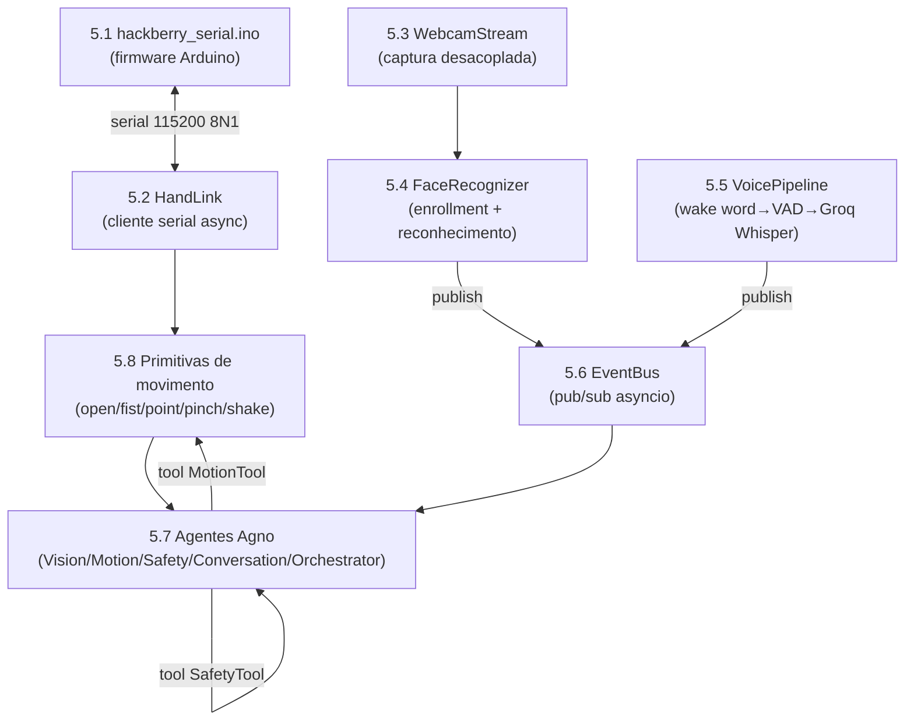

## 5. Exemplos de Código

Esta é a seção de referência de implementação. Todo o código aqui é **executável e coerente entre si**: o mesmo `HandLink` (cliente serial) é consumido pelas primitivas de movimento e pela tool do agente Motion; o mesmo `EventBus` conecta Visão, Orquestrador e demais agentes. Os trechos assumem **Python 3.11+**, **Arduino IDE / arduino-cli** para o firmware, e as bibliotecas justificadas na Seção 4.

> **Convenções de hardware respeitadas em todos os trechos.** A HACKberry é uma **MÃO** de 3 servos de dedos — não há atuador no pulso nem no braço. Os pinos usados são os dos FATOS deste projeto: **THUMB=D9, INDEX=D5, OTHER=D6**, sensor em **A1**. O repositório oficial `mission-arm/HACKberry` (sketch `Hackberryv3.0.ino`) usa um mapeamento diferente (Index=D3, Other=D5, Thumb=D6) — **confirme o silk da sua placa Mk2 V3/V4 antes de compilar** e ajuste as constantes de pino se necessário.

> **Nota sobre IDs de modelo de IA.** Os IDs abaixo foram verificados no momento da redação (jun/2026). IDs de provedores externos mudam — sempre confirme em `console.groq.com/docs/models`, `inference-docs.cerebras.ai/models/overview` e na documentação da Anthropic. Em particular, `qwen-3-32b`/`llama-3.3-70b` na Cerebras tinham deprecação anunciada; e a doc do Agno pode ainda exibir IDs Claude legados — substitua por `claude-opus-4-8`.

### Mapa de dependências entre os trechos



---

### 5.1 Firmware Arduino custom — `hackberry_serial.ino`

Sketch completo para **Arduino Nano (ATmega328P)** da placa HACKberry Mk2. O firmware nativo é autônomo (sensor→servo) e **não expõe API de comandos**; este firmware custom substitui essa lógica por um **loop controlado por host** com protocolo serial, preservando os limites de ângulo nativos (`outThumbMax`/`outIndexMax`/`outOtherMax`) como clamps de segurança.

**Recursos implementados:** parse linha-a-linha (`\n`), comandos `G`/`P`/`S`/`?`/`H`, CLAMP por servo, **slew-rate** (incremento máx por ciclo), **watchdog de heartbeat** (abre a mão se o host sumir), `detach()` em repouso para eliminar jitter/corrente de holding, e ACK/ERR a cada comando.

```cpp
/*
 * hackberry_serial.ino — Firmware host-controlled para a MÃO HACKberry (Mk2 / Arduino Nano)
 * Projeto Thoth — UFRGS / Enfitec Jr. / CTA-IF
 *
 * Protocolo serial (ASCII, 115200 8N1, terminador '\n'):
 *   Host -> MCU:
 *     G:<thumb>,<index>,<other>   define angulos absolutos (graus); aplica CLAMP
 *     P:<nome>                    gesto nomeado: OPEN | FIST | POINT | PINCH | SHAKE
 *     S                           STOP seguro = abre a mao (libera objeto)
 *     H                           heartbeat (mantem o watchdog vivo)
 *     ?                           query de status
 *   MCU -> Host:
 *     R                           banner de boot/ready
 *     A:<eco>                     ACK do comando aceito (ex.: A:G  A:P:FIST)
 *     E:<cod>:<msg>               erro (1=range,2=parse,3=wdt,4=cmd)
 *     S:<th>,<idx>,<ot>,<mode>    status (angulos atuais + modo: HOST|SAFE)
 *
 * ATENCAO DE PINAGEM: estes pinos seguem os FATOS do projeto Thoth.
 * O sketch oficial mission-arm/HACKberry usa D3/D5/D6 — confira a SUA placa.
 */

#include <Servo.h>
#include <avr/wdt.h>     // watchdog de hardware (anti-travamento de software)

// ---------- Pinos dos 3 servos de dedos (FATOS do projeto) ----------
const uint8_t PIN_THUMB = 9;   // servo pequeno -> polegar (abducao/rotacao). SEM PPTC!
const uint8_t PIN_INDEX = 5;   // servo grande  -> indicador. Protegido por PPTC 500mA
const uint8_t PIN_OTHER = 6;   // servo pequeno -> medio+anelar+minimo. Protegido por PPTC

// ---------- Limites de angulo por servo (equivalentes a outThumbMax/Min etc.) ----------
// 0 grau = totalmente ABERTO/ESTENDIDO; valor MAX = totalmente FLEXIONADO/FECHADO.
// CALIBRE estes valores com a SUA mao montada antes de operar com objeto na mao.
const int THUMB_MIN = 10,  THUMB_MAX = 150;   // polegar
const int INDEX_MIN = 10,  INDEX_MAX = 160;   // indicador
const int OTHER_MIN = 10,  OTHER_MAX = 160;   // tres dedos

// ---------- Parametros de controle ----------
const uint8_t STEP_BIG   = 4;     // graus/ciclo para Index/Other (tem PPTC)
const uint8_t STEP_THUMB = 2;     // graus/ciclo para o polegar (SEM PPTC -> mais suave)
const uint16_t TICK_MS   = 20;    // periodo do loop de controle (50 Hz)
const uint16_t WDT_MS    = 1000;  // sem heartbeat por este tempo -> fail-safe = abrir
const uint16_t IDLE_MS   = 800;   // parado neste tempo apos atingir alvo -> detach()

// ---------- Estado ----------
Servo svThumb, svIndex, svOther;
int curThumb, curIndex, curOther;     // angulos atuais (suavizados)
int tgtThumb, tgtIndex, tgtOther;     // angulos alvo
bool attached = false;
bool safeMode = false;                // true apos watchdog/STOP
unsigned long lastHeartbeat = 0;
unsigned long lastTick = 0;
unsigned long reachedAt = 0;          // quando atingiu o alvo (para detach por ociosidade)

// ---------- Buffer de linha serial ----------
char lineBuf[48];
uint8_t lineLen = 0;

// --- utilidades -------------------------------------------------------------
int clampThumb(int a) { return constrain(a, THUMB_MIN, THUMB_MAX); }
int clampIndex(int a) { return constrain(a, INDEX_MIN, INDEX_MAX); }
int clampOther(int a) { return constrain(a, OTHER_MIN, OTHER_MAX); }

void attachAll() {
  if (!attached) {
    svThumb.attach(PIN_THUMB);
    svIndex.attach(PIN_INDEX);
    svOther.attach(PIN_OTHER);
    // re-escreve a posicao atual ANTES de mover, para evitar salto brusco
    svThumb.write(curThumb);
    svIndex.write(curIndex);
    svOther.write(curOther);
    attached = true;
  }
}

void detachAll() {
  if (attached) {
    svThumb.detach();   // corta PWM -> elimina jitter e corrente de holding
    svIndex.detach();
    svOther.detach();
    attached = false;
  }
}

void sendStatus() {
  Serial.print(F("S:"));
  Serial.print(curThumb); Serial.print(',');
  Serial.print(curIndex); Serial.print(',');
  Serial.print(curOther); Serial.print(',');
  Serial.println(safeMode ? F("SAFE") : F("HOST"));
}

// Define alvos absolutos com CLAMP. Retorna false se algum vier fora do range.
bool setTargets(int t, int i, int o) {
  int ct = clampThumb(t), ci = clampIndex(i), co = clampOther(o);
  bool inRange = (ct == t && ci == i && co == o);
  tgtThumb = ct; tgtIndex = ci; tgtOther = co;
  safeMode = false;          // novo comando valido sai do modo seguro
  attachAll();
  reachedAt = 0;
  return inRange;
}

// Gestos nomeados -> resolvem para combinacoes dos limites (sempre dentro do CLAMP).
bool applyGesture(const char* name) {
  if      (!strcmp(name, "OPEN"))  return setTargets(THUMB_MIN, INDEX_MIN, OTHER_MIN);
  else if (!strcmp(name, "FIST"))  return setTargets(THUMB_MAX, INDEX_MAX, OTHER_MAX);
  else if (!strcmp(name, "POINT")) return setTargets(THUMB_MAX, INDEX_MIN, OTHER_MAX); // indicador estendido
  else if (!strcmp(name, "PINCH")) return setTargets(THUMB_MAX, (INDEX_MIN+INDEX_MAX)/2, OTHER_MIN);
  else if (!strcmp(name, "SHAKE")) // "apertar a mao": fecho suave (~70% do curso)
    return setTargets(THUMB_MIN + (THUMB_MAX-THUMB_MIN)*7/10,
                      INDEX_MIN + (INDEX_MAX-INDEX_MIN)*7/10,
                      OTHER_MIN + (OTHER_MAX-OTHER_MIN)*7/10);
  return false; // gesto desconhecido -> trata como erro de comando
}

void goSafeOpen() {            // fail-safe: abre a mao e marca SAFE
  tgtThumb = THUMB_MIN; tgtIndex = INDEX_MIN; tgtOther = OTHER_MIN;
  safeMode = true;
  attachAll();
}

// --- parser de comando ------------------------------------------------------
void handleLine(char* s) {
  if (s[0] == '\0') return;            // ignora linha vazia
  wdt_reset();

  switch (s[0]) {
    case 'H':                          // heartbeat
      lastHeartbeat = millis();
      Serial.println(F("A:H"));
      return;

    case '?':                          // status
      sendStatus();
      return;

    case 'S':                          // STOP seguro
      goSafeOpen();
      Serial.println(F("A:S"));
      return;

    case 'P': {                        // gesto nomeado: "P:FIST"
      if (s[1] != ':') { Serial.println(F("E:2:parse")); return; }
      char* name = s + 2;
      if (applyGesture(name)) { Serial.print(F("A:P:")); Serial.println(name); }
      else                    { Serial.println(F("E:4:cmd")); }
      return;
    }

    case 'G': {                        // angulos: "G:120,30,30"
      if (s[1] != ':') { Serial.println(F("E:2:parse")); return; }
      int t, i, o;
      // sscanf e' pesado mas roda fora do hot-path (so a cada comando)
      if (sscanf(s + 2, "%d,%d,%d", &t, &i, &o) != 3) {
        Serial.println(F("E:2:parse")); return;
      }
      if (setTargets(t, i, o)) Serial.println(F("A:G"));
      else                     Serial.println(F("E:1:range"));  // ainda assim aplica o CLAMP
      return;
    }

    default:
      Serial.println(F("E:4:cmd"));
  }
}

// --- loop de controle nao-bloqueante (slew-rate) ----------------------------
void controlTick() {
  bool moving = false;
  if (curThumb != tgtThumb) { curThumb += constrain(tgtThumb - curThumb, -STEP_THUMB, STEP_THUMB); moving = true; }
  if (curIndex != tgtIndex) { curIndex += constrain(tgtIndex - curIndex, -STEP_BIG,   STEP_BIG);   moving = true; }
  if (curOther != tgtOther) { curOther += constrain(tgtOther - curOther, -STEP_BIG,   STEP_BIG);   moving = true; }

  if (attached) {
    svThumb.write(curThumb);
    svIndex.write(curIndex);
    svOther.write(curOther);
  }

  unsigned long now = millis();
  if (moving) {
    reachedAt = 0;
  } else {
    if (reachedAt == 0) reachedAt = now;
    // anti-stall / anti-jitter: detach apos ficar parado IDLE_MS no alvo
    if (now - reachedAt > IDLE_MS) detachAll();
  }
}

void setup() {
  Serial.begin(115200);
  // posicao inicial segura = mao aberta
  curThumb = tgtThumb = THUMB_MIN;
  curIndex = tgtIndex = INDEX_MIN;
  curOther = tgtOther = OTHER_MIN;
  attachAll();
  lastHeartbeat = millis();
  wdt_enable(WDTO_2S);          // watchdog de HW: se o loop travar > 2s, reseta a placa
  Serial.println(F("R"));       // banner de ready
}

void loop() {
  wdt_reset();
  unsigned long now = millis();

  // 1) leitura serial nao-bloqueante, linha a linha
  while (Serial.available()) {
    char c = (char)Serial.read();
    if (c == '\n' || c == '\r') {
      lineBuf[lineLen] = '\0';
      handleLine(lineBuf);
      lineLen = 0;
    } else if (lineLen < sizeof(lineBuf) - 1) {
      lineBuf[lineLen++] = c;
    } else {
      lineLen = 0;                       // overflow -> descarta a linha (anti-desync)
      Serial.println(F("E:2:parse"));
    }
  }

  // 2) watchdog de heartbeat -> fail-safe = abrir a mao
  if (!safeMode && (now - lastHeartbeat > WDT_MS)) {
    goSafeOpen();
    Serial.println(F("E:3:wdt"));
  }

  // 3) tick de controle a 50 Hz (slew-rate + detach por ociosidade)
  if (now - lastTick >= TICK_MS) {
    lastTick = now;
    controlTick();
  }
}
```

> **Por que abrir a mão no fail-safe?** Em prótese assistiva, perder comunicação enquanto se segura um objeto deve **liberar** o objeto (posição segura), nunca apertar mais forte. O `detach()` em repouso reduz a dissipação contínua do regulador de 3 terminais e protege o servo do polegar, que **não tem PPTC**.

---

### 5.2 Comunicação Arduino ↔ Python — `HandLink`

Cliente serial assíncrono com **`pyserial-asyncio`** (casa com o event loop do Agno: leitura não-bloqueante, sem thread de polling). Implementa conexão/handshake, reconexão com backoff, envio de comando com **ACK e timeout**, **heartbeat assíncrono** e parsing de status. É a classe consumida por toda a Seção 5.8 e pela tool do Motion (5.7).

```python
# thoth/hardware/hand_link.py
"""Cliente serial assíncrono para o firmware hackberry_serial.ino."""
from __future__ import annotations

import asyncio
import logging
from dataclasses import dataclass

import serial_asyncio  # pip install pyserial-asyncio

log = logging.getLogger("thoth.hand")


@dataclass
class HandStatus:
    thumb: int
    index: int
    other: int
    mode: str            # "HOST" | "SAFE"


class HandLink:
    """Mantém a sessão serial com a mão. Uma instância, compartilhada por todo o app."""

    def __init__(self, port: str, baud: int = 115200,
                 ack_timeout: float = 0.4, heartbeat_period: float = 0.3):
        self.port = port
        self.baud = baud
        self.ack_timeout = ack_timeout
        self.heartbeat_period = heartbeat_period

        self._reader: asyncio.StreamReader | None = None
        self._writer: asyncio.StreamWriter | None = None
        self._ack_waiter: asyncio.Future[str] | None = None
        self._send_lock = asyncio.Lock()          # 1 comando "em voo" -> preserva ordem dos ACKs
        self._tasks: list[asyncio.Task] = []
        self._connected = asyncio.Event()
        self.last_status: HandStatus | None = None

    # ---- ciclo de vida -----------------------------------------------------
    async def connect(self) -> None:
        """Conecta, espera o banner 'R' e dispara reader + heartbeat."""
        backoff = 0.5
        while True:
            try:
                self._reader, self._writer = await serial_asyncio.open_serial_connection(
                    url=self.port, baudrate=self.baud)
                # após abrir a porta, o Nano reinicia (auto-reset DTR): aguarda o banner 'R'
                await self._await_ready(timeout=5.0)
                self._connected.set()
                self._tasks = [
                    asyncio.create_task(self._reader_loop(), name="hand-reader"),
                    asyncio.create_task(self._heartbeat_loop(), name="hand-heartbeat"),
                ]
                log.info("HandLink conectado em %s", self.port)
                return
            except Exception as exc:  # noqa: BLE001
                log.warning("Falha ao conectar (%s); retry em %.1fs", exc, backoff)
                await asyncio.sleep(backoff)
                backoff = min(backoff * 2, 5.0)

    async def _await_ready(self, timeout: float) -> None:
        deadline = asyncio.get_event_loop().time() + timeout
        while asyncio.get_event_loop().time() < deadline:
            line = await asyncio.wait_for(self._reader.readline(), timeout=timeout)
            if line.strip() == b"R":
                return
        raise TimeoutError("banner 'R' não recebido")

    async def close(self) -> None:
        for t in self._tasks:
            t.cancel()
        if self._writer:
            self._writer.close()
        self._connected.clear()

    # ---- envio com ACK -----------------------------------------------------
    async def _send_raw(self, line: str) -> str:
        """Envia uma linha e aguarda a próxima resposta (ACK/ERR). Serializado."""
        async with self._send_lock:
            self._ack_waiter = asyncio.get_event_loop().create_future()
            self._writer.write((line + "\n").encode())
            await self._writer.drain()
            try:
                return await asyncio.wait_for(self._ack_waiter, self.ack_timeout)
            except asyncio.TimeoutError:
                log.error("timeout aguardando ACK de %r", line)
                raise
            finally:
                self._ack_waiter = None

    async def set_angles(self, thumb: int, index: int, other: int) -> str:
        return await self._send_raw(f"G:{thumb},{index},{other}")

    async def gesture(self, name: str) -> str:
        return await self._send_raw(f"P:{name.upper()}")

    async def stop(self) -> str:
        """E-stop lógico: abre a mão imediatamente."""
        return await self._send_raw("S")

    async def query(self) -> HandStatus | None:
        await self._send_raw("?")
        return self.last_status

    # ---- loops internos ----------------------------------------------------
    async def _reader_loop(self) -> None:
        try:
            while True:
                raw = await self._reader.readline()
                if not raw:
                    raise ConnectionError("EOF na serial")
                line = raw.decode(errors="replace").strip()
                if not line:
                    continue
                self._route(line)
        except Exception as exc:  # noqa: BLE001
            log.error("reader_loop caiu: %s — reconectando", exc)
            self._connected.clear()
            asyncio.create_task(self._reconnect())

    def _route(self, line: str) -> None:
        if line.startswith("S:"):                       # status assíncrono
            try:
                t, i, o, mode = line[2:].split(",")
                self.last_status = HandStatus(int(t), int(i), int(o), mode)
            except ValueError:
                log.warning("status malformado: %r", line)
        # ACK/ERR resolvem o future do comando em voo
        if self._ack_waiter and not self._ack_waiter.done():
            if line.startswith("E:"):
                self._ack_waiter.set_exception(RuntimeError(line))
            else:
                self._ack_waiter.set_result(line)

    async def _heartbeat_loop(self) -> None:
        while True:
            await asyncio.sleep(self.heartbeat_period)
            if self._connected.is_set():
                try:
                    await self._send_raw("H")
                except Exception:  # noqa: BLE001
                    pass  # falha de heartbeat é tratada pela reconexão do reader

    async def _reconnect(self) -> None:
        await self.close()
        await asyncio.sleep(0.5)
        await self.connect()
        # política de segurança: NÃO reenviar gesto perigoso automaticamente.
        await self.stop()  # deixa a mão aberta após reconectar
```

> **Por que `pyserial-asyncio` e não PySerial síncrono?** O Agno opera num event loop asyncio; uma leitura bloqueante exigiria thread dedicada + filas (`run_in_executor`), mais frágil. Aqui a leitura é uma coroutine, o heartbeat é uma task, e o `_send_lock` garante 1 comando em voo (ordem de ACK preservada).

---

### 5.3 Captura de webcam (OpenCV) com thread desacoplada — `WebcamStream`

`cap.read()` é bloqueante. O padrão correto é uma **thread dedicada** que mantém apenas o **último frame** (latest-frame); o loop de inferência consome esse frame sem travar. No Windows, `CAP_DSHOW` reduz a latência de abertura; `BUFFERSIZE=1` evita frames atrasados.

```python
# thoth/vision/webcam.py
"""Captura de webcam desacoplada do consumo (latest-frame), com medição de FPS."""
from __future__ import annotations

import threading
import time

import cv2
import numpy as np


class WebcamStream:
    def __init__(self, src: int = 0, width: int = 640, height: int = 480, fps: int = 30):
        # CAP_DSHOW: backend DirectShow no Windows (abertura mais rápida/estável)
        self.cap = cv2.VideoCapture(src, cv2.CAP_DSHOW)
        self.cap.set(cv2.CAP_PROP_FRAME_WIDTH, width)
        self.cap.set(cv2.CAP_PROP_FRAME_HEIGHT, height)
        self.cap.set(cv2.CAP_PROP_FPS, fps)
        self.cap.set(cv2.CAP_PROP_BUFFERSIZE, 1)   # mantém só o frame mais recente

        if not self.cap.isOpened():
            raise RuntimeError(f"não foi possível abrir a câmera src={src}")

        self._frame: np.ndarray | None = None
        self._lock = threading.Lock()
        self._running = False
        self._thread: threading.Thread | None = None

        # medição de FPS efetivo
        self._tick = time.monotonic()
        self._count = 0
        self.fps_measured = 0.0

    def start(self) -> "WebcamStream":
        self._running = True
        self._thread = threading.Thread(target=self._loop, daemon=True)
        self._thread.start()
        return self

    def _loop(self) -> None:
        while self._running:
            ok, frame = self.cap.read()
            if not ok:
                time.sleep(0.005)
                continue
            with self._lock:
                self._frame = frame
            self._count += 1
            now = time.monotonic()
            if now - self._tick >= 1.0:
                self.fps_measured = self._count / (now - self._tick)
                self._tick, self._count = now, 0

    def read(self) -> np.ndarray | None:
        """Retorna uma cópia do último frame (ou None se ainda não há frame)."""
        with self._lock:
            return None if self._frame is None else self._frame.copy()

    def stop(self) -> None:
        self._running = False
        if self._thread:
            self._thread.join(timeout=1.0)
        self.cap.release()


# Exemplo de uso: NÃO rodar 5 modelos em série no mesmo frame a 30 FPS na CPU.
# Processe a uma cadência menor (ex.: reconhecimento facial a cada N frames).
if __name__ == "__main__":
    cam = WebcamStream().start()
    try:
        n = 0
        while True:
            frame = cam.read()
            if frame is None:
                continue
            n += 1
            if n % 5 == 0:                       # inferência pesada a cada 5 frames
                print(f"FPS captura ≈ {cam.fps_measured:.1f}")
            cv2.imshow("thoth", frame)
            if cv2.waitKey(1) & 0xFF == ord("q"):
                break
    finally:
        cam.stop()
        cv2.destroyAllWindows()
```

---

### 5.4 Reconhecimento facial — enrollment + reconhecimento em tempo real

Usa a biblioteca **`face_recognition`** (mais simples de integrar; encodings de 128 dimensões). Para máxima precisão/robustez em rostos não-frontais, **a alternativa recomendada é InsightFace (`buffalo_l`, ArcFace, embeddings de 512-D)** — incluída como bloco comentado ao final.

**Enrollment:** lê `data/known_faces/<Nome>/*.jpg`, gera encodings e salva uma galeria em `data/encodings.pkl`.

```python
# thoth/vision/face_enroll.py
"""Enrollment: gera encodings das imagens em data/known_faces/<Nome>/*.jpg."""
from __future__ import annotations

import pickle
from pathlib import Path

import face_recognition  # pip install face_recognition  (depende de dlib)
import numpy as np

KNOWN_DIR = Path("data/known_faces")
OUT_FILE = Path("data/encodings.pkl")


def build_gallery() -> dict[str, np.ndarray]:
    """Para cada pessoa, média dos encodings das suas fotos."""
    gallery: dict[str, list[np.ndarray]] = {}
    for person_dir in sorted(KNOWN_DIR.iterdir()):
        if not person_dir.is_dir():
            continue
        name = person_dir.name
        for img_path in person_dir.glob("*.jp*g"):
            image = face_recognition.load_image_file(img_path)   # RGB
            boxes = face_recognition.face_locations(image, model="hog")  # "cnn" se tiver GPU
            encs = face_recognition.face_encodings(image, boxes)
            if not encs:
                print(f"[aviso] nenhum rosto em {img_path}")
                continue
            gallery.setdefault(name, []).append(encs[0])
        if name in gallery:
            print(f"{name}: {len(gallery[name])} foto(s)")

    # média por pessoa -> 1 vetor 128-D representativo
    averaged = {n: np.mean(np.stack(v), axis=0) for n, v in gallery.items()}
    OUT_FILE.parent.mkdir(parents=True, exist_ok=True)
    with OUT_FILE.open("wb") as f:
        pickle.dump(averaged, f)
    print(f"galeria salva: {len(averaged)} pessoa(s) -> {OUT_FILE}")
    return averaged


if __name__ == "__main__":
    build_gallery()
```

**Reconhecimento em tempo real:** consome frames do `WebcamStream`, retorna `(identidade, confiança)`.

```python
# thoth/vision/face_recognizer.py
"""Reconhecimento facial em tempo real: identidade + confiança."""
from __future__ import annotations

import pickle
from pathlib import Path

import cv2
import face_recognition
import numpy as np

ENC_FILE = Path("data/encodings.pkl")


class FaceRecognizer:
    def __init__(self, tolerance: float = 0.45):
        # tolerance: distância euclidiana máx. para considerar "match".
        # ~0.6 é o default da lib; 0.4–0.5 reduz falsos positivos. CALIBRE.
        with ENC_FILE.open("rb") as f:
            self.gallery: dict[str, np.ndarray] = pickle.load(f)
        self.names = list(self.gallery.keys())
        self.matrix = np.stack(list(self.gallery.values())) if self.gallery else np.empty((0, 128))
        self.tolerance = tolerance

    def identify(self, frame_bgr: np.ndarray) -> list[tuple[str, float, tuple]]:
        """Retorna lista de (nome, confiança 0–1, bbox) para cada rosto no frame."""
        rgb = cv2.cvtColor(frame_bgr, cv2.COLOR_BGR2RGB)
        boxes = face_recognition.face_locations(rgb, model="hog")
        encs = face_recognition.face_encodings(rgb, boxes)
        results: list[tuple[str, float, tuple]] = []

        for enc, box in zip(encs, boxes):
            if self.matrix.shape[0] == 0:
                results.append(("Desconhecido", 0.0, box))
                continue
            dists = np.linalg.norm(self.matrix - enc, axis=1)
            best = int(np.argmin(dists))
            dist = float(dists[best])
            if dist <= self.tolerance:
                # confiança aproximada: 1 quando dist=0, 0 quando dist=tolerance
                conf = max(0.0, 1.0 - dist / self.tolerance)
                results.append((self.names[best], conf, box))
            else:
                results.append(("Desconhecido", 0.0, box))
        return results


# ---------------------------------------------------------------------------
# ALTERNATIVA DE MAIOR PRECISÃO — InsightFace (ArcFace, 512-D), via ONNX:
#
#   from insightface.app import FaceAnalysis
#   import numpy as np
#   app = FaceAnalysis(name="buffalo_l")
#   app.prepare(ctx_id=-1)          # ctx_id=-1 => CPU; 0 => GPU (onnxruntime-gpu)
#   faces = app.get(frame_bgr)      # cada face: .embedding (512-D) e .bbox
#   # match por similaridade de cosseno contra a galeria (threshold ~0.35–0.5; CALIBRE)
#   def cosine(a, b): return float(np.dot(a, b) / (np.linalg.norm(a) * np.linalg.norm(b)))
#
# InsightFace roda bem em CPU via ONNX e é mais robusto a pose/iluminação.
# Os thresholds dependem da sua câmera/iluminação — calibre empiricamente.
# ---------------------------------------------------------------------------
```

> **Cadência, não série.** Não rode o reconhecedor a 30 FPS na CPU. Processe a cada N frames (ver 5.3) ou numa task separada, e **publique no EventBus** apenas quando a identidade mudar (ver 5.6).

---

### 5.5 Speech-to-Text — wake word → VAD → Groq Whisper

Pipeline: **openWakeWord** (Apache-2.0, sem chave) ativa a escuta → **Silero VAD** segmenta a fala (fecha o segmento após ~600 ms de silêncio) → envia **só o segmento** à **Groq** (modelo `whisper-large-v3` para PT-BR com melhor acurácia; `whisper-large-v3-turbo` para custo/velocidade) → devolve o texto. Evita mandar silêncio (corta custo e latência).

```python
# thoth/voice/stt_pipeline.py
"""Pipeline de voz: wake word -> VAD -> grava segmento -> Groq Whisper -> texto."""
from __future__ import annotations

import io
import os
import wave

import numpy as np
import sounddevice as sd            # pip install sounddevice
from groq import Groq               # pip install groq
from openwakeword.model import Model as WakeModel  # pip install openwakeword
from silero_vad import load_silero_vad, VADIterator  # pip install silero-vad

SAMPLE_RATE = 16_000               # Whisper e Silero operam a 16 kHz
FRAME = 512                        # tamanho de frame para wake/VAD (~32 ms)
SILENCE_TAIL_S = 0.6               # silêncio que fecha um segmento de fala


def _pcm_to_wav_bytes(pcm: np.ndarray, sr: int = SAMPLE_RATE) -> bytes:
    """Empacota PCM int16 mono em um WAV em memória (formato aceito pela Groq)."""
    buf = io.BytesIO()
    with wave.open(buf, "wb") as wf:
        wf.setnchannels(1)
        wf.setsampwidth(2)         # int16
        wf.setframerate(sr)
        wf.writeframes(pcm.tobytes())
    return buf.getvalue()


class VoicePipeline:
    def __init__(self, wakeword: str = "hey_jarvis", groq_model: str = "whisper-large-v3"):
        # GROQ_API_KEY no ambiente:  PowerShell -> $env:GROQ_API_KEY="gsk_..."
        self.client = Groq(api_key=os.environ["GROQ_API_KEY"])
        self.groq_model = groq_model
        self.wake = WakeModel(wakeword_models=[wakeword])  # modelos pré-treinados Apache-2.0
        self.vad_model = load_silero_vad()
        self.vad = VADIterator(self.vad_model, sampling_rate=SAMPLE_RATE)

    def listen_once(self) -> str | None:
        """Bloqueia até detectar a wake word, grava a fala e transcreve. Retorna o texto."""
        print("aguardando wake word…")
        with sd.InputStream(samplerate=SAMPLE_RATE, channels=1, dtype="int16",
                            blocksize=FRAME) as stream:
            # 1) espera a palavra de ativação
            while True:
                block, _ = stream.read(FRAME)
                samples = block.reshape(-1).astype(np.int16)
                scores = self.wake.predict(samples)
                if max(scores.values()) > 0.5:
                    break

            # 2) grava o segmento de fala usando VAD para detectar o fim
            print("escutando comando…")
            collected: list[np.ndarray] = []
            silence_frames = 0
            max_silence = int(SILENCE_TAIL_S * SAMPLE_RATE / FRAME)
            while True:
                block, _ = stream.read(FRAME)
                samples = block.reshape(-1).astype(np.int16)
                collected.append(samples)
                # Silero espera float32 normalizado [-1, 1]
                f32 = samples.astype(np.float32) / 32768.0
                speech = self.vad(f32, return_seconds=False)
                if speech is None:            # frame sem fala
                    silence_frames += 1
                    if silence_frames >= max_silence and len(collected) > max_silence:
                        break
                else:
                    silence_frames = 0

        self.vad.reset_states()
        pcm = np.concatenate(collected)
        if pcm.size < SAMPLE_RATE // 2:        # < 0,5 s -> provavelmente ruído
            return None

        # 3) envia o segmento à Groq Whisper
        wav_bytes = _pcm_to_wav_bytes(pcm)
        resp = self.client.audio.transcriptions.create(
            file=("speech.wav", wav_bytes),
            model=self.groq_model,             # "whisper-large-v3" (PT-BR) | "...-turbo"
            language="pt",                     # ISO-639-1
            response_format="text",
        )
        text = resp if isinstance(resp, str) else getattr(resp, "text", "")
        return text.strip() or None


if __name__ == "__main__":
    vp = VoicePipeline()
    while True:
        t = vp.listen_once()
        if t:
            print("usuário disse:", t)
```

> **Fallback offline.** Para privacidade/sem internet, troque a chamada Groq por **faster-whisper** local (`WhisperModel("base", device="cpu")`). A arquitetura recomendada é: openWakeWord → Silero VAD → Groq turbo (online) com faster-whisper como fallback.

---

### 5.6 Sistema de eventos entre agentes — `EventBus`

Barramento publish/subscribe sobre `asyncio`, com `dataclass` de evento (tipo, payload, prioridade, timestamp). É o ponto de desacoplamento entre os produtores (Visão, Voz) e os consumidores (Orquestrador, demais agentes). Mesmo `EventBus` é usado por toda a Seção 5.7.

```python
# thoth/core/event_bus.py
"""EventBus assíncrono (pub/sub) para coordenação entre módulos do Thoth."""
from __future__ import annotations

import asyncio
import time
from collections import defaultdict
from dataclasses import dataclass, field
from enum import IntEnum
from typing import Any, Awaitable, Callable


class Priority(IntEnum):
    LOW = 0
    NORMAL = 1
    HIGH = 2
    CRITICAL = 3      # ex.: parada de emergência


@dataclass(order=True)
class Event:
    # 'order=True' + sort_index permite usar em PriorityQueue (maior prioridade primeiro)
    sort_index: float = field(init=False, repr=False)
    type: str = field(compare=False)
    payload: dict[str, Any] = field(default_factory=dict, compare=False)
    priority: Priority = field(default=Priority.NORMAL, compare=False)
    timestamp: float = field(default_factory=time.time, compare=False)

    def __post_init__(self) -> None:
        # negativo: prioridade alta sai primeiro; desempate por timestamp (mais antigo primeiro)
        self.sort_index = -float(self.priority) * 1e12 + self.timestamp


Handler = Callable[[Event], Awaitable[None]]


class EventBus:
    def __init__(self) -> None:
        self._subs: dict[str, list[Handler]] = defaultdict(list)
        self._queue: asyncio.PriorityQueue[Event] = asyncio.PriorityQueue()
        self._task: asyncio.Task | None = None

    def subscribe(self, event_type: str, handler: Handler) -> None:
        """Inscreve um handler. Use '*' para receber todos os eventos."""
        self._subs[event_type].append(handler)

    async def publish(self, event: Event) -> None:
        await self._queue.put(event)

    async def emit(self, type: str, payload: dict[str, Any] | None = None,
                   priority: Priority = Priority.NORMAL) -> None:
        """Atalho de publicação."""
        await self.publish(Event(type=type, payload=payload or {}, priority=priority))

    def start(self) -> None:
        if self._task is None:
            self._task = asyncio.create_task(self._dispatch_loop(), name="eventbus")

    async def stop(self) -> None:
        if self._task:
            self._task.cancel()

    async def _dispatch_loop(self) -> None:
        while True:
            event = await self._queue.get()
            handlers = self._subs.get(event.type, []) + self._subs.get("*", [])
            # executa handlers concorrentemente; um erro não derruba os demais
            await asyncio.gather(
                *(self._safe(h, event) for h in handlers),
                return_exceptions=True,
            )

    @staticmethod
    async def _safe(handler: Handler, event: Event) -> None:
        try:
            await handler(event)
        except Exception as exc:  # noqa: BLE001
            import logging
            logging.getLogger("thoth.bus").exception("handler falhou: %s", exc)
```

**Exemplo: Visão publica `pessoa_reconhecida`, Orquestrador reage.**

```python
# thoth/core/example_wiring.py
"""Demonstra Visão publicando e Orquestrador reagindo via EventBus."""
from __future__ import annotations

import asyncio

from thoth.core.event_bus import EventBus, Event, Priority


# --- produtor (camada de Visão) ---
async def vision_producer(bus: EventBus, recognizer, cam) -> None:
    """Publica 'pessoa_reconhecida' quando a identidade muda (debounce simples)."""
    last_seen: str | None = None
    while True:
        frame = cam.read()
        if frame is not None:
            for name, conf, _box in recognizer.identify(frame):
                if name != "Desconhecido" and name != last_seen and conf > 0.5:
                    last_seen = name
                    await bus.emit(
                        "pessoa_reconhecida",
                        {"nome": name, "confianca": round(conf, 2)},
                        priority=Priority.NORMAL,
                    )
        await asyncio.sleep(0.2)   # cadência ~5 Hz


# --- consumidor (Orquestrador) ---
async def on_person(event: Event) -> None:
    nome = event.payload["nome"]
    conf = event.payload["confianca"]
    print(f"[orquestrador] {nome} reconhecido (conf={conf}) -> cumprimentar")
    # aqui o Orquestrador acionaria o ConversationAgent (saudação)
    # e o MotionAgent (gesto SHAKE), via suas tools (ver 5.7 / 5.8)


async def main() -> None:
    bus = EventBus()
    bus.subscribe("pessoa_reconhecida", on_person)
    bus.start()
    # ... vision_producer(bus, recognizer, cam) rodaria como task ...
    await asyncio.sleep(1)


if __name__ == "__main__":
    asyncio.run(main())
```

---

### 5.7 Agentes Agno — Vision / Motion / Safety / Conversation / Orchestrator

Usa o **Agno v2** (`pip install agno`; mais `anthropic`, `groq`, `cerebras-cloud-sdk`). Atribuição de modelos por papel: **Claude** (`claude-opus-4-8`) para o Orquestrador (planejamento, tool-use coordenado); **Groq** (`llama-4-scout` / Whisper) e **Cerebras** (`gpt-oss-120b`) para inferência rápida dos sub-agentes.

> **Atenção a fatos de hardware nas instruções dos agentes.** O `MotionAgent` só executa gestos de dedos. "Levantar o braço" e "reorientar a mão para mirar uma pessoa" **não são viáveis** (não há atuador de pulso/ombro) — o `SafetyAgent` deve recusar esses comandos e sinalizá-los como gap de hardware.

```python
# thoth/agents/team.py
"""Definição dos agentes Agno e do Orquestrador (Team coordinate)."""
from __future__ import annotations

import json

from agno.agent import Agent
from agno.team import Team, TeamMode
from agno.tools import tool
from agno.models.anthropic import Claude
from agno.models.groq import Groq
from agno.models.cerebras import Cerebras

from thoth.hardware.hand_link import HandLink
from thoth.hardware import motion  # módulo da Seção 5.8


# Limites usados pela validação do Safety (espelham os clamps do firmware 5.1).
LIMITS = {
    "thumb": (10, 150),
    "index": (10, 160),
    "other": (10, 160),
}

# Comandos do usuário que NÃO são viáveis no hardware atual (sem atuador de braço).
HARDWARE_GAPS = {"levantar o braço", "levante o braço", "erguer o braço",
                 "mirar", "apontar para mim girando a mão"}


def build_team(hand: HandLink) -> Team:
    # ----- TOOLS customizadas -----------------------------------------------

    @tool
    async def executar_gesto(gesto: str) -> str:
        """Executa um gesto físico na MÃO HACKberry.

        Use SEMPRE que o usuário pedir uma ação física da mão (fechar, abrir,
        apontar, pinça, apertar a mão). Gestos válidos: open, fist, point,
        pinch, shake. Esta é a única forma de atuar no hardware.
        """
        g = gesto.strip().lower()
        fn = {
            "open": motion.abrir,
            "fist": motion.fechar_punho,
            "point": motion.apontar,
            "pinch": motion.pinca,
            "shake": motion.apertar_a_mao,
        }.get(g)
        if fn is None:
            return f"ERRO: gesto desconhecido '{gesto}'. Válidos: open/fist/point/pinch/shake."
        ack = await fn(hand)            # chama o cliente serial (5.2 + 5.8)
        return f"ok: gesto '{g}' executado (ACK={ack})"

    @tool
    async def parada_emergencia() -> str:
        """Aborta qualquer movimento e ABRE a mão imediatamente (e-stop lógico).

        Use quando houver risco, comando ambíguo perigoso, ou pedido explícito de parar.
        """
        ack = await hand.stop()
        return f"e-stop acionado: mão aberta (ACK={ack})"

    @tool
    def validar_comando(comando: str, angulos_json: str = "") -> str:
        """Valida se um comando do usuário é fisicamente seguro e viável NESTA mão.

        Use ANTES de qualquer movimento não-nomeado. Rejeita comandos que exigem
        braço/ombro/pulso motorizado (gaps de hardware) e ângulos fora dos limites.
        Retorna 'OK' ou a razão da recusa.
        """
        c = comando.strip().lower()
        if any(gap in c for gap in HARDWARE_GAPS):
            return ("RECUSADO: este hardware é uma MÃO de 3 servos; não há atuador de "
                    "pulso/braço/ombro. 'Levantar o braço' ou 'mirar' não são viáveis "
                    "(gap de hardware — trabalho futuro).")
        if angulos_json:
            try:
                ang = json.loads(angulos_json)   # nunca regex: sempre json.loads
            except json.JSONDecodeError:
                return "RECUSADO: angulos_json inválido."
            for servo, (lo, hi) in LIMITS.items():
                v = ang.get(servo)
                if v is not None and not (lo <= v <= hi):
                    return f"RECUSADO: {servo}={v} fora do limite [{lo},{hi}]."
        return "OK"

    # ----- AGENTES especialistas --------------------------------------------

    vision_agent = Agent(
        name="Vision",
        role="Interpreta descrições de cena e identidades vindas da visão computacional.",
        model=Groq(id="meta-llama/llama-4-scout-17b-16e-instruct"),  # multimodal rápido
        instructions=[
            "Você resume o que a câmera vê: pessoas presentes, identidades reconhecidas "
            "e gestos. Seja factual e conciso. Não invente identidades.",
        ],
    )

    motion_agent = Agent(
        name="Motion",
        role="Traduz intenções em gestos físicos da MÃO HACKberry.",
        model=Cerebras(id="gpt-oss-120b"),    # inferência de baixa latência
        tools=[executar_gesto, parada_emergencia],
        instructions=[
            "Você comanda uma MÃO de 3 servos de dedos. Só pode: open, fist, point, "
            "pinch, shake. NÃO há atuador de pulso ou braço — nunca prometa levantar o "
            "braço ou reorientar a mão. Antes de mover, confie na validação do Safety.",
        ],
    )

    safety_agent = Agent(
        name="Safety",
        role="Valida segurança e viabilidade física de cada comando antes da execução.",
        model=Cerebras(id="gpt-oss-120b"),
        tools=[validar_comando],
        instructions=[
            "Você é o portão de segurança. Use validar_comando em TODO pedido de "
            "movimento. Recuse gaps de hardware (braço/ombro/mirar) e ângulos fora dos "
            "limites. Em dúvida, recuse e explique.",
        ],
    )

    conversation_agent = Agent(
        name="Conversation",
        role="Dialoga em português do Brasil com o usuário de forma natural e breve.",
        model=Claude(id="claude-opus-4-8", cache_system_prompt=True),
        instructions=[
            "Responda em PT-BR, com tom cordial e respostas curtas. Quando cumprimentar "
            "alguém reconhecido, use o nome. Não descreva capacidades que o robô não tem.",
        ],
    )

    # ----- ORQUESTRADOR (Team coordinate) -----------------------------------
    # 'coordinate' (padrão v2): o líder delega sequencialmente às members e
    # sintetiza, mantendo contexto compartilhado. O termo 1.x "collaborate"
    # mapeia para 'coordinate' na v2.
    orchestrator = Team(
        name="ThothOrchestrator",
        mode=TeamMode.coordinate,
        model=Claude(id="claude-opus-4-8"),   # raciocínio/planejamento no líder
        members=[vision_agent, safety_agent, motion_agent, conversation_agent],
        instructions=[
            "Você coordena um robô assistente baseado na MÃO HACKberry.",
            "Fluxo: (1) entenda o pedido; (2) se envolver movimento, peça ao Safety "
            "para validar ANTES; (3) se aprovado, peça ao Motion para executar; "
            "(4) responda ao usuário pelo Conversation.",
            "Mapeamento de comandos -> hardware real:",
            " - 'aperte minha mão' = gesto SHAKE (fecho suave). Viável.",
            " - 'aponte' = gesto POINT (indicador estendido). Viável, mas a mão NÃO se "
            "   reorienta para mirar uma pessoa (sem braço posicionador).",
            " - 'feche/abra a mão' = FIST/OPEN. Viável.",
            " - 'levante o braço' = NÃO viável (gap de hardware). Explique ao usuário.",
            " - 'quem está na sala?' = pergunte ao Vision; independe da mão.",
            "Para o loop crítico, prefira respostas curtas (menos tokens).",
        ],
    )
    return orchestrator


# Ponte EventBus -> Orquestrador (consome eventos de Visão/Voz e aciona o Team).
async def handle_event(orchestrator: Team, event) -> None:
    if event.type == "comando_voz":
        await orchestrator.aprint_response(event.payload["texto"])
    elif event.type == "pessoa_reconhecida":
        nome = event.payload["nome"]
        await orchestrator.aprint_response(
            f"A câmera reconheceu {nome}. Cumprimente-o(a) e ofereça apertar a mão."
        )
```

> **Latência é dominada pelo provedor LLM.** O Agno trata o LLM como *soft real-time* — não oferece garantias de tempo real determinístico. Por isso o **controle de baixo nível (slew-rate, watchdog, e-stop) vive no firmware** (5.1), nunca no agente. Para o loop crítico use Cerebras/Groq; reserve Claude para planejamento.

---

### 5.8 Primitivas de movimento da HACKberry

Funções Python que traduzem intenções em comandos seriais, **respeitando os limites** e usando o mesmo `HandLink` (5.2). São consumidas pela tool `executar_gesto` (5.7). Os ângulos espelham os limites do firmware (5.1): `0°≈aberto`, `MAX≈fechado`.

```python
# thoth/hardware/motion.py
"""Primitivas de movimento da MÃO HACKberry. Cada função retorna o ACK do firmware.

Convenção de ângulos (espelha hackberry_serial.ino):
  thumb: 10..150   index: 10..160   other: 10..160
  menor = ABERTO/ESTENDIDO   maior = FLEXIONADO/FECHADO
"""
from __future__ import annotations

from thoth.hardware.hand_link import HandLink

# Limites (mantenha sincronizados com o firmware 5.1)
THUMB_MIN, THUMB_MAX = 10, 150
INDEX_MIN, INDEX_MAX = 10, 160
OTHER_MIN, OTHER_MAX = 10, 160


def _frac(lo: int, hi: int, f: float) -> int:
    """Interpola entre lo e hi pela fração f∈[0,1], com clamp."""
    f = max(0.0, min(1.0, f))
    return int(round(lo + (hi - lo) * f))


async def abrir(hand: HandLink) -> str:
    """Mão totalmente aberta (posição segura). Gesto nomeado no firmware."""
    return await hand.gesture("OPEN")


async def fechar_punho(hand: HandLink) -> str:
    """Punho fechado (preensão máxima). Gesto nomeado no firmware."""
    return await hand.gesture("FIST")


async def apontar(hand: HandLink) -> str:
    """Apontar: indicador ESTENDIDO + demais dedos FLEXIONados + polegar recolhido.

    NOTA: a mão aponta no eixo em que estiver fixada manualmente no pulso —
    NÃO consegue se reorientar para mirar uma pessoa (sem braço posicionador).
    """
    # Estende indicador (INDEX_MIN), flexiona os três dedos (OTHER_MAX),
    # recolhe o polegar (THUMB_MAX) para não atrapalhar o gesto.
    return await hand.set_angles(thumb=THUMB_MAX, index=INDEX_MIN, other=OTHER_MAX)


async def pinca(hand: HandLink) -> str:
    """Pinça: polegar contra o indicador (a meio curso), demais dedos abertos."""
    return await hand.set_angles(
        thumb=THUMB_MAX,
        index=_frac(INDEX_MIN, INDEX_MAX, 0.5),  # indicador a meio caminho
        other=OTHER_MIN,
    )


async def apertar_a_mao(hand: HandLink) -> str:
    """'Apertar a mão' = fecho SUAVE (~70% do curso), não esmagador.

    Usa fração do curso em vez do batente para reduzir corrente/pico no servo
    do polegar (que não tem PPTC) e tornar o aperto confortável/seguro.
    """
    return await hand.set_angles(
        thumb=_frac(THUMB_MIN, THUMB_MAX, 0.70),
        index=_frac(INDEX_MIN, INDEX_MAX, 0.70),
        other=_frac(OTHER_MIN, OTHER_MAX, 0.70),
    )


# Exemplo de uso isolado (sem agentes), útil para testes de bancada:
if __name__ == "__main__":
    import asyncio

    async def demo() -> None:
        hand = HandLink(port="COM5")     # ajuste a porta (Linux: /dev/ttyUSB0)
        await hand.connect()
        try:
            print(await abrir(hand))
            await asyncio.sleep(1.0)
            print(await apertar_a_mao(hand))
            await asyncio.sleep(1.0)
            print(await apontar(hand))
            await asyncio.sleep(1.0)
            print(await pinca(hand))
            await asyncio.sleep(1.0)
            print(await abrir(hand))     # sempre termina em posição segura
        finally:
            await hand.close()

    asyncio.run(demo())
```

> **Coerência garantida.** `motion.py` usa exatamente o `HandLink` de 5.2; a tool `executar_gesto` (5.7) chama estas funções; e os limites refletem os clamps do firmware (5.1). Qualquer recalibração deve ser feita **nos três lugares** (firmware, `motion.py`, `LIMITS` do Safety) para manter o sistema consistente.
