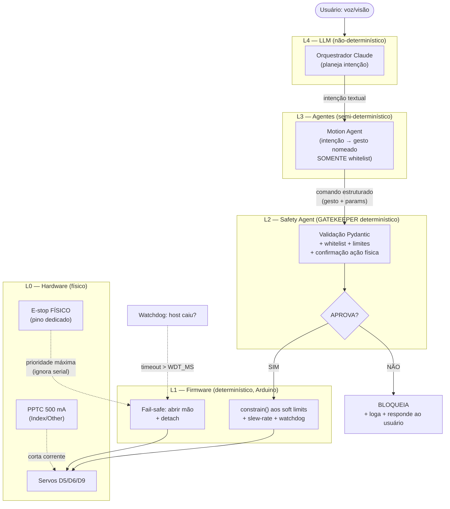

## 6. Segurança

> A HACKberry é uma **prótese assistiva** que entra em contato com objetos e, potencialmente, com a **pele de pessoas**. Diferente de um robô industrial enjaulado, ela opera no mesmo espaço que humanos e é comandada por uma camada de IA não-determinística (LLMs). Isso impõe um princípio inegociável: **a IA propõe; um caminho de segurança determinístico dispõe**. Nenhum comando de movimento gerado por um modelo de linguagem chega ao firmware sem passar por validação determinística — e nenhuma camada de software substitui a parada de emergência física.

Esta seção especifica a segurança em seis frentes: arquitetura em camadas (6.1), anticolisão dentro dos limites de uma *mão* (6.2), limitação de movimento (6.3), parada de emergência (6.4), proteção elétrica/mecânica dos servos (6.5) e segurança específica da camada agêntica (6.6). Os números de pino, limites de corrente e nomes de variáveis seguem os **fatos de hardware** consolidados na Seção 0.1 e o firmware especificado na Seção 5.1.

---

### 6.1 Arquitetura de segurança em camadas (defense-in-depth)

A premissa de projeto é que **qualquer camada pode falhar ou alucinar** — em especial o LLM. Por isso a segurança é distribuída em camadas independentes, cada uma capaz de barrar um movimento perigoso por conta própria (*defense-in-depth*). A camada mais profunda (firmware) é a mais confiável porque é **determinística, auditável e fisicamente próxima do atuador**; a mais externa (LLM) é a menos confiável e tem o **menor** poder direto sobre o hardware.

O elemento central é o **Safety Agent**, que atua como **gatekeeper**: todo comando de movimento — venha do orquestrador, de um agente de motion ou de um gesto nomeado — passa por ele **antes** de ser serializado para o firmware. O Safety Agent tem **poder de veto** absoluto e não negociável: ele não "sugere", ele **autoriza ou bloqueia**. Ao contrário das demais camadas, o Safety Agent **não é um agente LLM** — é um componente Python determinístico (validadores Pydantic + máquina de estados + whitelist). Chamá-lo de "agente" é uma escolha de nomenclatura arquitetural; ele não chama nenhum modelo de linguagem no caminho crítico, justamente para não herdar a não-determinação do LLM.

| Camada | Onde roda | Natureza | Responsabilidade de segurança | Poder |
|--------|-----------|----------|-------------------------------|-------|
| **L0 — Hardware** | Placa Mk2 / servos | Físico | PPTC 500 mA (Index/Other), regulador de 3 terminais, e-stop físico, fonte 7,2 V | Corte físico de corrente |
| **L1 — Firmware** | Arduino Nano | Determinístico (C++) | `constrain()` aos soft limits, slew-rate, watchdog, fail-safe (abrir mão), detach idle | Última linha de defesa em software |
| **L2 — Safety Agent (gatekeeper)** | Host (Python) | Determinístico (não-LLM) | Validação Pydantic, whitelist de gestos, limites de velocidade, confirmação de ação física, e-stop de software | **Veto** sobre todo comando |
| **L3 — Orquestrador / Motion Agent** | Host (Agno) | Semi-determinístico | Resolve intenção → gesto nomeado; **só** emite comandos da whitelist | Propõe movimento |
| **L4 — LLM (Claude/Groq/Cerebras)** | Nuvem | Não-determinístico | Planejamento e diálogo; **nunca** escreve ângulos diretamente no hardware | Propõe intenção (texto) |

**Regra de ouro do fluxo:** a confiança **diminui** de L0 para L4, e o poder direto sobre o atuador **também** diminui de L0 para L4. O LLM (L4) tem a maior capacidade cognitiva e o **menor** acesso físico; o firmware (L1) e o hardware (L0) têm a menor "inteligência" e o **maior** poder de corte. Um comando precisa ser aprovado por **todas** as camadas determinísticas (L2 e L1) para chegar ao servo.



**Por que o gatekeeper roda no host e não só no firmware?** Porque o host tem contexto que o firmware não tem (ex.: "há uma pessoa na frente da câmera", "o usuário não confirmou a ação"), e o firmware tem garantias que o host não tem (latência determinística, proximidade física, independência da rede). As duas camadas são **redundantes de propósito**: o firmware re-aplica `constrain()` mesmo que o Safety Agent já tenha validado — *belt and suspenders*. Se o host for comprometido ou travar, o firmware ainda protege; se o firmware tiver um bug de limite, o Safety Agent já barrou antes.

---

### 6.2 Como evitar colisões

> **Honestidade de engenharia primeiro:** a HACKberry é uma **mão**, não um braço posicionador. Ela **não tem percepção 3D do espaço** e não pode "desviar" de obstáculos no ambiente — não há sensor de profundidade, IMU no efetuador, nem cinemática de braço a planejar. O que chamamos aqui de "colisão" é **estritamente** o evento em que os **dedos forçam contra um objeto ou contra a pele** durante o fechamento. Anticolisão espacial real é um **gap de hardware** discutido na Seção 7 (base móvel, braço com mais DOF, sensores de proximidade).

Dentro do escopo de uma mão, há três classes de colisão a tratar:

**(a) Colisão dedo↔objeto/pele (força de preensão excessiva).** Esta é a mais crítica em uma prótese assistiva. Sem sensor de corrente dedicado por servo, usamos dois *proxies* de força:

1. **Sinal do sensor da porta A1 (SENS):** o fotorrefletor de pressão (ou o canal EMG) pode ser lido como telemetria mesmo em modo *host-controlled*. Um aumento abrupto/anômalo durante o fechamento indica resistência.
2. **Proxy por estagnação (stall) no firmware:** se o servo recebe um alvo de fechamento mas a posição **não progride** dentro de um tempo `T` (sem sensor de corrente, inferimos pelo tempo decorrido vs. deslocamento esperado pelo slew-rate), tratamos como "encontrou resistência" → **paramos o fechamento**, fazemos `detach()` daquele servo e emitimos `E:` (provável stall). Isso protege ao mesmo tempo o objeto/pele **e** o servo (ver 6.5).

A regra é: **parar ao detectar resistência**, nunca insistir contra ela. O firmware **nunca** mantém torque crescente contra um obstáculo.

```cpp
// Firmware (trecho): parada por resistência durante fechamento.
// Sem sensor de corrente -> usamos progresso esperado vs. real como proxy.
void stepServoTowards(ServoState &s) {
  if (s.current == s.target) return;
  int dir  = (s.target > s.current) ? +1 : -1;
  int step = min(s.maxStep, abs(s.target - s.current)); // slew-rate (6.3)
  s.current += dir * step;
  s.servo.write(constrain(s.current, s.outMin, s.outMax)); // clamp duro (6.3)

  // Proxy de stall: alvo não foi alcançado dentro do orçamento de tempo?
  if (millis() - s.moveStartMs > s.stallTimeoutMs && s.current != s.target) {
    s.servo.detach();              // libera torque -> não força contra objeto/pele
    serialPrintf("E:1:stall:%c\n", s.tag);
    s.target = s.current;          // congela: para de empurrar
  }
}
```

**(b) Auto-colisão entre dedos.** Os três servos podem, em combinação, levar o polegar contra os dedos flexionados. Isso é evitado **por construção** com os **soft limits** (`outThumbMax`, `outIndexMax`, `outOtherMax`): os limites são calibrados de modo que mesmo o fechamento máximo simultâneo dos três servos não force mecanicamente uma parte contra a outra além do batente natural da preensão. Como os limites são aplicados **independentemente por servo** no firmware (6.3), não existe combinação de comando da whitelist que ultrapasse esses ângulos.

**(c) "Colisão" por gesto impossível/perigoso.** Tratada na camada L2/L3: o Motion Agent só emite **gestos da whitelist** (6.6), e o Safety Agent rejeita ângulos arbitrários. Não há como o LLM pedir "feche o indicador a 200°".

**Limitação assumida explicitamente:** sem o hardware da Seção 7, o sistema **não detecta** que está prestes a fechar sobre algo frágil *antes* do contato — ele reage **ao** contato (proxy de força). Para preensão segura de objetos delicados, o caminho recomendado é fechamento **lento** (slew-rate reduzido) + parada por resistência, aceitando que a detecção é reativa, não preditiva. Esta é uma limitação de hardware, não de software.

---

### 6.3 Como limitar movimentos

A limitação de movimento é **dupla e redundante**: validada no **host** (L2) e re-aplicada no **firmware** (L1). Se uma falhar, a outra cobre.

**(1) Soft limits por servo (host + firmware).** As variáveis nativas `outThumbMax`/`outIndexMax`/`outOtherMax` (e os respectivos mínimos) definem a faixa angular fisicamente segura de cada servo. Elas são a **fonte única de verdade**, replicadas como constantes no host e no firmware. No firmware, **todo** valor escrito passa por `constrain()`:

```cpp
// Firmware: clamp duro -- NUNCA escrever fora dos limites nativos.
int safeWrite(Servo &sv, int angle, int outMin, int outMax) {
  int a = constrain(angle, outMin, outMax);
  sv.write(a);
  return a; // retorna o valor efetivamente aplicado (para telemetria/ACK)
}
```

**(2) Slew-rate / ramp (limite de velocidade).** Em vez de escrever o ângulo-alvo de uma vez (pico de corrente, *jerk*, possível stall), o firmware integra a posição a cada *tick* (ex.: 20 ms) por um passo máximo `STEP` (~2–4°/tick). Isso impõe um **limite de velocidade angular** efetivo e suaviza a preensão. O loop é **não-bloqueante** (`millis()`, máquina de estados — **nunca** `delay()`).

**(3) Whitelist de gestos (host).** Movimento livre por ângulo arbitrário é **proibido** pela política padrão. O Motion Agent trabalha com um conjunto fechado de gestos nomeados, cada um resolvendo para ângulos pré-validados:

| Gesto (`name`) | Comando do usuário | Resolve para |
|----------------|--------------------|--------------|
| `OPEN` | "abra a mão" / fail-safe | todos os servos em `outMin` (mão relaxada/aberta) |
| `CLOSE` / `GRIP` | "aperte minha mão" / "segure" | fechamento clampado a `outMax` (slew-rate reduzido) |
| `POINT` | "aponte" | indicador estendido + médio/anelar/mínimo flexionados |
| `PINCH` | "pinça" | polegar + indicador aproximados, demais flexionados |

**(4) Validação de parâmetros (Pydantic, host — L2).** Mesmo o caminho de ângulos absolutos (uso de baixo nível, calibração) é validado por modelos Pydantic com limites embutidos, antes de virar bytes na serial. Isso barra valores fora de faixa, tipos errados e velocidades excessivas **antes** de chegarem ao firmware.

```python
from pydantic import BaseModel, Field, field_validator

# Fonte única de verdade no host (espelha os limites nativos do firmware).
SERVO_LIMITS = {          # (out_min, out_max) por servo -- CALIBRAR na placa real
    "thumb": (35, 130),   # D9  -- polegar (SEM PPTC: cuidado redobrado, ver 6.5)
    "index": (40, 150),   # D5  -- indicador
    "other": (40, 150),   # D6  -- médio/anelar/mínimo
}
MAX_DEG_PER_S = 180       # limite de velocidade angular (casa com o slew-rate do firmware)

class ServoCommand(BaseModel):
    servo: str = Field(..., pattern="^(thumb|index|other)$")
    angle: int
    speed_deg_s: int = Field(120, ge=10, le=MAX_DEG_PER_S)

    @field_validator("angle")
    @classmethod
    def within_soft_limits(cls, v, info):
        servo = info.data.get("servo")
        if servo is None:                      # 'servo' falhou na validação antes
            return v
        lo, hi = SERVO_LIMITS[servo]
        if not (lo <= v <= hi):
            raise ValueError(f"angle {v} fora do soft limit [{lo},{hi}] de '{servo}'")
        return v

class GestureCommand(BaseModel):               # caminho preferencial (whitelist)
    name: str = Field(..., pattern="^(OPEN|CLOSE|GRIP|POINT|PINCH)$")
    speed_deg_s: int = Field(120, ge=10, le=MAX_DEG_PER_S)
```

> **Defesa em profundidade na prática:** mesmo que o Pydantic do host fosse contornado (bug, comando direto, host comprometido), o `constrain()` do firmware ainda recusaria o ângulo ilegal. A validação do host existe para **falhar cedo, com mensagem clara e auditável**; a do firmware existe para **falhar seguro, sempre**.

---

### 6.4 Parada de emergência (e-stop)

> Em uma prótese assistiva, a parada de emergência é **mandatória** e deve existir em **múltiplas vias independentes**, sem depender de que o software de alto nível esteja são. O estado seguro definido para a HACKberry é **mão ABERTA com servos RELAXADOS (detach)**: libera qualquer objeto/pele preso na preensão e elimina torque de retenção.

Vias de parada, em ordem de confiabilidade (da mais robusta à mais frágil):

| Via | Camada | Aciona | Independe de |
|-----|--------|--------|--------------|
| **1. Botão físico de e-stop** | L0/L1 | Pino dedicado (porta de expansão **A2/A3**), lido a cada loop com prioridade máxima | Serial, host, rede, LLM |
| **2. Watchdog de firmware** | L1 | `millis() - lastHeartbeat > WDT_MS` (host caiu/travou) | Host vivo |
| **3. WDT de hardware (AVR)** | L1 | `wdt_enable()` reseta o MCU se o loop travar | Software do firmware estar são |
| **4. Comando serial `S`** | L2 | Safety Agent envia `S\n` (e-stop de software) | — (precisa de serial + host) |
| **5. Kill switch de software** | L2/L3 | Flag do Safety Agent: rejeita todo comando de movimento | — |

**Sequência de e-stop (qualquer via que dispare leva ao mesmo estado FAIL-SAFE):**

```mermaid
sequenceDiagram
    participant Trigger as Gatilho de e-stop
    participant FW as Firmware (L1)
    participant Servos
    participant Host as Safety Agent (L2)

    Trigger->>FW: e-stop (botão físico / watchdog / cmd S)
    Note over FW: PRIORIDADE MÁXIMA<br/>ignora fila serial pendente
    FW->>Servos: write(outMin) em todos (abrir mão)
    Note over FW,Servos: aguarda slew curto / direto p/ aberto
    FW->>Servos: detach() em D5, D6, D9 (relaxa, corta PWM)
    FW->>FW: mode = SAFE
    FW-->>Host: E:3:wdt  /  A:S  (notifica)
    Host->>Host: kill switch ON; recusa novos movimentos
    Note over Host,FW: recuperação SÓ por re-handshake<br/>+ re-confirmação explícita do usuário
```

**Watchdog de firmware (heartbeat do host).** O host deve enviar `H\n` periodicamente (recomendado a cada 200–500 ms). Se o firmware ficar `WDT_MS` (~1000 ms) sem heartbeat — host travou, USB caiu, processo Python morreu — ele assume o estado seguro **sozinho**:

```cpp
#include <avr/wdt.h>

const unsigned long WDT_MS = 1000;
unsigned long lastHeartbeat = 0;
enum Mode { HOST, EMG, SAFE };
Mode mode = EMG;                 // default seguro: degrada ao comportamento nativo

void setup() {
  Serial.begin(115200);
  wdt_enable(WDTO_2S);           // WDT de HARDWARE: reseta o MCU se o loop travar
}

void loop() {
  wdt_reset();                   // alimenta o WDT de hardware todo loop
  if (digitalRead(PIN_ESTOP) == LOW) { enterFailSafe(); }   // via 1: prioridade máxima

  // via 2: heartbeat do host
  if (mode == HOST && (millis() - lastHeartbeat > WDT_MS)) {
    enterFailSafe();             // host sumiu -> estado seguro autônomo
  }
  // ... leitura serial não-bloqueante, slew-rate, telemetria ...
}

void enterFailSafe() {
  // estado FAIL-SAFE: mão ABERTA + servos RELAXADOS
  openHandImmediate();           // write(outMin) nos três servos
  servoThumb.detach();           // D9
  servoIndex.detach();           // D5
  servoOther.detach();           // D6
  mode = SAFE;
  Serial.print(F("E:3:wdt\n"));
  // permanece em SAFE até re-handshake explícito (R + re-confirmação)
}
```

Pontos-chave: (i) o e-stop **físico** tem prioridade sobre qualquer comando serial — é lido antes de processar a fila; (ii) o estado `SAFE` é **pegajoso**: o sistema não volta a aceitar movimento por conta própria — exige re-handshake e **re-confirmação do usuário**, e o cliente Python **nunca** reenvia automaticamente um gesto de fechamento sem nova confirmação (ver 6.6); (iii) o default de boot é `EMG`, de modo que, sem o host, a mão **degrada graciosamente** para o comportamento protético nativo em vez de ficar inerte.

---

### 6.5 Proteção dos servomotores

A proteção elétrica/térmica dos servos é parte da segurança porque um servo em **stall** aquece, drena corrente, pode danificar a placa **e** indica que a mão está forçando contra algo (6.2). Os fatos de hardware impõem cuidados assimétricos:

| Servo | Pino | Proteção PPTC (500 mA) | Risco | Mitigação no firmware |
|-------|------|------------------------|-------|------------------------|
| Indicador | **D5** | ✅ Sim | Médio | slew-rate, detach idle |
| Médio/anelar/mínimo | **D6** | ✅ Sim | Médio | slew-rate, detach idle |
| **Polegar** | **D9** | ❌ **NÃO** | **Alto** | **cuidado redobrado**: `STEP` menor, `stallTimeoutMs` mais curto, detach mais agressivo |

> **O polegar (D9) é o ponto fraco elétrico.** Como **não** tem PPTC, um stall prolongado no polegar não é cortado por fusível rearmável — pode levar a sobreaquecimento do servo e estresse do regulador. Toda a lógica de anti-stall deve ser **mais conservadora** para o polegar.

**Regras de proteção (firmware):**

1. **Nunca manter torque contra batente.** Atingiu o alvo (ou detectou stall por timeout) → para de comandar movimento naquela direção. Insistir contra um batente mecânico é a causa nº 1 de aquecimento e dano.
2. **Detach quando idle.** Após atingir o alvo e ficar parado por `X` ms, `servo.detach()` corta o PWM → elimina jitter e a corrente de retenção (*holding torque*), reduzindo dissipação contínua no regulador de 3 terminais. No próximo comando, re-escrever a posição atual **antes** de `attach()` para evitar salto.
3. **Slew-rate (6.3)** reduz o pico de corrente de partida — principal fonte de jitter e de disparo do PPTC.
4. **Duty cycle / térmico.** Evitar ciclos de fechamento repetidos e rápidos (ex.: o LLM "espremendo" a mão em loop). O Safety Agent impõe **debounce/rate-limit** entre comandos de movimento; o detach idle dá tempo de resfriamento ao regulador.
5. **Fonte de alimentação correta — NUNCA alimentar os servos pela USB.** Os servos são alimentados pela bateria **Li-ion 7,2 V** através do regulador do servo (entrada máx 20 V). O 5 V do Nano (via USB) **não** sustenta o stall somado dos três servos e pode causar brown-out/reset do MCU. Capacitor de desacoplamento (≥470 µF) próximo aos servos; fios de potência soldados.
6. **Monitoramento.** Sem sensor de corrente por servo, monitore a **tensão de bateria** por divisor de tensão e reporte no status (`S:...,<mv>`); faça **corte preventivo em sub-tensão**. Stall é inferido por timeout (6.2). Se houver hardware futuro (sensor de corrente/temperatura), integrá-lo como gatilho adicional de detach.

```cpp
// Firmware: detach por inatividade (térmico + anti-jitter).
// Polegar (D9, sem PPTC) usa idleTimeout MAIS CURTO.
void maybeDetachIdle(ServoState &s) {
  if (s.current == s.target && s.attached &&
      (millis() - s.reachedAt > s.idleTimeoutMs)) {  // thumb: idleTimeoutMs menor
    s.servo.detach();        // corta PWM: sem holding torque, menos calor
    s.attached = false;
  }
}
```

---

### 6.6 Segurança de IA / agêntica

O risco distintivo deste projeto é que parte da cadeia de comando é um **LLM não-determinístico**, capaz de **alucinar** uma ação física. As salvaguardas a seguir partem de um princípio: **o LLM nunca tem acesso direto ao atuador** — ele só produz *texto/intenção*, que é traduzido por código determinístico em comandos da whitelist.

**(1) Tratamento de alucinação — a salvaguarda central.** O Motion Agent expõe ao LLM **apenas tools com gestos da whitelist** (`OPEN`, `CLOSE`/`GRIP`, `POINT`, `PINCH`). **Não existe** uma tool que aceite "ângulo arbitrário" no caminho do LLM. Se o modelo alucinar um gesto inexistente (`"WAVE"`, `"CRUSH"`) ou um ângulo fora de faixa, o `pattern` do Pydantic (6.3) **rejeita** antes de qualquer byte ir à serial. O ângulo absoluto só é acessível por uma rotina de **calibração de baixo nível**, fora do alcance do agente conversacional.

> **Defesa explícita contra "ângulos do LLM":** o Motion Agent **nunca** repassa ângulos numéricos gerados pelo LLM diretamente ao firmware. O LLM escolhe um **nome** de gesto; o **código** (não o modelo) resolve o nome para ângulos pré-validados.

```python
from agno.tools import tool

@tool  # Única superfície de movimento exposta ao LLM. Gatilho explícito na docstring.
def perform_gesture(name: str) -> str:
    """Executa um gesto FÍSICO com a mão protética. Use SOMENTE quando o usuário
    pedir explicitamente uma ação física (ex.: 'aperte minha mão', 'aponte', 'pinça').
    'name' DEVE ser um de: OPEN, CLOSE, GRIP, POINT, PINCH. Qualquer outro valor é
    rejeitado. NÃO aceita ângulos numéricos."""
    cmd = GestureCommand(name=name)          # Pydantic: barra alucinação/whitelist
    return safety_agent.submit(cmd)          # L2 gatekeeper: pode VETAR (6.1)
```

**(2) Confirmação para ações físicas (human-in-the-loop).** Movimentos que tocam uma pessoa ou aplicam força exigem **confirmação explícita** antes de executar. `CLOSE`/`GRIP` ("aperte minha mão") são *gating actions*: o orquestrador verbaliza a intenção e aguarda confirmação por voz antes do Safety Agent liberar. Em Claude (Opus 4.8), promover essas ações sensíveis a **tools dedicadas** facilita auditoria e *gating*. O loop de tool use deve preservar o conteúdo completo da resposta (`tool_use`/thinking) e casar cada `tool_result` ao `tool_use_id`; o `input` da tool é sempre lido com `json.loads()` — nunca por regex.

**(3) Sandbox de comandos.** O Safety Agent é o **único** componente autorizado a abrir/escrever na porta serial. Agentes LLM **não** têm acesso ao objeto serial nem a uma tool de "serial cru". A whitelist + Pydantic formam o *sandbox*: a superfície de ataque/erro do LLM é reduzida a um enum de cinco gestos.

**(4) Limites de autonomia.** O grau de autonomia é **configurável e conservador por padrão**:

| Nível | Movimento autônomo permitido | Confirmação |
|-------|------------------------------|-------------|
| **Restrito (default)** | Nenhum movimento físico sem confirmação por voz | Sempre |
| **Assistido** | `OPEN`/`POINT` (não-aplicam força) autônomos; `CLOSE`/`GRIP`/`PINCH` exigem confirmação | Para ações de força |
| **Autônomo (debug/lab)** | Todos os gestos da whitelist | Nunca — **só** em bancada supervisionada |

Rate-limit de movimento (debounce, ver 6.5) e *cooldown* impedem que um LLM em loop "martele" os servos.

**(5) Logging / auditoria.** Toda decisão de segurança é registrada de forma estruturada e imutável: comando recebido (origem L3/L4), veredito do Safety Agent (aprovado/vetado + motivo), valor efetivamente enviado, ACK/ERR do firmware, eventos de e-stop e mudanças de modo. Isso permite reconstruir *post-mortem* exatamente por que a mão se moveu — requisito em dispositivo assistivo.

```python
import logging, json, time

audit = logging.getLogger("thoth.safety.audit")

def log_decision(source: str, cmd: dict, verdict: str, reason: str = "", applied=None):
    audit.info(json.dumps({
        "ts": time.time(), "source": source,   # ex.: "MotionAgent", "Orchestrator"
        "command": cmd, "verdict": verdict,     # "APPROVED" | "VETOED"
        "reason": reason, "applied": applied,   # valor real enviado ao firmware
    }))
```

**(6) Falha segura por padrão na camada de IA.** Em qualquer ambiguidade, conflito ou erro de parsing, o Safety Agent **veta** (nega por padrão), não executa. Perda de conexão com o provedor LLM **não** dispara movimento; perda de conexão com o firmware aciona o watchdog (6.4). O kill switch de software pode ser acionado por voz ("pare", "stop") e por qualquer das vias da Seção 6.4.

> **Resumo do contrato de segurança da IA:** o LLM pode *pensar* o que quiser, mas só consegue *mover* a mão por meio de um gesto nomeado da whitelist, validado por Pydantic, autorizado pelo Safety Agent (com confirmação humana para ações de força), re-clampado pelo firmware e interrompível por um e-stop físico que ignora todo o software. Cada elo é independente; nenhum sozinho é confiável; juntos, são seguros.
