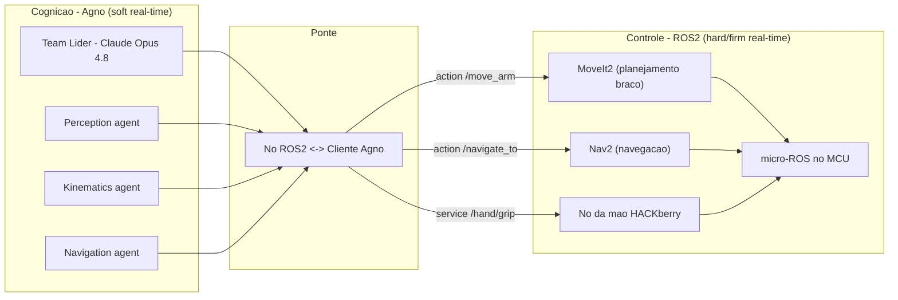

## 7. Escalabilidade Futura

Esta seção descreve como o Projeto Thoth pode evoluir além da mão HACKberry de 3 servos sem que a arquitetura cognitiva precise ser reescrita. O princípio condutor é o **desacoplamento por camadas e por agentes**: a inteligência (orquestrador Agno + Claude) raciocina sobre *intenções* ("apertar a mão", "ir até a porta", "pegar o copo"), enquanto agentes especializados traduzem cada intenção em comandos para o subsistema físico correspondente. Adicionar um novo subsistema (braço, base, sensor 3D) significa, na prática, **adicionar um agente e um novo "device link"** — não refatorar o núcleo.

> **Premissa de honestidade de hardware.** Tudo nesta seção que excede a preensão dos três dedos exige **hardware que a HACKberry não possui**. A mão atual não tem motor no pulso nem no braço (Seção 0.1). Portanto, "apontar para uma pessoa", "levantar o braço" e "navegar até alguém" são marcados explicitamente como **evoluções com custo de hardware**, e não como capacidades latentes do equipamento atual. Cada subseção separa claramente o que é **software/arquitetura** do que é **investimento físico**.

### Como a arquitetura Agno absorve novos subsistemas

A arquitetura proposta na Seção 1 é um `Team` Agno em modo `coordinate` (líder Claude que delega e sintetiza), comunicando-se com o mundo físico por um **EventBus** interno e por *device links* assíncronos (o `HandLink` serial da Seção 5). O padrão de expansão é sempre o mesmo:

1. **Novo hardware** ganha um **device link** (serial/USB, ROS2, TCP) com seu próprio protocolo e watchdog.
2. **Nova capacidade** é exposta como **tools Python** (`@tool`) que validam, fazem *clamp* de segurança e despacham para o device link.
3. **Novo agente** Agno encapsula essas tools, recebe um `role` descritivo e entra como *member* do `Team`. O líder passa a poder delegar a ele.
4. O **EventBus** ganha novos tópicos; o `session_state` compartilhado (acessível via `run_context.session_state`) carrega o estado do novo subsistema entre agentes.

```python
# Padrão de expansão: adicionar um agente sem tocar no núcleo
from agno.agent import Agent
from agno.team import Team, TeamMode
from agno.models.anthropic import Claude
from agno.models.cerebras import Cerebras

# Agentes já existentes (Seção 1): percepcao, dialogo, atuador_mao
# --- novo subsistema entra como mais um member ---
arm_agent = Agent(
    name="ArmKinematics",
    model=Cerebras(id="llama-4-scout-17b-16e-instruct"),  # baixa latencia p/ resolver poses
    role="Resolve cinematica inversa e planeja trajetorias do braco posicionador (6 DOF).",
    tools=[plan_reach, move_to_pose, retract_arm],  # @tool com clamp de juntas
)

robot_team = Team(
    name="Thoth",
    mode=TeamMode.coordinate,
    model=Claude(id="claude-opus-4-8"),   # lider raciocina/orquestra
    members=[percepcao, dialogo, atuador_mao, arm_agent],  # <- adicao incremental
)
```

> **Nota de versão (Agno v2).** O modo colaborativo da v2 chama-se `coordinate` (a nomenclatura `collaborate` era da 1.x; verifique a doc da versão fixada antes de assumir alias). Para orquestração determinística de subsistemas físicos — onde a ordem importa por segurança (ex.: *abrir mão antes de recuar o braço*) — considere migrar do `Team` para um `Workflow` Agno (`Step`, `Condition`, `Loop`), que dá controle explícito de sequência. Trate sempre o LLM como **soft-real-time**: o controle de baixo nível (clamp, slew-rate, e-stop) vive no firmware/ROS2, nunca no agente.

---

### 7.1 Mais graus de liberdade — braço posicionador

**Problema que resolve.** Hoje a HACKberry **forma** o gesto de apontar, mas **não mira**, e **não levanta** (Seção 0.1). Um braço posicionador de **4 a 6 DOF** (ombro 2–3 DOF + cotovelo + pulso motorizado 1–2 DOF) acoplado à base da mão converte "aponte para mim" e "levante o braço" de *gaps de hardware* em capacidades reais.

#### O que muda em hardware

| Item | Atual (HACKberry) | Evolução (braço 4–6 DOF) |
|------|-------------------|---------------------------|
| Atuadores | 3 micro-servos de dedo | Servos de **alto torque** (ex.: Dynamixel série X, com feedback de posição/corrente) **ou** motores de passo (NEMA 17/23) + drivers (TMC2209/A4988) com redução |
| Carga | ~0 (só dedos) | Suporta peso do antebraço + mão (450–500 g) + objeto; torque cresce com o comprimento do elo |
| Sensoriamento | Posição em malha aberta (servo hobby) | **Encoders** absolutos ou Dynamixel com leitura de ângulo/corrente → malha fechada |
| Estrutura | Mão impressa em 3D | Elos rígidos, mancais, limites mecânicos de fim-de-curso |
| Energia | Li-ion 7,2 V (servos de dedo) | Barramento dedicado de maior corrente; **fonte separada** dos servos da mão; e-stop físico de série (Seção 6) |
| Controlador | Arduino Nano (mão) | MCU/SBC adicional para o braço (ex.: ESP32/Teensy ou diretamente um SBC) — **não** sobrecarregar o Nano da mão |

> **Atenção elétrica.** Não alimentar atuadores de alto torque do regulador da mão. O regulador de 3 terminais e o PPTC de 500 mA da HACKberry (e o polegar **sem** PPTC) foram dimensionados para micro-servos; um braço exige seu próprio barramento de potência, capacitores de desacople e proteção de corrente independente.

#### O que muda em software — cinemática

O braço introduz **cinemática direta (FK)** e **inversa (IK)**: dado um alvo no espaço (x, y, z) — por exemplo, a posição do rosto detectado pela visão — calcular os ângulos das juntas.

- **Modelagem rápida / prototipagem:** [`ikpy`](https://github.com/Phylliade/ikpy) (IK analítica/numérica a partir de uma cadeia de elos descrita em URDF ou montada em código). Leve, roda em Python puro, ideal para 4–6 DOF.
- **Validação e simulação física:** **PyBullet** (carrega URDF, simula colisões, gravidade e torque) — permite testar trajetórias **antes** de mover hardware real, reduzindo risco de colisão e stall.
- **Limites de junta como segurança:** cada junta recebe `min/max` (análogo aos `outIndexMax`/`outThumbMax` da mão) e a IK só aceita soluções dentro do envelope; *clamp* obrigatório no device link.

```python
# Esboco: IK para apontar a mao em direcao a um ponto detectado pela visao
import numpy as np
from ikpy.chain import Chain

arm = Chain.from_urdf_file("thoth_arm.urdf")  # 6 DOF: ombro x3, cotovelo, pulso x2

def solve_pointing(target_xyz: np.ndarray) -> list[float]:
    """Retorna angulos de junta (rad) para apontar a mao ao alvo."""
    ik = arm.inverse_kinematics(target_position=target_xyz)
    # clamp por junta antes de enviar ao firmware do braco
    return [clamp(a, lo, hi) for a, (lo, hi) in zip(ik, JOINT_LIMITS)]
```

#### O que muda em arquitetura

Surge um novo **agente `Kinematics/Planning`** (esboçado acima como `ArmKinematics`), responsável por: receber um alvo simbólico do líder ("aponte para o professor"), obter as coordenadas 3D do `Perception agent` (que já localiza rostos), resolver IK, planejar trajetória sem colisão e despachar via `ArmLink` (novo device link serial/USB para o MCU do braço). O `atuador_mao` continua independente: o líder coordena **braço posiciona → mão executa gesto** em sequência (caso de uso forte para `Workflow` com `Step` ordenado). **Isto resolve definitivamente "levante o braço" e "aponte para mim".**

---

### 7.2 Base móvel — locomoção e navegação

**Problema que resolve.** Permite que o robô **vá até** uma pessoa/objeto antes de interagir, ampliando "quem está na sala?" para "vá cumprimentar quem chegou".

#### Hardware

- **Plataforma diferencial** (2 rodas motrizes + roda boba): simples, robusta, suficiente para ambiente interno — recomendada como ponto de partida.
- **Plataforma omnidirecional** (rodas mecanum/omni): movimento holonômico (lateral sem girar), melhor para espaços apertados, mais cara e mecanicamente complexa.
- **Sensores de navegação:** encoders de roda (**odometria**), IMU (fusão de pose), e um **LiDAR 2D** (ex.: RPLIDAR) ou câmera de profundidade para mapeamento/obstáculos.
- **Motores:** DC com encoder + driver (ponte-H tipo TB6612/VNH) ou BLDC; controlador de motor dedicado (não o MCU da mão).

#### Software e arquitetura

A pilha clássica é **odometria → SLAM → navegação**:

- **SLAM** (mapeamento + localização simultâneos): em projeto fora do ROS, bibliotecas como `slam-toolbox` (no ecossistema ROS2) ou implementações com filtro de partículas; fora do ROS, soluções leves de *occupancy grid* + scan matching.
- **Navegação** (planejamento de caminho global + local + desvio de obstáculo): `Nav2` é a referência madura, mas pressupõe ROS2 (ver 7.4).
- **Arquitetura Agno:** entra um **`Navigation agent`** com tools `go_to(location)`, `stop()`, `where_am_i()`. O líder delega "vá até a porta" → o agente consulta o mapa, planeja e executa, publicando progresso no EventBus (`nav/status`). O `session_state` ganha a pose atual do robô, disponível para todos os agentes.

> **Quando isto justifica ROS2.** Assim que entram SLAM + navegação + múltiplos sensores em tempo real, a complexidade favorece fortemente a migração para ROS2 (Seção 7.4), onde Nav2, *costmaps* e *tf2* já resolvem o grosso do problema.

---

### 7.3 LLM local — soberania, latência e custo

**Problema que resolve.** Hoje cognição depende de nuvem (Claude/Groq/Cerebras): há latência de rede, custo por chamada, *rate limits* (TPM da Groq é o gargalo prático — Seção 4) e o áudio/imagem sai do dispositivo. Rodar **modelos locais** dá privacidade, operação offline e custo marginal zero por inferência — ao preço de qualidade/latência inferiores em hardware acessível.

#### Runtimes e trade-offs

| Runtime | Uso ideal | Notas |
|---------|-----------|-------|
| **Ollama** | Prototipagem, single-box, troca rápida de modelo | Expõe endpoint **OpenAI-compatible** (`http://localhost:11434/v1`); ótimo para começar |
| **llama.cpp** | Borda/CPU, quantização agressiva (GGUF Q4/Q5) | Máximo controle de memória; bom para SBC/Jetson |
| **vLLM** | Servir com throughput alto (multi-requisição, *paged attention*) | Requer GPU decente; melhor para um servidor local dedicado |

- **Quantização:** Q4_K_M/Q5 (GGUF) ou AWQ/GPTQ reduzem VRAM em troca de leve perda de qualidade — viabiliza 7B–8B em GPUs modestas e até 14B–32B em GPUs maiores.
- **Hardware-alvo:** **Jetson Orin** (Nano/NX/AGX) embarca GPU para inferência local no robô; alternativamente um **PC com GPU** (≥12–24 GB VRAM) servindo via rede local.
- **Trade-off central:** modelo local 7B–8B **não** iguala Claude Opus 4.8 em planejamento. **Estratégia recomendada (híbrida):** raciocínio profundo/orquestração continua em Claude na nuvem quando há rede; **percepção rápida e respostas curtas** (classificar intenção, descrever cena) caem para o modelo local — degradação graciosa offline.

#### Como Agno acomoda — sem mudar a arquitetura

Como Ollama/vLLM/llama.cpp expõem **API OpenAI-compatible**, basta apontar um modelo Agno OpenAI-like para o `base_url` local. **Nenhum agente, tool ou EventBus muda** — só a configuração de modelo do agente.

```python
# Trocar um agente para LLM local: so muda o 'model' (endpoint OpenAI-compatible)
from agno.agent import Agent
from agno.models.openai import OpenAILike  # cliente OpenAI-compatible

local_perception = Agent(
    name="PerceptionFast",
    model=OpenAILike(
        id="llama-3.1-8b-instant",          # confira o id servido pelo seu runtime
        base_url="http://localhost:11434/v1",  # Ollama; vLLM/llama.cpp expoem URL similar
        api_key="ollama",                    # placeholder; runtimes locais ignoram
    ),
    role="Classifica intencao e descreve cena rapidamente, offline.",
    tools=[describe_scene],
)
```

> **Verifique** o nome exato do modelo servido pelo runtime (varia por *pull*/deploy) e o caminho de import do cliente OpenAI-compatible na versão do Agno fixada (`agno.models.openai`). Mantenha o líder em Claude quando houver rede; configure *fallback* para o modelo local quando a chamada de nuvem falhar ou exceder timeout.

---

### 7.4 ROS2 — quando o controle vira tempo real

**Por que e quando migrar.** Agno orquestra **cognição** (soft-real-time, orientada a LLM). À medida que entram **braço com IK em malha fechada, base móvel, múltiplos sensores e controle síncrono**, surge a necessidade de *middleware* de robótica com garantias de tempo, descoberta de nós, *transforms* (tf2) e ferramentas de visualização (RViz2). **ROS2** (Humble/Jazzy) é a escolha padrão. **Regra prática:** migre quando ≥2 dos seguintes forem verdade — base móvel + SLAM, braço com trajetória controlada, >3 sensores concorrentes, ou necessidade de *playback*/diagnóstico (rosbag).

#### Coexistência: Agno (cognição) + ROS2 (controle)

A migração **não substitui** o Agno: o `Team` continua sendo o cérebro; o ROS2 vira a "medula" de tempo real. A ponte é um **nó ROS2 que também é cliente Agno** (ou um nó dedicado que assina/publica em nome dos agentes).

#### Mapeamento EventBus → primitivas ROS2

| Conceito Thoth (atual) | Equivalente ROS2 | Quando usar |
|------------------------|------------------|-------------|
| Evento de estado contínuo (pose, status da mão, frame) | **Tópico** (pub/sub) | Telemetria, *streaming* de percepção |
| Comando com resposta imediata (ler bateria, abrir mão já) | **Service** (req/resp) | Operações curtas e síncronas |
| Comando de longa duração com feedback/cancelamento ("vá até a porta", "execute trajetória") | **Action** | Navegação, trajetória do braço, gestos longos |
| `session_state` compartilhado | **Parameters** + tópicos de estado | Configuração e estado global |



- **MoveIt2** assume o **planejamento de movimento do braço** (IK, trajetória, colisão) — substitui a prototipagem com `ikpy`/PyBullet da Seção 7.1 por uma solução madura e testada.
- **micro-ROS** roda **no microcontrolador** (ex.: ESP32/Teensy do braço; o Arduino Nano da mão é limitado, mas a placa pode publicar/assinar tópicos via *agent* serial), transformando o firmware custom (Seção 5) em um **nó ROS2** que recebe comandos por tópico/action em vez do protocolo ASCII serial proprietário — preservando, ainda assim, clamp, slew-rate e watchdog locais.
- **Coexistência prática:** Agno decide *o quê* e *por quê* (linguagem, contexto, prioridade), ROS2 garante *como* e *quando* (sincronia, segurança, feedback contínuo). O e-stop físico (Seção 6) permanece em hardware, fora de ambas as camadas.

---

### 7.5 Manipulação de objetos — de "fechar a mão" a "pegar o copo"

**O que a HACKberry já permite.** Preensão **por gesto nomeado** (CLOSE/PINCH/GRIP) com fechamento controlado por slew-rate (Seção 5). Com isso, segurar objetos leves de geometria simples (apoiados/entregues à mão) é viável.

**O que a HACKberry NÃO permite (limite físico).** Preensão **por força regulada** real e *grasp* autônomo confiável exigem o que a mão atual não tem:

- **Sensor de força/contato por dedo:** a HACKberry controla **posição** dos servos, não força. Sem PPTC no polegar e sem sensor de corrente por dedo, "apertar até X newtons sem esmagar" é estimado por **timeout/posição**, não medido. Mão de manipulação séria precisa de **sensores de força/táteis** (FSR, células de carga, ou dedos com sensoriamento de corrente).
- **Reorientação da mão:** sem o braço da Seção 7.1, a mão não se posiciona para envolver um objeto arbitrário no espaço.

#### Visão 3D e *grasp planning* (software)

| Componente | Ferramenta | Papel |
|------------|-----------|-------|
| Profundidade | **Intel RealSense** (D435/D455) + `pyrealsense2` | Nuvem de pontos / mapa de profundidade da cena |
| Detecção/segmentação | YOLO (detecção), **SAM**/segmentação de instâncias | Isolar o objeto-alvo e sua máscara 3D |
| Pose 3D do objeto | Estimadores de pose 6D / centroide da nuvem de pontos | Onde e como o objeto está orientado |
| Planejamento de preensão | **GraspNet**/heurísticas de *antipodal grasp* | Onde e com que abertura fechar os dedos |
| Execução com realimentação | Loop força/posição + slew-rate | Fechar até contato; abortar em stall (Seção 6) |

#### Arquitetura

Entra um **`Manipulation agent`** que compõe percepção 3D + *grasp planning* + (na evolução completa) o braço da 7.1: o líder delega "pegue o copo azul" → segmentação identifica o objeto → RealSense dá a pose 3D → `grasp planner` propõe a abertura/aproximação → braço posiciona (7.1) → mão executa PINCH/GRIP com realimentação. Na HACKberry **atual**, isso fica restrito a **entrega assistida** (objeto colocado na mão; a mão fecha controladamente); manipulação autônoma plena é evolução de hardware (mão com mais sensores + braço).

---

### 7.6 Agentes autônomos avançados — memória, planejamento e aprendizado

Eixo puramente **cognitivo/software**: aumenta a autonomia da camada Agno sem necessariamente mexer no hardware.

- **Memória de longo prazo + RAG.** Hoje o `session_state` persiste sessão via `db` (Seção 4). A evolução adiciona **memória de longo prazo** (`memory_manager` / `enable_agentic_memory`) e um **store vetorial** (RAG) para o robô lembrar preferências, rostos e episódios ("o professor Silva pediu para não acender a luz forte"). Implementação direta nos parâmetros já existentes do `Agent`/`Team`.
- **Planejamento hierárquico.** Decompor objetivos de alto nível em subtarefas: líder Claude gera o plano; sub-agentes executam passos; `Workflow` Agno (`Step`/`Condition`/`Loop`) dá estrutura determinística e auditável. Permite tarefas multi-etapa ("receba a visita, identifique, cumprimente e avise no chat").
- **Aprendizado (IL/RLHF).** Coletar demonstrações de teleoperação (*imitation learning*) para gestos/trajetórias; refinar políticas com *feedback* humano (RLHF) sobre quais respostas/ações foram boas. Aplica-se sobretudo às camadas de planejamento de movimento (7.1/7.5).
- **Sim2real.** Treinar/validar políticas de manipulação e navegação em simulação (**PyBullet** já citado, **Isaac Sim** no ecossistema NVIDIA) e transferir para o robô real — reduz desgaste de hardware e risco em fases de aprendizado. URDF compartilhado entre sim e ROS2 (7.4) facilita a ponte.
- **Self-reflection.** Usar `reasoning=True`/`reasoning_model` do Agno (ou um passo de crítica) para o agente revisar o próprio plano antes de atuar — relevante quando ações têm consequência física.

> **Segurança cresce com a autonomia.** Quanto mais o robô decide e age sozinho, mais críticas as salvaguardas da Seção 6: **gating de ações sensíveis em tools dedicadas** (toda ação física passa por uma tool auditável que faz clamp e checa pré-condições), **human-in-the-loop** para ações de alto impacto, watchdog/e-stop sempre no hardware, e *logging* completo de decisão→ação para auditoria. Autonomia avançada **não** remove o e-stop físico nem os limites de firmware — empilha-se sobre eles.

---

### Quadro de maturidade do projeto (Nível 0 → 5)

Escala de maturidade tecnológica do Projeto Thoth, do estado atual à autonomia plena. O projeto-base desta documentação posiciona-se entre os Níveis 1 e 2.

| Nível | Designação | Hardware | Cognição / Software | Capacidades representativas |
|:---:|------------|----------|---------------------|------------------------------|
| **0** | Protótico nativo | HACKberry stock (3 servos) | Firmware autônomo EMG/pressão, **sem PC** | Preensão controlada por sinal fisiológico; nenhuma IA |
| **1** | Mão agêntica *(alvo deste plano)* | HACKberry + firmware custom serial | `Team` Agno (Claude+Groq+Cerebras), visão, voz | "Aperte a mão", "aponte" (forma o gesto), "quem está na sala?"; e-stop, watchdog, slew-rate |
| **2** | Percepção rica | + RealSense / mais sensores | + RAG/memória longa, reconhecimento robusto, *self-reflection* | Reconhece e lembra pessoas; descreve cena 3D; entrega assistida de objetos |
| **3** | Braço posicionador | + braço 4–6 DOF (alto torque/encoders) | + `Kinematics agent` (IK: ikpy/PyBullet), `Workflow` ordenado | **Levanta o braço**, **mira** ao apontar, alcança e posiciona a mão no espaço |
| **4** | Plataforma móvel + tempo real | + base móvel + LiDAR/profundidade | **Migração ROS2** (Nav2 + MoveIt2 + micro-ROS); Agno como cognição | Navega o ambiente, vai até pessoas, planeja trajetórias com colisão; coexistência cognição/controle |
| **5** | Autonomia plena | + mão com sensores de força/táteis + LLM local (Jetson/GPU) | Planejamento hierárquico, IL/RLHF, sim2real, operação offline | Manipulação autônoma com *grasp planning* e força regulada; aprende com demonstração; opera com privacidade e degradação graciosa |

> **Critério de transição.** Sobe-se de nível **somente** quando as salvaguardas do nível anterior estão validadas (e-stop, clamps, watchdog, testes em simulação antes do real). A escalada de autonomia (Níveis 4–5) é **gated** pela maturidade de segurança, não pela disponibilidade de hardware — coerente com o propósito assistivo e com o público (prótese real, UFRGS/Enfitec Jr./CTA-IF).
